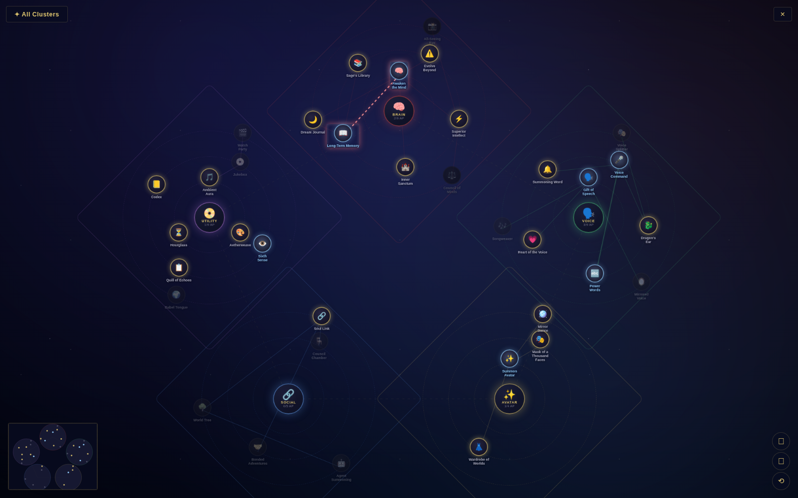

# TerranSoul

> **🚧 This project is under active construction since 10/04/2026.**
> If you are interested, please discuss via <https://discord.gg/RzXcvsabKD> to become a contributor.

> **💡 Why TerranSoul?**
> Tools like OpenClaw, Claude Cowork, and other AI agents can already perform like J.A.R.V.I.S. — but J.A.R.V.I.S. was never just an AI agent. It connected multiple devices, divided tasks across machines, hosted its own infrastructure, maintained the right RAG pipelines, and had persistent memory. Today's AI is powerful but fragmented: agents don't host infrastructure, don't manage retrieval or memory end-to-end, and can't split work across your PCs. So why not bring everything together under one roof? I'm just kicking this off — if you're interested, come drive it even further with your imagination.

**J.A.R.V.I.S. in Real Life — chat-first · cross-device · open-source**

## What this AI is

- **For technical users:** A full 3D AI companion focused on full-context engineering and harness engineering.
- **For non-technical users:** A 3D AI companion that helps with daily work on desktop and mobile.

Try teaching your AI with our software and experiment with its capabilities yourself.  
If you need tailored support for personal, commercial, small business, or enterprise use, please contact: **Darren.bui@terransoul.com**

[](https://github.com/Terranes/TerranSoul/actions/workflows/terransoul-ci.yml)

---

## Design Philosophy — Build Your AI Like an RPG Character

Most AI tools give you a settings page full of toggles and dropdowns. TerranSoul does it differently: **you level up your AI the same way you level up a character in a game.**

Every capability your AI can learn — voice, memory, vision, music — is a **quest** you complete. Quests teach you how each feature works and reward you with a smarter companion. Unlock the right combination of skills and you trigger **combos** — powerful synergies like "Offline Sage" (local LLM + memory) or "Omniscient Companion" (vision + memory + voice input).

### Your AI Has a Brain — And You Build It

TerranSoul's architecture mirrors the human brain. Each region maps to a real AI subsystem you progressively unlock:

| Human Brain                | AI System                          | RPG Stat             |
| -------------------------- | ---------------------------------- | -------------------- |
| Prefrontal Cortex          | Reasoning Engine (LLM + Agents)    | 🧠 Intelligence      |
| Hippocampus                | Long-term Memory                   | 📖 Wisdom            |
| Working Memory Network     | Short-term Memory                  | 🎯 Focus             |
| Neocortex                  | Retrieval System (RAG / Knowledge) | 📚 Knowledge         |
| Basal Ganglia / Cerebellum | Control & Execution Layer          | ⚡ Dexterity         |

As you unlock skills, your AI's stats grow. A freshly installed TerranSoul starts at level 1 with just a free cloud brain. By the time you've completed the Ultimate tier, you have a fully autonomous assistant with voice, vision, memory, multi-device sync, and community agents — all configured through gameplay, not menus.

### The Skill Tree — Constellation Map

Skills are laid out on a **constellation map** — a full-screen dark star-field with circular category clusters arranged radially, each containing skill nodes in concentric rings:



Each **category cluster** (Brain, Voice, Avatar, Social, Utility) is a radial wheel of nodes. Foundation skills sit in the inner ring, Advanced in the middle ring, and Ultimate on the outer ring. Glowing connection lines trace the prerequisite chains between nodes. Clicking a cluster zooms in; clicking a node opens its quest detail.

```
         ┌─ Voice (🗣️ jade) ──────┐     ┌── Avatar (✨ gold) ──┐
         │  🗣️ Gift of Speech      │     │  ✨ Summon Avatar     │
         │  🎤 Voice Command       │     │  🐾 Desktop Familiar  │
         │  🐉 Dragon's Ear        │     └───────────────────────┘
         │  🔤 Power Words         │
         │  🎭 Voice Splitter      │            ┌── Social (🔗 sapphire) ──┐
         └─────────────────────────┘            │  🔗 Soul Link            │
                                                │  🤖 Agent Summoning      │
    ┌── Brain (🧠 crimson) ────────────┐        └──────────────────────────┘
    │  🧠 Awaken the Mind              │
    │  ⚡ Superior Intellect            │   ┌── Utility (📀 amethyst) ──────┐
    │  🏰 Inner Sanctum                │   │  🎵 Ambient Aura              │
    │  📖 Long-Term Memory             │   │  📀 Jukebox  🎬 Watch Party    │
    │  📸 All-Seeing Eye               │   │  👁️ Sixth Sense  🌍 Babel Tongue│
    │  ⚠️ Evolve Beyond                │   │  🏗️ System Integration         │
    └──────────────────────────────────┘   └────────────────────────────────┘
```

### Quests — Learn by Doing

Each skill node is a **quest** with objectives, rewards, and a story-style description. For example:

> **🧠 Awaken the Mind** — *Connect to a free cloud AI*
>
> Your companion awakens! Connect to a free LLM API and watch your AI come alive with real-time conversation, emotion-tagged responses, and avatar reactions.
>
> **Rewards:** Real-time AI chat · Emotion-tagged responses · Sentiment-based avatar reactions

When you send "Where can I start?" or "What should I do?", your AI responds naturally and suggests the next available quest — no rigid menus, just a conversation with your companion about what to unlock next.

<!-- TODO: Add screenshot of quest overlay with Accept/Tell me more/Maybe later tiles -->
<!--  -->

### Combos — Skill Synergies

Unlock the right combination of skills and you trigger **combos** — bonus capabilities that emerge from synergy:

| Combo                    | Skills                               | What You Get                               |
| ------------------------ | ------------------------------------ | ------------------------------------------ |
| 🎧 DJ Companion          | Voice + Custom Music                 | AI curates music based on mood             |
| 💬 Full Conversation     | Voice Input + Voice Output           | Hands-free voice chat                      |
| 🧠 True Recall           | Paid Brain + Memory                  | Context-aware responses from full history  |
| 🏔️ Offline Sage          | Local Brain + Memory                 | Full AI offline with persistent memory     |
| 👂 Perfect Hearing       | Whisper ASR + Hotwords               | Boosted speech recognition accuracy        |
| 👥 Social Memory         | Speaker ID + Memory                  | Remembers who said what                    |
| 🌐 Universal Translator  | Translation + Voice Input            | Real-time voice translation                |
| 👁️ Omniscient Companion  | Vision + Memory + Voice              | Sees, hears, and remembers everything      |
| 🐝 Hive Mind             | Agents + Device Link                 | Multi-device agent orchestration           |
| 🐾 Living Desktop Pet    | Pet Mode + Voice + Presence          | Reactive floating desktop companion        |
| ⚡ Instant Companion     | Keyboard Shortcuts + Pet Mode        | Global hotkey summons your AI              |
| 🏠 Always There          | Auto-Start + Pet Mode + Presence     | AI greets you every time you boot up       |

<!-- TODO: Add screenshot of combo unlock animation -->
<!--  -->

### Brain Evolution Paths

There are multiple paths to evolve your AI's brain — each with different tradeoffs:

```
🧠 Free Brain (Pollinations/Groq)
├── ⚡ Superior Intellect (Paid API — OpenAI/Anthropic)
│   ├── 🤖 Agent Summoning (community AI agents)
│   ├── 🌍 Babel Tongue (real-time translation)
│   └── 📸 All-Seeing Eye (screen vision)
└── 🏰 Inner Sanctum (Local LLM via llmfit)
    └── Full offline operation — no internet needed
```

Each path is a quest chain. The free brain auto-configures on first launch (zero setup). From there, you choose: pay for power (Superior Intellect), or invest time in local setup for privacy and offline capability (Inner Sanctum).

---

## Vision

TerranSoul is an open-source **3D virtual assistant + AI package manager** that runs across:

| Platform | Target |
|----------|--------|
| Desktop | Windows · macOS · Linux |
| Mobile | iOS · Android |

TerranSoul includes a **TerranSoul Link** layer that securely connects all your devices so you can:

- 💬 Chat with TerranSoul anywhere
- 🔄 Sync conversations and settings across devices
- 🖥️ Control other devices remotely (send commands to run on your PC from your phone)
- 🤖 Orchestrate multiple AI agents (OpenClaw, Claude Cowork, etc.)

---

## What's Implemented

TerranSoul has completed **10 phases of development** (126 chunks). Here's what's working today:

### � Skill Tree / Quest System (RPG Brain Configuration)
- **Constellation map** — full-screen radial cluster layout with pan/zoom and minimap
- Floating **crystal orb** progress indicator opens the constellation
- **3 tiers:** Foundation → Advanced → Ultimate
- **Skill nodes** across Brain, Voice, Avatar, Social and Utility categories
- **Combo abilities** triggered by unlocking specific skill pairs/triples (DJ Companion, Hive Mind, Offline Sage, etc.)
- Quest nodes with prerequisites, rewards, objectives, and story descriptions
- Brain-based quest detection — your AI suggests quests conversationally, not via rigid menus
- Hot-seat overlay with Accept / Tell me more / Maybe later choice tiles
- Daily AI-prioritized quest suggestions
- Pin/dismiss/manual-complete quests
- Quest confirmation dialog + reward panel with choices
- Persistent tracker (Tauri file + localStorage fallback, merged on load)

### 🎭 3D Character System
- **VRM 1.0 & 0.x** model support via Three.js + `@pixiv/three-vrm`
- 3 bundled default models (Annabelle, M58, GENSHIN) + custom VRM import
- Natural relaxed pose (not T-pose), spring bone warmup, frustum culling disabled
- **AvatarStateMachine** — 5 body states (idle, thinking, talking, happy, sad) with expression-driven animation
- **Exponential damping** for smooth bone/expression transitions
- **5-channel FFT lip sync** (Aa, Ih, Ou, Ee, Oh) via Web Worker audio analysis
- **Gesture blending** (MANN-inspired procedural animation)
- **On-demand rendering** — throttles to ~15 FPS when idle, 60 FPS when active
- Placeholder fallback character if VRM loading fails
- Error overlay with retry button

### 🧠 Brain System (LLM Integration — The "Prefrontal Cortex")
- **4 modes:** Free API (Groq/Pollinations), Paid API (OpenAI/Anthropic), Local Ollama, Stub fallback
- Zero-setup first launch — free brain auto-configures with no API keys needed
- Streaming responses with real-time token display
- Provider health monitoring with automatic failover
- Provider migration detection — warns users and suggests brain upgrades when APIs deprecate
- Chat-based LLM switching ("switch to groq", "use pollinations")
- Persona-based fallback when no LLM is configured
- 60s streaming timeout + 30s fallback timeout to prevent stuck states

### 🗣️ Voice System (The "Charisma" Stats)
- **ASR:** Web Speech API, Whisper, Groq speech-to-text
- **TTS:** Edge TTS with gender-matched voices (pitch/rate prosody per character)
- **Hotword detection** for wake-word activation
- **Speaker diarization** support
- LipSync ↔ TTS audio pipeline for real-time mouth animation

### 💾 Memory System (The "Hippocampus")
- Long-term + short-term memory stores
- Semantic graph visualization (Cytoscape.js)
- Memory extraction and summarization

### 🔗 TerranSoul Link
- Device identity + pairing with QR codes
- Cross-device conversation sync
- Settings synchronization

### 📦 AI Package Manager
- Install / update / remove / start / stop agents
- Package registry with marketplace UI
- WASM sandbox for agent isolation

### 🖥️ Window Modes
- Standard desktop window
- Transparent always-on-top overlay
- **Pet mode** — compact desktop companion

### 🎵 Audio & Ambience
- Procedural JRPG-style BGM (Crystal Theme, Starlit Village, Eternity)
- Volume control with persistence
- Always-visible play/stop button + expandable track selector

### 🎨 UI Polish
- Animated splash screen (kawaii cat loading)
- Chat export (copy/download)
- Typing indicator
- Mobile-responsive layout
- Keyboard detector for virtual keyboard handling
- Background selection + custom import

---

## Platform Strategy (One Codebase)

Built on **Tauri 2.0** as a unified shell across desktop + mobile:

| Layer | Technology |
|-------|-----------|
| Backend | Rust (shared) |
| UI Shell | WebView (shared) |
| Frontend | Vue 3 + TypeScript (shared) |
| 3D Rendering | Three.js with WebGL2 |

**Platform notes:**

- **Desktop:** transparent always-on-top overlay window + system tray
- **Mobile:** full-screen app (or compact mode), push notifications later, background sync later

---

## Core Products (What Users See)

### A) Chat + 3D + Voice Assistant

A single screen showing:

- 🎭 3D character viewport (VRM model with lip sync + expressions)
- 💬 Chat message list with streaming responses
- ⌨️ Text input bar (+ voice input via ASR)
- 🤖 Agent selector ("auto" or choose agent)
- 🎵 Ambient BGM player
- 🎮 Skill tree / quest progression system
- ⚙️ Settings panel (model, background, camera)

### B) RPG Brain Configuration (Quest-Driven Setup)

Instead of traditional setup wizards, TerranSoul guides you through configuration via quests:

- **"Awaken the Mind" quest** → connects your first LLM brain (free, zero config)
- **"Gift of Speech" quest** → enables TTS so your character speaks aloud
- **"Voice Command" quest** → enables ASR so you can talk to your companion
- **"Superior Intellect" quest** → upgrades to a paid API for better responses
- **"Inner Sanctum" quest** → sets up a local LLM for offline + private operation

Each quest teaches you what the feature does, walks you through setup, and rewards you with stat boosts and potential combo unlocks.

### C) Settings / Management

- **Agents:** install · update · remove · start · stop
- **Characters:** import VRM · select built-ins
- **Memory:** view graph · extract · summarize
- **Link devices:** pair + list devices + permissions + remote control

---

## High-Level Architecture (Per Device)

TerranSoul App (on each device) is a **Tauri 2.0** application:

```
┌─────────────────────────────────────────────────────┐
│  Frontend (WebView — Vue 3 + TypeScript)            │
│  ├── 3D Character Viewport (Three.js + VRM)         │
│  │   ├── AvatarStateMachine (expression-driven)     │
│  │   ├── 5-Channel LipSync (FFT via Web Worker)     │
│  │   └── Gesture Blender (MANN-inspired)            │
│  ├── Chat UI (messages, streaming, typing indicator)│
│  ├── Skill Tree / Quest Board (License Board UI)    │
│  ├── Setup Wizards (Brain, Voice)                   │
│  ├── Memory Graph (Cytoscape.js)                    │
│  ├── Pet Overlay / Window Modes                     │
│  └── BGM Player (procedural Web Audio)              │
├─────────────────────────────────────────────────────┤
│  Pinia Stores (state management)                    │
│  ├── brain, conversation, streaming                 │
│  ├── character, identity, memory                    │
│  ├── skill-tree, voice, settings                    │
│  ├── link, sync, messaging, routing                 │
│  └── package, sandbox, provider-health, window      │
├─────────────────────────────────────────────────────┤
│  Rust Core Engine                                   │
│  ├── Brain (Ollama/OpenAI/Anthropic/Free API)       │
│  ├── AI Package Manager                             │
│  ├── Agent Orchestrator + Routing                   │
│  ├── Memory (long-term + short-term)                │
│  ├── TTS (Edge TTS)                                 │
│  ├── TerranSoul Link (cross-device sync + pairing)  │
│  ├── Messaging (pub/sub IPC)                        │
│  └── Sandbox (WASM agent isolation)                 │
├─────────────────────────────────────────────────────┤
│  AI Agents (separate processes or services)         │
│  ├── Local LLM runtimes (Ollama)                    │
│  ├── Remote API providers (OpenAI, Anthropic, Groq) │
│  └── Community integrations                         │
└─────────────────────────────────────────────────────┘
```

---

## Development Status

**Completed phases:** 10 (126 implementation chunks)
**Test suite:** 893 unit tests + 53 E2E tests — all passing
**Current focus:** Phase 11 — RPG Brain Configuration (stat sheets, combo animations, quest rewards)
**Next planned:** Chunk 130 — Brain config UI as RPG stat sheet

See [rules/milestones.md](rules/milestones.md) for upcoming work and [rules/completion-log.md](rules/completion-log.md) for the detailed record of all completed work.

---

## 3D Character System

| Property | Choice |
|----------|--------|
| Primary avatar format | **VRM 1.0 & 0.x** |
| Rendering | Three.js WebGL2 + `@pixiv/three-vrm` |
| Animation | AvatarStateMachine (expression-driven, exponential damping) |
| Lip Sync | 5-channel FFT viseme analysis via Web Worker |
| Gestures | MANN-inspired procedural gesture blending |

**Key features:**

- Standard humanoid skeleton with spring bone physics (hair/clothes)
- Facial expressions via BlendShapes (Aa, Ih, Ou, Ee, Oh for speech + emotion blends)
- Natural relaxed pose on load (not T-pose), spring bone warmup for physics settling
- Camera auto-framing per model height
- On-demand rendering: ~15 FPS when idle, 60 FPS on animation
- Placeholder geometric character fallback on load failure
- Persistent camera state (azimuth + distance)

---

## Chat System

**Conversation model:**

```ts
interface Message {
  id: string;
  role: 'user' | 'assistant';
  content: string;
  agent_name?: string;
  timestamp: number;
}
```

**Features:**

- Message list with streaming token display
- Typing/thinking indicator
- Agent badge per assistant message
- "Auto agent" routing via conversation router
- Emotion detection from responses (happy, sad, thinking, etc.)
- Chat export (copy to clipboard / download)
- Streaming timeouts (60s streaming, 30s fallback) to prevent stuck states
- Persona-based fallback when no LLM brain is configured

---

## AI Package Manager

**Goal:** Install/manage AI agents as packages across devices.

**Core commands:**

```bash
terransoul install <agent-name>
terransoul update <agent-name>
terransoul remove <agent-name>
terransoul list
terransoul start <agent-name>
terransoul stop <agent-name>
```

---

## Tech Stack

| Component | Technology |
|-----------|-----------|
| App Shell | [Tauri 2.0](https://tauri.app/) |
| Frontend | [Vue 3](https://vuejs.org/) + TypeScript |
| State Management | [Pinia](https://pinia.vuejs.org/) |
| 3D Engine | [Three.js](https://threejs.org/) + [@pixiv/three-vrm](https://github.com/pixiv/three-vrm) |
| Build Tool | [Vite](https://vitejs.dev/) |
| Backend | Rust |
| Package Manager | npm (frontend) · Cargo (backend) |

---

## Getting Started

### Prerequisites

- [Node.js](https://nodejs.org/) ≥ 20
- [Rust](https://www.rust-lang.org/tools/install) (latest stable)
- [Tauri prerequisites](https://v2.tauri.app/start/prerequisites/)
- [WebView2](https://developer.microsoft.com/en-us/microsoft-edge/webview2/) (Windows only)
- VBScript feature enabled (Windows only)

> **Quick setup with Copilot:** Open GitHub Copilot Chat and type `/setup-prerequisites` to automatically check and install all prerequisites.

### Development

```bash
# Install frontend dependencies
npm install

# Run in development mode (Tauri + Vite dev server)
npm run tauri dev
```

### Build

```bash
# Build the frontend
npm run build

# Build the Tauri app
npm run tauri build
```

---

## Project Structure

```
TerranSoul/
├── src/                    # Vue 3 frontend
│   ├── components/         # UI components (Chat, Quest, Model, Splash, etc.)
│   ├── views/              # Page-level views (Chat, Brain/Voice setup, Memory, etc.)
│   ├── stores/             # Pinia stores (brain, character, conversation, memory, skill-tree, etc.)
│   ├── composables/        # Reusable composables (ASR, TTS, BGM, lip-sync, hotwords, etc.)
│   ├── renderer/           # Three.js rendering (scene, VRM, animator, lip-sync, gestures)
│   ├── config/             # Configuration (default models, gender voices)
│   ├── utils/              # Utilities (API client, emotion parser, VAD, markdown)
│   ├── workers/            # Web Workers (audio analysis)
│   └── types/              # TypeScript type definitions
├── src-tauri/              # Rust backend (Tauri)
│   └── src/
│       ├── brain/          # LLM integration (Ollama, OpenAI, Anthropic, free APIs)
│       ├── memory/         # Long-term + short-term memory
│       ├── messaging/      # Pub/sub IPC messaging
│       ├── routing/        # Agent routing
│       ├── sandbox/        # WASM agent sandbox
│       ├── commands/       # Tauri IPC commands (60+)
│       ├── lib.rs
│       └── main.rs
├── scripts/                # Build scripts (BGM generation, etc.)
├── rules/                  # Architecture, coding standards, milestones, completion log
├── instructions/           # User-facing docs (extending, importing models)
├── e2e/                    # Playwright end-to-end tests
├── public/                 # Static assets (models, backgrounds, audio)
├── .github/workflows/      # CI/CD pipelines
├── package.json
├── vite.config.ts
├── vitest.config.ts
└── tsconfig.json
```

---

## Contributing

This project is in its **earliest stages**. We welcome contributors of all skill levels!

1. Join the discussion on [Discord](https://discord.gg/RzXcvsabKD)
2. Fork the repository
3. Create a feature branch (`git checkout -b feature/amazing-feature`)
4. Commit your changes (`git commit -m 'Add amazing feature'`)
5. Push to the branch (`git push origin feature/amazing-feature`)
6. Open a Pull Request

---

## License

Licensed under the [MIT License](./LICENSE).
