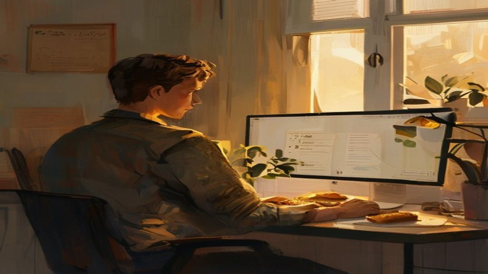

# AI Memory in Five Scenes

> Inspired by cognee's [*AI memory in five scenes*](https://www.cognee.ai/blog/fundamentals/ai-memory-in-five-scenes). Credit in [`CREDITS.md`](../CREDITS.md).

TerranSoul is an AI companion with memory. What does *memory* actually mean for an AI, and why does it matter? Five everyday scenes.

---

## Scene 1: A kid in a library

You are twelve years old, standing in a real library with a school project on dinosaurs. Three people are behind the desk.

The **first** is bright and chatty. He can talk about dinosaurs all afternoon. He just started this week, so he has no idea where anything is in *this* library. Lots of knowledge, no sense of place.

The **second** stares at a computer. Tell him a book title and he will read you the back cover. He cannot tell you whether the book is any good for your project. All search, no judgment.

The **third** is the senior librarian. Twenty years here. She remembers that the chapter you actually need is buried inside an old history book three shelves over, and that it connects to the picture book your classmate borrowed last week. She gives you the answer, not the search results.

Most AI products today are one of those three.

TerranSoul is the third one. You can pick which "brain" it uses — a free cloud model, a paid cloud model, or one running entirely on your own computer with no internet — and all three read from the same library: the memory TerranSoul has quietly been building about you. Switch the brain, keep the librarian.

---

## Scene 2: A high schooler picking a movie

Friday night. You open a streaming app and want a recommendation.

A generic chatbot suggests a beloved animated film — on a service you do not subscribe to. You watched it last month anyway. There is a seven-year-old on the couch.

The streaming service's built-in bot dumps a wall of plot summaries, cast lists, and star ratings. The answer is in there somewhere. Good luck.

A friend who has watched movies with you for years remembers: *you like Pixar, there is a kid on the couch tonight, you fell asleep in the last quiet drama you tried, and you cannot stand sad endings on a Friday.* They give you two suggestions and one sentence each.

TerranSoul is built to be that friend. Every conversation is shaped by:

- What you've told it about yourself.
- What it has watched you do — which projects you keep returning to, which suggestions you accepted, which you ignored.
- How recent things are. A preference from an hour ago outweighs one from two years ago.
- What kind of question you just asked. *"What did I do?"* is answered differently from *"what is true?"* or *"how do I?"*.
- What you said is private. Some memories never leave your computer. Some sync between *your* devices. Some you choose to share. The most-private rule always wins.

TerranSoul does not shout your whole memory at the AI on every message. It hands the AI a small, tidy briefing for *this* moment. That is why the answers feel personal instead of generic.

---

## Scene 3: A college student cramming for an exam

A few days before a final. Lecture notes on the laptop, PDFs of slides, scanned chapters, your own scribbles. You ask a chatbot, *"What did Professor Miller say about entropy?"*

A plain chatbot gives you a textbook definition of entropy. Lovely. Professor Miller is not in there. You could paste your notes in one document at a time, but there are too many, and the chatbot starts forgetting the early ones.

The trick that actually works: a tool quietly chops your notes into bite-sized pieces, gives each piece a kind of "fingerprint" that captures its meaning, and stores them. When you ask a question, the tool fingerprints the *question* the same way and pulls back the few pieces that look most similar. Those go to the AI along with your question. Now the AI is answering from your actual notes.

TerranSoul does this for everything you let it remember: chats, documents you drop in, screenshots, voice notes, files in folders you point it at. It pulls back the right handful of pieces, ranks them, throws out the noisy ones, and only then asks the AI to answer.

Two honest things about this kind of memory:

1. It is genuinely good at *"what did so-and-so say about X."*
2. It is not enough by itself. Ask *"which examples did the professor use that were not in the textbook?"* and a fingerprint match alone gets confused, because that question is about *relationships* between things, not similarity. Hold that thought for Scene 4.

TerranSoul also keeps a strict budget on how much of your notes it hands to the AI in any one message. Otherwise the AI gets buried, slows down, and the answer gets worse, not better. Less is more.

---

## Scene 4: A junior engineer hunting for a job

You want your next job. Specifically:

- *Remote-first.*
- *A startup with 20 to 50 people.*
- *Already raised a Series B.*
- *Uses Python and React.*
- *Not in fintech.*

A chatbot hands you a friendly-looking list. Half the companies are too big. Two are in fintech. One is "remote" but actually means "two days a week from our Berlin office." Useless.

You try the fingerprint trick from Scene 3. Better — at least the postings now mention your keywords. But "startup culture" sneaks in for a 600-person company. "Remote" sneaks in for a hybrid role. *Not in fintech* gets quietly ignored.

The real fix is to teach the system to *name things*. Not just "this paragraph mentions Python" but **"this is a company, that is a job, this is a skill, that is a funding stage, those are connected like this."** Once the system has named the pieces and drawn the lines between them, your messy wish list becomes a precise question:

> *Find me jobs whose company is at Series B, whose team size is between 20 and 50, whose required skills include Python and React, whose industry is not fintech, and whose location policy is remote-first — and show me the exact sentence you got each fact from.*

That is the leap from "find similar text" to "answer the question." TerranSoul does this leap. Behind the scenes it keeps a quiet map of the people, places, projects, decisions, and preferences in your life, with little arrows showing how they connect — *you decided X on date Y because of person Z*. When a question needs *relationships* to answer, TerranSoul walks the map.

Two things follow from that map being there:

- **TerranSoul holds contradictions.** If something you said three months ago no longer matches what you said yesterday, both versions are kept, the older one fades, and the new one wins. Nothing is silently overwritten and nothing is silently lost.
- **TerranSoul shows its receipts.** When it tells you something, it can point back at the original message, file, or moment it learned it from. You never have to take its word for it.

---

## Scene 5: The veteran at a party

A party. Someone asks what you do. You say you work on AI memory. Most people change the subject. One person leans in. They have built this stuff before. They already know that the impressive demo and the system that survives a Tuesday afternoon are two different things.

Three things actually decide whether an AI memory is useful in real life.

**It has to be fast.** Beautiful retrieval that takes thirty seconds is worse than a mediocre answer in one second, because nobody waits. TerranSoul stays snappy by remembering popular answers, splitting its memory into smaller pieces it can search in parallel, skipping the heavy machinery for trivial questions like *"hi,"* and falling back gracefully on slower hardware (your phone) instead of freezing.

**It has to be honest about quality.** A memory that confidently makes things up is worse than no memory. TerranSoul keeps every memory with a *confidence* attached, lets old facts decay if newer ones contradict them, and treats different kinds of knowledge differently — casual notes can move fast and loose; legal, financial, and shared-team facts move carefully and require agreement before they change.

**It has to be measurable.** "Trust us, it's good" is not a feature. TerranSoul ships with public benchmarks against the same long-memory test sets the research community uses, and reports both wins and ties honestly. When a new trick helps on one kind of question and hurts on another, it gets turned on only for the kind it helps.

This is the scene TerranSoul is built for. Not the demo. The Tuesday.

---

## So what is TerranSoul?

The senior librarian from Scene 1, who happens to be your streaming-night friend from Scene 2, who has read every note you ever gave it like the study tool from Scene 3, who keeps a quiet relationship map like the job-hunt assistant from Scene 4 — and who has been built to survive the Tuesday-afternoon problems from Scene 5.

In plainer words: **TerranSoul remembers your life the way a thoughtful friend would — privately, accurately, and with receipts — and lets you choose which AI brain gets to talk to that memory.**
