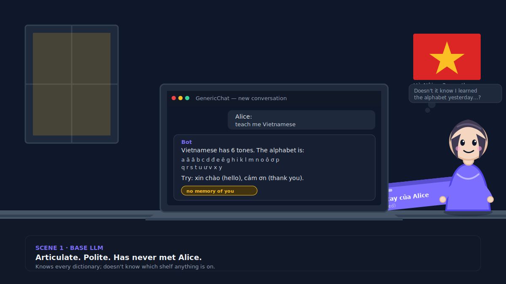
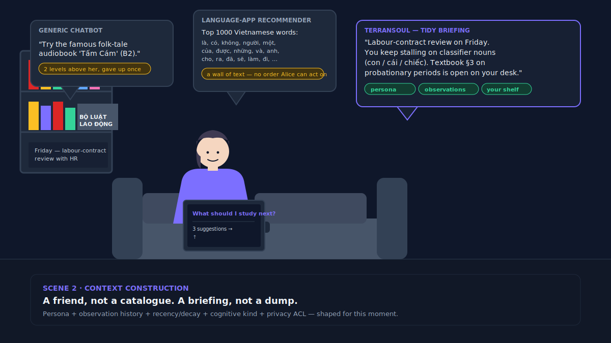
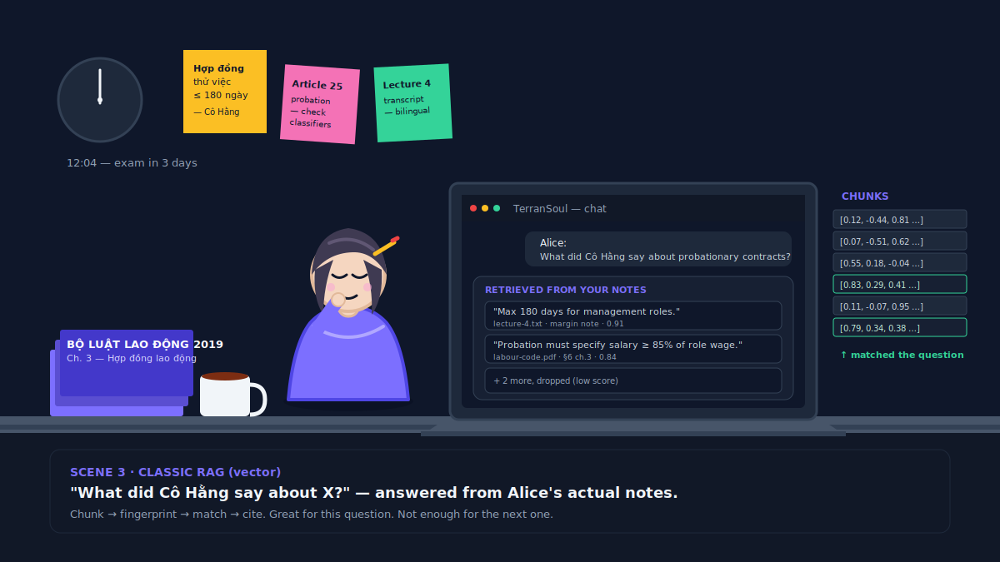

# AI Memory in Five Scenes — Alice Learns Vietnamese

> Inspired by cognee's [*AI memory in five scenes*](https://www.cognee.ai/blog/fundamentals/ai-memory-in-five-scenes). Only the **base LLM → classic RAG → graph-aware RAG → hybrid memory at scale** progression is reused; the story, examples, and illustrations are TerranSoul's own. Credit in [`CREDITS.md`](../CREDITS.md).

TerranSoul is the canonical recurring character in this project's tutorials, screenshots, and seed memories: **Alice, learning Vietnamese — and, eventually, Vietnamese labour law.** The same five-stage journey explains what an AI *memory* actually is, and where TerranSoul sits on the curve.

---

## Scene 1: Alice opens a chatbot for the first time

Day one. Alice is moving to Hà Nội in three months. She opens a generic chatbot and types *"teach me Vietnamese."*

The chatbot is bright and polite. It explains the six tones, lists the alphabet, drills *xin chào* and *cảm ơn*. Tomorrow she comes back and asks the same kind of question — and gets the same kind of beginner answer. It does not remember that she already knows the alphabet. It does not know she is moving for a job in legal compliance. It has never seen the notebook page she scribbled on the bus.

That is a **base large language model**. Articulate, well-read, and completely unaware of *Alice*. Like a cheerful new employee on his first day who has read every dictionary but does not know which shelf anything is on.

TerranSoul is built around the opposite default. The chat box is the *front door*; the room behind it is a memory of Alice — what she has told the assistant, what it has watched her do, what she has dropped into it as a file or a screenshot or a voice note. You can swap which "brain" answers (a free cloud model, a paid cloud model, or a model running entirely on Alice's own laptop with no internet at all) and the room behind the door does not change. Switch the brain, keep the librarian.

---

## Scene 2: Alice picks her next study set

A few weeks in. Alice opens her language app on the couch and asks for *the next thing to study.*

A generic chatbot suggests a famous Vietnamese folk-tale audiobook. Lovely. She does not own it, it is two CEFR levels above her, and she already gave up on it once.

Her language app's own recommender dumps a frequency list of the top thousand Vietnamese words. The right answer is in there somewhere — buried in a list with no order Alice can act on.

A friend who has been studying *with* her for weeks would say something different: *"You have a labour-contract review on Friday, you keep stalling on classifier nouns (con, cái, chiếc), and the textbook chapter on probationary periods is still open on your desk. Do twenty minutes on classifiers, then re-read §3 of that chapter, then I'll quiz you on five contract phrases."* Two suggestions, one sentence each, grounded in what is on Alice's shelf and on her calendar.

TerranSoul is built to be that friend. Every reply is shaped by:

- **Persona.** What Alice has told the assistant about herself — that she is moving to Hà Nội, that she works in compliance, that she prefers bullet lists to paragraphs.
- **Observation history.** Which suggestions she accepted, which she ignored, which exercises she finished, which she skipped.
- **Recency and decay.** A preference she stated yesterday outweighs one from a year ago. Old facts fade unless they are reinforced.
- **Cognitive kind.** *"What did I do this week?"* (episodic), *"what does điều khoản mean?"* (semantic), *"how do I write a probation notice?"* (procedural), and *"is this clause fair?"* (judgment) are answered from different parts of memory and routed through different prompts.
- **Privacy.** Some memories never leave Alice's laptop. Some sync between *her* devices. Some she chooses to share with a teammate. The most-private rule always wins.

TerranSoul does not shout the entire memory at the language model on every turn. It hands the model a small, tidy briefing for *this* moment — the way a good friend already knows what to mention before they open their mouth.

---

## Scene 3: Alice studies for the labour-law exam

Three months in. Alice has signed up for a labour-law refresher because her new job needs it. Her laptop is now a graveyard of PDFs of the **Bộ luật Lao động 2019** (the Vietnamese Labour Code), scanned chapters of a textbook her tutor lent her, lecture recordings transcribed in two languages, and her own bilingual scribbles. She asks her chatbot, *"What did Cô Hằng say about probationary contracts?"*

A plain chatbot gives her a textbook definition of a probationary contract. Lovely. Cô Hằng — her tutor — is not in there. Alice could paste her notes in one PDF at a time, but there are too many and the chatbot starts forgetting the early ones.

The trick that actually works: a tool quietly chops Alice's notes into bite-sized pieces, gives each piece a *fingerprint* that captures its meaning, and stores them. When Alice asks her question, the tool fingerprints the *question* the same way and pulls back the few pieces that look most similar — the lecture transcript paragraph where Cô Hằng walked through Article 24, plus Alice's own margin note saying *"max 180 days for management roles."* Those pieces go to the language model along with the question. Now the model is answering from Alice's actual notes, in Alice's own words, citing Alice's own tutor.

That is **classic RAG** — Retrieval-Augmented Generation, vector style — and TerranSoul does it for everything Alice lets it remember: chats, dropped documents, screenshots, voice notes, files in folders she points it at. It pulls back the right handful of pieces, ranks them, throws out the noisy ones, and only then asks the model to answer.

Two honest things about this kind of memory:

1. It is genuinely good at *"what did Cô Hằng say about probationary contracts."*
2. It is **not enough** by itself. Ask *"which clauses about probation did Cô Hằng mention that are not in my textbook?"* and a fingerprint match alone gets confused. That is a question about *relationships* between things, not similarity. Hold that thought for Scene 4.

TerranSoul also keeps a strict budget on how much of Alice's notes it hands to the language model in any one message. Otherwise the model gets buried, slows down, and the answer gets worse, not better. Less is more.

---

## Scene 4: Alice asks the question that needs a map

Exam week. Alice sharpens her question:

> *"Which clauses about probationary contracts did Cô Hằng raise in lecture 4 that the textbook does **not** cover, and what was her exact phrasing?"*

The plain chatbot makes something up. The fingerprint trick from Scene 3 does better — it surfaces every passage that *mentions* probation — but it cannot enforce *not in the textbook* and cannot tell *Cô Hằng said this* apart from *the textbook said this*. It returns five paragraphs that all look similar and leaves Alice to sort them by hand.

The real fix is to teach the system to **name things**. Not just "this paragraph mentions probation" but *this is a Lecture, that is a Clause, that is an Article, this is a Tutor, that is a Textbook, those are connected like this:*

- *Lecture 4* — **delivered by** → *Cô Hằng*
- *Lecture 4* — **mentions** → *Clause 25.2*, *Clause 25.3*
- *Textbook §6* — **covers** → *Clause 25.1*, *Clause 25.2*
- *Clause 25.3* — **belongs to** → *Article 25 of Bộ luật Lao động 2019*

Once the system has named the pieces and drawn the lines between them, Alice's messy wish becomes a precise question:

> *Find me clauses **mentioned by** Cô Hằng **in** Lecture 4 that are **not covered by** any textbook section, and show me the exact transcript line you got each one from.*

That is the leap from *find similar text* to *answer the question*. TerranSoul does this leap. Behind the scenes it keeps a quiet map of the people, places, projects, decisions, and preferences in Alice's life, with little arrows showing how they connect — *Alice decided to skip Clause 25.1 on date Y because Cô Hằng called it deprecated.* When a question needs *relationships* to answer, TerranSoul walks the map.

Two consequences of that map being there:

- **TerranSoul holds contradictions.** When Cô Hằng's reading of Article 25 disagrees with Alice's older textbook, both versions stay; the older one fades; the newer one wins for the next answer. Nothing is silently overwritten and nothing is silently lost.
- **TerranSoul shows its receipts.** When it answers, it can point back at the exact transcript line, scanned page, or chat message it learned the fact from. Alice never has to take its word for it — important when the question is legal.

---

## Scene 5: Alice shares her brain with Bob, on a Tuesday

Six months in. Alice is now the unofficial Vietnamese-labour-law tutor for her two foreign coworkers. Bob is one of them. He is on the same Wi-Fi, sitting across the kitchen table.

Bob does not need a copy of Alice's whole memory database — he just needs *his question* answered with *Alice's evidence*. So Alice flips on **LAN brain sharing** in TerranSoul, gives the share a name (*"Alice — Vietnamese law notes"*), hands Bob a bearer token out-of-band, and Bob's TerranSoul discovers the share over the local network and runs a search. Ranked snippets come back, with citations, scoped to *his* query. Alice's database never crosses the table.

This is the Tuesday-afternoon scene — the one that decides whether the four scenes above were a demo or a tool. Three things have to be true:

**It has to be fast.** Beautiful retrieval that takes thirty seconds is worse than a mediocre answer in one second, because Bob will ask Google instead. TerranSoul stays snappy by remembering popular answers, splitting Alice's memory into small shards it searches in parallel, skipping the heavy machinery for trivial questions like *"hi,"* and falling back gracefully when one device is slower than the other. *p95 latency, not p50, is the number that matters.*

**It has to be honest about quality.** A memory that confidently makes things up is *worse* than no memory — especially for legal facts. TerranSoul attaches a confidence to every memory, lets old facts decay if newer ones contradict them, and treats different cognitive kinds differently. Alice's casual reading notes can move fast and loose; her shared *legal-clause* facts move carefully, are versioned, and never silently overwrite one another.

**It has to be measurable.** *"Trust us, it's good"* is not a feature. TerranSoul ships with public benchmarks against the same long-memory test sets the research community uses — LongMemEval-S, LoCoMo MTEB, agentmemory token-efficiency — and reports both wins and ties honestly. When a new trick helps Alice's *contract-clause* questions but hurts her *tone-pronunciation* questions, it gets turned on only for the kind it helps.

> *Legal note: this is a software workflow story, not legal advice. Real legal decisions need official sources and qualified review. The Alice-Bob LAN scenario above is the same one walked through step-by-step in [tutorials/lan-mcp-sharing-tutorial.md](../tutorials/lan-mcp-sharing-tutorial.md).*

---

## So what is TerranSoul?

The cheerful new employee from Scene 1 who actually *remembers Alice this time*; the friend on the couch from Scene 2 who already knows what is on her calendar and her shelf; the study tool from Scene 3 that has read every note she ever gave it; the cartographer from Scene 4 who keeps a quiet map of how everything connects — built to survive the Tuesday-afternoon problems from Scene 5 when Alice hands a bearer token to Bob across the kitchen table.

In plainer words: **TerranSoul remembers Alice's life the way a thoughtful friend would — privately, accurately, and with receipts — and lets her choose which AI brain gets to talk to that memory, and which of her people get to ask it questions.**
