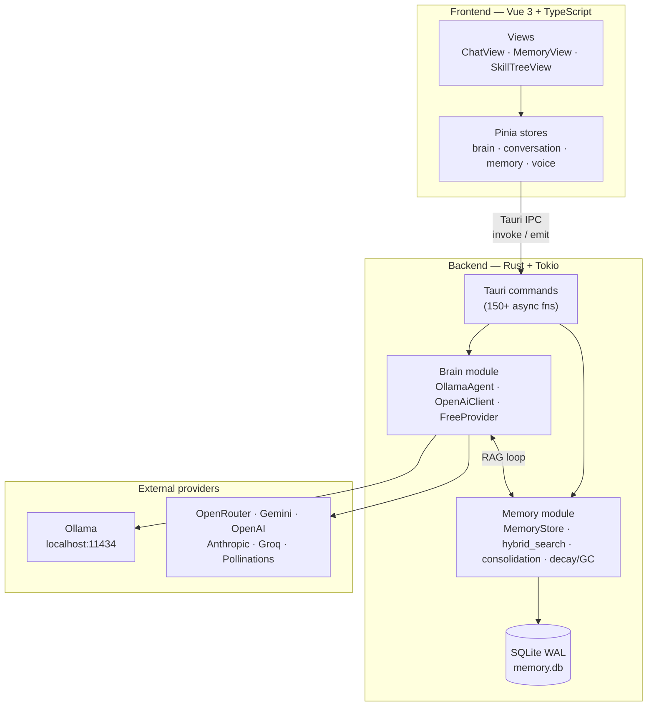
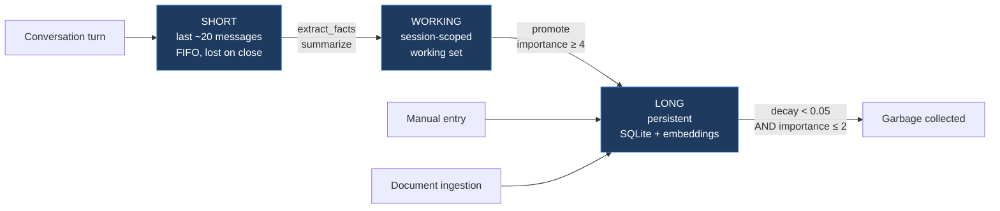
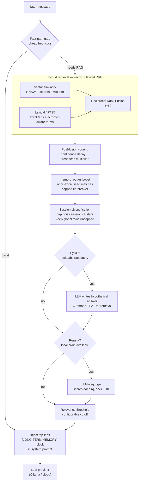
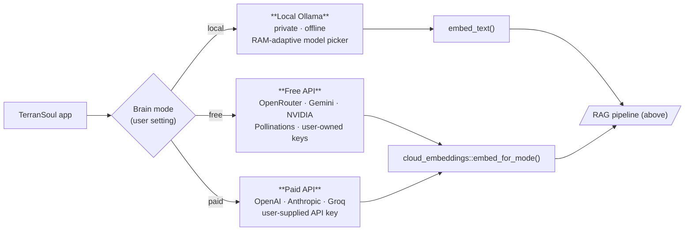
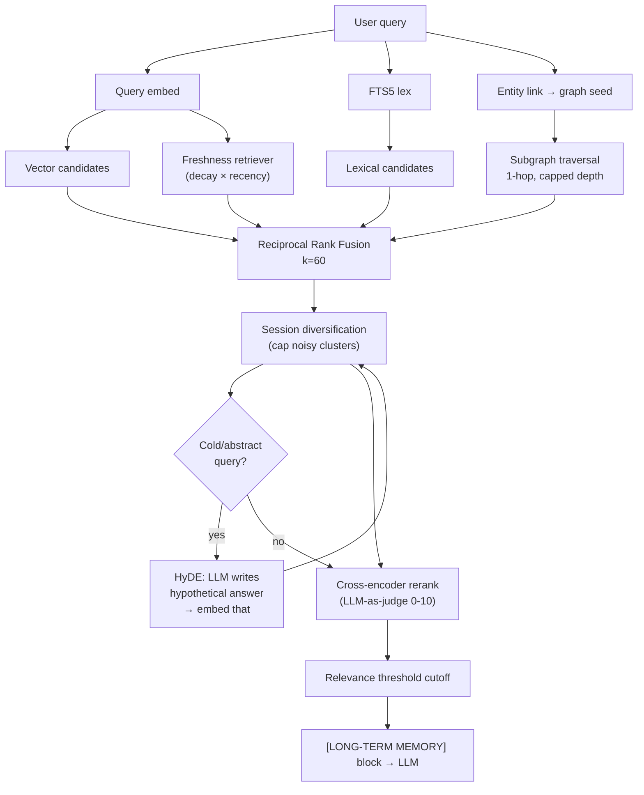
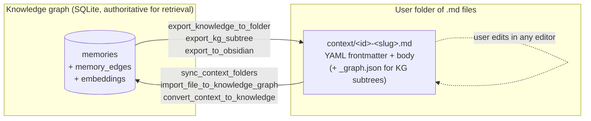

# Brain & Memory — Advanced Architecture Design

> **TerranSoul v0.1** — Self-learning AI companion with persistent memory  
> Last updated: 2026-05-11
> **Audience**: Developers, contributors, and architects who need to understand the full memory/brain system.

## Architecture at a glance

> **TerranSoul is a Vue+Tauri desktop app whose Rust backend keeps a SQLite-backed memory store (3 tiers, 8 categories, 4 cognitive kinds) and pipes every chat turn through a hybrid retrieval pipeline before sending it to a pluggable LLM provider (local Ollama, free cloud, or paid cloud).**

### 1. System layers — who calls whom



### 2. Memory model — three tiers, two axes

Every memory has a **tier** (lifecycle), a **structural type** (how it was created), and a derived **cognitive kind** (what mental function it serves).



| Axis | Values | Stored where |
|---|---|---|
| **Tier** | `short` · `working` · `long` | `memories.tier` column |
| **Structural type** | `fact` · `preference` · `context` · `summary` | `memories.memory_type` column |
| **Cognitive kind** (derived) | `episodic` · `semantic` · `procedural` · `judgment` | classified at retrieval time, optional `cognitive_kind` column for seeded rows |
| **Category** | `personal` · `relations` · `habits` · `domain` · `skills` · `emotional` · `world` · `meta` | tag prefixes (`personal:*`, `domain:law:*`, …) |

### 3. RAG retrieval pipeline — what happens on every chat turn



### 4. Brain modes — three pluggable backends, same surface



### Mental model summary

- **The brain is the LLM provider** (Ollama / cloud), pluggable via a trait.
- **The memory is a SQLite store** with FTS, embeddings, decay, and a knowledge graph (`memory_edges` table).
- **RAG is the bridge**: every chat turn retrieves the top relevant memories and injects them into the system prompt before calling the brain.
- **Categories + cognitive kinds** are how decay, retrieval boosting, and conflict resolution are tuned per memory.
- **Knowledge Graph** (`memory_edges`) enables multi-hop retrieval (e.g., "user's daughter's school" follows two edges).

When you have those five points internalised, the rest of the doc is just specifications and shipped status.

---

## Why Hybrid RAG — Design Rationale

> **Short version:** vector-only RAG fails on multi-hop questions and stale facts. TerranSoul fuses three retrievers — **vector (semantic)**, **knowledge graph (relational)**, and **temporal memory (recency + versioned truth)** — behind RRF + diversification + HyDE + cross-encoder rerank. This is the same hybrid pattern QuarkAndCode describes in *GraphRAG vs Vector RAG* and the [agentmemory + Graphify](https://github.com/rohitg00/agentmemory) pattern for combining structural code maps with temporal user history.

### The three failure modes of pure vector RAG

Vector RAG (chunk → embed → cosine top-k) is the easy default and works for "find me a paragraph that means X." But it consistently breaks on:

1. **Multi-hop / relational reasoning.** "Who approved deployment Y, and who do they report to?" requires following `deployment → approved_by → person → reports_to → person`. Cosine similarity does not encode `reports_to`; it just returns text that *mentions* approvals.
2. **Schema-heavy / entity-bound questions.** A 2023 data.world benchmark cited by *GraphRAG vs Vector RAG* showed GPT-4 over raw SQL at 16.7 % execution accuracy versus a knowledge-graph (SPARQL) representation at 54.2 % on the same 43 insurance-domain questions — and 0 % vs non-zero in the high-complexity quadrant. Structure matters when the question is about structure.
3. **Stale-truth conflicts.** As a companion accumulates history, old embeddings keep ranking next to new ones. Without a temporal/decay layer, the system happily mixes "we deprecated X" with "X is the recommended approach" from two months prior. The agentmemory + Graphify pattern fixes this by attaching a **temporal timeline** of observations to the structural graph so newer truths override older ones with explicit provenance.

### TerranSoul's three retrievers (and what each is good at)

| Retriever | Implementation | Strength | Weakness alone |
|---|---|---|---|
| **Vector** | HNSW (`usearch`) over per-shard 1024/768-dim embeddings (`mxbai-embed-large` default since BENCH-LCM-5; `nomic-embed-text` lightweight fallback) | Fuzzy semantic recall, "meaning-similar" matches, scales to 1M+ rows | No relations, no recency, fragments multi-hop chains |
| **Knowledge graph** | `memory_edges` table (typed, directional, confidence-weighted edges) + tag-derived implicit edges, plus the Phase-6 entity-resolution layer that deduplicates `Bill G.`/`William Gates` style splits | Multi-hop traversal, explainability via the supporting subgraph, schema-bound questions | Coverage gaps where no edges were extracted; needs maintenance |
| **Temporal / decay layer** | Per-memory `decay_score`, `last_accessed_at`, source-hash invalidation, append-only versioning (V8), LLM-powered conflict resolution | "What's currently true", contradiction handling, override of stale embeddings | Doesn't help if there are no candidates yet |

A fourth retriever — **lexical FTS5** with corpus-aware acronym + rare-term weighting and broad-term caps — rides alongside to rescue exact identifiers (file paths, error codes, model names) that pure semantic similarity misses.

### How they fuse



**Why this exact combination:**

- **RRF over 4 retrievers** is robust to any single retriever returning garbage — the worst case is that retriever contributes nothing, not that it poisons the top-k. This directly addresses the *Meilisearch / Optimum Partners* "route different question types to different backends" pattern by letting all backends vote.
- **Session diversification with uncapped global rows** ensures one noisy conversation cluster can't drown out the genuinely relevant global memory. Per-session caps are configurable; global rows are intentionally not capped because they represent durable knowledge.
- **HyDE on cold/abstract queries only** — gated by a cheap heuristic — because HyDE costs an extra LLM call and shouldn't fire on every "hi" turn.
- **Cross-encoder rerank with the active local brain** when available, because a 0-10 LLM-as-judge score over the top ~30 candidates is dramatically more accurate than raw cosine, and TerranSoul already has the brain running.
- **Relevance threshold cutoff** is the last guardrail — low-score memories are dropped entirely rather than padded into the prompt. This is what makes the "I don't know" rule in [rules/reality-filter.md](../rules/reality-filter.md) enforceable: if nothing crosses the threshold, the agent doesn't get fake context.

### What "agentmemory + Graphify" maps to in TerranSoul

The agentmemory/Graphify pattern combines a **structural map** (code/file graph) with a **temporal map** (user actions, prior commit goals, past bug fixes, preferences) so an agent can answer "why did we change the auth logic in the API folder?" by locating the API nodes structurally and then pulling the historical conversations linked to those nodes.

TerranSoul implements both halves natively:

- **Structural map** → `memory_edges` + native code intelligence (`code_query`, `code_context`, `code_impact`, `code_rename`) operating over an indexed AST/symbol graph. The graph stores file/function/class dependencies and lets multi-hop traversal answer "what depends on this".
- **Temporal map** → the three-tier memory (`short` / `working` / `long`), `decay_score`, append-only versioning, source-hash invalidation, LLM-powered conflict resolution, and per-memory `last_accessed_at`. New observations override old ones with explicit provenance and version snapshots.
- **Unified store** → both maps live in the same SQLite database, so a single hybrid query can fuse "files this function touches" with "what we said about this function last week" without a cross-database join.

This is why the design is *not* "vector-only with a graph bolted on" — the graph, temporal, and lexical retrievers are first-class citizens in the RRF fuser, not optional plugins.

### Measured payoff

On the LongMemEval-S retrieval-only slice (500 cleaned questions), TerranSoul `search` with corpus-aware lexical weighting + gated KG boost hits **R@5 99.2 %, R@10 99.6 %, R@20 100.0 %, NDCG@10 91.3 %, MRR 92.6 %**, ahead of agentmemory's published 95.2/98.6/99.4/87.9/88.2 and MemPalace's ~96.6 % R@5. On the pinned agentmemory `bench:quality` case set, no-vector RRF reaches 67.1 % R@10 / 98.2 % NDCG / 100.0 % MRR. Token-efficiency: 2,798 retrieved-memory tokens/query for the same quality, vs 32,660 tokens/query for full-context paste — **91.4 % cheaper**.

These numbers are the practical justification for the hybrid design over vector-only — and the loop in [rules/milestones.md](../rules/milestones.md) `BENCH-LCM` / `BENCH-AM` keeps pushing them.

**LoCoMo retrieval bench (full 1976-query MTEB slice, 2026-05-13):** the bench harness `scripts/locomo-mteb.mjs` exercises four canonical pipeline configurations end-to-end:
- `rrf` — `hybrid_search_rrf` only (LCM-5 baseline)
- `rrf_rerank` — RRF + cross-encoder LLM-as-judge over top-30 (LCM-8, **canonical default**: overall R@10 **68.3 %**, adversarial 67.7 %)
- `rrf_hyde` — HyDE-expanded vector channel + raw lexical channel (LCM-10 alternative)
- `rrf_hyde_rerank` — HyDE expansion + cross-encoder rerank (LCM-10 alternative): overall R@10 **68.5 %** (+0.2pp tied), but per-task wins on temporal_reasoning +2.9pp and multi_hop +1.0pp at the cost of open_domain -1.6pp. HyDE is therefore wired as a **per-query-class tool** (gate on in production for abstract / multi-hop / temporal queries; gate off for under-specified open-ended queries) rather than a global default.
- `rrf_ctx` / `rrf_ctx_rerank` — ingest-side Anthropic Contextual Retrieval (LCM-11 alternative, gated on `LONGMEM_CONTEXTUALIZE=1`, with disk-cache at `target-copilot-bench/ctx-cache/`): 100-q adversarial smoke shows R@10 **68.5 %** (tied with LCM-10), NDCG@10 **40.8 %** (+1.1pp over LCM-10, +4.3pp over LCM-8), but did **not** clear the LCM-11 acceptance bar of NDCG@10 ≥ 50. Both systems stay registered as **alternative** bench paths for future stacked-pipeline experiments; the canonical default remains `rrf_rerank`. Durable lesson: contextual retrieval gains are dataset-dependent — LoCoMo conversational chunks already carry inline speaker+timestamp anchors, so the canonical Anthropic +49 % failure-reduction does not transfer.

---

## Table of Contents

1. [System Overview](#system-overview)
2. [Three-Tier Memory Model](#three-tier-memory-model)
 - [Short-Term Memory](#short-term-memory)
 - [Working Memory](#working-memory)
 - [Long-Term Memory](#long-term-memory)
 - [Tier Lifecycle & Promotion Chain](#tier-lifecycle--promotion-chain)
3. [Memory Categories (Ontology)](#memory-categories-ontology)
 - [Core Types](#core-types)
 - [Proposed Category Taxonomy](#proposed-category-taxonomy)
 - [Category × Tier Matrix](#category--tier-matrix)
 - [Cognitive Memory Axes (Episodic / Semantic / Procedural / Judgment)](#35-cognitive-memory-axes-episodic--semantic--procedural--judgment)
4. [Hybrid RAG Pipeline](#hybrid-rag-pipeline)
 - [6-Signal Scoring Formula](#6-signal-scoring-formula)
 - [RAG Injection Flow](#rag-injection-flow)
  - [Tool Plugins And Brain Routing](#tool-plugins-and-brain-routing)
  - [Memory Plugin Hooks](#memory-plugin-hooks)
 - [Embedding & Vector Search](#embedding--vector-search)
5. [Decay & Garbage Collection](#decay--garbage-collection)
6. [Knowledge Graph Vision](#knowledge-graph-vision)
 - [Current: Tag-Based Graph](#current-tag-based-graph)
 - [Implemented (V5): Entity-Relationship Graph](#implemented-v5-entity-relationship-graph)
 - [Graph Traversal for Multi-Hop RAG](#graph-traversal-for-multi-hop-rag)
7. [Visualization Layers](#visualization-layers)
 - [Layer 1: In-App (Cytoscape.js)](#layer-1-in-app-cytoscapejs)
 - [Layer 2: Obsidian Vault Export](#layer-2-obsidian-vault-export)
 - [Layer 3: Debug SQL Console](#layer-3-debug-sql-console)
 - [§ 7.5 Folder ↔ Knowledge Graph Sync](#75-folder--knowledge-graph-sync)
8. [SQLite Schema](#sqlite-schema)
9. [Why SQLite?](#why-sqlite)
10. [Brain Modes & Provider Architecture](#brain-modes--provider-architecture)
11. [LLM-Powered Memory Operations](#llm-powered-memory-operations)
12. [Multi-Source Knowledge Management](#multi-source-knowledge-management)
 - [Source Hash Change Detection](#1-source-hash-change-detection)
 - [TTL Expiry](#2-ttl-expiry)
 - [Access Count Decay](#3-access-count-decay)
 - [LLM-Powered Conflict Resolution](#4-llm-powered-conflict-resolution)
13. [Open-Source RAG Ecosystem Comparison](#open-source-rag-ecosystem-comparison)
14. [Debugging with SQLite](#debugging-with-sqlite)
15. [Hardware Scaling](#hardware-scaling)
16. [Scaling Roadmap](#scaling-roadmap)
17. [FAQ](#faq)
18. [Diagrams Index](#diagrams-index)
19. [April 2026 Research Survey — Modern RAG & Agent-Memory Techniques](#april-2026-research-survey--modern-rag--agent-memory-techniques)
20. [Brain Component Selection & Routing — How the LLM Knows What to Use](#brain-component-selection--routing--how-the-llm-knows-what-to-use)
21. [How Daily Conversation Updates the Brain — Write-Back / Learning Loop](#how-daily-conversation-updates-the-brain--write-back--learning-loop)
22. [Native Code Intelligence — Clean-Room GitNexus Parity Path](#native-code-intelligence--clean-room-gitnexus-parity-path)
23. [Code-RAG Fusion in `rerank_search_memories` (Phase 13 Tier 2)](#code-rag-fusion-in-rerank_search_memories-phase-13-tier-2)
24. [MCP Server — External AI Coding Assistant Integration (Phase 15)](#mcp-server--external-ai-coding-assistant-integration-phase-15)
25. [Intent Classification](#25-intent-classification)
26. [Knowledge Wiki Operations — Graphify + LLM Wiki Application](#26-knowledge-wiki-operations--graphify--llm-wiki-application)

---

## 1. System Overview

```
┌─────────────────────────────────────────────────────────────────────────────┐
│                          TerranSoul Desktop App                            │
│                                                                             │
│  ┌──────────────────────────────────────────────────────────────────────┐   │
│  │                     FRONTEND (Vue 3 + TypeScript)                    │   │
│  │                                                                      │   │
│  │  ┌──────────────┐  ┌──────────────┐  ┌────────────────────────────┐ │   │
│  │  │  ChatView    │  │ MemoryView   │  │ SkillTreeView              │ │   │
│  │  │              │  │              │  │                            │ │   │
│  │  │ • Send msg   │  │ • List/Grid  │  │ • Quest-guided discovery  │ │   │
│  │  │ • Stream res │  │ • Graph viz  │  │ • "Sage's Library" quest  │ │   │
│  │  │ • Subtitles  │  │ • Tier chips │  │   unlocks RAG features    │ │   │
│  │  └──────┬───────┘  │ • Filters    │  └────────────────────────────┘ │   │
│  │         │          │ • Search     │                                  │   │
│  │         │          │ • Add/Edit   │                                  │   │
│  │         │          │ • Decay viz  │                                  │   │
│  │         │          └──────┬───────┘                                  │   │
│  │         │                 │                                          │   │
│  │  ┌──────▼─────────────────▼──────────────────────────────────────┐  │   │
│  │  │                    Pinia Stores                                │  │   │
│  │  │                                                                │  │   │
│  │  │  brain.ts ──── conversation.ts ──── memory.ts ──── voice.ts   │  │   │
│  │  │  (provider)    (chat + stream)      (CRUD + search) (TTS/ASR) │  │   │
│  │  └──────────────────────┬────────────────────────────────────────┘  │   │
│  └─────────────────────────┼────────────────────────────────────────────┘   │
│                            │ Tauri IPC (invoke / emit)                      │
│  ┌─────────────────────────▼────────────────────────────────────────────┐   │
│  │                     BACKEND (Rust + Tokio)                           │   │
│  │                                                                      │   │
│  │  ┌────────────────────────────────────────────────────────────────┐  │   │
│  │  │                   Commands Layer (150+)                        │  │   │
│  │  │  chat.rs • streaming.rs • memory.rs • brain.rs • voice.rs     │  │   │
│  │  └────────┬──────────────────────────────┬────────────────────────┘  │   │
│  │           │                              │                           │   │
│  │  ┌────────▼────────┐           ┌─────────▼─────────┐               │   │
│  │  │  Brain Module   │           │  Memory Module     │               │   │
│  │  │                 │           │                    │               │   │
│  │  │ • OllamaAgent  │◄─────────►│ • MemoryStore      │               │   │
│  │  │ • OpenAiClient │  RAG loop │ • brain_memory.rs   │               │   │
│  │  │ • FreeProvider  │           │ • hybrid_search()  │               │   │
│  │  │ • embed_text() │           │ • vector_search()  │               │   │
│  │  │ • ProviderRotat│           │ • decay / gc       │               │   │
│  │  └────────┬────────┘           └─────────┬──────────┘               │   │
│  │           │                              │                           │   │
│  │           │      ┌───────────────────────▼──────┐                   │   │
│  │           │      │  SQLite (WAL mode)           │                   │   │
│  │           │      │  memory.db                   │                   │   │
│  │           │      │                              │                   │   │
│  │           │      │  memories ─┬─ content        │                   │   │
│  │           │      │            ├─ embedding BLOB  │                   │   │
│  │           │      │            ├─ tier            │                   │   │
│  │           │      │            ├─ memory_type     │                   │   │
│  │           │      │            ├─ tags            │                   │   │
│  │           │      │            ├─ importance      │                   │   │
│  │           │      │            ├─ decay_score     │                   │   │
│  │           │      │            └─ source_*        │                   │   │
│  │           │      └──────────────────────────────┘                   │   │
│  │           │                                                          │   │
│  │  ┌────────▼──────────────────────────┐                              │   │
│  │  │  External LLM Providers          │                              │   │
│  │  │                                   │                              │   │
│  │  │  • Ollama (localhost:11434)       │                              │   │
│  │  │  • OpenRouter / Gemini / NVIDIA  │                              │   │
│  │  │  • Pollinations / OpenAI / Groq  │                              │   │
│  │  └───────────────────────────────────┘                              │   │
│  └──────────────────────────────────────────────────────────────────────┘   │
└─────────────────────────────────────────────────────────────────────────────┘
```

### Browser mode surface

The Vue bundle also supports a browser-only mode for the public TerranSoul
landing page and live model testing on Vercel. This web surface is not a Tauri
release package or installer flow: when `App.vue` cannot reach Tauri IPC, it
routes to a static product landing page, keeps provider setup behind a single
button/modal, and keeps the real Three.js/VRM character mounted as a forced
pet-mode preview. Opening "3D" or "Chat" from the landing page creates a compact
responsive in-page app window with dialog semantics and mobile-safe sizing; it
uses the same Pinia stores as desktop, but native-only commands fall back to
browser-native storage and direct provider calls unless a remote host is paired.

Browser mode therefore exercises the real frontend brain contract without
claiming local desktop capabilities: Free/Paid API chat can run directly in the
web client after chat or pet mode opens the provider chooser. Current research
puts OpenRouter first for static-web free model breadth, followed by Gemini AI
Studio, NVIDIA NIM free serverless development APIs, and Pollinations tokens
from `enter.pollinations.ai`; ChatGPT/OpenAI remains available as a paid API
path. Every provider card launches the provider page first. Manual key/token
entry is present only as the secondary direct-call option required by a
backendless static deployment. The selected web test session is remembered in
the `brain` Pinia store plus localStorage, and ChatView exposes a Reconfigure LLM
button so Vercel users do not have to leave the conversation to switch providers.
Local/remote brain paths still require an explicit TerranSoul host. Browser mode
now includes a known-host LAN bridge on the landing page: the user can enter a
host/port, the page probes the existing gRPC-Web `RemoteHost`, stores the host
in `ts.browser.lan.host`, and opens `ChatView` through `remote-conversation`.
That is the maximum backendless browser shape. A Vercel HTTPS page cannot
auto-discover all LAN TerranSoul instances because browsers cannot receive
mDNS/UDP advertisements, inspect router/ARP state, or safely scan private
subnets from a public origin. It also cannot call plaintext private-LAN HTTP
from HTTPS; direct browser LAN calls require same-machine loopback, local HTTP
development, or a browser-trusted HTTPS host with the right CORS/private-network
allowance. Native mobile/desktop pairing remains the reliable LAN discovery and
trust path. The browser transport resolver rejects local Ollama/LM Studio as
direct browser transports so the UI never implies Rust-backed memory or
localhost LLM access is available without a RemoteHost.

Browser RAG is implemented by `src/transport/browser-rag.ts` and backs the
`memory` Pinia store whenever Tauri IPC is unavailable. It persists memory
records to IndexedDB with a localStorage mirror, computes browser embeddings via
a deterministic Transformers.js-compatible seam, performs flat vector search
with keyword/freshness/importance/decay/tier scoring, fuses vector + keyword +
freshness rankings with RRF (`k=60`), exposes a HyDE prompt builder for direct
provider calls, applies a simplified local rerank through the same hybrid score,
and exports/imports a versioned sync payload that can be stored in the user's
Google Drive file flow. Browser chat injects top browser-RAG hits as the same
`[RETRIEVED CONTEXT]` / `[LONG-TERM MEMORY]` context-pack contract used by desktop and writes completed browser chat
turns back into local memory. Browser-mode QA is covered by focused Vue tests for
landing anchors, one-click browser authorization, forced pet-preview wiring,
manga-style pet emotion bubbles, app-window launch events, browser memory
storage/search, browser sync payloads, and prompt injection. The memory store also exposes a progressive search shape: compact ranked previews first, with full `MemoryEntry` expansion only for selected IDs.

---

## 2. Three-Tier Memory Model

TerranSoul's memory mirrors human cognition: **short-term** (seconds–minutes), **working** (session-scoped), and **long-term** (permanent knowledge base).

### Short-Term Memory

```
┌─────────────────────────────────────────────────────────────────┐
│                    SHORT-TERM MEMORY                             │
│                                                                  │
│  Storage:   Rust Vec<Message> in AppState (in-memory)           │
│  Capacity:  Last ~20 messages                                    │
│  Lifetime:  Current session only — lost on app close            │
│  Purpose:   Conversation continuity ("what did I just say?")    │
│  Injected:  Always — appended to LLM prompt as chat history    │
│                                                                  │
│  ┌──────────────────────────────────────────────────────────┐   │
│  │ [user]      "What are the filing rules?"                  │   │
│  │ [assistant] "Family law filings require 30-day notice..." │   │
│  │ [user]      "What about emergency motions?"               │   │
│  │ [assistant] "Emergency motions can be filed same-day..."  │   │
│  │ ... (last 20 messages, FIFO eviction)                     │   │
│  └──────────────────────────────────────────────────────────┘   │
│                                                                  │
│  Eviction:  When buffer exceeds 20, oldest messages are         │
│             candidates for extraction → working memory           │
└─────────────────────────────────────────────────────────────────┘
```

### Working Memory

```
┌─────────────────────────────────────────────────────────────────┐
│                    WORKING MEMORY                                │
│                                                                  │
│  Storage:   SQLite, tier='working'                              │
│  Capacity:  Unbounded (session-scoped)                          │
│  Lifetime:  Persists across restarts but scoped to session_id   │
│  Purpose:   Facts extracted from current conversation           │
│  Injected:  Via hybrid_search() when relevant to query          │
│                                                                  │
│  Created by:                                                     │
│  • extract_facts() — LLM extracts 5 key facts from chat        │
│  • summarize() — LLM creates 1-3 sentence recap                │
│  • User clicks "Extract from session" button                    │
│                                                                  │
│  ┌──────────────────────────────────────────────────────────┐   │
│  │ id=101  "User prefers dark mode"         tier=working    │   │
│  │ id=102  "User is studying family law"    tier=working    │   │
│  │ id=103  "Session about filing deadlines" tier=working    │   │
│  │         session_id="sess_2026-04-22_001"                 │   │
│  └──────────────────────────────────────────────────────────┘   │
│                                                                  │
│  Promotion:  Working → Long when importance ≥ 4 or user confirms│
│  Eviction:   Decays faster than long-term (tier_priority=lower) │
└─────────────────────────────────────────────────────────────────┘
```

### Long-Term Memory

```
┌─────────────────────────────────────────────────────────────────┐
│                    LONG-TERM MEMORY                              │
│                                                                  │
│  Storage:   SQLite, tier='long', vector-indexed                 │
│  Capacity:  1M verified (HNSW bench); 1B design path via sharding │
│  Lifetime:  Permanent — subject to decay + GC                   │
│  Purpose:   Knowledge base for RAG injection                    │
│  Injected:  Top 5 via hybrid_search() into [LONG-TERM MEMORY]  │
│                                                                  │
│  Sources:                                                        │
│  • Manual entry (user types in Memory View)                     │
│  • Promoted from working memory                                 │
│  • Document ingestion (PDF/URL → chunked → embedded)            │
│  • LLM extraction ("Extract from session")                      │
│                                                                  │
│  ┌──────────────────────────────────────────────────────────┐   │
│  │ id=1  "Cook County Rule 14.3: 30 days to respond"        │   │
│  │       tier=long  type=fact  importance=5  decay=0.92     │   │
│  │       tags="law,family,deadline,cook-county"             │   │
│  │       embedding=[0.12, -0.34, 0.56, ...] (768-dim)      │   │
│  │       access_count=47  last_accessed=2026-04-22          │   │
│  │                                                           │   │
│  │ id=2  "User's name is Alex"                              │   │
│  │       tier=long  type=fact  importance=5  decay=0.99     │   │
│  │       tags="personal,identity"                           │   │
│  │       access_count=312                                   │   │
│  │                                                           │   │
│  │ id=3  "Alex prefers concise answers"                     │   │
│  │       tier=long  type=preference  importance=4  decay=0.87│   │
│  │       tags="personal,preference,style"                   │   │
│  └──────────────────────────────────────────────────────────┘   │
│                                                                  │
│  Decay:  decay_score = 1.0 × 0.95^(hours_since_access / 168)  │
│  GC:     Remove when decay < 0.05 AND importance ≤ 2           │
└─────────────────────────────────────────────────────────────────┘
```

### Tier Lifecycle & Promotion Chain

```
 ┌───────────────────────────────────────────────────────────────────────┐
 │                      MEMORY TIER LIFECYCLE                            │
 │                                                                       │
 │                                                                       │
 │   CONVERSATION                                                        │
 │   ┌─────────┐     evict (FIFO, >20)     ┌───────────┐               │
 │   │  SHORT  │ ──────────────────────────>│  WORKING  │               │
 │   │  TERM   │     extract_facts()        │  MEMORY   │               │
 │   │         │     summarize()            │           │               │
 │   └─────────┘                            └─────┬─────┘               │
 │        │                                       │                      │
 │   lost on close                          promote()                    │
 │                                          (importance ≥ 4              │
 │                                           or user action)             │
 │                                                │                      │
 │                                          ┌─────▼─────┐               │
 │   MANUAL ENTRY ─────────────────────────>│   LONG    │               │
 │   DOCUMENT INGESTION ───────────────────>│   TERM    │               │
 │   LLM EXTRACTION ──────────────────────>│  MEMORY   │               │
 │                                          └─────┬─────┘               │
 │                                                │                      │
 │                                          decay < 0.05                │
 │                                          AND importance ≤ 2          │
 │                                                │                      │
 │                                          ┌─────▼─────┐               │
 │                                          │  GARBAGE   │               │
 │                                          │ COLLECTED  │               │
 │                                          └───────────┘               │
 └───────────────────────────────────────────────────────────────────────┘
```

---

## 3. Memory Categories (Ontology)

### Core Types

The current `memory_type` column supports four values:

| Type | Description | Example |
|------|-------------|---------|
| `fact` | Objective knowledge, rules, data | "Cook County requires 30-day notice for filings" |
| `preference` | Subjective user preferences | "User prefers dark mode and concise answers" |
| `context` | Situational/environmental info | "User is on mobile during commute" |
| `summary` | LLM-generated session recaps | "Session covered family law deadlines and billing" |

### Proposed Category Taxonomy

The four core types are **structural** (how the memory was created). Categories are **semantic** (what the memory is about). Both axes are needed.

**Category × Structural Type — example contents:**

| Category \ Type | `fact` | `preference` | `context` | `summary` |
|---|---|---|---|---|
| **personal info** | name, age, location | dark mode, language, timezone | "on mobile" | "User intro session" |
| **friends & relations** | "Mom is Sarah" | "Dad likes golf" | "Sister visiting" | "Talked about family" |
| **habits & routines** | "Runs 5km/day" | "Prefers 6am alarm" | "Morning workout" | "Health recap" |
| **domain knowledge** | "Rule 14.3…" | "Cite Bluebook" | "Case research" | "Law session" |
| **skills & projects** | "Knows Python" | "Learning Rust" | "Coding session" | "Skill progress" |
| **emotional state** | "Anxious about exams" | "Likes encouragement" | "Stressed about deadline" | "Mood trend recap" |
| **world knowledge** | "Earth is 93M mi from sun" | — | "Election season" | "News digest" |

**Proposed `category` values** (stored as a new column or as structured tags):

| Category | Tag Prefix | Description | Decay Behavior |
|----------|-----------|-------------|----------------|
| `personal` | `personal:*` | Identity, demographics, self-description | Very slow decay (core identity) |
| `relations` | `rel:*` | People the user knows, relationships | Slow decay |
| `habits` | `habit:*` | Routines, schedules, repeated behaviors | Medium decay (habits change) |
| `domain` | `domain:*` | Professional/academic knowledge | Configurable per domain |
| `skills` | `skill:*` | Abilities, learning progress, projects | Medium decay |
| `emotional` | `emotional:*` | Mood, feelings, mental state snapshots | Fast decay (emotions are ephemeral) |
| `world` | `world:*` | General knowledge, news, events | Slow decay (facts are stable) |
| `meta` | `meta:*` | Preferences about TerranSoul itself | Very slow decay |

### Category × Tier Matrix

Not all categories belong in all tiers:

| Category | `short` | `working` | `long` |
|---|---|---|---|
| **personal** | rare | extracted | ✓ permanent |
| **relations** | mentioned | extracted | ✓ permanent |
| **habits** | — | observed | ✓ after confirmation |
| **domain** | referenced | chunked / cited | ✓ ingested docs |
| **skills** | mentioned | session notes | ✓ tracked progress |
| **emotional** | ✓ current | session mood | ✓ only patterns |
| **world** | referenced | — | ✓ verified facts |
| **meta** | — | — | ✓ always |

**Key insight**: Emotional memories should decay fast in long-term (you don't want "user was stressed on April 3rd" cluttering RAG forever), but personal identity ("user's name is Alex") should essentially never decay.

**Implementation path**: The canonical V15 schema includes optional `category` and `cognitive_kind` columns, plus the `protected` eviction guard; structured tag prefixes (`personal:name`, `rel:friend:sarah`, `domain:law:family`) remain the primary portable categorisation layer.

> **As-built (2026-04-24).** Tag-prefix approach implemented:
> - `memory::tag_vocabulary` with `CURATED_PREFIXES` (`personal`, `domain`, `project`, `tool`, `code`, `external`, `session`, `quest`), `validate` / `validate_csv`, `LEGACY_ALLOW_LIST`.
> - `category_decay_multiplier` per-prefix decay rates (personal 0.5×, session/quest 2×).
> - `memory::auto_tag` LLM auto-tagger: opt-in via `AppSettings.auto_tag`; dispatches to Ollama/FreeApi/PaidApi; merges ≤ 4 curated tags with user tags on `add_memory`.
> - `MemoryView.vue` tag-prefix filter chip row with per-prefix counts.
> - Obsidian vault export with tag metadata.

---

## 3.5 Cognitive Memory Axes (Episodic / Semantic / Procedural / Judgment)

> **Status:** classifier landed at `src-tauri/src/memory/cognitive_kind.rs`
> alongside ontology tag prefixes; **no extra schema change**.

### 3.5.1 The question

Cognitive psychology splits long-term memory into distinct systems, with
TerranSoul adding an explicit **judgment** kind for durable rules, heuristics,
and operating decisions that should be auditable like other memory facts:

| Cognitive kind | Description | Brain region | TerranSoul examples |
|----------------|-------------|--------------|---------------------|
| **Episodic** | Time- and place-anchored personal experiences. Each memory is a "scene" with a when/where. | Hippocampus | "On April 22nd Alex finished the rust refactor", "We met Sarah at the cafe yesterday" |
| **Semantic** | Time-independent general knowledge and stable preferences. The "what" without the "when". | Neocortex | "Rust uses ownership for memory safety", "Alex prefers dark mode", "Mars has two moons" |
| **Procedural** | How-to knowledge, motor skills, repeatable workflows. The "how". | Cerebellum / basal ganglia | "How to ship a release: bump → tag → push", "Morning routine: 6am alarm, run 5km, shower, breakfast" |
| **Judgment** | Durable rules, heuristics, and operating decisions. The "why this choice" layer. | Prefrontal cortex | "Prefer focused patches before broad refactors", "Do not stop MCP during TerranSoul sessions" |

These overlap with — but are **orthogonal to** — TerranSoul's existing
`MemoryType` (`fact`/`preference`/`context`/`summary`) and `MemoryTier`
(`short`/`working`/`long`) axes:

**Structural Type × Cognitive Kind** (✓ = common, ◇ = possible, — = rare):

| Type \ Kind | `episodic` | `semantic` | `procedural` | `judgment` |
|---|---|---|---|---|
| **fact** | ◇ event record | ✓ general truth | ◇ how-to fact | ✓ decision rule |
| **preference** | — | ✓ stable choice | ◇ workflow preference | ✓ operating preference |
| **context** | ✓ current event | ◇ current state | ◇ repo workflow | ✓ session heuristic |
| **summary** | ✓ session recap | — | ◇ process recap | ◇ decision recap |

### 3.5.2 Do we **need** a cognitive-kind axis?

**Yes** — but a derived one, not a stored one. We need it for three concrete
RAG-quality reasons:

1. **Decay must be kind-aware.** Episodic memories should decay much faster
 than semantic ones — nobody benefits from "user mentioned the weather on
 April 3rd" haunting RAG forever, but "user's name is Alex" must never
 decay. Procedural memories should decay slowly *unless* they're explicitly
 superseded.
2. **Retrieval must be kind-prioritised by query intent.** A query like
 *"how do I deploy?"* wants procedural first; *"what did we decide
 yesterday?"* wants episodic first; *"what is X?"* wants semantic first. A
 light query-intent classifier + a kind-aware ranker boost is a meaningful
 precision improvement over pure vector similarity.
3. **Conflict resolution must be kind-aware.** Two semantic memories saying
 contradictory things ("Alex prefers dark mode" vs "Alex prefers light
 mode") must be reconciled — the newer wins. Two episodic memories of the
 same event can both be true and should be merged, not deduplicated.

The canonical SQLite schema now includes a nullable `cognitive_kind` column for
seeded and externally-ingested rows that already know their kind. The
pure-function classifier remains the fallback/source of truth when the column is
`NULL`, so existing rows and alternate backends can still derive the kind from
`(memory_type, tags, content)` without an LLM call.

### 3.5.3 Classifier algorithm

Implemented as a pure function in
[`memory/cognitive_kind.rs`](../src-tauri/src/memory/cognitive_kind.rs):

```
fn classify(memory_type, tags, content) -> CognitiveKind:
 1. If `tags` contains an explicit cognitive tag
 (`episodic` | `semantic` | `procedural`/`procedure` | `judgment`, optionally with
 `:detail` suffix), use it. — power-user override.
 2. Else apply structural-type defaults:
 Summary → Episodic (recaps a session)
 Preference → Semantic (stable user state)
 Fact, Context → fall through to step 3.
 3. Else apply lightweight content heuristics:
 "how to" / "step " / "first," / numbered-list shape
 → Procedural
 "yesterday" / "this morning" / weekday names / "ago"
 → Episodic
 else → Semantic (safe default)
```

The classifier is exhaustively unit-tested in Rust and mirrored by 19 TS cases
covering tag override, structural-type defaults, content heuristics, and edge
cases. It is
**deterministic and offline** — no LLM call. An optional LLM-based reclassifier
can be added later for the long-tail; the heuristic currently resolves the
~85% of memories where the kind is obvious from surface features.

### 3.5.4 How the axes compose

```
            ┌──────────────────────┐
            │      Memory          │
            │ ──────────────────── │
            │ tier: short/working/long       (lifecycle)
            │ memory_type: fact/pref/...     (structural origin)
            │ cognitive_kind: ep/sem/proc/judgment (cognitive function) ← derived
            │ category: personal/world/...   (subject taxonomy)    ← tag prefix
            │ tags: free-form + structured                         (filtering)
            │ embedding, importance, decay_score, …
            └──────────────────────┘
```

`tier` answers *"How long do we keep this?"*
`memory_type` answers *"How was this born?"*
`cognitive_kind` answers *"What kind of cognition does this support?"*
`category` answers *"What is this about?"*

### 3.5.5 Decay tuning by cognitive kind

Recommended decay multipliers (multiply the existing `decay_score` step):

| Kind | Half-life target | Multiplier | Rationale |
|-------------|------------------|------------|-----------|
| Episodic | 30–90 days | × 1.5 | Time-anchored; old episodes stop being useful |
| Semantic | 365+ days | × 0.5 | Stable knowledge; almost never wrong-by-staleness |
| Procedural  | 180+ days | × 0.7 | Slow decay; bump back up to 1.0 on each successful execution |
| Judgment | 365+ days | × 0.6 | Durable rules and decisions; supersede explicitly rather than silently aging out |

Implementation hook: extend `apply_memory_decay` to read
`classify_cognitive_kind(...)` and apply the multiplier. The classifier is
already exposed from `crate::memory` so no new wiring is required.

### 3.5.6 Retrieval ranking by query intent

A 50-line classifier on the **query** side can detect intent from cue words:

| Query cue | Boost |
|--------------------------------------------|----------------------|
| `how do I`, `steps to`, `procedure for` | + procedural × 1.4 |
| `when`, `what did we`, `last time`, `ago`  | + episodic × 1.4 |
| `what is`, `define`, `prefers?` | + semantic × 1.2 |

This is additive on top of the existing 6-signal hybrid score — see §4 — so
we never trade off vector similarity for kind matching, we just break ties.

> ✅ **Shipped.** Implemented as
> `crate::memory::query_intent::classify_query` returning an
> `IntentClassification { intent, confidence, kind_boosts }`. Five intent
> labels (`Procedural`, `Episodic`, `Factual`, `Semantic`, `Unknown`),
> heuristic-based, no LLM call. Caller can multiply each candidate doc's
> RRF score by `boosts.for_kind(doc.cognitive_kind)` before final ranking.
> Wiring into the live RRF pipeline tracked separately (see Phase 16.6
> GraphRAG / 16.4b Self-RAG).
>
> ✅ **Wiring shipped.** Exposed as
> `MemoryStore::hybrid_search_rrf_with_intent(query, embedding?, limit)`.
> Runs the standard 3-signal RRF fusion, then multiplies each fused
> score by the per-kind boost from `IntentClassification.kind_boosts`
> using each doc's `cognitive_kind::classify` result, and re-sorts.
> When the classifier returns `Unknown`, the method is identical to
> plain `hybrid_search_rrf` (no perturbation). +5 tests.
>
> ✅ **Chat-path wiring shipped (CHAT-PARITY-5, 2026-05-13).**
> `commands::chat::retrieve_prompt_memories` now applies a multiplicative
> ×1.15 boost on candidates whose `cognitive_kind::classify` matches the
> query's intent-preferred kind, BEFORE the cross-encoder rerank. The
> mapping is implemented as `intent_prefers_kind(intent, kind) -> bool`
> (Procedural→Procedural, Episodic→Episodic, Factual→Semantic,
> Semantic→Semantic|Judgment, Unknown→none, Negative→never preferred).
> Pure-logic, no LLM hop, position-derived base score so the boost can
> displace at most ~1 rank — safe under intent misclassification.
> No-op on `QueryIntent::Unknown` (heuristic-uncertain queries fall back
> to RRF + cascade order). +3 hermetic tests.

### 3.5.7 Persistence story

The column is intentionally nullable:

1. Fresh SQLite stores create `memories.cognitive_kind TEXT`; older stores get
 the column from the canonical initializer's compatibility pass.
2. `mcp-data/shared/memory-seed.sql` may insert explicit values for high-signal
 project knowledge (`principle`, `procedural`, etc.).
3. Runtime ranking still falls back to `cognitive_kind::classify` whenever the
 column is absent from a backend row or `NULL`.
4. A future follow-up can add an index and persist the classifier output on
 every add/update path if profiling shows per-query classification is costly.

### 3.5.8 What does **not** change

- No new Tauri command, no new schema, no new index.
- `MemoryEntry` payload is unchanged on the wire — the kind is computed
  client-side or by the Rust ranker as needed.
- Existing tests remain green; the classifier ships alongside `MemoryStore`,
  not inside it.

---

## 4. Hybrid RAG Pipeline

### 6-Signal Scoring Formula

Contentful retrieval queries run a hybrid search that combines six signals into a single relevance score. Short content-light chat turns, such as greetings and acknowledgements, take the fast chat path and skip embedding/search entirely so LocalLLM replies are not delayed by model contention.

The lexical layer uses one shared query-term parser across `search`, `hybrid_search`, and RRF: it keeps short technical acronyms such as `ci`/`cd`/`ui`, filters broad question stop terms such as `how`/`does`/`work`/`app`, adds light variants for common natural-language forms, and ranks candidates by exact tag-token hits, exact content-token hits, substring hits, all-term coverage, and importance. Before final ordering, the reranker computes per-query corpus weights over the candidate pool so rare anchors such as names, objects, and domain terms outrank generic filler terms; broad workflow terms such as `configuration`, `setup`, `test`, and `validation` are capped so they cannot masquerade as rare anchors in small candidate pools. RRF treats vector and lexical ranks as the primary evidence streams; freshness and knowledge-graph edges are post-fusion multipliers so they can break ties without overpowering content relevance.

LongMemEval-S retrieval-only verification (2026-05-11, 500 cleaned questions) with this lexical path: TerranSoul `search` R@5 **99.2 %**, R@10 **99.6 %**, R@20 **100.0 %**, NDCG@10 **91.3 %**, MRR **92.6 %**. This is the comparable retrieval-table number, not official end-to-end LongMemEval QA accuracy.

```
final_score =
 0.40 × vector_similarity // Semantic meaning (cosine distance)
  + 0.20 × keyword_match // FTS5 full-text match (V21) with INSTR fallback
  + 0.15 × recency_bias // How recently accessed
  + 0.10 × importance_score // User-assigned priority (1–5)
  + 0.10 × decay_score // Freshness multiplier (0.0–1.0)
  + 0.05 × tier_priority // working(1.0) > long(0.7) > short(0.3)
```

**Signal breakdown:**

```
┌─────────────────────────────────────────────────────────────────────┐
│                    HYBRID SEARCH — 6 SIGNALS                        │
│                                                                     │
│  ┌─────────────────────────┐                                        │
│  │ 1. VECTOR SIMILARITY    │  Weight: 40%                           │
│  │    cosine(query_emb,    │  Range: 0.0 – 1.0                     │
│  │           memory_emb)   │  Source: nomic-embed-text (768-dim)    │
│  │                         │  Fallback: skip if no embeddings       │
│  └─────────────────────────┘                                        │
│                                                                     │
│  ┌─────────────────────────┐                                        │
│  │ 2. KEYWORD MATCH        │  Weight: 20%                           │
│  │    words_in_common /    │  Range: 0.0 – 1.0                     │
│  │    total_query_words    │  Case-insensitive, whitespace-split    │
│  │                         │  Searches: content + tags              │
│  └─────────────────────────┘                                        │
│                                                                     │
│  ┌─────────────────────────┐                                        │
│  │ 3. RECENCY BIAS         │  Weight: 15%                           │
│  │    e^(-hours / 24)      │  Half-life: 24 hours                  │
│  │                         │  Based on last_accessed timestamp      │
│  │                         │  Decays exponentially from 1.0 → 0.0  │
│  └─────────────────────────┘                                        │
│                                                                     │
│  ┌─────────────────────────┐                                        │
│  │ 4. IMPORTANCE           │  Weight: 10%                           │
│  │    importance / 5.0     │  Range: 0.2 – 1.0                     │
│  │                         │  User-assigned: 1=low, 5=critical     │
│  └─────────────────────────┘                                        │
│                                                                     │
│  ┌─────────────────────────┐                                        │
│  │ 5. DECAY SCORE          │  Weight: 10%                           │
│  │    stored decay_score   │  Range: 0.01 – 1.0                    │
│  │    (exponential forget) │  Updated by apply_memory_decay()       │
│  └─────────────────────────┘                                        │
│                                                                     │
│  ┌─────────────────────────┐                                        │
│  │ 6. TIER PRIORITY        │  Weight: 5%                            │
│  │    working=1.0          │  Working memory is most relevant       │
│  │    long=0.7             │  Long-term is base knowledge           │
│  │    short=0.3            │  Short-term rarely searched            │
│  └─────────────────────────┘                                        │
│                                                                     │
│  PERFORMANCE NOTE                                                   │
│  Weighted scoring is linear over the candidate set. Million-memory  │
│  desktop retrieval uses the native-ann HNSW vector candidate stage; │
│  linear vector scan is explicitly out of design at 1M entries.      │
│             writes measured reports to                              │
│  src-tauri/target/bench-results/million_memory.json.                │
└─────────────────────────────────────────────────────────────────────┘
```

### RAG Injection Flow

> **Note (2026-04-25):** The diagram below shows the foundational 4-step flow
> that is still the backbone of every retrieval. Since this was first drawn,
> the pipeline has been extended with:
> - **Vector nearest-neighbor adapter** — default builds use a pure-Rust linear cosine index for stable headless/test runs; the `native-ann` feature enables persisted `usearch` HNSW for large local stores
> - **Cloud embedding API** — vector RAG works in free/paid modes too
> - **Fast chat path** (2026-05-09) — `should_skip_rag` / `shouldUseFastChatPath` skip embed + hybrid search for empty memory stores and short content-light turns, avoiding local embedding model swaps on greetings
> - **LocalOllama VRAM guard** (2026-05-09) — production state starts with a 5-minute startup quiet window, pre-warms the chat model before the embedding queue starts, pauses local embedding ticks during active chat, sends `keep_alive: 0` on embed calls, `keep_alive: "30m"` on chat calls, and `think:false` on the hot stream so thinking models do not spend seconds silently before visible text
> - **RRF fusion** — live desktop and paired-mobile chat use thresholded hybrid eligibility followed by Reciprocal Rank Fusion (k=60), corpus-aware exact lexical ranking, capped freshness/KG post-fusion boosts, session diversification, and query-intent boosts for final prompt ordering
> - **HyDE** — LLM-hypothetical-document embedding for cold/abstract queries
> - **Cross-encoder rerank** — LLM-as-judge scores (query, doc) pairs 0–10; RRF/HyDE search defaults rerank on and prunes below threshold 0.55 before prompt injection
> - **Relevance threshold** — only entries above a configurable score are injected
> - **Progressive disclosure search** — `progressive_search_memories` returns compact ranked previews first and expands selected full rows by ID
> - **Semantic chunking** — `text-splitter` crate replaces naive word-count splitter
> - **NotebookLM-style source guides** — one compact `summary` row per source lets broad document questions retrieve a source guide before raw chunks
> - **N-to-1 consolidation synthesis** — idle consolidation creates parent `summary` memories from related child clusters, sets child `parent_id`, and records `derived_from` graph edges
> - **Auto-edge extraction on ingest** — document ingest best-effort proposes typed KG edges after storing/embedding new chunks
> - **Contextual Retrieval** — Anthropic 2024 approach prepends doc context to chunks
> - **Contradiction resolution** — LLM-powered conflict detection + soft-closure. Auto-detects on the explicit `add_memory` Tauri command (Chunk 17.2, unconditional) and on chat-extracted facts via `extract_memories_from_session` when `AppSettings.auto_detect_conflicts = true` (CHAT-PARITY-4, 2026-05-13; default `false` because each near-duplicate ingest costs one `OllamaAgent::check_contradiction` round-trip).
> - **Temporal reasoning** — natural-language time-range queries
> - **Memory versioning** — non-destructive V8 edit history
> - **Plugin memory hooks** — sandboxed `pre_store` / `post_store` processors can normalize or index memory payloads without schema changes
>
> See the § 19.2 research survey rows and `rules/completion-log.md` for as-built details.

```
User types: "What are the filing deadlines?"
                │
 ▼
┌──────────────────────────────────────────────────────────────────────┐
│ Step 0: FAST-PATH GATE                                               │
│                                                                      │
│ If memory_count == 0, or the user turn is short/content-light        │
│ (≤ 3 tokens and every token ≤ 5 chars), skip RAG entirely.           │
│                                                                      │
│ Examples: "Hi", "Hello", "OK", "who are you".                    │
│ Result: no embedding call, no hybrid_search, no model swap.          │
│ LocalOllama also keeps background embed ticks paused during startup   │
│ and active chat, and the hot stream uses think:false for fast TTFT.   │
│                                                                      │
│ Contentful questions continue to Step 1.                             │
└──────────────────────────┬───────────────────────────────────────────┘
 ▼
┌──────────────────────────────────────────────────────────────────────┐
│ Step 1: EMBED QUERY                                                  │
│                                                                      │
│ POST http://127.0.0.1:11434/api/embed                               │
│ { "model": "nomic-embed-text", "input": "filing deadlines" }       │
│ → query_embedding = [0.12, -0.34, ...] (768 floats, ~50ms)         │
│                                                                      │
│ Fallback (no Ollama): skip vector signal, keyword+temporal only     │
└──────────────────────────┬───────────────────────────────────────────┘
 ▼
┌──────────────────────────────────────────────────────────────────────┐
│ Step 2: HYBRID SEARCH                                                │
│                                                                      │
│ hybrid_search(query="filing deadlines",                             │
│               embedding=Some([0.12, -0.34, ...]),                   │
│               limit=5)                                              │
│                                                                      │
│ Scans ALL memories in SQLite, scores each with 6 signals,          │
│ fuses/reranks candidates, caps noisy non-empty session clusters,   │
│ and returns top 5 by final_score.                                   │
│                                                                      │
│ Results:                                                             │
│   #1  score=0.89  "Cook County Rule 14.3: 30-day notice"           │
│   #2  score=0.74  "Emergency motions: same-day filing allowed"     │
│   #3  score=0.61  "Standard civil filing: 21-day response"         │
│   #4  score=0.55  "Court hours: 8:30am–4:30pm for filings"        │
│   #5  score=0.41  "E-filing portal: odysseyfileandserve.com"       │
└──────────────────────────┬───────────────────────────────────────────┘
 ▼
┌──────────────────────────────────────────────────────────────────────┐
│ Step 3: FORMAT MEMORY BLOCK                                          │
│                                                                      │
│ [RETRIEVED CONTEXT]                                                 │
│ Source: TerranSoul queryable memory/RAG store.                      │
│ Contract: retrieved records, not an exhaustive transcript/database. │
│ [LONG-TERM MEMORY]                                                  │
│ - [long] Cook County Rule 14.3: 30-day notice required              │
│ - [long] Emergency motions: same-day filing allowed                 │
│ - [long] Standard civil filing: 21-day response                    │
│ - [long] Court hours: 8:30am–4:30pm for filings                   │
│ - [long] E-filing portal: odysseyfileandserve.com                  │
│ [/LONG-TERM MEMORY]                                                 │
│ [/RETRIEVED CONTEXT]                                                │
└──────────────────────────┬───────────────────────────────────────────┘
 ▼
┌──────────────────────────────────────────────────────────────────────┐
│ Step 4: INJECT INTO SYSTEM PROMPT                                    │
│                                                                      │
│ system: "You are a helpful AI companion. {personality}               │
│                                                                      │
│          [RETRIEVED CONTEXT]                                         │
│          Source: TerranSoul queryable memory/RAG store.              │
│          Contract: use these retrieved records when relevant; say    │
│          when context is insufficient.                               │
│          [LONG-TERM MEMORY]                                          │
│          - [long] Cook County Rule 14.3: 30-day notice...           │
│          ... (top 5 records)                                        │
│          [/LONG-TERM MEMORY]                                         │
│          [/RETRIEVED CONTEXT]                                        │
│                                                                      │
│          Use these memories to inform your response."                │
│                                                                      │
│ user: "What are the filing deadlines?"                               │
│                                                                      │
│ → LLM generates response grounded in retrieved memories             │
└──────────────────────────────────────────────────────────────────────┘
```

### Retrieved Context Pack Contract

TerranSoul treats memory injection as a **database retrieval result**, not as
"the AI remembering everything." Inspired by critiques of file/prompt-stuffed
"agent memory," live chat now wraps every retrieved memory block in an outer
`[RETRIEVED CONTEXT]` section. The inner `[LONG-TERM MEMORY]` marker remains
for compatibility with existing prompt tests and LLM instructions, but the outer
contract tells the model:

1. the snippets came from TerranSoul's queryable memory/RAG store;
2. the snippets are not an exhaustive transcript or complete database dump;
3. irrelevant snippets may be ignored; and
4. if retrieved context is insufficient, the model should say so instead of
 pretending the database was fully searched.

Implementation points:

- Rust desktop/local/cloud streaming: `src-tauri/src/memory/context_pack.rs`,
  used by `commands/chat.rs`, `commands/streaming.rs`,
  `ai_integrations/grpc/phone_control.rs`, and `brain/ollama_agent.rs`.
- Browser/Vercel direct-provider chat mirrors the same format in
  `src/stores/conversation.ts` before appending browser-native RAG hits.

### Tool Plugins And Brain Routing

Tool integrations that do not replace the active brain should live in the
plugin host, not the Agent Marketplace or local-model selector. The
`openclaw-bridge` built-in plugin is the reference case: `/openclaw read`,
`/openclaw fetch`, and `/openclaw chat` are command/slash-command contributions
registered by `PluginHost::with_builtin_plugins`. The active brain still owns
conversation planning and any RAG-grounded answer, while OpenClaw owns the
external tool runtime behind explicit plugin capability consent.

This split keeps the brain surface coherent:

- **Brain mode** chooses the LLM provider and embedding path.
- **Memory/RAG** decides which long-term context enters the prompt.
- **Plugin commands** perform bounded side effects or external tool calls.
- **CapabilityStore** gates sensitive plugin operations by plugin id.

The local Ollama system prompt may recommend OpenClaw as an extension, but it
must describe it as the `openclaw-bridge` plugin rather than a model tag or
installable agent package.

### Memory Plugin Hooks

TerranSoul plugins can contribute sandboxed memory processors through
`contributes.memory_hooks` in `terransoul-plugin.json`. The host keeps these
hooks lazy by default: a plugin with `activation_events: [{ "type":
"on_memory_tag", "tag": "project" }]` activates only when an incoming or
persisted memory has either the exact tag (`project`) or a prefix-qualified tag
(`project:terran-soul`).

Supported stages:

| Stage | Timing | Can mutate stored memory? | Intended use |
|---|---|---:|---|
| `pre_store` | Before `add_memory` parses `MemoryType`, embeds content, and writes to SQLite | Yes | Normalize tags, enrich content, adjust importance, classify type |
| `post_store` | After SQLite persistence and built-in auto-tagging | No | External indexing, notifications, lightweight audit side effects |

The hook payload is JSON:

```json
{
  "stage": "pre_store",
  "content": "User prefers local-first tools",
  "tags": "preferences,local",
  "importance": 3,
  "memory_type": "preference",
  "entry_id": null
}
```

WASM processors export `memory_hook(input_ptr: i32, input_len: i32) -> i64` and
an exported `memory`. TerranSoul writes the JSON payload into guest memory,
runs the hook inside `WasmRunner`, and reads a JSON patch from the returned
packed pointer/length (`ptr << 32 | len`). Missing fields are left unchanged.
Invalid JSON or sandbox failures are logged and the original payload continues
through the memory pipeline, preserving the local-first fallback contract.
Default builds return a clear disabled message from `WasmRunner`; rebuild with
`--features wasm-sandbox` to enable the Wasmtime runtime.

```json
{
  "tags": "personal:preference, tool:local-first",
  "importance": 4
}
```

### Embedding & Vector Search

```
┌──────────────────────────────────────────────────────────────────┐
│                    EMBEDDING ARCHITECTURE                         │
│                                                                   │
│  Model:     nomic-embed-text (768-dimensional)                   │
│  Providers:                                                       │
│    Local:   Ollama (localhost:11434/api/embed)                   │
│    Cloud:   OpenAI-compatible /v1/embeddings (paid/free modes)   │
│             Dispatched by cloud_embeddings::embed_for_mode()     │
│  Fallback chain (            — local Ollama path):               │
│    1. nomic-embed-text  (preferred, 768d)                        │
│    2. mxbai-embed-large (1024d, strong general-purpose)          │
│    3. snowflake-arctic-embed (1024d / 768d)                      │
│    4. bge-m3 (1024d, multilingual)                               │
│    5. all-minilm (384d, tiny last-resort)                        │
│    6. active chat model (almost always rejects → keyword-only)   │
│  Storage:   BLOB column in SQLite (768 × 4 bytes = 3 KB each)   │
│  Vector index:                                                    │
│    Default: pure-Rust linear cosine scan (loader-stable CI/MCP)  │
│    native-ann: per-shard persisted usearch HNSW files            │
│      <app-data>/vectors/<tier>__<kind>.usearch (+ .quant sidecar) │
│      shard fan-out + RRF merge keeps retrieval bounded at scale  │
│                                                                   │
│  Memory budget:                                                   │
│    1,000 memories   ×  3 KB  =    3 MB                           │
│   10,000 memories   ×  3 KB  =   30 MB                           │
│  100,000 memories   ×  3 KB  =  300 MB                           │
│  1,000,000 memories ×  3 KB  = 3,000 MB (ANN index: ~100 MB)    │
│                                                                   │
│  Cosine Similarity:                                               │
│  sim(A, B) = (A · B) / (||A|| × ||B||)                          │
│  Range: -1.0 (opposite) to 1.0 (identical)                      │
│  Threshold: > 0.97 = duplicate detection                         │
│                                                                   │
│  Deduplication:                                                   │
│  Before insert → embed new text → cosine vs all existing         │
│  If max_similarity > 0.97 → skip insert, return existing id     │
│                                                                   │
│  Resilience (durable workflow contract):                         │
│  • The embed-model resolver walks the fallback chain above on    │
│    cache miss, picking the first model present in `/api/tags`.   │
│    Models the unsupported-cache has marked are skipped.          │
│  • If every dedicated embedder is missing AND the active chat    │
│    model returns 501/400 from /api/embed (Llama, Phi, Gemma, …), │
│    the model is added to a process-lifetime "unsupported" cache  │
│    and no further embed calls are made for it. Vector RAG        │
│    silently degrades to keyword + LLM-ranking. No log spam, no   │
│    chat pipeline stalls.                                         │
│  • The `/api/tags` probe that picks the embedding model is       │
│    cached for 60 s.                                              │
│  • `reset_embed_cache` Tauri command flushes both caches; called │
│    automatically on `set_brain_mode` so a brain switch can       │
│    re-discover a working embedding backend.                      │
└──────────────────────────────────────────────────────────────────┘
```

---

## 5. Decay & Garbage Collection

### Exponential Forgetting Curve

Memories naturally fade over time unless actively accessed:

```
decay_score(t) = 1.0 × 0.95 ^ (hours_since_last_access / 168)

Where:
  • 168 hours = 1 week
  • Half-life ≈ 2 weeks of non-access
  • Minimum floor: 0.01 (never fully zero)
```

```
Decay Score
  1.0 ┤ ●
      │  ●
  0.9 ┤ ●
      │     ●
  0.8 ┤ ●
      │         ●
  0.7 ┤ ●
      │              ●
  0.6 ┤ ●
      │                   ●
  0.5 ┤ ● ← ~2 weeks
      │                         ●
  0.4 ┤ ●
      │                               ●
  0.3 ┤ ●
      │                                     ●
  0.2 ┤ ●
      │                                         ●
  0.1 ┤ ●●
      │                                             ●●●
  0.05┤─ ─ ─ ─ ─ ─ ─ ─ ─ ─ ─ ─ ─ ─ ─ ─ ─ ─ ─ ─ ─ ─ ●●●●●── GC threshold
  0.01┤ ●●●●●●●●●
      └──┬──┬──┬──┬──┬──┬──┬──┬──┬──┬──┬──┬──┬──┬──┬──┬──┬
 0d  2d  4d  6d  1w 2w 3w 4w 5w
 Days since last access

  • Accessing a memory resets its decay to 1.0
  • Important memories (≥3) survive GC even at low decay
  • GC removes: decay < 0.05 AND importance ≤ 2
```

### Configurable Memory + Storage Caps

Brain memory/RAG has two separate user-configurable limits:

- **Memory configuration** — `AppSettings.max_memory_mb` defaults to **10 MB** and is clamped to `1..=1024` MB. Broad list/cache calls use `MemoryStore::get_all_within_storage_bytes(max_bytes)` so the app only keeps a bounded brain memory/RAG working set in memory.
- **Storage configuration** — `AppSettings.max_memory_gb` defaults to **10 GB** and is clamped to `1..=100` GB. The full corpus is persisted to storage until this cap requires pruning.
- `MemoryView` exposes numeric inputs and draggable range controls for both "Brain memory & RAG in memory" and "Brain memory & RAG in storage".
- `MemoryStore::stats` reports estimated active memory storage (`storage_bytes`) so the UI can show current usage against the cap.
- `MemoryStore::enforce_size_limit(max_bytes)` prunes rows until estimated active storage is under the cap, ordering candidates by lowest tier priority, lowest importance, lowest decay score, oldest access, lowest access count, and oldest creation time.
- The cap is enforced after manual memory writes, LLM fact extraction, summaries, replay extraction, manual GC, and the background maintenance garbage-collection job.

This keeps the in-memory working set small while persisting everything to storage by default, then keeps the stored RAG index fresh by deleting low-utility stale memories first only when the 10 GB storage cap is exceeded.

### Category-Aware Decay (Proposed)

Different categories should decay at different rates:

| Category | Base Rate | Half-Life | Rationale |
|---|---|---|---|
| `personal` | 0.99 | ~6 months | Identity is stable |
| `relations` | 0.98 | ~3 months | People change slowly |
| `habits` | 0.96 | ~1 month | Routines evolve |
| `domain` | 0.97 | ~2 months | Knowledge is durable |
| `skills` | 0.96 | ~1 month | Skills need practice |
| `emotional` | 0.90 | ~1 week | Moods are transient |
| `world` | 0.97 | ~2 months | Facts are stable |
| `meta` | 0.99 | ~6 months | App prefs are sticky |

Future formula:

```
decay_score(t) = 1.0 × category_rate ^ (hours / 168)
```

---

## 6. Knowledge Graph Vision

### Current: Tag-Based Graph

The in-app MemoryGraph (Cytoscape.js) connects memories that share tags:

```
┌─────────────────────────────────────────────────────────────────────┐
│                  CURRENT GRAPH MODEL (TAG EDGES)                    │
│                                                                     │
│   "Rule 14.3"                     "User prefers email"              │
│   tags: law, family, deadline     tags: preference, communication   │
│        ●───────────────────────────────●                            │
│       /│\         shared tag:          │                            │
│      / │ \        (none — no edge)     │                            │
│     /  │  \                            │                            │
│    /   │   \                           │                            │
│   ●    │    ●                          ●                            │
│  "Emergency    "Court hours"     "Email template"                   │
│   motions"     tags: law,        tags: communication,               │
│   tags: law,    schedule          template                          │
│    family,                                                          │
│    emergency                                                        │
│                                                                     │
│  Nodes: Each memory entry                                           │
│  Edges: Shared tag between two memories                             │
│  Size:  Proportional to importance (20 + importance × 8 px)        │
│  Color: By memory_type (fact=blue, preference=green, etc.)         │
│  Layout: CoSE (force-directed)                                      │
└─────────────────────────────────────────────────────────────────────┘
```

**Limitations of tag-based edges:**
- No semantic relationships ("Rule 14.3 is an exception to Rule 14.1")
- No directional links ("Sarah is Alex's mother" ≠ "Alex is Sarah's child")
- Tags must be manually assigned or extracted — no automatic linking
- Clusters form around common tags, not around meaning

### Implemented (V5): Entity-Relationship Graph

A proper knowledge graph with typed, directional edges — shipped in the V5
schema (April 2026).

document ingestion now joins this graph
automatically. After URL/file/crawl chunks and deterministic source-guide rows
are written and embedded, `commands/ingest.rs` checks `AppSettings.auto_extract_edges`
and the active local brain model. When both are available it runs the existing
edge pipeline (`format_memories_for_extraction` → `OllamaAgent::propose_edges`
→ `parse_llm_edges` → `add_edges_batch`) as a best-effort follow-up. The primary
ingest remains authoritative: edge extraction failures are swallowed so content
is never lost, and the maintenance scheduler/manual `extract_edges_via_brain`
command can retry later.

```
┌─────────────────────────────────────────────────────────────────────┐
│                    ENTITY-RELATIONSHIP GRAPH (V5)                    │
│                                                                     │
│              ┌──────────┐                                            │
│              │  Alex    │                                            │
│              │ (person) │                                            │
│              └────┬─────┘                                            │
│           ┌───────┼──────────────┐                                   │
│     mother_of  studies      prefers                                  │
│           │       │              │                                    │
│     ┌─────▼──┐ ┌──▼───────┐ ┌───▼────────┐                         │
│     │ Sarah  │ │ Family   │ │ Dark mode  │                          │
│     │(person)│ │ Law      │ │(preference)│                          │
│     └────────┘ │(domain)  │ └────────────┘                          │
│                └────┬─────┘                                          │
│              ┌──────┼──────────┐                                     │
│          contains  governs   cites                                   │
│              │       │         │                                      │
│     ┌────────▼──┐ ┌──▼─────┐ ┌▼──────────┐                         │
│     │ Rule 14.3 │ │ Filing │ │ Illinois  │                          │
│     │ (rule)    │ │Deadline│ │ Statute   │                          │
│     │           │ │ (fact) │ │ 750-5/602 │                          │
│     └───────────┘ └────────┘ └───────────┘                          │
│                                                                     │
│  SCHEMA:                                                             │
│  • Nodes: existing `memories` rows                                   │
│  • Edges: typed relationships with direction (`memory_edges`)        │
│  • Edge types: contains, cites, governs, related_to, mother_of,    │
│                studies, prefers, contradicts, supersedes, …          │
│  • Provenance: `source` ∈ {user, llm, auto}                         │
│  • Idempotency: UNIQUE(src_id, dst_id, rel_type)                    │
│  • Cascade: ON DELETE CASCADE keeps the graph consistent             │
│  • Traversal: cycle-safe BFS, optional rel_type filter               │
└─────────────────────────────────────────────────────────────────────┘
```

**Shipped `memory_edges` table (canonical schema):**

```sql
CREATE TABLE memory_edges (
 id INTEGER PRIMARY KEY AUTOINCREMENT,
 src_id INTEGER NOT NULL REFERENCES memories(id) ON DELETE CASCADE,
 dst_id INTEGER NOT NULL REFERENCES memories(id) ON DELETE CASCADE,
 rel_type TEXT NOT NULL, -- 'contains', 'cites', 'related_to', …
 confidence REAL NOT NULL DEFAULT 1.0,  -- LLM extraction confidence
 source TEXT NOT NULL DEFAULT 'user',  -- user | llm | auto
 created_at INTEGER NOT NULL,
 UNIQUE(src_id, dst_id, rel_type)
);

CREATE INDEX idx_edges_src  ON memory_edges(src_id);
CREATE INDEX idx_edges_dst  ON memory_edges(dst_id);
CREATE INDEX idx_edges_type ON memory_edges(rel_type);
-- PRAGMA foreign_keys=ON enforced at connection open.
```

**Code surface (Rust):**

| Symbol | Location |
|---|---|
| `MemoryEdge` / `NewMemoryEdge` / `EdgeSource` / `EdgeDirection` | `src-tauri/src/memory/edges.rs` |
| `MemoryStore::add_edge` / `add_edges_batch` / `list_edges` | `edges.rs` |
| `MemoryStore::get_edges_for(id, EdgeDirection)` | `edges.rs` |
| `MemoryStore::delete_edge` / `delete_edges_for_memory` | `edges.rs` |
| `MemoryStore::edge_stats -> EdgeStats` | `edges.rs` |
| `MemoryStore::traverse_from(id, max_hops, rel_filter)` | `edges.rs` |
| `MemoryStore::hybrid_search_with_graph(query, emb, limit, hops)` | `edges.rs` |
| `memory::audit::get_memory_provenance(store, id)` | `audit.rs` |
| `OllamaAgent::propose_edges(memories_block) -> String` | `brain/ollama_agent.rs` |
| `parse_llm_edges(text, known_ids)` | `edges.rs` |

**Memory-audit provenance view (.4):** `memory::audit` returns a single joined payload for one memory entry: the current `memories` row, all `memory_versions` snapshots, and incident `memory_edges` annotated as incoming/outgoing with compact neighboring-memory summaries. The Tauri command is `get_memory_provenance(memory_id)`, consumed by the Memory tab's Audit panel so the frontend renders provenance from one authoritative SQLite query path instead of stitching raw IDs client-side.

**3-D memory KG visualizer (.5):** `src/components/MemoryGraph3D.vue` renders `memories` + `memory_edges` with Three.js instanced memory nodes and a `d3-force-3d` layout. Node color comes from the shared TS/Rust cognitive-kind classifier (`src/utils/cognitive-kind.ts`, including `judgment`), edge color is a deterministic design-token-backed hash of `rel_type`, and the viewport shows both cognitive-kind and relation legends so users can inspect graph semantics at a glance.

### Graph Traversal for Multi-Hop RAG

```
Query: "What rules apply to Alex's area of study?"

Step 1 — Hybrid search (vector + keyword + recency + importance):
  → "Alex studies Family Law"  (direct hit, score 1.0)

Step 2 — Graph traversal (1 hop from each direct hit):
  → "Rule 14.3: 30-day notice" (Family Law --contains--> Rule 14.3)
  → "Filing deadline: 30 days" (Family Law --governs--> Filing Deadline)
  → "Illinois Statute 750-5/602" (Family Law --cites--> Statute)

Step 3 — Merge & re-rank:
  → Each graph hit scored as `seed_score / (hop + 1)`
  → De-duplicate by memory id, keeping the highest score
  → Sort by composite score, truncate to `limit`

This finds memories that are TOPICALLY connected even if they don't share
exact keywords or high vector similarity with the query.
```

Implemented as `MemoryStore::hybrid_search_with_graph` and exposed via the
`multi_hop_search_memories` Tauri command. `hops` is hard-capped at 3 by the
command layer to prevent runaway expansion.

---

## 7. Visualization Layers

The memory graph is hard to visualize in a single UI because it spans three tiers, multiple categories, thousands of entries, and complex relationships. The solution: **four complementary visualization layers**.

> **Scaling note:** For datasets past ~50k nodes, the 2D/3D renderers cannot
> show everything at once. The `memory_graph_page` paged endpoint (see
> [`billion-scale-retrieval-design.md`](billion-scale-retrieval-design.md)
> Phase 5) streams LOD pages to the viewport. Supernodes at overview zoom,
> neighbourhood expand on focus, never more than ~5 000 visible nodes.

### Layer 1: In-App 2D Graph (sigma.js WebGL + Canvas2D fallback)

The primary 2D visualization, rendered inside TerranSoul's Memory tab via
`MemoryGraph.vue`. Uses sigma.js WebGL backend for performance (handles
10k+ nodes smoothly); falls back to Canvas2D in non-WebGL environments
(Vitest / jsdom). Pulls paged data from `memory_graph_page` on viewport
change / zoom / focus.

```
┌─────────────────────────────────────────────────────────────────────┐
│                  IN-APP MEMORY GRAPH                                 │
│                                                                     │
│  ┌─────────────────────────────────────────────────────────────┐   │
│  │  Filters: [Tier ▼] [Type ▼] [Category ▼] [Search...]      │   │
│  ├─────────────────────────────────────────────────────────────┤   │
│  │                                                             │   │
│  │        ● Rule 14.3                                         │   │
│  │       / \          ● Alex's name                           │   │
│  │      /   \        /                                        │   │
│  │     ●     ●      ●                                         │   │
│  │   Emergency  Court   Prefers                               │   │
│  │   motions    hours   email     ● Dark mode                 │   │
│  │                      \        /                             │   │
│  │                       ●──────●                              │   │
│  │                    Communication                            │   │
│  │                    preferences                              │   │
│  │                                                             │   │
│  ├─────────────────────────────────────────────────────────────┤   │
│  │  Legend:  ● fact  ● preference  ● context  ● summary       │   │
│  │  Size = importance │ Opacity = decay_score                 │   │
│  └─────────────────────────────────────────────────────────────┘   │
│                                                                     │
│  Interactions:                                                      │
│  • Click node → detail panel (content, tags, decay, access_count)  │
│  • Hover → highlight connected nodes                                │
│  • Pinch/scroll → zoom                                              │
│  • Drag → pan                                                       │
│  • Filter toolbar → show/hide by tier, type, category              │
│                                                                     │
│  Pros: Integrated, always available, real-time                      │
│  Cons: Limited screen real estate, no advanced layout controls      │
└─────────────────────────────────────────────────────────────────────┘
```

### Layer 2: Obsidian Vault Export

For power users who want to explore their memory graph in a full-featured knowledge management tool:

```
┌─────────────────────────────────────────────────────────────────────┐
│                 OBSIDIAN VAULT EXPORT                                │
│                                                                     │
│  TerranSoul exports memories as an Obsidian-compatible vault:      │
│                                                                     │
│  📁 TerranSoul-Vault/                                               │
│  ├── 📁 personal/                                                   │
│  │   ├── Alex.md                                                    │
│  │   ├── preferences.md                                             │
│  │   └── identity.md                                                │
│  ├── 📁 relations/                                                  │
│  │   ├── Sarah (mother).md                                          │
│  │   ├── David (study partner).md                                   │
│  │   └── Professor Kim.md                                           │
│  ├── 📁 habits/                                                     │
│  │   ├── morning-routine.md                                         │
│  │   └── study-schedule.md                                          │
│  ├── 📁 domain/                                                     │
│  │   ├── 📁 family-law/                                             │
│  │   │   ├── Rule 14.3 — Filing Deadline.md                        │
│  │   │   ├── Emergency Motions.md                                   │
│  │   │   └── Illinois Statute 750-5-602.md                          │
│  │   └── 📁 civil-procedure/                                       │
│  │       └── Standard Filing — 21 Day Response.md                   │
│  ├── 📁 emotional/                                                  │
│  │   └── 2026-04-22 — exam stress.md                                │
│  ├── 📁 meta/                                                       │
│  │   ├── brain-mode.md                                              │
│  │   └── voice-settings.md                                          │
│  └── 📁 _session-summaries/                                        │
│      ├── 2026-04-20 — family law study.md                           │
│      ├── 2026-04-21 — filing deadlines.md                           │
│      └── 2026-04-22 — exam prep.md                                  │
│                                                                     │
│  Each .md file contains:                                            │
│  ┌──────────────────────────────────────────────────────────┐      │
│  │ ---                                                       │      │
│  │ id: 42                                                    │      │
│  │ tier: long                                                │      │
│  │ type: fact                                                │      │
│  │ category: domain                                          │      │
│  │ importance: 5                                             │      │
│  │ decay: 0.92                                               │      │
│  │ access_count: 47                                          │      │
│  │ created: 2026-03-15                                       │      │
│  │ last_accessed: 2026-04-22                                 │      │
│  │ tags: [law, family, deadline, cook-county]                │      │
│  │ ---                                                       │      │
│  │                                                           │      │
│  │ # Cook County Rule 14.3                                   │      │
│  │                                                           │      │
│  │ 30 days to respond to a family law motion in Cook County. │      │
│  │                                                           │      │
│  │ ## Related                                                │      │
│  │ - [[Emergency Motions]] — exception for same-day filing  │      │
│  │ - [[Illinois Statute 750-5-602]] — governing statute     │      │
│  │ - [[Standard Filing — 21 Day Response]] — civil default  │      │
│  │                                                           │      │
│  │ ## Source                                                 │      │
│  │ Ingested from: court-rules-2026.pdf (page 14)            │      │
│  └──────────────────────────────────────────────────────────┘      │
│                                                                     │
│  Obsidian features this enables:                                    │
│  • Graph View — full knowledge graph with category coloring        │
│  • Backlinks — see which memories reference each other             │
│  • Dataview — query memories by metadata (importance ≥ 4)          │
│  • Canvas — drag memories into spatial layouts                      │
│  • Daily Notes — session summaries linked by date                  │
│  • Search — full-text across all memories                          │
│  • Community plugins — timeline, kanban, excalidraw                │
│                                                                     │
│  Sync strategy:                                                     │
│  • Export: TerranSoul → Obsidian (one-way, on demand or scheduled) │
│  • Import: Obsidian → TerranSoul (future — parse [[wikilinks]])    │
│  • Bidirectional sync is a non-goal (too complex, conflict-prone)  │
│                                                                     │
│  Implementation:                                                     │
│  • Tauri command: export_obsidian_vault(path: String)              │
│  • Iterates all memories, groups by category, writes .md files     │
│  • Generates [[wikilinks]] from shared tags + memory_edges         │
│  • YAML frontmatter from memory metadata                           │
│  • Runs in background (async), shows progress bar                  │
└─────────────────────────────────────────────────────────────────────┘
```

**Why Obsidian?**
- Free, local-first, Markdown-based — aligns with TerranSoul's privacy philosophy
- Graph View is the best knowledge graph visualizer for personal data
- Massive plugin ecosystem (Dataview, Timeline, etc.) we don't need to build
- Users already familiar with it (50M+ downloads)
- No vendor lock-in — it's just Markdown files in folders

### Layer 3: Debug SQL Console

For developers and advanced users:

```
┌─────────────────────────────────────────────────────────────────────┐
│               DEBUG SQL CONSOLE (Ctrl+Shift+D)                      │
│                                                                     │
│  Direct SQLite queries against memory.db for debugging:            │
│                                                                     │
│  > SELECT tier, memory_type, COUNT(*), AVG(importance),            │
│    AVG(decay_score) FROM memories GROUP BY tier, memory_type;       │
│                                                                     │
│  tier     │ type       │ count │ avg_importance │ avg_decay         │
│  ─────────┼────────────┼───────┼────────────────┼──────────         │
│  long     │ fact       │  1247 │ 3.8            │ 0.72              │
│  long     │ preference │   89  │ 4.1            │ 0.85              │
│  long     │ summary    │   203 │ 3.0            │ 0.55              │
│  working  │ context    │   34  │ 2.5            │ 0.91              │
│  working  │ fact       │   12  │ 3.2            │ 0.95              │
│                                                                     │
│  Accessible via:                                                    │
│  • Tauri command: get_schema_info()                                │
│  • External: sqlite3 memory.db (direct access)                     │
│  • Dev overlay: Ctrl+D shows memory stats in-app                   │
└─────────────────────────────────────────────────────────────────────┘
```

---

## 7.5 Folder ↔ Knowledge Graph Sync

> **Why this matters.** A common failure mode is "too many context Markdown
> files": rules, docs, notes, transcripts, tutorials piling up in folders
> that no human can keep in their head. TerranSoul treats the **folder** and
> the **knowledge graph** as two views of the same content and lets you
> sync in either direction at any time. Missing entries are created on
> import; missing files are recreated on export.

### The two views

| View | What it is | Source of truth for | Edit with |
|---|---|---|---|
| **Knowledge graph (SQLite + `memory_edges`)** | Rows + typed edges + embeddings + decay/importance/tags | RAG retrieval, scoring, decay, conflict resolution | Tauri/MCP commands |
| **Folder of Markdown files** | One `.md` per memory, YAML frontmatter + body, optional `_graph.json` manifest for graph subtrees | Human reading, manual editing, version control, third-party tools (Obsidian, VS Code) | Any text editor |

### Sync flow



### Tauri commands you actually call

| Direction | Command | What it does | Source |
|---|---|---|---|
| Folder → KG (flat) | `sync_context_folders` | Walks every registered context folder; for each `.md/.txt/.pdf/etc.` runs the chunked ingest pipeline and dedupes by `source_url + source_hash` so re-runs only re-process changed files. **Missing entries are created.** | [`commands/context_folder.rs`](../src-tauri/src/commands/context_folder.rs) |
| Folder → KG (one file, with graph) | `import_file_to_knowledge_graph(file_path, label, importance)` | Reads one file, splits it semantically, inserts a **document-root summary node** + one chunk node per section, and creates typed edges (`contains`, `follows`) so the document becomes a small subgraph in the KG. | [`commands/context_folder.rs`](../src-tauri/src/commands/context_folder.rs) |
| Folder → KG (consolidate) | `convert_context_to_knowledge(folder_label?)` | Groups all chunks tagged `context-folder` by `source_url`, concatenates them per file, and writes one consolidated high-importance `knowledge,converted,<label>` memory. The original chunks stay as low-importance reference. | [`commands/context_folder.rs`](../src-tauri/src/commands/context_folder.rs) |
| KG → Folder (flat) | `export_knowledge_to_folder(output_dir, tag_filter?, min_importance?)` | Writes every matching memory as `<id>-<slug>.md` with YAML frontmatter (id, tags, importance, type, tier, source). **Missing files are recreated.** | [`commands/context_folder.rs`](../src-tauri/src/commands/context_folder.rs) |
| KG → Folder (subtree, with edges) | `export_kg_subtree(root_ids, output_dir, max_hops?)` | BFS from the root memories up to `max_hops` (default 2, max 5), writes one `.md` per node with a `## Graph Edges` section listing typed edges, plus a `_graph.json` manifest of the full node+edge structure. | [`commands/context_folder.rs`](../src-tauri/src/commands/context_folder.rs) |
| KG → Folder (Obsidian vault) | `export_to_obsidian` (manual) / `MaintenanceJob::ObsidianExport` (~23 h cooldown) | PARA-classified vault layout (`Projects/`, `Areas/`, `Resources/`, `Archive/`). Idempotent: skips files whose hash matches. | [`memory/obsidian_export.rs`](../src-tauri/src/memory/obsidian_export.rs) |

### File format produced (and read back)

Every exported file uses the same YAML frontmatter so the round-trip stays stable:

```yaml
---
id: 1042
created_at: "2026-05-06T15:42:11Z"
importance: 9
memory_type: "fact"
tier: "long"
tags:
  - "tutorial"
  - "knowledge-graph"
source_url: "tutorials/folder-to-knowledge-graph-tutorial.md"
source_hash: "sha256:…"
---

<verbatim memory body>
```

For `export_kg_subtree`, each file additionally gets a `## Graph Edges` section listing typed edges:

```markdown
## Graph Edges

- → `contains` (id=1043, confidence=1.00)
- → `follows`  (id=1044, confidence=1.00)
- ← `cites`    (id=987,  confidence=0.82)
```

…plus a sibling `_graph.json` manifest with the full node+edge graph for programmatic re-import.

### "Sync any time, create what's missing" workflow

The recommended pattern when your folder of Markdown context files is the bottleneck:

1. **Register the folder** — `add_context_folder(folder_path, label)` once.
2. **First sync** — `sync_context_folders()` walks the folder and inserts every file as KG nodes (chunked).
3. **Edit in any editor** — open the folder in VS Code, Obsidian, or anything else. Add new files, edit existing ones, delete obsolete ones.
4. **Re-sync** — call `sync_context_folders()` again:
   - Files whose `source_hash` changed → re-chunked, re-embedded, edges re-evaluated.
   - Brand-new files → ingested as new memories (**missing entries are created**).
   - Unchanged files → skipped (no churn).
5. **Promote to first-class knowledge** — once you trust the imported chunks, run `convert_context_to_knowledge(label)` to consolidate them into compact, high-importance `knowledge,converted,…` memories that score higher in RAG.
6. **Round-trip out for editing** — `export_knowledge_to_folder` (flat) or `export_kg_subtree` (preserves graph topology). Edit. Re-import via the same `sync_context_folders` pass; **missing files in the folder are not recreated by sync** (use `export_*` for that), but **missing memories in the graph are recreated by sync**.

### Direction semantics — what "missing" means

| Sync direction | What "missing" triggers |
|---|---|
| `sync_context_folders` (folder → KG) | New files in folder → **new KG memories created** |
| `sync_context_folders` (folder → KG) | Files removed from folder → KG memories **kept** (sync is additive; use targeted deletion via `MemoryView` or `delete_memory`) |
| `export_knowledge_to_folder` (KG → folder) | Memories not yet on disk → **new files written** |
| `export_knowledge_to_folder` (KG → folder) | Files on disk that no longer have a matching memory → **left in place** (export is additive; clean the output dir manually if you want a fresh mirror) |
| `export_to_obsidian` (KG → vault, scheduled) | Same additive semantics; PARA folder classification re-evaluated each run |

This is intentional: neither side ever silently destroys content the other side might still want. Deletion is always an explicit user action.

### Limits & gaps to be aware of

- **Frontmatter on re-ingest is partial.** `sync_context_folders` and `ingest_document` dedupe on `source_url + source_hash` but do **not** currently parse YAML frontmatter back into `id` / `tier` / structured tags — they re-classify from filename and content. This means an edited exported file becomes a *new* memory unless its hash exactly matches the original, with the previous version remaining in the KG. If frontmatter-driven re-binding matters for your workflow, that's a tracked enhancement; for now use `import_file_to_knowledge_graph` for explicit control.
- **Wikilink parsing is partial.** `[[id-slug]]` references in Markdown bodies are not yet auto-converted into `memory_edges` on ingest. Edges are produced by (a) `import_file_to_knowledge_graph` (`contains` / `follows`), (b) the LLM edge extractor (`extract_edges_via_brain`), and (c) `_graph.json` manifests from `export_kg_subtree`.
- **Code repos use a separate path.** `code_index_repo` → `code_resolve_edges` → `code_compute_processes` → `code_generate_wiki` produces its own knowledge graph from source code. There is no single command yet that ingests a mixed code+docs folder.
- **Image OCR is not supported.** Markdown images survive as raw `` tokens; alt-text and captions are searchable but pixel content is not.
- **Conflict resolution on re-import.** When edited content contradicts a pre-existing memory, `memory::conflicts` (LLM-as-judge) runs over the affected edge neighbourhood and may mark the older row as superseded (`valid_to` set) rather than deleting it. See [§ 12.4 LLM-Powered Conflict Resolution](#4-llm-powered-conflict-resolution).
- **Markdown is a projection, not MCP memory.** Anything that should be durable agent knowledge must be synced into `mcp-data/shared/memory-seed.sql` (a numbered migration file) so the SQLite + `memory_edges` graph stays the single source of truth across machines.

---

## 8. SQLite Schema

### Current Canonical Schema (V22)

Collapsed the pre-release migration runner into a single canonical
initializer at `src-tauri/src/memory/schema.rs`. Fresh SQLite databases are
created directly at the current version, and `schema_version` records one
canonical row rather than a historical migration ledger. Incremental upgrade
guards bring existing databases forward (V14→V15→…→V22).

**Schema version history (post-V15 additions):**

| Version | Feature | Key tables/indexes added |
|---|---|---|
| V15 | Baseline (memories, edges, versions, conflicts, devices, sync, pending_embeddings) | — |
| V16–V20 | Embedding queue, ANN flush, metrics, capacity eviction, maintenance state | Various |
| V21 | FTS5 keyword index + paged graph infra (Chunk 48.5 / 48.6) | `memories_fts` (external-content FTS5), composite covering indexes `(src_id, rel_type)` / `(dst_id, rel_type)` on `memory_edges`, `memory_graph_clusters` |
| V22 | Memory sources registry (BRAIN-REPO-RAG-1a) | `memory_sources` (id, kind ∈ {self,repo,topic}, label, repo_url, repo_ref, created_at, last_synced_at) — seeded with one `id='self'` row |

#### V22 — `memory_sources` registry

The v22 migration adds a typed registry of "brain origins" the user can
flip between in the Memory panel and (in later chunks) in MCP queries.
It is intentionally metadata-only at this milestone — per-repo content
lives in separate SQLite files under `mcp-data/repos/<source_id>/` and is
materialized by chunks 1b–1c.

```sql
CREATE TABLE memory_sources (
  id TEXT PRIMARY KEY,
  kind TEXT NOT NULL CHECK (kind IN ('self','repo','topic')),
  label TEXT NOT NULL,
  repo_url TEXT,
  repo_ref TEXT,
  created_at INTEGER NOT NULL,
  last_synced_at INTEGER
);
-- Seeded row: ('self','self','TerranSoul',NULL,NULL,<now>,NULL)
```

Application-layer invariants enforced in `memory::sources`:

- The `'self'` row may not be deleted via the public API.
- A second `kind='self'` row may not be created (the seeded singleton is
  the only one).
- Listing orders the singleton first, then alphabetises remaining rows
  by `lower(label)` so the Memory panel pill bar is stable.

The frontend Pinia store `src/stores/memory-sources.ts` mirrors these
invariants and persists the active source id under the localStorage key
`terransoul.memory-sources.active.v1` so the user's last selection
survives reloads. A sentinel id `"__all__"` is reserved for the
cross-source aggregate view that lands in BRAIN-REPO-RAG-1c.

#### Per-repo ingest layout (BRAIN-REPO-RAG-1b-i)

Each registered `kind='repo'` source owns an isolated directory under
`<data_dir>/repos/<source_id>/`:

```
repos/<source_id>/
├── checkout/        # gix shallow clone (depth=1)
├── memories.db      # per-repo SQLite (WAL) — repo_chunks table
├── ann.usearch      # per-repo HNSW vector index (populated by 1b-ii)
└── manifest.json    # source_id, repo_url, repo_ref, head_commit,
                    # last_synced_at, stats, manifest_version
```

`repo_chunks` schema (per-repo DB, not the main brain DB):

```sql
CREATE TABLE repo_chunks (
  id            INTEGER PRIMARY KEY AUTOINCREMENT,
  source_id     TEXT    NOT NULL,
  file_path     TEXT    NOT NULL,    -- POSIX-style relative path
  parent_symbol TEXT,                -- enclosing fn/class (1b-ii AST chunker)
  kind          TEXT    NOT NULL CHECK (kind IN ('text','code')),
  byte_start    INTEGER NOT NULL,
  byte_end      INTEGER NOT NULL,
  content       TEXT    NOT NULL,
  content_hash  TEXT    NOT NULL,    -- sha256 from chunking::Chunk.hash
  embedding     BLOB,                -- NULL in 1b-i; populated by 1b-ii
  created_at    INTEGER NOT NULL
);
```

The ingest pipeline (`memory::repo_ingest::ingest_repo`) runs synchronously
under `tokio::task::spawn_blocking`:

1. **Clone** — `gix::prepare_clone(url, dest).with_shallow(Shallow::DepthAtRemote(1))`
   then `fetch_then_checkout` → `main_worktree`. Anonymous HTTPS only;
   OAuth device flow lands in 1c.
2. **Walk** — `ignore::WalkBuilder` honours `.gitignore`,
   `.git/info/exclude`, `.terransoulignore`, plus per-source
   `include_globs`/`exclude_globs` via `OverrideBuilder`
   (precedence: user-includes → repo ignores → user-excludes → defaults).
   `.git/` is always skipped. Per-file 10 MiB cap (configurable).
3. **Secret scan** — regex set (PEM private-key headers, AWS access
   keys, GitHub PATs, Slack/Google API keys, generic 20+ char
   `api_key=...`); compiled once via `OnceLock`; window is the first
   256 KiB to bound scan cost. Hits skip the file and increment
   `manifest.stats.files_skipped_secret`.
4. **Binary skip** — NUL-byte heuristic in first 8 KiB + UTF-8 decode.
5. **Chunk** — text chunker reuses `memory::chunking::split_markdown`
   (text-splitter 0.30); byte spans recovered by linear cursor scan.
   AST chunking via tree-sitter is 1b-ii.
6. **Persist** — `RepoStore::insert_chunks` in 256-row batches inside
   a transaction. `embedding` left NULL in 1b-i.
7. **Manifest** — `serde_json::to_vec_pretty` to `manifest.json`,
   recording head commit (12-hex), counts, and `manifest_version=1`.

Tauri commands (feature-gated `#[cfg(feature = "repo-rag")]`,
desktop default):

- `repo_add_source(request, label)` — registers a `memory_sources` row
  with `kind='repo'` and runs the first ingest.
- `repo_sync(request)` — re-clones and rebuilds `repo_chunks` for an
  existing source (1b-i is replace-on-sync; incremental sync via
  `content_hash` lands in 1b-ii).
- `repo_remove_source(source_id)` — deletes both the
  `<data_dir>/repos/<source_id>/` directory and the `memory_sources`
  row. Idempotent.

#### AST annotation + incremental sync + progress events (BRAIN-REPO-RAG-1b-ii-a)

The 1b-ii-a slice extends the 1b-i pipeline with three orthogonal
capabilities while leaving the embed/HNSW path (`vectors.usearch`) for
1b-ii-b:

1. **AST `parent_symbol` annotation** — `ast_annotate_chunks(file_rel, content, &mut chunks)`
   in `memory::repo_ingest` reuses
   `coding::parser_registry::create_parser` and the `pub(crate)`
   extractors `coding::symbol_index::extract_rust_symbols` /
   `extract_ts_symbols` (each returns `(Vec<Symbol>, Vec<CodeEdge>)`).
   Because `Symbol` carries 1-based `line` / `end_line` (not byte
   offsets), the annotator builds a single byte→line table per file
   and binary-searches each chunk's `byte_start` to its line. Symbols
   are sorted by smallest span first so the innermost enclosing symbol
   wins, and each code chunk's `parent_symbol` is set to
   `"<kind>::<parent?>::<name>"` (e.g. `function::ingest_repo`,
   `method::Foo::bar`). Wired for `.rs` and `.ts/.tsx`; optional
   parsers (`parser-python` / `parser-go` / `parser-java` / `parser-c`)
   extend coverage automatically through `detect_language`.
2. **Incremental sync** — a new `repo_files(source_id, file_path,
   file_hash, last_synced_at, chunk_count)` table (composite primary
   key on `(source_id, file_path)`) lets each sync skip unchanged
   files. The per-file hash is SHA-256 hex of the full file body
   (`file_hash_hex(content)`); SHA-256 is already a brain-side dep via
   `memory::chunking`. Files matching `existing_file_hashes()` are
   skipped (`stats.files_skipped_unchanged++`); changed files have
   their existing `repo_chunks` rows deleted by `file_path` before the
   new chunks land; vanished files trigger `RepoStore::prune_missing`
   which drops both their `repo_chunks` and `repo_files` rows
   (`stats.files_pruned`). **Invariant:** per-file hash upserts are
   deferred into a `pending_hashes: Vec<(rel, hash, count)>` and
   applied only **after** the chunk buffer flushes, so an error
   mid-pipeline can never strand a hash ahead of its rows.
3. **Streaming progress events** — `IngestPhase ∈ {Clone, Walk,
   ScanSecrets, Chunk, Embed, Persist, Done}` (the `Embed` variant is
   reserved for 1b-ii-b) plus `IngestProgress { source_id, phase,
   processed, total, message }` and an `IngestSink: Sync` trait. The
   public `ingest_repo(data_dir, options)` signature is preserved as a
   thin wrapper over `ingest_repo_with(data_dir, options, &dyn
   IngestSink)` using a `SilentSink` no-op. The Tauri command path
   (1b-ii-b) will provide an `AppHandle`-backed sink that emits
   `"task-progress"` events using the existing `TaskProgressEvent`
   shape (Supertonic-1c precedent in `commands/ingest.rs`).

A test-only seam `ingest_from_checkout_for_tests(data_dir, options,
checkout, sink)` bypasses gix to exercise the walk → scan → chunk →
AST → persist → incremental → prune flow against a hand-rolled tempdir,
proving 1b-ii-a end-to-end without requiring a git binary. The real
`file://` integration test lands with 1b-ii-b alongside the embed pass.

#### Embed pass + per-repo HNSW + Tauri progress sink (BRAIN-REPO-RAG-1b-ii-b)

1b-ii-b consumes the `Embed` variant reserved by 1b-ii-a and completes
the per-repo ingest backend:

1. **`embed_repo_with_fn(data_dir, source_id, dimensions, embed_fn,
   sink)`** in `memory::repo_ingest` is a sync function that walks
   `repo_chunks` rows whose `embedding IS NULL`
   (`RepoStore::pending_embedding_rows`), persists each f32 vector as
   little-endian bytes via `RepoStore::set_embedding`, and adds it to a
   per-repo HNSW index opened at
   `<data_dir>/repos/<source_id>/vectors.usearch` through
   `AnnIndex::open(repo_root, dimensions)`. Default dimension is 1024
   to match `mxbai-embed-large`. Dim-mismatch and `None` returns from
   `embed_fn` are counted as `RepoEmbedStats::chunks_failed` without
   aborting — important because cloud embedding providers can
   rate-limit mid-batch and we want partial progress preserved.
2. **Tauri wiring** in `commands/repos.rs` uses a `TauriIngestSink`
   that maps each `IngestProgress` into a `TaskProgressEvent` and
   emits it on the `"task-progress"` channel (Supertonic-1c precedent
   in `commands/ingest.rs`). `sync_inner` now runs two
   `tokio::task::spawn_blocking` stages back-to-back: first the
   clone/walk/chunk ingest, then the embed pass. The embed closure
   snapshots `state.brain_mode` + `state.active_brain` *before* the
   blocking hop (so the `std::sync::Mutex` is never held across an
   `await`) and drives `cloud_embeddings::embed_for_mode` through
   `tokio::runtime::Handle::current().block_on(...)` inside the
   blocking thread. When `brain_mode` is `None` the closure
   short-circuits to `None` so the ingest still completes (zero
   embeddings, zero failures).
3. **`RepoSyncResponse.embedStats`** — the friendly response shape
   serialises `RepoEmbedStats { chunksEmbedded, chunksFailed }` next to
   the existing ingest stats so the Memory panel can show
   "embedded *N* of *M* chunks" alongside file counts.

The `embed_repo_with_fn` design intentionally takes `FnMut(&str) ->
Option<Vec<f32>>` rather than a sync wrapper over `embed_for_mode`
directly. That keeps the function pure-Rust + provider-agnostic and
lets tests pass deterministic mock embedders (1024-dim zero vectors,
length-encoded vectors, etc.) without spinning up Ollama or a network
client.

#### Source-scoped retrieval backend (BRAIN-REPO-RAG-1c-a)

1c-a lights up source-scoped hybrid search on top of the 1b-ii-b
per-repo SQLite + HNSW. Cross-source `All` fan-out, chat-prompt
citations, frontend `@source-id` mentions, and `BrainGateway`/MCP
tool registration land in the queued 1c-b slice.

1. **`RepoStore::hybrid_search(query, _query_embedding, ann_matches,
   limit)`** fuses three independent rankings via Reciprocal Rank
   Fusion with `k = 60`:
   - **Vector** — caller-supplied `ann_matches: &[(i64, f32)]`,
     typically pre-fetched from
     `AnnIndex::open(<repo_root>, dim).search(emb, limit * 5)`. Keeping
     `AnnIndex` out of the method signature keeps it dep-free and
     deterministically testable with synthetic `(id, score)` pairs
     drawn from real chunk ids.
   - **Keyword** — case-insensitive `LOWER(content) LIKE %term%` per
     whitespace-split token (≥ 2 chars), capped at 500 candidates,
     ranked by hit count then id. There is intentionally no FTS5
     virtual table on `repo_chunks` yet — LIKE keeps the surface lean
     and the schema unchanged from 1b.
   - **Recency** — `ORDER BY created_at DESC, id DESC LIMIT 100`.

   Because `repo_chunks` has no `tier` / `importance` / `decay_score`
   columns, the 6-signal main-brain formula in `memory/store.rs`
   (`vector 0.40 / keyword 0.20 / recency 0.15 / importance 0.10 /
   decay 0.10 / tier 0.05`) is *not* reused. Hits hydrate to
   `RepoSearchHit { id, source_id, file_path, parent_symbol, kind,
   byte_start, byte_end, content, score: f64 }`.

2. **Three Tauri commands** in `commands/repos.rs`, all gated by
   `#[cfg(feature = "repo-rag")]` and registered in
   `lib.rs::generate_handler!`:
   - `repo_search(source_id, query, limit?)` snapshots `brain_mode` +
     `active_brain` before the blocking hop, awaits `embed_for_mode`
     (vector signal silently skipped when no brain is configured),
     then runs two `spawn_blocking` stages — first the per-repo
     `AnnIndex.search`, then `RepoStore::hybrid_search`.
   - `repo_list_files(source_id)` returns `SELECT DISTINCT file_path
     ORDER BY file_path`.
   - `repo_read_file(source_id, file_path)` prefers a direct
     `std::fs::read_to_string` from `<repo_root>/checkout/<file_path>`
     after `canonicalize()` + `starts_with(checkout_root)` guards
     against symlink / `..` escapes; falls back to chunk reassembly
     (ordered by `byte_start, id`) when the checkout has been removed.
     Rejects empty / absolute / `..`-containing paths up-front.

> See [`docs/billion-scale-retrieval-design.md`](billion-scale-retrieval-design.md)
> for the full billion-scale scaling plan that motivated V21.

#### BrainGateway MCP surface for per-repo retrieval (BRAIN-REPO-RAG-1c-b-i)

1c-b-i promotes the three Tauri commands shipped in 1c-a to first-class
`BrainGateway` trait methods + identically-named MCP tools so external
AI coding agents reach indexed repositories through MCP, not just the
Tauri frontend. Cross-source `All` fan-out, prompt-assembler citations,
`@source-id` chat-composer mentions, and frontend vitest are deferred
to 1c-b-ii.

1. **Wire-stable request/response types** are defined in
   `ai_integrations/gateway.rs`:
   `RepoSearchRequest { source_id, query, limit }`,
   `RepoListFilesRequest { source_id }`,
   `RepoReadFileRequest { source_id, file_path }`, and a wire-stable
   `gateway::RepoSearchHit` that mirrors
   `memory::repo_ingest::RepoSearchHit`. Keeping the wire type at the
   gateway layer lets the `BrainGateway` trait stay feature-flag-free —
   builds without `--features repo-rag` still compile and simply return
   `GatewayError::NotConfigured` from the impl bodies.

2. **Three new `BrainGateway` trait methods** — `repo_search`,
   `repo_list_files`, `repo_read_file`. Each `AppStateGateway`
   implementation mirrors the validated `commands::repos` pattern:
   `require_read(caps)?` → `validate_source_id` → snapshot
   `brain_mode` + `active_brain` → `embed_for_mode` (best-effort) →
   `spawn_blocking` per-repo `AnnIndex.search` → `spawn_blocking`
   `RepoStore.hybrid_search`. `repo_read_file` prefers the on-disk
   checkout (`canonicalize()` + `starts_with(checkout_root)` symlink
   guard) and falls back to SQLite chunk reassembly, rejecting `..`,
   absolute prefixes, and OS-absolute paths as `InvalidArgument`.

3. **Three new MCP tools** — `repo_search`, `repo_list_files`,
   `repo_read_file` — registered unconditionally alongside the
   existing `brain_*` tools in `ai_integrations/mcp/tools.rs`.
   Capability gating happens server-side via `require_read` inside
   each gateway method, matching the existing brain-tool pattern.
   Dispatch arms forward `args["source_id"]`, `args["query"]`,
   `args["file_path"]`, `args["limit"]` into the trait calls.

#### Cross-source All-mode fan-out (BRAIN-REPO-RAG-1c-b-ii-a)

1c-b-ii-a lands the backend half of cross-source retrieval: a single
gateway call ranks chunks from the main TerranSoul brain and every
indexed repo memory source, RRF-merged so the chat layer can pull
"everything I know about X" in one round-trip. Frontend prompt-assembler
grouping, `@source-id` chat-composer mentions, citation rendering, and
vitest are deferred to 1c-b-ii-b.

1. **Wire-stable types** in `ai_integrations/gateway.rs`:
   `CrossSourceSearchRequest { query, limit }` and `MultiSourceHit`
   tagging every row with `source_id` (`"self"` for the main brain,
   otherwise the `memory_sources` repo id), `source_label`, `local_id`,
   `content`, RRF fused `score`, optional `file_path` /
   `parent_symbol` (repo hits) and optional `tier` (main brain). This
   single response shape lets the chat assembler group + cite by source
   without re-querying.

2. **`BrainGateway::cross_source_search` trait method** + an
   `AppStateGateway` impl that:
   - snapshots `brain_mode` + `active_brain` once, computes the query
     embedding via `cloud_embeddings::embed_for_mode` (best-effort),
   - clamps `limit` to `1..=100` (default 10) and per-source recall to
     `(limit * 5).clamp(20, 100)`,
   - runs `MemoryStore::hybrid_search_rrf` for the `'self'` bucket,
   - enumerates repo sources via
     `memory::sources::list_sources(store.conn()).filter(kind == Repo)`
     under `#[cfg(feature = "repo-rag")]` (empty under
     `#[cfg(not)]`) and, per repo, runs `AnnIndex.search` +
     `RepoStore.hybrid_search` inside `spawn_blocking`,
   - **fuses cross-source rankings** by assigning each
     `(source_id, local_id)` pair a stable `usize` index into a flat
     arena and passing per-source `Vec<usize>` rankings to
     `crate::memory::fusion::reciprocal_rank_fuse` at
     `DEFAULT_RRF_K = 60`. The arena indirection is mandatory because
     `reciprocal_rank_fuse<T: Copy + Eq + Hash + Ord>` rejects compound
     `(String, i64)` keys (`String` is not `Copy`).
   - returns `Vec<MultiSourceHit>` truncated to `limit`, sorted desc
     by fused RRF score with the score stamped onto each hit. A single
     misbehaving repo (missing store, embedding pass off, dim mismatch)
     downgrades to zero contribution rather than failing the call.

3. **Tauri command `cross_source_search`** lives in
   `commands/cross_source.rs` (not feature-gated; the gateway impl
   handles `repo-rag` cfg internally) and is registered in
   `lib.rs::generate_handler!`. **MCP tool `cross_source_search`** is
   registered unconditionally next to `repo_search` /
   `repo_list_files` / `repo_read_file`. Tool-list length bumps from
   38 → 39 (21 → 22 brain-only).

#### Cross-source chat wiring (BRAIN-REPO-RAG-1c-b-ii-b)

1c-b-ii-b wires the backend fan-out into the desktop chat surface for
the browser streaming path (path 2). Path 1 (Tauri/Rust backend
streaming) still uses single-source RAG; folding cross-source into
path 1 is rolled into chunk `1d` along with the Aider-style repo map
and final Brain Documentation Sync pass.

1. **TS wire type `MultiSourceHit`** in `src/types/index.ts` mirrors
   the Rust `gateway::MultiSourceHit` shape, and `Message` gains an
   optional `sources: MultiSourceHit[]` so each assistant turn carries
   the rows that contributed to its `[LONG-TERM MEMORY]` block.
2. **`useMemoryStore().crossSourceSearch(query, limit)`** wraps the
   new Tauri command and falls back to `hybridSearch` results wrapped
   as `self`-source hits when Tauri is unavailable, keeping pure-browser
   builds (Vercel etc.) graceful.
3. **Prompt assembler helpers** in `src/stores/conversation.ts`:
   - `parseSourceMentions(text)` extracts `@source-id` tokens using
     the regex `/(?:^|\s)@([A-Za-z0-9_.-][A-Za-z0-9_./-]*)/g`. The
     `(?:^|\s)` boundary is mandatory so email addresses
     (`me@example.com`) are not misinterpreted as source mentions.
     Returns `{ cleaned, mentioned[] }` with trailing sentence
     punctuation stripped and first-appearance dedup.
   - `groupHitsBySource(hits)` groups by `source_id` preserving
     first-appearance ordering (which the backend RRF ranking implies
     is most-relevant first per source).
   - `formatCrossSourceContextPack(hits)` — multi-source emits
     `── 🧠 TerranSoul ──` / `── 📦 owner/repo ──` headers; repo hits
     render as `[file_path::parent_symbol] content`; single-source
     collapses to the legacy `formatRetrievedContextPack` shape so
     existing prompt-shape assertions keep passing without
     modification.
4. **`sendMessage` browser path** routes through `crossSourceSearch`
   when the user mentions `@source-id` tokens OR the active source is
   the cross-source `All` view (`ALL_SOURCES_ID` sentinel). Mentions
   are one-turn overrides — they filter the result set after the
   fan-out but never mutate the active source registry (matching the
   Continue `@codebase` precedent).
5. **Citation footer** in `src/components/ChatMessageList.vue`: a
   `<details class="sources-footer">` block rendered when
   `item.msg.sources?.length > 0`. The `<summary>` shows per-source
   badges (`🧠`/`📦` + label + count); the expanded list shows each
   contributing row's `[file_path::parent_symbol]` (or `tier` for
   brain hits) plus a truncated content preview. All styling via
   `var(--ts-*)` design tokens.

Test coverage: 14 new cases in `src/stores/cross-source-rag.test.ts`
(mention parsing edges, grouping order, single- vs multi-source
rendering, repo hits with/without `parent_symbol`) plus 1 integration
case in `src/stores/conversation.test.ts` that stubs
`invoke('cross_source_search')` end-to-end and asserts both the
grouped prompt block and the `MultiSourceHit[]` payload on the
assistant message. Total: **1962/1962 vitest cases pass**.

#### Aider-style repo map + signatures (BRAIN-REPO-RAG-1d)

Two compression-mode MCP surfaces inspired by Aider's `RepoMap` and
Repomix's signature-only view let an external coding agent pull a
compass of an indexed repository — or drill into a single file —
without consuming the entire context budget on raw chunk content.

1. **`RepoStore::build_repo_map(budget_tokens)`** in
   `src-tauri/src/memory/repo_ingest.rs` runs `SELECT file_path,
   COUNT(*) FROM repo_chunks GROUP BY file_path ORDER BY 2 DESC`,
   then greedily packs file blocks into a `tokens × 4` character
   budget. Each block uses the Aider shape:

   ```
   src/file_a.rs:
   ⋮
   │fn alpha()
   │fn beta()
   │struct Foo
   ```

   The leading `⋮` marks the file boundary; each `│`-prefixed line
   is one of up to `REPO_MAP_MAX_SYMBOLS_PER_FILE = 8` unique
   `parent_symbol`s (HashSet dedup, earliest occurrence wins),
   rendered as `signature_preview` — the first
   `REPO_MAP_SIGNATURE_LINES = 3` non-blank trimmed lines of the
   chunk content. Budget bounds: `64..=16_384` tokens, default
   `1024`. Budget `0` returns `""`; tiny budgets always keep at
   least the top file.

   **Importance proxy, not PageRank.** Aider runs PageRank over a
   symbol call-graph; TerranSoul has no per-repo `repo_edges` table
   yet (the main brain ships `code_symbols` / `code_edges` in
   `coding/symbol_index.rs`, but those operate on `code_repos`, not
   on per-repo memory sources). Chunk count per file is a robust
   proxy for "this file has more named symbols", and a future
   slice will add per-repo call-graph extraction so a true PageRank
   score can replace it.

2. **`RepoStore::build_file_signatures(file_path)`** is a thin
   wrapper over the same `render_file_block` helper, drilling into
   a single file with the same compressed shape — useful as a
   follow-up after the agent picks a high-signal file from the
   repo map.

3. **Gateway + Tauri + MCP surface.** Both methods are exposed as
   `BrainGateway::repo_map` / `repo_signatures` trait methods with
   `RepoMapRequest { source_id, budget_tokens: Option<usize> }` and
   `RepoSignaturesRequest { source_id, file_path }` wire types.
   `AppStateGateway` clamps `budget_tokens` to `64..=16_384` (default
   `1024`), validates `source_id` against the registry, rejects
   path-traversal in `file_path` (empty, `..`, leading `/`, `\`,
   absolute), and runs the SQLite work in `spawn_blocking`. Tauri
   commands `repo_map` and `repo_signatures` in
   `commands/repos.rs` wire the gateway through `lib.rs::
   generate_handler!`; identically-named MCP tools live in
   `ai_integrations/mcp/tools.rs`, bringing the MCP tool count to
   **24 brain-only + 17 code = 41 total**. When the `repo-rag`
   Cargo feature is disabled, both methods return
   `GatewayError::NotConfigured("repo-rag feature is not enabled
   in this build")`.

4. **`repo-scholar-quest` skill** in `src/stores/skill-tree.ts`
   (tier `advanced`, requires `rag-knowledge`) activates when
   `brain.brainMode !== null && useMemorySourcesStore().repoSources.length > 0`.
   Combos: `paid-brain` → "Repo Sage"; `rag-knowledge` → "Polyglot
   Librarian".

Test coverage: 2 new `RepoStore` unit tests (ranking + budget
respect, dedup + Aider shape), 5 updated MCP test counts (22→24
brain tools, 39→41 total, code-tool slice index shifted +2), 76/76
skill-tree cases still pass.

#### Private-repo OAuth device flow (BRAIN-REPO-RAG-1e)

GitHub's RFC 8628 device authorization grant is wired in so users can
ingest private repositories without typing a token into a form.

1. **Token store.** `src-tauri/src/memory/repo_oauth.rs` defines
   `RepoOAuthToken { access_token, token_type, scope, created_at,
   expires_at }` and persists it to `<data_dir>/oauth/github.json` via
   atomic `.json.tmp` + rename. The `oauth/` directory and the file are
   hardened: Unix uses `PermissionsExt` 0o700 / 0o600; non-Unix uses
   `permissions.set_readonly(true)` as a best-effort match for
   VS Code/npm/pip posture (full ACL tightening via `icacls` is
   intentionally deferred to keep the path dependency-free).
2. **Debug safety.** `RepoOAuthToken::redacted()` is the only
   serialisation that touches the token; it returns
   `"<redacted N chars>"` and is the format used in any future
   logging.
3. **URL injection.** `inject_https_token(remote_url, token)` rewrites
   `https://github.com/...` → `https://x-access-token:<token>@github.com/...`
   (GitHub's documented HTTPS auth pattern). SSH URLs, non-GitHub
   URLs, and empty tokens pass through unchanged. URLs that already
   contain userinfo get their stale credentials replaced, not
   duplicated. `repo_ingest::ingest_repo_with` loads the token (if
   present) and passes the injected URL to `shallow_clone` — gix's
   credentials cascade is deliberately bypassed to keep the surface
   simple and identical across every git client.
4. **Tauri commands** (feature-gated on `repo-rag`):
   - `repo_oauth_github_start(scopes)` → `DeviceCodeResponse` (reuses
     `crate::coding::request_device_code` from the self-improve
     scaffolding).
   - `repo_oauth_github_poll(device_code)` → `DevicePollResult`. On
     `Success`, persists the token (under `spawn_blocking`).
   - `repo_oauth_github_status()` → `RepoOAuthStatus { linked,
     token_type, scope, created_at, expires_at, expired }`. Never
     exposes the token itself.
   - `repo_oauth_github_clear()` → idempotent removal.
5. **Frontend.** `src/components/RepoOAuthDialog.vue` walks the user
   through the device flow: surfaces `verification_uri` + `user_code`,
   polls every `interval` seconds, and shows linked/scope/expired
   status once authorized. Wrappers in
   `src/stores/memory-sources.ts` (`startGitHubOAuth`,
   `pollGitHubOAuth`, `fetchGitHubOAuthStatus`, `clearGitHubOAuth`)
   keep the token entirely backend-side.

Test coverage: 5 new Rust unit tests in `memory::repo_oauth::tests`
(roundtrip persistence under `oauth/`, redaction never leaks the
token, idempotent clear, expiry semantics, URL rewriting only
affects GitHub HTTPS forms including stale-credential replacement),
4 new vitest cases in `src/stores/memory-sources.test.ts` covering
the four store wrappers (start caches device code, poll refreshes
status on success, poll short-circuits with `error` when no device
code is active, clear wipes local state and invokes the backend).

#### Per-source knowledge-graph visualization (BRAIN-REPO-RAG-2a)

Before 2a, the 2D `MemoryGraph` and 3D `MemoryGalaxy` components only
ever rendered personal memories from the main brain — repo-RAG sources
were retrievable from chat but invisible in every graph view. 2a closes
that gap by projecting repo chunks into the unified graph as additional
nodes whenever the user is in the **All sources** view.

Pipeline:

1. **Backend projection** —
   `RepoStore::recent_chunks(limit)` in
   `src-tauri/src/memory/repo_ingest.rs` exposes the most recent rows
   from a per-repo SQLite, prioritising AST-annotated parents
   (`ORDER BY (parent_symbol IS NULL) ASC, created_at DESC, id DESC`)
   so meaningful function/class boundaries surface first.
2. **Cross-source fan-out** —
   `cross_source_graph_nodes(per_source_limit?)` in
   `src-tauri/src/commands/repos.rs` lists every non-`self` row from
   `memory_sources`, opens each `RepoStore`, takes up to
   `per_source_limit` (default 64, clamped to `[1, 512]`) recent chunks,
   and emits a unified `CrossSourceGraphNode { graphId, sourceId,
   sourceLabel, localId, content, filePath, parentSymbol, createdAt }`
   wire payload plus `perSourceCounts: [sourceId, label, count][]` for
   the legend.
3. **Collision-free numeric IDs** — personal memory ids are positive
   `INTEGER` autoincrement values; the projection hands out negative
   `graphId`s `-1, -2, -3, …` per repo chunk so d3-force's numeric node
   identity stays unique across sources without forcing a string-id
   migration through the existing 2D / 3D pipelines. The id space stays
   well inside JS `2^53` and never overlaps any real `memories.id`.
4. **Store wrapper** —
   `useMemoryStore.fetchCrossSourceGraph(perSourceLimit?)` invokes the
   Tauri command and returns `{ nodes, perSourceCounts }`. When the
   `repo-rag` feature is disabled (no command registered) the wrapper
   returns an empty payload so non-RAG builds remain functional.
5. **MemoryView trigger** — `MemoryView.vue` watches
   `sourcesStore.isAllView`; when active it calls
   `fetchCrossSourceGraph()`, projects each `CrossSourceGraphNode` into a
   minimal `MemoryEntry` (preserving the optional `source_id`,
   `source_label`, `file_path`, `parent_symbol` fields added to the
   shared type), and concatenates them onto `displayedMemories` before
   passing the merged list to `<MemoryGraph :memories>`. The personal
   `store.edges` are passed through unchanged — cross-source edges are
   deferred to a follow-up chunk.
6. **Color + provenance surfacing** —
   `MemoryGraph.vue` extends its theme with `repo: tok('--ts-warning',
   '#d4a14a')` and uses that hue for any node whose `sourceId` is set
   (otherwise it falls back to the tag/community palette). The
   right-side `SelectedNodesPanel` shows `📦 <sourceLabel> · <filePath>::<parentSymbol>`
   for repo nodes so the inspector reads as a code-aware browser.
   `MemoryGalaxy.vue` mirrors the recolouring with a `REPO_NODE_COLOR`
   warning hue applied wherever individual memory nodes are placed.

Test coverage: 1 new Rust unit test
(`repo_ingest::tests::repo_recent_chunks_prefers_parent_symbol_rows_and_respects_limit`)
locks in the projection's ordering, source-scoping, and limit clamping.
TypeScript additions are covered by the existing `vue-tsc` gate and the
fail-soft empty payload in `fetchCrossSourceGraph` keeps the
non-RAG/feature-off path well-typed.

#### Deep-scan ingest visibility + debug log (BRAIN-REPO-RAG-2b)

Before 2b the repo-RAG ingest pipeline silently dropped four classes of
files — over-cap (`files_skipped_size`), binary
(`files_skipped_binary`), unchanged-since-last-sync
(`files_skipped_unchanged`), and likely-secret
(`files_skipped_secret`). Counters were incremented inside the
`ingest_repo_with` orchestrator (and the test-only
`ingest_from_checkout_for_tests` twin), but the `IngestSink::progress`
channel only fired on walk / scan-secrets / chunk / persist phase
boundaries, so users running a Memory-panel repo scan saw nothing for
skipped files — a deep-scan-visibility hole.

2b makes every per-file decision visible end-to-end:

1. **Phase enum extension** — `IngestPhase` (in `repo_ingest.rs`) gains
   `Skip` (per-file skip events) and `Summary` (one final event before
   `Done` carrying the run-counter line
   `scanned=N indexed=N skipped_size=N skipped_binary=N skipped_unchanged=N skipped_secret=N pruned=N chunks=N`).
2. **Typed skip reasons** — `IngestProgress` gains
   `skip_reason: Option<&'static str>` with the four allowed values
   `"too_large" | "binary" | "unchanged" | "secret"`. Both ingest loops
   were rewritten so the relative path is computed *before* the size
   check, then every skip branch calls
   `emit_skip(processed, total, rel, reason)` before `continue`-ing.
3. **Generic event field** — `TaskProgressEvent` (in
   `src-tauri/src/tasks/manager.rs`) gains an optional
   `log_line: Option<String>` field annotated
   `#[serde(default, skip_serializing_if = "Option::is_none")]` so the
   wire payload stays back-compat for every other task kind. All 12
   existing struct-literal sites across `commands/brain.rs`,
   `commands/ingest.rs`, and `commands/repos.rs` were updated to set
   `log_line: None`.
4. **Server-side log formatting** — `TauriIngestSink::progress` in
   `commands/repos.rs` formats every event into a stable log line
   (`skip[<reason>]: <rel>` for skips, `summary: <counters>` for the
   summary, `<phase> (<p>/<t>): <msg>` for normal phases) and emits it
   alongside the existing progress fields.
5. **Frontend ring buffer** — `useTaskStore` (in `src/stores/tasks.ts`)
   keeps a per-task ring buffer `taskLogs: Map<string, string[]>` capped
   at `TASK_LOG_MAX_LINES = 500`; the `task-progress` listener appends
   each `log_line` and `clearTaskLog(id)` flushes a buffer. This works
   for every task kind, not just repo-RAG.
6. **Debug-log UI** — `TaskProgressBar.vue` renders a collapsible
   "Debug log (N lines)" disclosure under each running task with sticky
   skip/index counter chips (`indexed`, `skip-size`, `skip-binary`,
   `skip-unchanged`, `skip-secret`) coloured via `--ts-accent` /
   `--ts-warning` / `--ts-accent-error` design tokens. The open `<pre>`
   panel uses `--ts-font-mono` and auto-scrolls as new lines arrive.

Test coverage: 1 new Rust unit test
(`memory::repo_ingest::tests::ingest_emits_skip_and_summary_events_for_every_decision`)
builds a fixture with one indexed file + one secret file + one binary
file + one over-cap file (forced by `max_file_bytes: 1024`), asserts
every skip class fires a `Skip` event with the correct `skip_reason`,
and asserts `Summary` precedes `Done`. 3 new vitest cases in
`src/stores/tasks.test.ts` cover the per-task buffer, ring-buffer
eviction at the cap, and `clearTaskLog` removal semantics.

```sql
CREATE TABLE schema_version (
  version INTEGER PRIMARY KEY,
  applied_at  INTEGER NOT NULL,
  description TEXT NOT NULL DEFAULT ''
);

CREATE TABLE memories (
 id INTEGER PRIMARY KEY AUTOINCREMENT,
 content TEXT NOT NULL,
 tags TEXT NOT NULL DEFAULT '',
 importance INTEGER NOT NULL DEFAULT 3, -- 1=low, 5=critical
 memory_type TEXT NOT NULL DEFAULT 'fact', -- fact|preference|context|summary
 created_at INTEGER NOT NULL, -- Unix timestamp (ms)
 last_accessed INTEGER, -- Last RAG retrieval
 access_count  INTEGER NOT NULL DEFAULT 0, -- Times retrieved
 embedding BLOB, -- 768-dim f32 (3 KB)
 source_url TEXT, -- Origin URL for ingested docs
 source_hash TEXT, -- SHA-256 for dedup/staleness
 expires_at INTEGER, -- TTL for auto-expiry
 tier TEXT NOT NULL DEFAULT 'long',  -- short|working|long
 decay_score REAL NOT NULL DEFAULT 1.0,  -- 0.01–1.0 freshness
 session_id TEXT, -- Links working memories to session
 parent_id INTEGER, -- Summary → source memory link
 token_count INTEGER, -- Content size in tokens
 valid_to INTEGER, -- Soft-close timestamp
 obsidian_path TEXT, -- Vault-relative .md path
 last_exported INTEGER, -- Unix-ms export timestamp
 category TEXT, -- Optional taxonomy category
 cognitive_kind TEXT, -- Optional ep/sem/proc or seed kind
 updated_at INTEGER, -- CRDT LWW timestamp
 origin_device TEXT, -- CRDT tiebreaker device id
 protected INTEGER NOT NULL DEFAULT 0 -- Prevent capacity eviction
);

The feature-gated distributed backends (`postgres.rs`, `mssql.rs`,
`cassandra.rs`) mirror the same lifecycle metadata for cross-device and vault
workflows: `valid_to` for non-destructive supersession, `obsidian_path` /
`last_exported` for Obsidian export state, and `updated_at` / `origin_device`
for LWW sync deltas. SQLite remains canonical, but `StorageBackend` implementors
must keep those `MemoryEntry` fields populated or explicitly `NULL` so
all-feature Rust validation covers the same shape.

For bidirectional Obsidian sync, `last_exported` is recorded from the written
file's actual mtime after export, not only the pre-write wall clock timestamp.
That prevents Windows filesystems from treating a freshly exported note as an
external edit during the immediately following sync cycle.

CREATE INDEX idx_memories_importance ON memories(importance DESC);
CREATE INDEX idx_memories_created ON memories(created_at DESC);
CREATE INDEX idx_memories_tier ON memories(tier);
CREATE INDEX idx_memories_session ON memories(session_id);
CREATE INDEX idx_memories_decay ON memories(decay_score);
  CREATE INDEX idx_memories_source_hash ON memories(source_hash);
CREATE INDEX idx_memories_category ON memories(category);
  CREATE INDEX idx_memories_updated_at ON memories(updated_at);
  CREATE INDEX idx_memories_eviction ON memories(tier, importance, decay_score);

CREATE TABLE memory_edges (
 id INTEGER PRIMARY KEY AUTOINCREMENT,
 src_id INTEGER NOT NULL REFERENCES memories(id) ON DELETE CASCADE,
 dst_id INTEGER NOT NULL REFERENCES memories(id) ON DELETE CASCADE,
 rel_type TEXT NOT NULL,
 confidence  REAL NOT NULL DEFAULT 1.0,
 source TEXT NOT NULL DEFAULT 'user',  -- user | llm | auto
 created_at  INTEGER NOT NULL,
 valid_from  INTEGER,
 valid_to INTEGER,
 edge_source TEXT, -- e.g. gitnexus:<scope>
 UNIQUE(src_id, dst_id, rel_type)
);

CREATE INDEX idx_edges_src  ON memory_edges(src_id);
CREATE INDEX idx_edges_dst  ON memory_edges(dst_id);
CREATE INDEX idx_edges_type ON memory_edges(rel_type);
  CREATE INDEX idx_edges_valid_to ON memory_edges(valid_to);
  CREATE INDEX idx_edges_edge_source ON memory_edges(edge_source);
  -- V21: composite covering indexes for O(log n) paged adjacency (billion-scale)
  CREATE INDEX idx_edges_src_rel ON memory_edges(src_id, rel_type);
  CREATE INDEX idx_edges_dst_rel ON memory_edges(dst_id, rel_type);

  -- V21: FTS5 external-content keyword index (billion-scale Phase 4)
  CREATE VIRTUAL TABLE memories_fts USING fts5(content, tags, content=memories, content_rowid=id, tokenize='unicode61');

  -- V21: pre-aggregated graph cluster stats (billion-scale Phase 5)
  CREATE TABLE memory_graph_clusters (
    cognitive_kind TEXT PRIMARY KEY,
    node_count INTEGER NOT NULL DEFAULT 0,
    edge_count INTEGER NOT NULL DEFAULT 0,
    avg_importance REAL NOT NULL DEFAULT 0.0,
    refreshed_at INTEGER NOT NULL DEFAULT 0
  );

  CREATE TABLE memory_versions (
 id INTEGER PRIMARY KEY AUTOINCREMENT,
 memory_id INTEGER NOT NULL REFERENCES memories(id) ON DELETE CASCADE,
 version_num INTEGER NOT NULL,
 content TEXT NOT NULL,
 tags TEXT NOT NULL DEFAULT '',
 importance  INTEGER NOT NULL DEFAULT 3,
 memory_type TEXT NOT NULL DEFAULT 'fact',
 created_at  INTEGER NOT NULL,
 UNIQUE(memory_id, version_num)
  );
  CREATE INDEX idx_versions_memory ON memory_versions(memory_id);

  CREATE TABLE memory_conflicts (
 id INTEGER PRIMARY KEY AUTOINCREMENT,
 entry_a_id  INTEGER NOT NULL REFERENCES memories(id) ON DELETE CASCADE,
 entry_b_id  INTEGER NOT NULL REFERENCES memories(id) ON DELETE CASCADE,
 status TEXT NOT NULL DEFAULT 'open',
 winner_id INTEGER,
 created_at  INTEGER NOT NULL,
 resolved_at INTEGER,
 reason TEXT NOT NULL DEFAULT ''
  );
  CREATE INDEX idx_conflicts_status ON memory_conflicts(status);

  CREATE TABLE paired_devices (
 device_id TEXT PRIMARY KEY,
 display_name TEXT NOT NULL,
 cert_fingerprint TEXT NOT NULL,
 capabilities TEXT NOT NULL DEFAULT '[]',
 paired_at INTEGER NOT NULL,
 last_seen_at INTEGER
  );

  CREATE TABLE sync_log (
 id INTEGER PRIMARY KEY AUTOINCREMENT,
 peer_device TEXT NOT NULL,
 direction TEXT NOT NULL,
 entry_count INTEGER NOT NULL,
 timestamp INTEGER NOT NULL
  );
  CREATE INDEX idx_sync_log_peer ON sync_log(peer_device);

  CREATE TABLE pending_embeddings (
 memory_id INTEGER PRIMARY KEY REFERENCES memories(id) ON DELETE CASCADE,
 attempts INTEGER NOT NULL DEFAULT 0,
 last_error TEXT,
 next_retry_at INTEGER NOT NULL DEFAULT 0
  );
  CREATE INDEX idx_pending_embeddings_next ON pending_embeddings(next_retry_at);
-- PRAGMA foreign_keys=ON enforced at connection open.
```

  `edge_source` remains distinct from the `source` column: `source` records who
  asserted an edge (`user` / `llm` / `auto`), while `edge_source` records an
  optional external import scope. TerranSoul no longer ships third-party sidecar sync or
  sidecar commands; native code-intelligence graph data should use TerranSoul's
  own code-index tables and neutral provenance labels.

---

## 9. Why SQLite?

TerranSoul is a **desktop app** (Tauri 2.x), not a web service. The database must satisfy very different constraints than a server-side application:

| Requirement | SQLite ✓ | PostgreSQL ✗ | Why SQLite wins |
|---|---|---|---|
| **Zero config** | Embedded, no server | Needs install + config | Users just open the app |
| **Single file** | `memory.db` | Data directory cluster | Easy backup, easy sync |
| **Crash-safe** | WAL mode = ACID | Needs `pg_dump` setup | Auto-backup on startup |
| **Portable** | Works everywhere | OS-specific packages | Windows/Mac/Linux/mobile |
| **Performance** | <5ms for 100k rows | Overkill for single-user | Desktop app, not a cluster |
| **Offline** | Always works | Needs running service | Companion works without internet |

### WAL Mode (Write-Ahead Logging)

TerranSoul enables WAL mode on every startup:

```sql
PRAGMA journal_mode = WAL;
PRAGMA synchronous = NORMAL;
```

**What this means for your data:**
- Writes go to a WAL file first, then get checkpointed to the main DB
- If the app crashes mid-write, the WAL replays on next open — **zero data loss**
- Concurrent reads while writing (important for RAG search during chat)

### Auto-Backup

Every time TerranSoul starts, it copies `memory.db` → `memory.db.bak`:

```
%APPDATA%/com.terransoul.app/
├── memory.db         ← Live database
├── memory.db.bak     ← Auto-backup from last startup
├── memory.db-wal     ← Write-ahead log (may exist during use)
└── memory.db-shm     ← Shared memory (may exist during use)
```

### Database Location by OS

| OS | Path |
|---|---|
| **Windows** | `%APPDATA%\com.terransoul.app\memory.db` |
| **macOS** | `~/Library/Application Support/com.terransoul.app/memory.db` |
| **Linux** | `~/.local/share/com.terransoul.app/memory.db` |

---

## 10. Brain Modes & Provider Architecture

```
┌─────────────────────────────────────────────────────────────────────┐
│                    BRAIN MODE ARCHITECTURE                           │
│                                                                     │
│  ┌─────────────────────────────────────────────────────────────┐   │
│  │              Provider Selection (BrainMode)                  │   │
│  │                                                              │   │
│  │  ┌───────────┐  ┌───────────┐  ┌────────────────────────┐  │   │
│  │  │ free_api  │  │ paid_api  │  │ local_ollama           │  │   │
│  │  │           │  │           │  │                        │  │   │
│  │  │ OpenRouter│  │ OpenAI    │  │ Ollama server          │  │   │
│  │  │ Gemini    │  │ Anthropic │  │ localhost:11434         │  │   │
│  │  │ NVIDIA/Pol│  │ Groq      │  │                        │  │   │
│  │  │ User key  │  │ User key  │  │ Full privacy           │  │   │
│  │  │ No embed  │  │ No embed  │  │ Local embed            │  │   │
│  │  │           │  │           │  │ nomic-embed-text       │  │   │
│  │  └─────┬─────┘  └─────┬─────┘  └───────────┬────────────┘  │   │
│  │        │              │                     │               │   │
│  │        ▼              ▼                     ▼               │   │
│  │  ┌──────────────────────────────────────────────────────┐  │   │
│  │  │              Unified LLM Interface                    │  │   │
│  │  │                                                       │  │   │
│  │  │  call(prompt, system) → String                       │  │   │
│  │  │  call_streaming(prompt, system) → SSE events         │  │   │
│  │  │  embed(text) → Option<Vec<f32>>                      │  │   │
│  │  └──────────────────────────────────────────────────────┘  │   │
│  └─────────────────────────────────────────────────────────────┘   │
│                                                                     │
│  RAG capability by mode:                                            │
│                                                                     │
│  ┌──────────────┬──────────┬──────────┬──────────────────────┐     │
│  │ Signal       │ Free API │ Paid API │ Local Ollama         │     │
│  ├──────────────┼──────────┼──────────┼──────────────────────┤     │
│  │ Vector (40%) │    ◐*    │    ✓**   │ ✓ (nomic-embed-text)│     │
│  │ Keyword(20%) │    ✓     │    ✓     │ ✓                    │     │
│  │ Recency(15%) │    ✓     │    ✓     │ ✓                    │     │
│  │ Import.(10%) │    ✓     │    ✓     │ ✓                    │     │
│  │ Decay  (10%) │    ✓     │    ✓     │ ✓                    │     │
│  │ Tier    (5%) │    ✓     │    ✓     │ ✓                    │     │
│  ├──────────────┼──────────┼──────────┼──────────────────────┤     │
│  │ Effective    │ 60–100%  │ 100%     │ 100%                 │     │
│  │ RAG quality  │ (varies) │ (full)   │ (full hybrid)        │     │
│  └──────────────┴──────────┴──────────┴──────────────────────┘     │
│                                                                     │
│  * Free API vector: depends on provider (Mistral/GitHub Models     │
│    yes via cloud_embeddings; Pollinations/Groq/OpenRouter no).     │
│  ** Paid API: OpenAI-compatible /v1/embeddings via           .     │
│                                                                     │
│  Model selection:                                                   │
│  • model_recommender.rs — RAM-based catalogue                      │
│  • Auto-selects best model for available hardware                   │
│  • Catalogue includes: Gemma 4, Phi-4, Qwen 3, Kimi K2.6 (cloud) │
│  • Free API setup stores user-selected chat model in                │
│    BrainMode::FreeApi.model for OpenRouter/NVIDIA/Pollinations      │
│  • ProviderRotator — cycles through free providers on failure      │
└─────────────────────────────────────────────────────────────────────┘
```

#### Machine-readable model catalogue

> Parsed by `brain::doc_catalogue::parse_catalogue` at runtime.
> Keep column order: model_tag | display_name | description | required_ram_mb | is_cloud.

<!-- BEGIN MODEL_CATALOGUE -->

| model_tag | display_name | description | required_ram_mb | is_cloud |
|---|---|---|---|---|
| gemma4:31b | Gemma 4 31B | Google's dense 30.7B flagship. State-of-the-art reasoning, coding, and 256K context. 20 GB download. | 24576 | false |
| gemma4:26b | Gemma 4 26B MoE | MoE with 25.2B total / 3.8B active params. Fast inference with 256K context. 18 GB download. | 22528 | false |
| gemma3:27b | Gemma 3 27B | Previous-gen flagship. Excellent reasoning, vision, and 128K context. 17 GB download. | 20480 | false |
| gemma4:e4b | Gemma 4 E4B | 4.5B effective params optimised for edge. 128K context, vision + audio. 9.6 GB download. | 12288 | false |
| gemma4:e2b | Gemma 4 E2B | 2.3B effective params for edge devices. 128K context, vision + audio. 7.2 GB download. | 8192 | false |
| gemma3:4b | Gemma 3 4B | Compact multimodal model. 128K context, great for everyday chat. 3.3 GB download. | 6144 | false |
| phi4-mini | Phi-4 Mini 3.8B | Microsoft's compact reasoner. 128K context, strong math/logic. 2.5 GB download. | 4096 | false |
| gemma3:1b | Gemma 3 1B | Ultra-lightweight. 32K context, text-only. 815 MB download. | 2048 | false |
| gemma2:2b | Gemma 2 2B | Compact Gemma 2. 8K context, solid for simple tasks. 1.6 GB download. | 4096 | false |
| tinyllama | TinyLlama 1.1B | Minimal 1.1B model. 2K context. Works on very limited hardware. 638 MB download. | 2048 | false |
| kimi-k2.6:cloud | Kimi K2.6 (Cloud) | Moonshot AI's 1T MoE (32B active). Vision, tool use, thinking. 256K context. No local GPU needed. | 0 | true |

<!-- END MODEL_CATALOGUE -->

<!-- BEGIN TOP_PICKS -->

| tier | model_tag |
|---|---|
| VeryHigh | gemma4:e4b |
| High | gemma3:4b |
| Medium | gemma3:1b |
| Low | gemma3:1b |
| VeryLow | tinyllama |

<!-- END TOP_PICKS -->

### 10.1. External CLI backend

In addition to the three **native** brain modes above, TerranSoul
agents may be backed by an **external CLI worker** (`codex`, `claude`,
`gemini`, or a user-validated custom binary) bound to a working folder.
External CLI agents route chat turns through
[`cli_worker.rs`](../src-tauri/src/agents/cli_worker.rs) instead of the
unified LLM interface — stdout and stderr stream back as chat lines,
and progress is persisted to an append-only workflow history so a
killed app can resume the job. See
[`instructions/AGENT-ROSTER.md`](../instructions/AGENT-ROSTER.md) for
the full sandbox model, the RAM-aware concurrency cap, and the
durable-workflow replay semantics.

---

## 11. LLM-Powered Memory Operations

```
┌─────────────────────────────────────────────────────────────────────┐
│              LLM-POWERED MEMORY OPERATIONS                          │
│                                                                     │
│  These operations use the active LLM to enhance memory quality:    │
│                                                                     │
│  ┌─────────────────────────────────────────────────────────────┐   │
│  │ 1. EXTRACT FACTS                                            │   │
│  │                                                              │   │
│  │ Input:  Last N conversation messages                        │   │
│  │ Prompt: "Extract the 5 most important facts from this       │   │
│  │          conversation. Return as a JSON array of strings."  │   │
│  │ Output: ["User's name is Alex", "Studying family law", ...] │   │
│  │ Stored: tier=working, type=fact                             │   │
│  │ Trigger: User clicks "Extract from session" or auto at 20+ │   │
│  └─────────────────────────────────────────────────────────────┘   │
│                                                                     │
│  ┌─────────────────────────────────────────────────────────────┐   │
│  │ 2. SUMMARIZE SESSION                                        │   │
│  │                                                              │   │
│  │ Input:  Full conversation history                           │   │
│  │ Prompt: "Summarize this conversation in 1-3 sentences."     │   │
│  │ Output: "Discussed family law filing deadlines and..."      │   │
│  │ Stored: tier=working, type=summary, parent_id=session_id    │   │
│  └─────────────────────────────────────────────────────────────┘   │
│                                                                     │
│  ┌─────────────────────────────────────────────────────────────┐   │
│  │ 3. SEMANTIC SEARCH (legacy)                                 │   │
│  │                                                              │   │
│  │ Input:  Query + all memory entries (sent in one prompt!)    │   │
│  │ Prompt: "Rank these memories by relevance to the query."    │   │
│  │ Output: Ordered list of memory IDs                          │   │
│  │ Status: DEPRECATED — replaced by hybrid_search()            │   │
│  │ Limit:  ~500 entries before context overflow                │   │
│  └─────────────────────────────────────────────────────────────┘   │
│                                                                     │
│  ┌─────────────────────────────────────────────────────────────┐   │
│  │ 4. EMBED TEXT                                               │   │
│  │                                                              │   │
│  │ Input:  Any text string                                     │   │
│  │ Model:  nomic-embed-text (768-dim) via Ollama               │   │
│  │ Output: Option<Vec<f32>> (None if Ollama unavailable)       │   │
│  │ Used:   On memory insert, on query for hybrid search        │   │
│  └─────────────────────────────────────────────────────────────┘   │
│                                                                     │
│  ┌─────────────────────────────────────────────────────────────┐   │
│  │ 5. DUPLICATE CHECK                                          │   │
│  │                                                              │   │
│  │ Input:  New memory content                                  │   │
│  │ Method: Embed → cosine similarity vs all existing           │   │
│  │ Threshold: > 0.97 = duplicate                               │   │
│  │ Action: Skip insert, return existing memory ID              │   │
│  └─────────────────────────────────────────────────────────────┘   │
│                                                                     │
│  ┌─────────────────────────────────────────────────────────────┐   │
│  │ 6. BACKFILL EMBEDDINGS                                      │   │
│  │                                                              │   │
│  │ Input:  All memories with NULL embedding column             │   │
│  │ Method: Batch embed via Ollama, update BLOB column          │   │
│  │ Output: Count of newly embedded memories                    │   │
│  │ Trigger: Manual button or auto when Ollama first detected   │   │
│  └─────────────────────────────────────────────────────────────┘   │
│                                                                     │
│  ┌─────────────────────────────────────────────────────────────┐   │
│  │ 7. EXTRACT EDGES (V5 / Entity-Relationship Graph)           │   │
│  │                                                              │   │
│  │ Input:  All memories (chunked, default 25 per call)         │   │
│  │ Method: LLM proposes JSON-line edges with rel_type +        │   │
│  │         confidence; parser drops self-loops, unknown ids,   │   │
│  │         and clamps confidence to [0, 1].                     │   │
│  │ Output: Count of new edges inserted                         │   │
│  │ Trigger: 🔗 Extract edges button or `extract_edges_via_brain` │  │
│  └─────────────────────────────────────────────────────────────┘   │
│                                                                     │
│  ┌─────────────────────────────────────────────────────────────┐   │
│  │ 8. MULTI-HOP HYBRID SEARCH (V5)                             │   │
│  │                                                              │   │
│  │ Input:  Query text + optional embedding + hops (≤ 3)        │   │
│  │ Method: hybrid_search → BFS each hit `hops` deep →          │   │
│  │         re-rank with `seed_score / (hop + 1)`                │   │
│  │ Output: Top-N memories (vector hits + graph neighbours)     │   │
│  │ Trigger: `multi_hop_search_memories` Tauri command          │   │
│  └─────────────────────────────────────────────────────────────┘   │
│                                                                     │
│  ┌─────────────────────────────────────────────────────────────┐   │
│  │ 9. REFLECT ON SESSION                                       │   │
│  │                                                              │   │
│  │ Input:  Current short-term conversation buffer              │   │
│  │ Method: segmented fact extraction + 1-3 sentence summary    │   │
│  │ Output: working `session_reflection` summary, extracted     │   │
│  │         facts, and `derived_from` edges to source turns      │   │
│  │ Trigger: `/reflect` slash command or `reflect_on_session`   │   │
│  └─────────────────────────────────────────────────────────────┘   │
│                                                                     │
│  Future operations:                                                 │
│  • auto_categorize() — LLM assigns category from taxonomy         │
│  • extract_entities() — LLM identifies people, places, concepts   │
│  • detect_conflicts() — LLM finds contradicting memories          │
│  • merge_duplicates() — LLM combines near-duplicate content       │
└─────────────────────────────────────────────────────────────────────┘
```

---

## 12. Multi-Source Knowledge Management

Real-world knowledge comes from many sources that overlap, conflict, and go stale. TerranSoul handles this with four mechanisms:

### 1. Source Hash Change Detection

Every ingested document is tracked by URL and SHA-256 content hash:

```
Monday (initial sync):
  Court Rule 14.3 → hash = "a1b2c3d4"
  → Stored: id=42, source_hash="a1b2c3d4"

Tuesday (daily sync):
  Court Rule 14.3 → hash = "a1b2c3d4"  (same)
  → SKIP — content unchanged

Wednesday (rule amended):
  Court Rule 14.3 → hash = "e5f6g7h8"  (DIFFERENT!)
  → Detected: source_hash mismatch for source_url
  → Action:
 1. DELETE old memory (id=42)
 2. INSERT a compact source-guide summary plus new source chunks with new hash
 3. Auto-embed the source guide and chunks
 4. Log: "Updated: Court Rule 14.3 — content changed"
```

  ### 1a. Source Guides For Token Economy

  Adds a deterministic, NotebookLM-style source guide during ingestion. After semantic chunking succeeds, `run_ingest_task` stores one extra `MemoryType::Summary` row tagged `source-guide,document-summary,source:<slug>` with the source label, approximate length, compact synopsis, heading list, key terms, and starter questions. The source guide uses the same `source_url` / `source_hash` as the original chunks and is embedded in the same best-effort backfill pass.

  The goal is prompt cost control: broad questions like "summarize this source", "what are the main topics?", or "what should I ask about this document?" can retrieve the compact guide instead of several full chunks. Detail-seeking questions still retrieve original chunks, so grounding and quote-level answers remain possible. The guide is generated with deterministic text processing, not an LLM call, so ingestion does not spend paid/free provider tokens just to make the document readable.

  ### 1b. Scholar's Quest Web-Crawl Bounds

  Scholar's Quest treats document learning as a chain quest: setup prerequisites stop at Sage's Library (`rag-knowledge`), then the Scholar's Quest dialog gathers URLs/files and starts ingestion. Learn Docs performs a live precheck of the current brain mode and memory count for this chain, ignoring stale manual completion for auto-detected setup such as Sage's Library, and attaches that precheck to the resulting chat prompt as collapsed `thinkingContent`. The dialog does not include a Verify Brain quest step; direct entry checks the prerequisite chain first, and if anything is missing it shows a prerequisite decline state with Cancel and Start Now to launch setup. The web-crawl option is persisted in `AppSettings` as `scholar_crawl_enabled`, `scholar_crawl_max_depth`, and `scholar_crawl_max_pages` (defaults: off, depth 2, 20 pages). `KnowledgeQuestDialog.vue` passes the selected limits to `ingest_document`, and `commands/ingest.rs` canonicalises crawl task sources as `crawl:depth=<n>,pages=<n>:<url>` so resumed crawl tasks keep the same bounds. The backend clamps depth to 1..=5 and pages to 1..=100 before crawling; legacy `crawl:<url>` still uses the default 2 / 20 limits.

```
┌──────────────────────────────────────────────────────────┐
│                  STALENESS DETECTION                      │
│                                                           │
│   Source URL             Stored Hash    Current Hash      │
│   ──────────────────     ───────────    ────────────      │
│   /rules/family/14.3    a1b2c3d4       e5f6g7h8   ← STALE│
│   /rules/family/14.4    f9g0h1i2       f9g0h1i2   ✓ OK   │
│   /rules/civil/22.1     j3k4l5m6       j3k4l5m6   ✓ OK   │
│   /policies/billing     n7o8p9q0       r1s2t3u4   ← STALE│
│                                                           │
│   Action: 2 memories updated, 2 re-embedded               │
└──────────────────────────────────────────────────────────┘
```

### 2. TTL Expiry

Some knowledge has a natural shelf life. The `expires_at` column allows auto-expiry:

```sql
-- Set expiry when ingesting time-sensitive content
INSERT INTO memories (content, tags, importance, memory_type,
 created_at, source_url, expires_at)
VALUES (
  'Court closed Dec 25, 2026 – Jan 2, 2027 for holiday recess',
  'court-calendar,holiday',
  3,
  'fact',
  1713744000000,
  'https://ilcourts.gov/calendar/2026',
  1735776000000 -- expires Jan 2, 2027
);

-- Daily cleanup: remove expired memories
DELETE FROM memories
WHERE expires_at IS NOT NULL AND expires_at < strftime('%s','now') * 1000;
```

| Content Type | Typical TTL | Example |
|---|---|---|
| Court calendar events | Until event date + 1 day | "Hearing on May 15" |
| Holiday schedules | Until end of holiday | "Closed Dec 25-Jan 2" |
| Temporary policies | Duration of policy | "COVID masking required" |
| Client case deadlines | Until deadline + 7 days | "Smith motion due Apr 30" |
| Permanent rules | No expiry (`NULL`) | "30-day filing deadline" |

### 3. Access Count Decay

Memories that RAG never retrieves are probably not useful:

```sql
-- Find memories older than 90 days that were never accessed by RAG
SELECT id, content, created_at, access_count
FROM memories
WHERE access_count = 0
  AND created_at < strftime('%s','now') * 1000 - 7776000000  -- 90 days
ORDER BY created_at ASC;
```

These zero-access memories are prime candidates for GC — they were stored but never contributed to any RAG response.

### 4. LLM-Powered Conflict Resolution

When new information semantically overlaps with existing knowledge but says something different, the LLM analyzes the conflict:

```
Existing memory (id=42):
  "Family law motion responses must be filed within 30 days"
  source: ilcourts.gov/rules/family/14.3
  stored: 2026-03-15

New incoming content:
  "Effective April 1, 2026: Family law motion responses now have a
 21-day filing deadline (reduced from 30 days)"
  source: ilcourts.gov/rules/family/14.3-amended

Conflict detection:
  1. Embed new content → cosine similarity with id=42 = 0.94
 (high similarity, but below 0.97 dedup threshold)
  2. Both reference "family law motion response deadline"
  3. But values differ: 30 days vs 21 days

LLM conflict analysis prompt:
  "Compare these two pieces of information and determine if the
 new one supersedes the old one:
 OLD: [30-day filing deadline]
 NEW: [21-day filing deadline, effective April 1]
 Which is current?"

LLM response:
  "The new information supersedes the old. The deadline was reduced
 from 30 to 21 days effective April 1, 2026."

Action:
  → Mark id=42 as expired (or delete)
  → Insert new memory with updated content
  → Log: "Conflict resolved: Rule 14.3 deadline updated 30d → 21d"
```

This is inspired by **Mem0's conflict resolution** approach — using the LLM itself to arbitrate when two memories say different things about the same topic.

---

## 12.5. Context Folders — Brute-Force Directory Ingestion

Context Folders let users point TerranSoul at an entire directory and ingest
every supported file as raw knowledge chunks. This is the simplest way to give
the companion bulk context — ideal for project documentation, code repositories,
legal filings, research papers, or any folder of reference material.

### Warning: Brute-Force Nature

Context-folder ingestion is intentionally **brute-force**. Every file matching
supported extensions (`.txt`, `.md`, `.json`, `.rs`, `.ts`, `.vue`, `.css`,
`.html`, `.toml`, `.yaml`, `.yml`, `.xml`, `.csv`, `.py`, `.js`, `.jsx`,
`.tsx`, `.sql`, `.sh`, `.bat`, `.ps1`, `.cfg`, `.ini`, `.log`, `.c`, `.cpp`,
`.h`, `.hpp`, `.java`, `.kt`, `.go`, `.rb`, `.php`, `.swift`, `.r`) is read,
chunked, and stored. Large directories will produce many low-importance memory
entries and consume embedding resources. Users should:

- Start with small, focused folders (documentation, not the entire repo)
- Use the **Convert to Knowledge** feature to consolidate raw chunks into
  high-quality, compact knowledge entries after ingestion
- Monitor token counts via the conversion stats panel

### Configuration (UI)

Context folders are configured in **Brain View → 📂 Context Folders**:

1. **Add folder** — paste or type an absolute directory path and click ➕
2. **Label** — derived from the last path component; used as a tag
3. **Enable/disable** — toggle individual folders on/off without removing them
4. **Sync** — re-scans all enabled folders, detecting new/changed/removed files
 via SHA-256 content hashing (same as § 12.1 Source Hash Change Detection)
5. **Metadata** — shows last sync time and file count per folder

Settings are persisted in `AppSettings.context_folders` as:

```rust
pub struct ContextFolder {
 pub path: String, // absolute directory path
 pub label: String, // human-readable label (auto-derived)
 pub enabled: bool, // toggle without removing
 pub last_synced_at: Option<i64>,  // epoch ms of last sync
 pub last_file_count: Option<usize>, // files found on last scan
}
```

### Ingestion Pipeline

```
Directory scan
  ├── Filter by supported extensions
  ├── Read file content (UTF-8, skip binary)
  ├── SHA-256 hash for change detection
  ├── Check existing memories by source_url + source_hash
  │   ├── Hash match → SKIP (already ingested)
  │   └── Hash mismatch or new → DELETE old + INSERT new chunks
  ├── Semantic chunking via text-splitter
  └── Store as MemoryType::Reference, importance=2,
 tags="context-folder,<label>", source_url=file path
```

Each ingested file produces one or more memory entries at importance 2 (low),
tagged `context-folder,<label>`. They participate in RAG retrieval but score
below manually-created or converted knowledge entries.

### Context ↔ Knowledge Conversion

Raw context-folder chunks are useful for reference but suboptimal for RAG:
they are numerous, low-importance, and may be fragmented across chunk boundaries.
TerranSoul provides bidirectional conversion:

#### Convert to Knowledge (chunks → consolidated entries)

The `convert_context_to_knowledge` command:

1. Finds all memories tagged `context-folder` (optionally filtered by label)
2. Groups chunks by source file (using `source_url`)
3. Sorts chunks by ID to preserve document order
4. Concatenates chunks from the same file into a single document
5. Creates a consolidated `MemoryType::Fact` entry at importance 4 (high),
 tagged `knowledge,converted,<label>`
6. Original context-folder chunks remain untouched — they serve as raw reference
 while the converted entries power optimized retrieval

```
Before conversion:
  file_a.md → [chunk_1 (imp=2), chunk_2 (imp=2), chunk_3 (imp=2)]
  file_b.rs → [chunk_4 (imp=2), chunk_5 (imp=2)]

After conversion:
  file_a.md → [chunk_1, chunk_2, chunk_3] (unchanged)
 + [knowledge_entry (imp=4, consolidated)]
  file_b.rs → [chunk_4, chunk_5] (unchanged)
 + [knowledge_entry (imp=4, consolidated)]
```

#### Export Knowledge to Files (memories → portable files)

The `export_knowledge_to_folder` command reverses the flow:

1. Queries memories by tag filter and minimum importance
2. Renders each memory as a Markdown file with YAML frontmatter
 (using the same `obsidian_export::render_markdown` engine)
3. Writes files to a user-specified output directory

This enables:
- **Backup**: export brain knowledge to version-controlled files
- **Sharing**: portable knowledge files that can be imported on another device
- **Editing**: modify exported files, then re-ingest the folder for updates

### Recommended Workflow

```
1. Add context folder (Brain View → 📂 Context Folders → paste path)
 ⚠️  Warning: brute-force — all supported files will be ingested

2. Sync (click 🔄 Sync All)
 → Raw chunks created at importance 2

3. Review stats (conversion panel shows chunk counts + token usage)

4. Convert to Knowledge (click 📚 Convert to Knowledge)
 → Consolidated entries created at importance 4
 → Better RAG retrieval — fewer, higher-quality entries

5. (Optional) Export (click 💾 Export to Files)
 → Portable Markdown files with frontmatter

6. Re-sync periodically — SHA-256 hashing detects changes automatically
```

### Knowledge Graph ↔ Files

Beyond flat context-folder chunks and consolidated knowledge, TerranSoul supports
direct bidirectional conversion between the knowledge graph and file system:

#### File → Knowledge Graph (`import_file_to_knowledge_graph`)

Imports a single text file as a structured subgraph:

1. Reads the file and splits into semantic chunks (markdown-aware or plain text)
2. Creates a **root summary node** (`MemoryType::Summary`, importance + 1) with
 the document title, source path, and a 300-char preview
3. Stores each chunk as a `MemoryType::Fact` entry tagged `kg-import,<label>`
4. Creates `contains` edges from root → each chunk
5. Creates `follows` edges between consecutive chunks (preserving document order)

```
 root (Summary, imp=4)
 ╱ │ ╲
 contains contains  contains
 ╱ │ ╲
 chunk_1 ─follows→ chunk_2 ─follows→ chunk_3
```

The result is a navigable subgraph: the root node is a hub you can traverse
from in the WikiPanel, and document order is preserved via `follows` edges.
All edges carry `edge_source = "file-import:<normalised_path>"` for provenance
tracking and batch cleanup.

#### Knowledge Graph → Files (`export_kg_subtree`)

Exports a KG subtree rooted at one or more memory IDs to a directory:

1. BFS traversal from each root up to `max_hops` (default 2, max 5)
2. Collects all nodes reachable within the hop limit
3. Writes one `.md` file per node (YAML frontmatter + body + `## Graph Edges`
 section listing connected nodes with direction, relation type, and confidence)
4. Writes a `_graph.json` manifest containing:
 - `nodes[]` with id, tags, importance, memory_type, content_file
 - `edges[]` with src_id, dst_id, rel_type, confidence
 - `root_ids` and `max_hops` for reproducibility

The `_graph.json` manifest enables re-import: another TerranSoul instance (or
a script) can read the manifest and reconstruct the exact subgraph structure.

```
output_dir/
  42-user-prefers-python.md ← node with frontmatter + edges section
  78-building-neural-network.md
  _graph.json ← full structure manifest
```

### Tauri Commands

| Command | Parameters | Returns |
|---|---|---|
| `scan_context_folder` | `path: String` | `ScanResult { files, extensions }` |
| `add_context_folder` | `path, label, state` | `Vec<ContextFolder>` |
| `remove_context_folder` | `path, state` | `Vec<ContextFolder>` |
| `toggle_context_folder` | `path, enabled, state` | `Vec<ContextFolder>` |
| `list_context_folders` | `state` | `Vec<ContextFolder>` |
| `sync_context_folders` | `state` | `SyncResult { folders_synced, files_ingested, errors }` |
| `list_context_folder_memories` | `state` | `ContextFolderMemoryInfo { total_memories, total_tokens, by_folder }` |
| `export_knowledge_to_folder` | `outputDir, tagFilter?, minImportance?, state` | `KnowledgeExportResult { files_written, output_dir }` |
| `convert_context_to_knowledge` | `folderLabel?, state` | `ContextConversionResult { source_chunks, knowledge_entries_created, summary }` |
| `import_file_to_knowledge_graph` | `filePath, label?, importance?, state` | `FileToKgResult { file_path, chunks_created, edges_created, root_id, summary }` |
| `export_kg_subtree` | `rootIds, outputDir, maxHops?, state` | `KgSubtreeExportResult { root_ids, nodes_exported, edges_exported, files_written, output_dir }` |

---

## 13. Open-Source RAG Ecosystem Comparison

TerranSoul's RAG pipeline is purpose-built for a single-user desktop companion. Here's how it compares to the leading open-source RAG and memory frameworks:

### Cross-framework comparison at a glance

The table below contrasts TerranSoul against five widely-used RAG / knowledge
systems with very different design centres: **LangChain** (programmable RAG
framework), **Odyssey** ([odyssey-llm/odyssey](https://github.com/odyssey-llm/odyssey),
multi-agent orchestration with long-term memory), **RAGFlow** (enterprise
deep-document RAG), **SiYuan** ([siyuan-note/siyuan](https://github.com/siyuan-note/siyuan),
local-first block-based knowledge notebook with RAG plugins), and **GitNexus**
(repo-aware code-RAG for GitHub navigation). The goal is a single side-by-side
view rather than per-project deep-dives.

| Dimension | TerranSoul | LangChain | Odyssey | RAGFlow | SiYuan | GitNexus |
|---|---|---|---|---|---|---|
| Primary purpose | Personal AI companion w/ 3D avatar + RAG memory | General-purpose LLM/RAG framework (lib + LCEL) | Multi-agent task orchestration with persistent memory | Enterprise deep-document RAG | Local-first block-based note-taking + RAG plugin | Repo-aware code-RAG for GitHub exploration |
| Distribution | Single Tauri binary (Win/macOS/Linux/iOS/Android) | Python / JS package | Python framework | Docker Compose stack (server) | Electron desktop + optional self-host server | Hosted service / CLI |
| Storage backend | Embedded SQLite + BLOB embeddings | Bring-your-own (FAISS, Chroma, Qdrant, …) | Bring-your-own vector DB | Elasticsearch + MinIO + MySQL + Redis | Local filesystem (Markdown/JSON blocks) + optional vector index | Repo-scoped index (cloud-hosted) |
| Embedding model | Ollama `nomic-embed-text` (local, default) | Any provider (OpenAI/HF/Ollama/…) | Any provider | Built-in + pluggable | Pluggable (BGE / OpenAI / local) | Provider-managed |
| Retrieval strategy | Hybrid: cosine ANN + keyword + tag/recency boost | Composable (vector / BM25 / hybrid / multi-query / reranker) | Memory hierarchy + agent-tool retrieval | Layout-aware chunking + reranking + citation | Tag/link graph + vector search inside notebooks | Code-symbol-aware retrieval over repo graph |
| Knowledge graph | Typed entity-relationship graph (V5: directional `memory_edges`, multi-hop traversal) | LangGraph (separate package) | First-class graph memory | Document → chunk → citation graph | Bidirectional block links + tag graph (native) | AST + import/call graph over repo |
| Memory model | Three tiers: short-term, working, long-term + decay/GC | Conversation/buffer/summary memories (opt-in) | Hierarchical episodic + semantic memory across agents | None — stateless retrieval per query | Notebook history (no LLM-managed memory) | Session-scoped repo cache |
| Multi-modal ingest | Text via external scripts; images via vision tool | Connectors for 100+ sources (community) | Tool-driven ingestion | Native PDF/DOCX/PPTX/image w/ layout parsing | Markdown / PDF / images attached to blocks | Source code (most languages) |
| Conflict / decay handling | Hash-based staleness + LLM conflict resolver + decay scoring | None (manual) | LLM-mediated reconciliation between agents | Document versioning | Manual edits; Git-style history per block | Re-index on commit |
| Offline / privacy | 100 % offline-capable; data never leaves device | Depends on chosen providers | Depends on chosen providers | Server-bound; data stays on infra you run | Fully local-first by default | Cloud-hosted (telemetry-bearing) |
| Multi-user / collab | Single user + CRDT sync across that user's own devices | N/A (library) | Multi-agent, single user | Multi-tenant with RBAC | Single user; optional sync | Multi-user (org/repo scoped) |
| Programming surface | Tauri commands consumed by Vue 3 | Python + JS APIs (LCEL, Runnable) | Python agent SDK | REST API + UI | JS plugin API + Lua-ish kernel | REST / CLI |
| Best fit | Always-on personal companion that knows your life | Building bespoke RAG/agent apps | Multi-agent assistants needing persistent memory | Teams indexing large heterogeneous corpora | Researchers / writers managing personal knowledge | Developers exploring large repos |
| License | MIT | MIT | Apache-2.0 (per repo) | Apache-2.0 | AGPL-3.0 | Mixed (server proprietary, clients OSS) |

> Note: the GitHub URLs vary per project; the sources above were chosen as the
> canonical "headline" repository for each. Project metadata (license, exact
> feature set) drifts over time — update this table together with section 13.x
> when you upgrade or replace a comparator.

### Mem0 (53.7k stars)

| Capability | Mem0 | TerranSoul |
|---|---|---|
| Memory storage | External vector DB (Qdrant/Chroma) | Embedded SQLite — zero infra |
| Entity extraction | Automatic via LLM | Manual tags + LLM-assisted extract |
| Memory levels | User / Session / Agent | Short / Working / Long |
| Graph relationships | Built-in | Typed entity-relationship graph (V5: directional edges, multi-hop search) |
| Conflict resolution | LLM-powered automatic | Hash-based staleness + LLM conflict |
| Deployment | Requires server + vector DB | Fully embedded, works offline |

**What TerranSoul borrows**: LLM-powered memory extraction and conflict detection. Mem0's graph memory layer is now mirrored in TerranSoul's V5 entity-relationship graph (`memory_edges` table + `multi_hop_search_memories` command).

### LlamaIndex (48.8k stars)

| Capability | LlamaIndex | TerranSoul |
|---|---|---|
| PDF ingestion | LlamaParse (cloud API) | External script + text extraction |
| Data connectors | 160+ built-in | Manual ingestion scripts per source |
| Query pipeline | Composable (tree/compact/refine) | Single-pass vector search + inject |
| Embedding | Any provider | Ollama nomic-embed-text (local) |
| Chunking | Sentence/token/semantic splitters | 500-word overlap chunking |
| Deployment | Python library | Rust native binary |

**What TerranSoul borrows**: The chunking strategy (500-word segments with 50-word overlap) is inspired by LlamaIndex's sentence window approach.

### ChromaDB (27.6k stars)

| Capability | ChromaDB | TerranSoul |
|---|---|---|
| Storage | Custom Rust engine | SQLite BLOB column |
| Distance function | Cosine / L2 / IP | Cosine only |
| Metadata filtering | Built-in | SQL WHERE clauses on tags/importance |
| Indexing | HNSW (approximate) | Desktop default `native-ann` HNSW; headless/test fallback linear cosine |
| Scalability | Millions (ANN) | 10k smoke measured; 1M HNSW threshold gate behind `bench-million` |
| Deployment | Separate server or embedded | Fully embedded in app binary |

**What TerranSoul borrows**: The philosophy of "embeddings in a single binary." ChromaDB proves that a Rust core + simple API can handle production workloads.

### RAGFlow (78.7k stars)

| Capability | RAGFlow | TerranSoul |
|---|---|---|
| Document parsing | Deep layout understanding | Plain text extraction |
| File formats | 30+ (PDF, DOCX, PPTX, images) | Text-based (via external scripts) |
| Chunk visualization | Built-in UI | Memory View + access_count tracking |
| Deployment | Docker (server-based) | Desktop app (no server) |
| Target user | Enterprise teams | Individual power users |

**What TerranSoul borrows**: The chunk visualization concept — tracking which memories are actually used by RAG via `access_count`.

### Cognee (16.6k stars)

| Capability | Cognee | TerranSoul |
|---|---|---|
| Knowledge representation | Graph + Vector | Vector only (tags for structure) |
| Multi-hop reasoning | Graph traversal | Not yet (single-hop vector search) |
| Entity extraction | Automatic | LLM-assisted ("Extract from session") |
| Deployment | Python library | Rust native binary |

**Status (V5, April 2026)**: Cognee's graph-based approach now lives in TerranSoul's V5 schema. The shipped `memory_edges` table + `multi_hop_search_memories` command answer exactly that class of multi-hop query: a vector hit on "Smith case" expands one hop along `mentions` / `cites` / `governs` edges to surface every connected client and their communication-preference memory.

### Why TerranSoul Doesn't Use an External RAG Framework

| Decision Factor | External Framework | TerranSoul Built-in |
|---|---|---|
| **Zero dependencies** | Requires Python/Docker/server | Just install the app |
| **Offline-first** | Most need network for vector DB | SQLite works offline always |
| **Privacy** | Data may leave the machine | Everything stays local |
| **Single binary** | Multiple processes to manage | One Tauri binary |
| **Desktop UX** | Built for servers/APIs | Built for desktop companion |
| **Performance** | Network overhead | In-process HNSW candidate search for large desktop stores |
| **Maintenance** | Version compatibility issues | Self-contained canonical schema |

TerranSoul's approach: **take the best ideas** from these frameworks (Mem0's conflict detection, LlamaIndex's chunking, Chroma's Rust-native search, RAGFlow's access tracking, Cognee's entity extraction vision) and **implement them natively in Rust** as part of the Tauri binary.

---

## 14. Debugging with SQLite

### Recommended Tools

#### DB Browser for SQLite (GUI)

Download from https://sqlitebrowser.org/dl/ — open `memory.db` directly:

```
┌─ DB Browser for SQLite ────────────────────────────────┐
│ File  Edit  View  Tools  Help                           │
│                                                          │
│ Database: memory.db                                      │
│                                                          │
│ Tables:                                                  │
│  ├── memories (15,247 rows)                              │
│  ├── memory_edges                                        │
│  ├── memory_versions                                     │
│  ├── memory_conflicts                                    │
│  └── schema_version (1 canonical row)                    │
│                                                          │
│ ┌──────────────────────────────────────────────────────┐ │
│ │ Browse Data │ Execute SQL │ DB Structure │ Edit Prag │ │
│ ├──────────────────────────────────────────────────────┤ │
│ │ Table: memories ▾                                    │ │
│ ├────┬──────────────────────┬──────┬─────┬─────┬──────┤ │
│ │ id │ content              │ tags │ imp │ type│ tier │ │
│ ├────┼──────────────────────┼──────┼─────┼─────┼──────┤ │
│ │  1 │ Filing deadline: 30d │ law  │  5  │ fact│ long │ │
│ │  2 │ Client prefers email │ pref │  4  │ pref│ long │ │
│ │  3 │ Office hours M-F 9-5 │ info │  2  │ fact│ long │ │
│ └────┴──────────────────────┴──────┴─────┴─────┴──────┘ │
└─────────────────────────────────────────────────────────┘
```

#### sqlite3 CLI (Terminal)

```bash
sqlite3 "%APPDATA%/com.terransoul.app/memory.db"

.tables -- → memories memory_edges memory_versions memory_conflicts paired_devices schema_version sync_log
.schema memories
```

#### VS Code Extension

Install "SQLite Viewer" (`qwtel.sqlite-viewer`) — open `memory.db` directly in VS Code.

### Useful Debug Queries

```sql
-- Embedding coverage
SELECT
 COUNT(*) AS total,
 COUNT(embedding) AS embedded,
 COUNT(*) - COUNT(embedding) AS unembedded
FROM memories;

-- Most-accessed memories (RAG hits)
SELECT id, content, access_count, last_accessed
FROM memories
ORDER BY access_count DESC
LIMIT 10;

-- Never-retrieved memories (candidates for GC)
SELECT id, content, created_at
FROM memories
WHERE access_count = 0
ORDER BY created_at DESC
LIMIT 20;

-- Embedding size validation (expect 3072 bytes = 768 dims × 4 bytes)
SELECT id, content, LENGTH(embedding) AS embed_bytes,
 LENGTH(embedding) / 4 AS dimensions
FROM memories
WHERE embedding IS NOT NULL
LIMIT 5;

-- Canonical schema marker
SELECT version, description,
 datetime(applied_at / 1000, 'unixepoch', 'localtime') AS applied
FROM schema_version
ORDER BY version;

-- Memory distribution by tier and type
SELECT tier, memory_type, COUNT(*), AVG(importance), AVG(decay_score)
FROM memories GROUP BY tier, memory_type;

-- Find exact duplicates
SELECT a.id, b.id AS dup_id, a.content
FROM memories a
JOIN memories b ON a.id < b.id AND a.content = b.content;

-- Database health check
PRAGMA integrity_check; -- → ok
PRAGMA journal_mode; -- → wal
PRAGMA page_count;
PRAGMA page_size;
```

### Common Debugging Scenarios

**"My memories aren't being found by RAG"**
```sql
-- Check if the memory has an embedding
SELECT id, content, embedding IS NOT NULL AS has_embedding
FROM memories WHERE content LIKE '%your search term%';
-- If has_embedding = 0, run backfill: invoke('backfill_embeddings')
```

**"RAG is returning irrelevant results"**
```sql
-- Check low-importance entries polluting results
SELECT id, content, importance
FROM memories WHERE importance <= 2 AND access_count > 10;
-- Consider increasing importance or deleting irrelevant entries
```

**"Database seems corrupted"**
```sql
PRAGMA integrity_check;
-- If not "ok": close app → copy memory.db.bak → memory.db → reopen
```

---

## 15. Hardware Scaling

### Memory Count → Hardware Requirements

| Memory Count | Raw Embedding Storage | Expected Index RAM | Search Posture | Recommended Hardware |
|---|---|---|---|---|
| 1,000 | 3 MB | ~50 MB | Sub-ms in normal desktop/headless paths | Any modern PC |
| 10,000 | 30 MB | ~100 MB | smoke: HNSW p50 0.57 ms, p95 0.74 ms, p99 0.86 ms on Windows/i9-12900K | 8 GB RAM |
| 100,000 | 300 MB | ~500 MB | HNSW expected; run `TS_BENCH_SCALES=100000 cargo bench --bench million_memory` for local evidence | 16 GB RAM |
| 1,000,000 | 3 GB raw | ~4-5 GB HNSW | Full gated benchmark asserts HNSW p50 <= 30 ms, p95 <= 60 ms, p99 <= 100 ms; linear backend skipped | 32 GB RAM |
| 10,000,000 | 30 GB raw | 35+ GB HNSW | Out of current single-node target; use sharding or external vector DB | 64+ GB RAM |

### Example: High-End Desktop (65 GB RAM, RTX 3080 Ti)

```
Capacity breakdown:
├── Chat model (e.g., gemma3:12b):  ~8 GB VRAM
├── Embedding model (nomic-embed):  ~300 MB VRAM
├── OS + Apps:                      ~8 GB RAM
├── Available for memory index:     ~49 GB RAM
│
├── At 3 KB per embedding:
│   49 GB / 3 KB = ~16 million entries
│
└── Raw-residency limit: ~10 million entries
  (full query serving at that size needs future sharding or sidecar work)
```

### Scaling Beyond Linear Scan

For large desktop stores, the target path is the `native-ann` HNSW index via
`usearch` rather than an O(n) vector scan. Adds the reproducible
`src-tauri/benches/million_memory.rs` harness:
- Default smoke tier: 10k vectors, 1,000 queries, report JSON at `src-tauri/target/bench-results/million_memory.json`.
- Full tier: `cargo bench --bench million_memory --features bench-million`, 1M vectors, 1,000 queries, linear backend skipped, HNSW thresholds p50 <= 30 ms / p95 <= 60 ms / p99 <= 100 ms.
- Capacity tier: `enforce_capacity` seeds `cap * 1.05` long-tier rows and verifies the store prunes to `cap * 0.95` without deleting protected or high-importance rows.
- **CRUD tier (Phase 41):** the same harness now exercises real SQLite CRUD via `MemoryStore::add_many` (transactional, `prepare_cached`), `MemoryStore::get_all`, bulk update, and mixed CRUD workload sections. Adds explicit per-bench timeout controls (`TS_BENCH_TIMEOUT_SECS`, default 300), pre-phase guards, and in-loop timeout checks so long runs fail fast instead of hanging. 2026-05-07 1M CRUD-only runs (`TS_BENCH_SCALES=1000000 TS_BENCH_CRUD_ONLY=1`) continue to show headline write/read well inside target (roughly 6-7 s write and ~2 s read vs 60 s / 5 s budget). Million-scale benchmark delete is intentionally skipped because secondary-index maintenance dominates wall-clock and does not represent the Phase 41 headline write/read SLO.
- **Per-op metrics:** `src-tauri/src/memory/metrics.rs` records lock-free latency histograms for CRUD/search calls (`add`, `add_many`, `update`, `delete`, `set_embedding`, `hybrid_search`, `hybrid_search_rrf`). Snapshots are exposed via `get_memory_metrics` and embedded into MCP `/health` output to make perf regressions visible without ad-hoc profiling.
- Operator guide (commands, env knobs, JSON schema, troubleshooting) and a generalized recipe for adding new benchmarks: [docs/benchmarking.md](benchmarking.md).

If a dataset pushes beyond a single desktop's RAM budget, the next options are
date/topic sharding across SQLite files or an explicit external vector DB sidecar
such as Qdrant/Milvus. That distributed path is outside the Phase 38 single-node
million-memory target.

---

## 16. Scaling Roadmap

> **Billion-scale path (Phase 48):** For scaling past 10M memories toward 1B
> on a single workstation, see
> [`docs/billion-scale-retrieval-design.md`](billion-scale-retrieval-design.md).
> That doc covers sharded HNSW, IVF-PQ disk-backed ANN, FTS5, paged graph,
> and backpressure. Phases 4–5 and cross-cutting rules are shipped as of
> schema V21 (2026-05-11).

### Current Limits

| Metric | Current | Target |
|--------|---------|--------|
| Total memories | Tested to 1M (HNSW bench) | 1B (billion-scale design) |
| Search latency | HNSW smoke p99 0.86 ms at 10k; FTS5 keyword < 1 ms | p99 ≤ 100 ms at 1M (gated by `bench-million`) |
| Embedding model | nomic-embed-text (768-dim) | Same (good quality/size ratio) |
| RAG quality | 60% (no embed) to 100% (Ollama) | 100% via cloud embed API |
| Visualization | sigma.js WebGL 2D + Three.js/d3-force-3d 3D + paged graph | Billion-node LOD streaming |
| Categories | 8 categories (hierarchical prefix tags) | — (complete) |
| Relationships | Typed KG (V5) + temporal + conflict detect + covering indexes | Billion-edge paged adjacency |

### Phase Plan

```
┌─────────────────────────────────────────────────────────────────────┐
│                      SCALING ROADMAP                                │
│                                                                     │
│  PHASE 1 — Foundation (Current)                                     │
│  ├── ✓ Three-tier memory model (short/working/long)                │
│  ├── ✓ Hybrid 6-signal search                                      │
│  ├── ✓ Exponential decay + GC                                      │
│  ├── ✓ sigma.js WebGL + Three.js 3D graph visualization            │
│  ├── ✓ LLM extract/summarize/embed                                 │
│  └── ✓ Deduplication via cosine threshold                          │
│                                                                     │
│  PHASE 2 — Categories & Graph (✅ Shipped via tag-prefix convention) │
│  ├── ✓ Tag-prefix vocabulary as category surrogate                 │
│  │     (`memory::tag_vocabulary::CURATED_PREFIXES` —                │
│  │      `personal:`, `domain:`, `project:`, `event:`, `temporal:`,  │
│  │      `meta:`)                                                    │
│  ├── ✓ Auto-categorise via LLM on insert                           │
│  │     (LLM prompted with curated prefix list)                      │
│  ├── ✓ Category-aware decay rates                                  │
│  │     (`category_decay_multiplier(tags_csv)` →                     │
│  │      slowest-decaying prefix wins)                               │
│  ├── ✓ Category filters in Memory View                             │
│  │     (multi-select chip row)                                      │
│  └── ✓ Obsidian vault export (one-way)                             │
│                                                                     │
│  PHASE 3 — Entity Graph (✅ Shipped — canonical schema)             │
│  ├── ✓ memory_edges table (FK cascade)                             │
│  ├── ✓ LLM-powered edge extraction (extract_edges_via_brain)       │
│  ├── ✓ Relationship type taxonomy (17 curated types + free-form)   │
│  ├── ✓ Multi-hop RAG via graph traversal (hybrid_search_with_graph)│
│  ├── ✓ Graph-enhanced Cytoscape visualization (typed/directional)  │
│  └── ✓ Conflict detection between connected memories               │
│        (`memory::edge_conflict_scan` — collect_scan_candidates +    │
│         record_contradiction, LLM-as-judge over positive-relation   │
│         edges, 3-phase lock-safe pattern)                           │
│                                                                     │
│  PHASE 4 — Scale                                                    │
│  ├── ✓ Vector index adapter for >1M memories                       │
│  │     (`memory::ann_index::AnnIndex` — default pure-Rust linear,    │
│  │      optional native-ann HNSW via usearch 2.x with periodic save) │
│  │                                                                  │
│  ├── ✓ Cloud embedding API for free/paid modes                     │
│  │     (`brain::cloud_embeddings::embed_for_mode` dispatcher,       │
│  │      OpenAI-compat `/v1/embeddings`)                             │
│  ├── ✓ Chunking pipeline for large documents                       │
│  │     (`memory::chunking`, `text-splitter` crate, semantic         │
│  │      Markdown/text splitting, dedup, heading metadata)           │
│  │                                                                  │
│  ├── ✓ Source-guide summaries for imported documents                │
│  │     (`commands::ingest`, deterministic NotebookLM-style guide    │
│  │      row tagged `source-guide` and embedded beside chunks)        │
│  │                                                                  │
│  │  ├── ✓ Relevance threshold (skip injection if score < 0.3,         │
│  │  │     user-tunable via `AppSettings.relevance_threshold`,         │
│  │  │     `MemoryStore::hybrid_search_with_threshold`)                │
│  ├── ✓ One-way Obsidian vault export (`export_to_obsidian` command,  │
│  │     `memory::obsidian_export`)                                   │
│  ├── ✓ Bidirectional Obsidian sync (`memory::obsidian_sync`,         │
│  │     actual file-mtime `last_exported` after writes)              │
│  ├── ✓ Memory versioning (`memory::versioning`, V8 schema,         │
│  │     `memory_versions` table, `get_memory_history` command)       │
│  │                                                                  │
│  ├── ✓ Memory-audit provenance view (`memory::audit`,              │
│  │     `get_memory_provenance`, Memory tab Audit panel joining       │
│  │     current row + versions + KG edges + neighbor summaries)       │
│  │                                                                  │
│  └── ✓ 3-D memory KG viewport (`MemoryGraph3D.vue`,            │
│        Three.js instanced nodes + d3-force-3d layout; node color     │
│        from cognitive_kind, edge color from rel_type)               │
│                                                                     │
│  PHASE 5 — Intelligence                                             │
│  ├── ✓ Auto-promotion based on access patterns                     │
│  │     (`MemoryStore::auto_promote_to_long`,                        │
│  │      command `auto_promote_memories`)                            │
│  ├── ✓ Contradiction resolution (LLM picks winner)                 │
│  │     (`memory::conflicts` — V9 schema, `MemoryConflict` CRUD,    │
│  │      losers soft-closed via `valid_to`)                          │
│  ├── ✓ Temporal reasoning (`memory::temporal::parse_time_range` +   │
│  │     `temporal_query` command + chat-RAG filter stage             │
│  │     `commands::chat::retrieve_prompt_memories`, CHAT-PARITY-3;   │
│  │     bench wiring via `rrf_temporal` / `rrf_temporal_rerank`      │
│  │     modes in `longmemeval_ipc` reusing                            │
│  │     `temporal::filter_entries_in_query_range`, BENCH-PARITY-3)   │
│  ├── ✓ Memory importance auto-adjustment from access_count         │
│  │     (`MemoryStore::adjust_importance_by_access`,                  │
│  │      command `adjust_memory_importance`)                         │
│  └── ✓ Cross-device memory merge via CRDT sync                    │
│        (`memory::crdt_sync` LWW deltas + `link::handlers`         │
│         Soul Link `memory_sync` / `memory_sync_request`,           │
│         Unix-ms `sync_log` watermarks)                             │
│                                                                     │
│  PHASE 6 — Modern RAG (April 2026 research absorption — see §19)   │
│  ├── ✓ Reciprocal Rank Fusion utility (memory/fusion.rs)           │
│  ├── ✓ RRF wired into hybrid_search (vector + keyword + freshness  │
│  │     retrievers fused with k = 60) — `hybrid_search_rrf`         │
│  ├── ✓ HyDE — Hypothetical Document Embeddings search command      │
│  │     (`memory/hyde.rs` + `hyde_search_memories` Tauri command)   │
│  ├── ✓ Cross-encoder reranking pass (LLM-as-judge style;           │
│  │     `memory/reranker.rs` + `rerank_search_memories` command)    │
│  ├── ✓ Contextual Retrieval (Anthropic 2024) — LLM-prepended chunk │
│  │     context before embedding (`memory::contextualize`,          │
│  │     `AppSettings.contextual_retrieval`)                         │
│  ├── ✓ Late chunking ingest integration — opt-in whole-document    │
│  │     token embeddings + pooled chunk vectors via `late_chunking` │
│  ├── ○ GraphRAG / LightRAG-style community summaries over          │
│  │     memory_edges (multi-hop + LLM cluster summary)              │
│  ├── ◐ Self-RAG controller shipped (`orchestrator::self_rag` —    │
│  │     reflection-token parser + 3-iteration decision SM,           │
│  │                ); orchestrator-loop integration is               │
│  ├── ◐ CRAG retrieval evaluator shipped (`memory::crag` —        │
│  │     `parse_verdict` + `aggregate` over CORRECT/AMBIGUOUS/        │
│  │     INCORRECT,            ); query-rewrite + web-search          │
│  │     fallback is                                                  │
│  ├── ✓ Sleep-time consolidation (Letta-style background job that    │
│  │     compresses, links, and creates N-to-1 summary parents)        │
│  │     (`memory::consolidation`, schedule via workflows)             │
│  ├── ✓ Temporal knowledge graph (Zep / Graphiti-style valid_from / │
│  │     valid_to columns on memory_edges, V6 schema)                │
│  └── ✓ Matryoshka embeddings (truncate to 256-dim fast pass +    │
│        full-dim re-rank; `memory::matryoshka` module +              │
│        `matryoshka_search_memories` Tauri command)                  │
│                                                                     │
│  PHASE 7 — Billion-Scale (✅ Partially shipped — see                │
│            docs/billion-scale-retrieval-design.md)                   │
│  ├── ✓ Sharded retrieval scaffold (memory/sharded_retrieval.rs)    │
│  ├── ✓ Paged graph endpoint (memory_graph_page) + LOD viewport     │
│  ├── ✓ FTS5 per-shard keyword index (memories_fts, schema V21)     │
│  ├── ✓ Composite covering indexes + memory_graph_clusters (V21)    │
│  ├── ✓ Backpressure (shard_max_entries=2M, reject at capacity)     │
│  ├── ✓ Hot-cache (60s TTL, generation-based invalidation)          │
│  ├── ✓ Health surface (ShardHealthSummary in brain_health MCP)     │
│  ├── ✓ Router health surface (`router_health` in brain_health MCP;  │
│  │    built_at/age/centroid_count/stale + refresh policy state)    │
│  ├── ✓ Sharded HNSW (one usearch index per ShardKey) + durable     │
│  │    coarse router persistence (`vectors/shard_router.json`)      │
│  │    with lazy load/rebuild fallback                              │
│  ├── ✓ Router refresh scheduler policy (cooldown + mutation        │
│  │    threshold, forced refresh on AnnCompact maintenance)         │
│  ├── ✓ Disk-backed ANN migration sidecar path (`memory/disk_backed_ann`; │
│  │    `MemoryStore::disk_ann_plan` + `run_disk_ann_migration_job`, │
│  │    writes `vectors/<shard>.ivfpq.json` on AnnCompact)           │
│  ├── ✓ Disk ANN health surface (`disk_ann_health` in brain_health MCP; │
│  │    eligible candidates vs sidecar-ready shards)                 │
│  ├── ✓ Manual migration control surface (`disk_ann_plan_preview`,   │
│  │    `disk_ann_migration_status`, `run_disk_ann_migration`) for    │
│  │    deterministic operator-triggered sidecar batches              │
│  └── ○ Full IVF-PQ index build/search path for migrated shards     │
└─────────────────────────────────────────────────────────────────────┘
```

---

## 17. FAQ

### "What if Ollama is not running?"

TerranSoul gracefully degrades:
- **Vector search**: Skipped (no embedding available for query)
- **Fallback**: Keyword + temporal signals only (60% RAG quality)
- **Chat**: Uses Free Cloud API or Paid API if configured as backup

### "Can I export/import memories?"

```sql
-- Export to CSV
.mode csv
.headers on
.output memories_backup.csv
SELECT id, content, tags, importance, memory_type, tier, created_at FROM memories;
.output stdout

-- Import from CSV
.mode csv
.import memories_backup.csv memories
```

For richer export, use the Obsidian vault export (§7 Layer 2) which preserves metadata, relationships, and category structure.

### "How do I add memories programmatically?"

```typescript
import { invoke } from '@tauri-apps/api/core';

// Add a single memory (auto-embedded if brain is configured)
await invoke('add_memory', {
  content: 'Court filing deadline is 30 days from service',
  tags: 'law,deadline,filing',
  importance: 5,
  memoryType: 'fact',
});

// Backfill embeddings for all un-embedded entries
const count = await invoke<number>('backfill_embeddings');
console.log(`Embedded ${count} new entries`);

// Check database schema info
const info = await invoke('get_schema_info');
// { schema_version: 15, total_memories: 15247, embedded_count: 15200, ... }
```

### "What's the difference between search and semantic search?"

| Feature | `search_memories` | `semantic_search_memories` | `hybrid_search_memories` |
|---|---|---|---|
| Method | FTS5 full-text (with INSTR fallback) | Cosine similarity | 6-signal scoring |
| Speed | <1ms (any size) | ~50ms embed + <5ms search | ~50ms embed + <5ms search |
| Accuracy | Exact match only | Understands meaning | Best of both worlds |
| Requires Brain | No | Yes (Ollama for embedding) | Partial (degrades gracefully) |
| Example | "deadline" finds "deadline" | "when to file" finds "30-day deadline" | "when to file" finds "30-day deadline" + recency/importance boost |

### "How does the memory graph connect to categories?"

The in-app sigma.js/Three.js graph connects nodes (memories) via typed edges in `memory_edges`. With the category taxonomy (§3), the graph gains a second axis:

- **Tags** create horizontal connections (memories about the same topic)
- **Categories** create vertical grouping (all personal info, all domain knowledge, etc.)
- **Obsidian export** (§7) provides the best visualization — category folders become Obsidian folders, `[[wikilinks]]` become graph edges, and Obsidian's Graph View renders the full knowledge topology

---

## 18. Diagrams Index

Quick reference for all diagrams in this document:

| Section | Diagram | Description |
|---------|---------|-------------|
| §1 | System Overview | Full stack: Vue → Tauri IPC → Rust → SQLite → LLM |
| §2 | Short/Working/Long boxes | Three-tier memory details |
| §2 | Tier Lifecycle | Promotion chain: short → working → long → GC |
| §3 | Category × Type matrix | 8 categories × 4 types grid |
| §4 | 6-Signal breakdown | Hybrid search weights and ranges |
| §4 | RAG Injection Flow | 4-step: embed → search → format → inject |
| §4 | Embedding Architecture | Model, storage, budget, dedup |
| §5 | Decay curve | Exponential forgetting over 5 weeks |
| §5 | Category decay table | Proposed per-category decay rates |
| §6 | Tag-based graph | Current Cytoscape model |
| §6 | Entity-relationship graph | Shipped V5 graph with typed edges |
| §6 | Multi-hop RAG | Graph traversal for related memories |
| §7 | In-app graph | Cytoscape.js with filters |
| §7 | Obsidian vault structure | Folder tree + Markdown format |
| §9 | Why SQLite | WAL mode, auto-backup, DB location |
| §10 | Brain modes | Provider architecture + RAG capability matrix |
| §11 | LLM operations | 6 current + future operations |
| §12 | Staleness detection | Source hash change flow |
| §12 | Conflict resolution | LLM-powered contradiction handling |
| §13 | RAG ecosystem | 5 framework comparison tables |
| §14 | DB Browser | SQLite debug tool UI |
| §15 | Hardware scaling | Memory count → RAM/speed table |
| §16 | Scaling roadmap | 6-phase plan from foundation to modern-RAG absorption |
| §19 | Research survey | April 2026 modern RAG / agent-memory technique map |
| §20 | Selection topology | How the LLM / orchestrator chooses each brain component |
| §21 | Write-back loop | How daily conversation updates the brain (auto-learn cadence, fact extraction, decay) |

---

## 19. April 2026 Research Survey — Modern RAG & Agent-Memory Techniques

> **Why this section exists**: the RAG and agent-memory landscape moved fast in 2024–2026. This section catalogs every major technique that emerged or matured during that window, maps each one to TerranSoul's current implementation status, and links each gap to a concrete Phase 6 roadmap item (§16). It is the canonical "what are we missing?" reference — consult it (alongside §10 and §13) before designing any new brain / memory work.

### 19.1 Status legend

| Symbol | Meaning |
|---|---|
| ✅ | Shipped in the current binary |
| 🟡 | Partial / foundations in place, full feature pending |
| 🔵 | Documented gap with concrete Phase 6 roadmap item |
| ⚪ | Intentionally rejected (does not fit single-user desktop companion) |

### 19.2 Technique → TerranSoul status map

| # | Technique (year, source) | What it is | TerranSoul status | Where / Roadmap |
|---|---|---|---|---|
| 1 | **Hybrid dense + sparse retrieval** (BM25 + vector, established) | Combine lexical and semantic signals | ✅ | §4 — 6-signal hybrid scoring |
| 2 | **Reciprocal Rank Fusion (RRF)** (Cormack 2009, ubiquitous in 2024+ stacks) | Rank-based fusion `Σ 1/(k + rank_i)` across multiple retrievers, robust to score-scale mismatch | ✅ | `src-tauri/src/memory/fusion.rs` (utility + tests). Wired into `hybrid_search_rrf` (`memory/store.rs`) — fuses vector + keyword + freshness rankings with `k = 60`; exposed as `hybrid_search_memories_rrf` Tauri command. |
| 3 | **Contextual Retrieval** ([Anthropic, Sep 2024](https://www.anthropic.com/news/contextual-retrieval)) | LLM prepends a 50–100 token chunk-specific context to each chunk *before* embedding, reduces failed retrievals by ~49 % | ✅ | `src-tauri/src/memory/contextualize.rs` — `contextualise_chunk(doc_summary, chunk, brain_mode)` + `generate_doc_summary`. Opt-in via `AppSettings.contextual_retrieval`. Integrated into `run_ingest_task`.. |
| 3a | **NotebookLM-style source guides** (Google NotebookLM public product pattern, 2023+) | Source-grounded notebooks create a compact source summary / guide first, then answer from selected source evidence with citations; TerranSoul adapts the token-saving part locally | ✅ | `src-tauri/src/commands/ingest.rs` builds a deterministic `MemoryType::Summary` source-guide row after chunking, tags it `source-guide,document-summary,source:<slug>`, and embeds it beside chunks. Broad document questions retrieve the guide before raw chunks, saving provider prompt tokens without an ingest-time LLM call.. |
| 4 | **HyDE — Hypothetical Document Embeddings** (Gao et al., 2022; mainstream 2024) | LLM generates a hypothetical answer; we embed *that* and search, much better recall on cold/abstract queries | ✅ | `src-tauri/src/memory/hyde.rs` (prompt + reply cleaner, 10 unit tests) + `OllamaAgent::hyde_complete` + `hyde_search_memories` Tauri command. Falls back to embedding the raw query if the brain is unreachable. |
| 5 | **Self-RAG** (Asai et al., 2023) | LLM emits reflection tokens (`Retrieve` / `Relevant` / `Supported` / `Useful`), iteratively decides when to retrieve and self-grades output | � | `src-tauri/src/orchestrator/self_rag.rs` ships the **pure controller** — reflection-token parser + 3-iteration decision SM. Orchestrator-loop integration that re-prompts the LLM until `Decision::Accept` is the follow-up. |
| 6 | **Corrective RAG (CRAG)** (Yan et al., 2024) | Lightweight retrieval evaluator classifies hits as Correct / Ambiguous / Incorrect, triggers web search or rewrite on the latter two | � | `src-tauri/src/memory/crag.rs` ships the **pure evaluator** — `build_evaluator_prompts` + `parse_verdict` + `aggregate` over CORRECT/AMBIGUOUS/INCORRECT. Query-rewrite + web-search fallback is the follow-up. |
| 7 | **GraphRAG** ([Microsoft, 2024](https://github.com/microsoft/graphrag)) | LLM extracts entities + relations into a KG, runs Leiden community detection, summarizes each community; queries hit community summaries first | 🟡 → 🔵 | Foundations: `memory_edges` V5 + `multi_hop_search_memories` (§6). Missing: community detection + LLM community-summary rollups. Phase 6. |
| 8 | **LightRAG** (HKU, 2024) | GraphRAG variant: dual-level retrieval (low-level entity + high-level theme) with incremental graph updates; cheaper than full GraphRAG | 🔵 | Phase 6 — natural follow-on once community summaries land |
| 9 | **Late Chunking** ([Jina AI, Sep 2024](https://jina.ai/news/late-chunking-in-long-context-embedding-models/)) | Embed the *whole* document with a long-context embedding model first, then mean-pool per-chunk token windows — preserves cross-chunk context | ✅ | `memory::late_chunking` now includes pooling plus chunk↔token alignment (`CharSpan`, `token_spans_for_char_spans`), and `run_ingest_task` uses it behind `AppSettings.late_chunking`. `OllamaAgent::embed_tokens` calls `/api/embed` with `truncate=false` and accepts token-vector response shapes with offsets or token text. If the local model returns standard pooled embeddings, ingestion falls back to the existing per-chunk embedding path.. |
| 10 | **Cross-encoder reranking** (BGE-reranker-v2-m3, Cohere Rerank 3, etc.) | Second-pass scorer over top-k candidates with a query-doc joint encoder, much higher precision than bi-encoder cosine | ✅ | `src-tauri/src/memory/reranker.rs` (prompt + score parser + reorder logic, 14 unit tests) + `OllamaAgent::rerank_score` + `rerank_search_memories` Tauri command. Uses **LLM-as-judge** with the active brain (no extra model download). Unscored candidates are kept rather than dropped, preserving recall when the brain is flaky. Interface (`(query, document) -> Option<u8>`) is identical to a future BGE/mxbai backend so swapping is a one-line change. |
| 11 | **Matryoshka Representation Learning** (Kusupati et al., 2022; widely adopted 2024) | One embedding model, truncatable to 256 / 512 / 768 dim with graceful quality degradation — cheap fast first pass + full-dim re-rank | ✅ | `src-tauri/src/memory/matryoshka.rs` — `truncate_and_normalize` + `two_stage_search`, plus `matryoshka_search_memories` Tauri command. Default fast-dim 256 for `nomic-embed-text`.. |
| 12 | **Letta (formerly MemGPT) sleep-time memory** ([Letta, 2024](https://www.letta.com/blog/sleep-time-compute)) | Background "sleep" job during idle compresses, links, and consolidates short → working → long; writable structured memory blocks | ✅ | `src-tauri/src/memory/consolidation.rs` — `run_sleep_time_consolidation` job runs during idle, links short→working→long, synthesizes related child clusters into parent `summary` rows, sets child `parent_id`, records `derived_from` edges, and surfaces stats via `ConsolidationResult`. |
| 13 | **Zep / Graphiti temporal KG** ([getzep/graphiti, 2024](https://github.com/getzep/graphiti)) | Knowledge graph where every edge has `valid_from` / `valid_to` timestamps; supports point-in-time queries and contradicting-fact resolution | ✅ | The canonical schema includes two nullable Unix-ms columns on `memory_edges` (`valid_from` inclusive, `valid_to` exclusive — open ends mean "always"). `MemoryEdge::is_valid_at(t)` is the pure interval predicate; `MemoryStore::get_edges_for_at(memory, dir, valid_at)` is the point-in-time query (when `valid_at = None` it preserves the legacy "return all edges" behaviour for full back-compat). `MemoryStore::close_edge(id, t)` records supersession; pairing it with `add_edge { valid_from: Some(t) }` expresses "fact X changed value at time t" as two non-destructive rows. The `add_memory_edge` Tauri command gained `valid_from` / `valid_to` parameters; the `close_memory_edge` command exposes supersession to the frontend. Edge unit tests plus canonical schema tests cover the shape. |
| 14 | **Agentic RAG** (industry term, 2024–2026) | RAG embedded in an agent loop: plan → retrieve → reflect → re-retrieve → generate, with tool use | 🟡 | Foundations: roster + workflow engine. Phase 6: explicit retrieve-as-tool wiring. |
| 15 | **Context Engineering** (discipline, 2025) | Systematic management of *what* enters the context window: history, tool descriptions, retrieved chunks, structured instructions — beyond prompt engineering | 🟡 | Persona + `[LONG-TERM MEMORY]` block + animation tags is a starting point (§4 RAG injection flow). Phase 6: explicit context budgeter. |
| 16 | **Long-context vs RAG ("just stuff 1M tokens")** | Use 200K–2M token windows instead of retrieval | ⚪ | Rejected for personal companion: cost-prohibitive on local hardware, attention blind spots, privacy. RAG remains primary; long-context is a per-call tactical choice. |
| 17 | **ColBERT / late-interaction retrieval** (Khattab & Zaharia, 2020; ColBERTv2, 2022) | Token-level multi-vector retrieval with MaxSim, very high recall but storage-heavy | ⚪ | Rejected for desktop: ~10× embedding storage. Cross-encoder reranker (item 10) gives most of the quality at far lower cost. |
| 18 | **External vector DB (Qdrant, Weaviate, Milvus)** | Dedicated vector database service | ⚪ | Rejected by design: TerranSoul ships as a single Tauri binary (§13 "Why TerranSoul Doesn't Use an External RAG Framework"). SQLite + optional ANN index (Phase 4) keeps the offline-first promise. |

### 19.3 Implementation already shipped from this survey

**Reciprocal Rank Fusion utility** — `src-tauri/src/memory/fusion.rs` ships `reciprocal_rank_fuse(rankings, k)`, a pure stable function that takes any number of ranked candidate lists (e.g. vector-rank, keyword-rank, graph-rank) and returns a fused ranking by `Σ 1/(k + rank_i)` with `k = 60` per the original Cormack et al. paper. It is intentionally decoupled from `MemoryStore` so Phase 6 work (cross-encoder reranking, multi-retriever fusion, GraphRAG community vs entity-level fusion) can plug into it without further refactoring. Unit tests cover: stable ordering, missing-from-some-rankings handling, single-list passthrough, and tie behaviour.

**RRF wired into hybrid_search** — `MemoryStore::hybrid_search_rrf(query, query_embedding, limit)` builds three independent rankings (vector cosine similarity over embeddings, keyword hit-count over content + tags, freshness composite of recency + importance + decay + tier) and fuses them with `reciprocal_rank_fuse` (`k = 60`). It is exposed as the Tauri command `hybrid_search_memories_rrf` alongside the legacy weighted-sum `hybrid_search_memories`. RRF is preferred when the underlying retrievers have incomparable score scales — the case for raw cosine, hit ratios and freshness composites — because it removes hand-tuned weight magic. Live streamed chat and phone-control chat now call `retrieve_chat_rag_memories`, which uses weighted hybrid scoring only as a relevance-threshold eligibility gate, then asks `hybrid_search_rrf_with_intent` for final prompt order. **BENCH-CHAT-PARITY-1 (2026-05-13)** added `retrieve_chat_rag_memories_reranked`, an async wrapper that layers the LCM-8 cross-encoder rerank stage on top of the RRF helper when a local Ollama brain is configured; cloud streaming (`stream_openai_api`) calls the reranked wrapper, while the local-Ollama streaming hot-path and the Self-RAG loop keep the sync helper to honour the VRAM-safety contract (loading a reranker would evict the chat model and break TTFT). **BENCH-KG-1 (2026-05-13)** wired `memory::cascade::cascade_expand` (1–2 hop BFS over `memory_edges` with `seed × edge_prior × 0.7^depth` decay) into `commands::chat::retrieve_prompt_memories` behind the new `AppSettings.enable_kg_boost` flag (default `false`); when on, graph-adjacent memories can be promoted into the cross-encoder rerank pool even when they share no query tokens with the user turn. Two hermetic tests assert the gate works in both directions (`retrieve_prompt_memories_kg_boost_promotes_neighbours`, `retrieve_prompt_memories_kg_boost_disabled_by_default`). The MCP gateway (`ai_integrations/gateway.rs`) has run cascade unconditionally since Chunk 43.5 — chat now matches that surface when the flag is enabled. **BENCH-KG-2 (2026-05-13)** brought the cascade stage into the bench harness so retrieval-stage parity between chat and bench can now be measured end-to-end. `src-tauri/src/bin/longmemeval_ipc.rs` gained an ingest-time `KgIndex` (gated by `LONGMEM_KG_EDGES=1`) that runs a lightweight proper-noun extractor over each session and inserts top-`LONGMEM_KG_MAX_NEIGHBOURS` `shares_entities` edges (`EdgeSource::Auto`) for any pair sharing ≥2 entities; new `rrf_kg` / `rrf_kg_rerank` search modes call a public `MemoryStore::cascade_expand_seeds(&[(i64,f64)], Option<usize>)` wrapper at depth 2 to merge graph neighbours into the RRF candidate pool before the optional cross-encoder rerank. The `locomo-mteb.mjs` orchestrator registers the new modes and threads `LONGMEM_KG_EDGES=1` through to the IPC process when any KG system is requested. The `StorageBackend` trait gains a default `hybrid_search_rrf` that delegates to `hybrid_search`, so non-default backends (Postgres / MSSQL / Cassandra) continue to compile and may opt into RRF natively later.

**HyDE — Hypothetical Document Embeddings** — `src-tauri/src/memory/hyde.rs` ships `build_hyde_prompt(query) -> (system, user)` and `clean_hyde_reply(reply) -> Option<String>`; both are pure functions with full unit-test coverage of preamble stripping, whitespace collapsing, and too-short-input rejection. `OllamaAgent::hyde_complete(query)` orchestrates the LLM call, returning the cleaned hypothetical or `None` if the brain is unreachable. The Tauri command `hyde_search_memories(query, limit)` chains HyDE → embed → `hybrid_search_rrf`, with a three-stage fallback: if HyDE expansion fails, embed the raw query; if embedding fails, fall back to keyword + freshness ranking. This makes HyDE a drop-in upgrade over `hybrid_search_memories_rrf` for cold-query retrieval without changing caller code. **BENCH-CHAT-PARITY-2 (2026-05-13)** wires HyDE into cloud streaming chat behind a per-query-class gate. `memory::query_intent::should_run_hyde(query, brain_available)` builds on `classify_query` and only returns `true` for `QueryIntent::Semantic` or `QueryIntent::Episodic` (the multi-hop / temporal / abstract classes BENCH-LCM-10 showed HyDE actually helps); factoid (`Factual`) and procedural (`Procedural`) classes skip HyDE so cloud TTFT is not regressed on hot lookups. When the gate fires, `commands::streaming::stream_openai_api` calls `OllamaAgent::hyde_complete` then re-embeds the hypothetical via `embed_for_mode` so cloud users get cloud embeddings of the hypothetical (not Ollama-only), and the resulting embedding replaces the raw `query_emb` for the rest of the RRF + threshold + optional KG-cascade + optional rerank pipeline. Local-Ollama streaming and the Self-RAG loop continue to skip HyDE entirely to honour the VRAM-safety contract. With this change, cloud streaming chat exercises **all 5** design-doc retrieval stages (embed → optional class-gated HyDE → RRF threshold → optional KG-cascade boost → optional cross-encoder rerank). **CHAT-PARITY-3 (2026-05-13)** then closed the dark `memory::temporal::parse_time_range` stage by inserting a post-RRF time-range filter into `commands::chat::retrieve_prompt_memories`: when the user turn carries an explicit time expression ("yesterday", "last week", "since 2026-04-01"), candidates whose `created_at` falls outside the parsed range are dropped BEFORE the cross-encoder rerank so the LLM-as-judge pays no token cost on out-of-range docs. The stage is a no-op when no time expression is present (zero false positives — `parse_time_range` returns `None`), so the default RAG path is unchanged. Two hermetic tests assert both directions (`retrieve_prompt_memories_filters_by_explicit_time_range`, `retrieve_prompt_memories_no_time_filter_when_query_lacks_time_expression`).

**Cross-encoder reranker (LLM-as-judge style)** — `src-tauri/src/memory/reranker.rs` ships three pure functions: `build_rerank_prompt(query, doc) -> (system, user)` (with rubric + 1500-char document clipping), `parse_rerank_score(reply) -> Option<u8>` (robust to chat noise like `"**7**"`, `"Score: 7"`, `"7 out of 10"`), and `rerank_candidates(candidates, scores, limit) -> Vec<MemoryEntry>` (sorts by score descending, breaks ties by original bi-encoder rank, **keeps unscored candidates below scored ones rather than dropping them**). `OllamaAgent::rerank_score(query, doc) -> Option<u8>` is the brain wrapper. The Tauri command `rerank_search_memories(query, limit, candidates_k)` runs a two-stage pipeline: stage 1 calls `hybrid_search_rrf` with `candidates_k` (default 20, clamped `limit..=50`) for recall, stage 2 reranks down to `limit` for precision. Choosing LLM-as-judge over a dedicated BGE/mxbai reranker model avoids a second model download and works in all three brain modes (Free / Paid / Local Ollama); the `(query, document) -> Option<u8>` interface is identical to a future dedicated-reranker backend so swapping is a one-line change.

**Temporal knowledge graph (V6 schema)** — V6 migration adds two nullable Unix-ms columns to `memory_edges`: `valid_from` (inclusive lower bound, `NULL` ≡ "always has been valid") and `valid_to` (exclusive upper bound, `NULL` ≡ "still valid"). The right-exclusive convention makes supersession unambiguous: closing edge A at `t` and inserting edge B with `valid_from = Some(t)` produces exactly one valid edge for every timestamp. `MemoryEdge::is_valid_at(t)` is the pure interval predicate (10 unit tests across the 4 open/closed combinations + boundary inclusivity); `MemoryStore::get_edges_for_at(memory_id, direction, valid_at: Option<i64>)` is the point-in-time query — when `valid_at = None` it preserves the legacy "return every edge" behaviour, so every existing caller stays correct without modification. `MemoryStore::close_edge(id, t)` records supersession (idempotent, returns SQL row count). The `add_memory_edge` Tauri command gained `valid_from` / `valid_to` parameters with serde defaults of `None`; the new `close_memory_edge` command exposes supersession to the frontend. **Why the in-memory filter rather than a SQL `WHERE` clause?** The temporal predicate involves two `IS NULL OR …` branches per row, which costs more in query-planner complexity than it saves in I/O at the size of a personal memory graph; the new `idx_edges_valid_to` index leaves the door open to push the predicate into SQL once any user's graph grows past the working-set boundary.

### 19.4 How to use this section

1. **Before designing brain work**, scan the `Status` column for 🔵 items relevant to your goal — they already have a Phase 6 roadmap slot.
2. **When picking up a 🔵 item**, file a Chunk in `rules/milestones.md` referencing both its row in §19.2 and its Phase 6 entry in §16.
3. **When a new 2026+ technique emerges**, append a row to §19.2 with a `[citation](url)` and assign a status symbol — never silently absorb new work without updating this map.

### 19.5 Sources

- Anthropic — *Contextual Retrieval* (Sep 2024)
- Asai et al. — *Self-RAG: Learning to Retrieve, Generate, and Critique through Self-Reflection* (NeurIPS 2023)
- Cormack, Clarke, Büttcher — *Reciprocal Rank Fusion outperforms Condorcet and individual Rank Learning Methods* (SIGIR 2009)
- Edge et al. (Microsoft) — *From Local to Global: A GraphRAG Approach to Query-Focused Summarization* (2024)
- Gao et al. — *Precise Zero-Shot Dense Retrieval without Relevance Labels* (HyDE, 2022)
- Guo et al. — *LightRAG: Simple and Fast Retrieval-Augmented Generation* (HKU, 2024)
- Jina AI — *Late Chunking in Long-Context Embedding Models* (Sep 2024)
- Khattab & Zaharia — *ColBERT* (SIGIR 2020) and *ColBERTv2* (NAACL 2022)
- Kusupati et al. — *Matryoshka Representation Learning* (NeurIPS 2022)
- Letta — *Sleep-Time Compute for AI Agents* (2024)
- Packer et al. — *MemGPT: Towards LLMs as Operating Systems* (2023)
- Yan et al. — *Corrective Retrieval Augmented Generation (CRAG)* (2024)
- Zep / `getzep/graphiti` — Temporal Knowledge Graph for Agent Memory (2024)
- Industry surveys: Redis "Agentic RAG" (2025), Eden AI "2025 Guide to RAG", Microsoft Research GraphRAG releases through 2026Q1.

---

## 20. Brain Component Selection & Routing — How the LLM Knows What to Use

> **Why this section exists**: TerranSoul's brain is composed of **many independent components** (4 provider modes × N free providers, 2 embedding models, 3 memory tiers, 3 search methods, 4 storage backends, 17 edge relation types, agent roster, durable workflow engine, …). A frequent contributor question is *"how does the LLM know which one to pick for a given turn?"* The honest answer is: **most routing is deterministic and happens in Rust, not inside the LLM.** The LLM is invoked only at a few precise decision points. This section is the canonical decision matrix.

### 20.1 Selection topology — who decides what?

```
┌────────────────────────────────────────────────────────────────────────────┐
│                    BRAIN COMPONENT SELECTION TOPOLOGY                      │
│                                                                            │
│   USER (Setup wizard, Brain hub UI, chat command)                          │
│      │  sets:     active brain mode, paid model, Ollama model,             │
│      │            storage backend, RAG injection toggle                    │
│      ▼                                                                     │
│   PERSISTED CONFIG  (active_brain.txt · brain_mode.json · settings)        │
│      │                                                                     │
│      ▼                                                                     │
│   RUST DETERMINISTIC ROUTER  (no LLM in this layer)                       │
│   ├── streaming::stream_chat       → match BrainMode { Free/Paid/Local }   │
│   ├── phone_control::stream_chat   → same prompt assembly over gRPC-Web    │
│   ├── ProviderRotator              → fastest healthy free provider         │
│   ├── OllamaAgent::resolve_embed_model → nomic-embed-text → chat fallback │
│   ├── MemoryStore::hybrid_search   → score every memory, top-k            │
│   ├── StorageBackend trait         → SQLite | Postgres | MSSQL | Cassandra│
│   ├── cognitive_kind::classify     → episodic | semantic | procedural     │
│   ├── AgentOrchestrator::dispatch  → agent_id="auto" → default ("stub")   │
│   └── PermissionStore              → cross-device command gating          │
│      │                                                                     │
│      ▼                                                                     │
│   LLM-DRIVEN DECISION POINTS  (the few places the LLM actually chooses)   │
│   ├── semantic_search_entries      → LLM ranks memory relevance           │
│   ├── extract_facts / summarize    → LLM picks what is worth remembering   │
│   ├── extract_edges_via_brain      → LLM picks relation type from 17-list │
│   └── Free-text intent in chat     → "switch to groq" → conversation.ts   │
│      │                                                                     │
│      ▼                                                                     │
│   CHAT TURN  (provider answers user with retrieved context)                │
└────────────────────────────────────────────────────────────────────────────┘
```

**Design principle**: keep routing in Rust whenever it can be expressed as a pure function of state — the LLM is expensive, non-deterministic, and harder to test. The LLM is reserved for *content* decisions (what is relevant, what is a fact, what relation connects two facts), not for *plumbing* decisions (which provider, which model, which tier).

### 20.2 Decision matrix

Each row below is one selection point. The "Decided by" column tells you **whether the LLM, the user, or pure code makes the call**, and where the logic lives.

| # | Selection point | Decided by | Algorithm / signal | Source of truth | Fallback chain |
|---|---|---|---|---|---|
| 1 | **Brain mode** (Free / Paid / Local / Stub) | User (setup wizard, mode switcher, chat intent, browser provider modal) | Persisted `BrainMode` enum | `brain/brain_config.rs::load_brain_mode` | Browser prompt → configured provider → Stub/persona fallback |
| 2 | **Free provider** (OpenRouter, Gemini, NVIDIA, Pollinations, Groq, …) | User first, pure code for health/rotation | `ProviderRotator::next_healthy_provider` — fastest healthy non-rate-limited | `brain/provider_rotator.rs:161` + `src/stores/brain.ts` browser provider catalogue | Configured provider → next in `sorted_ids` with available key → Stub |
| 3 | **Free provider chat model** | User (browser provider modal, Marketplace free panel, Tauri setup wizard) | Optional `BrainMode::FreeApi { model }`, applied only when the configured provider is used | `brain/brain_config.rs` + `src/stores/brain.ts` model catalogues | Provider catalogue default model |
| 4 | **Paid model & endpoint** | User (paid setup) | Persisted in `BrainMode::PaidApi { model, base_url }` | `brain/brain_config.rs` | None — paid mode requires explicit config |
| 5 | **Local Ollama chat model** | User (model picker, hardware-adaptive recommender) | `model_recommender::recommend_for_ram(ram_mb)` | `brain/model_recommender.rs` | Default `gemma3:4b` |
| 6 | **Local Ollama embedding model** | Pure code with cache | `OllamaAgent::resolve_embed_model` — try `nomic-embed-text`, else fall back to active chat model; cache result for 60s; mark unsupported permanently | `brain/ollama_agent.rs` | `nomic-embed-text` → chat model → skip vector signal entirely |
| 7 | **Memory tier to write into** | User explicit + auto-promotion | `MemoryStore::add_memory(tier=Working/Long)`, `promote` triggered by importance ≥ 4 | `memory/store.rs` | New entries default to Working |
| 8 | **Memory tier to search** | Pure code | `hybrid_search` scans **all tiers**, applies `tier_priority` weight (working 1.0 → long 0.5 → short 0.3) | `memory/store.rs:574` | All tiers always considered |
| 9 | **Search method** (`search` / `semantic_search` / `hybrid_search` / `multi_hop`) | Caller (frontend / streaming command / phone-control stream) | Frontend calls `hybrid_search_memories` for explicit search; chat streams call hybrid retrieval for RAG injection after the fast-path gate | `commands/memory.rs` + `commands/streaming.rs` + `src/stores/conversation.ts` + `ai_integrations/grpc/phone_control.rs` | Fast chat path skips retrieval; otherwise `hybrid_search` degrades to keyword if embedding fails |
| 10 | **Top-k for RAG injection** | Pure code + user threshold | Top 5 after hybrid scoring, filtered by `AppSettings.relevance_threshold` | `commands/streaming.rs` + `ai_integrations/grpc/phone_control.rs` | Empty block when fast-path skips retrieval or nothing clears threshold |
| 10a | **Intent-classifier fast path** | Pure code | Short content-light turns return `chat` without an LLM classifier request; contentful/setup turns still use the classifier | `brain/intent_classifier.rs::should_use_fast_chat_path` + `src/stores/conversation.ts::shouldUseFastChatPath` | Prevents LocalOllama classifier/chat contention on greetings |
| 11 | **Memory relevance ranking (LLM mode)** | **LLM** | `semantic_search_entries` sends all entries to LLM with a ranking prompt | `memory/brain_memory.rs` | Falls back to `hybrid_search` if Ollama unreachable |
| 12 | **Fact extraction from chat** | **LLM** | `extract_facts` prompts LLM for ≤5 atomic facts | `memory/brain_memory.rs` | None — feature unavailable without an LLM brain |
| 13 | **Cognitive kind** (episodic / semantic / procedural / judgment) | Pure code | `cognitive_kind::classify(memory_type, tags, content)` — tag prefix `episodic:* / semantic:* / procedural:*` plus `procedure` alias / `judgment:*` overrides; otherwise tag → type → content order, verb/hint heuristics | `memory/cognitive_kind.rs` + `src/utils/cognitive-kind.ts` | Defaults to `Semantic` |
| 14 | **Knowledge-graph edge relation type** | **LLM** + normaliser | `extract_edges_via_brain` prompts LLM with the 17-type taxonomy; `edges::normalise_rel_type` snaps free-form types to canonical | `memory/edges.rs` | Free-form edges allowed (preserved as-is) |
| 15 | **Storage backend** | User (compile-time + config) | Cargo features `postgres` / `mssql` / `cassandra`; runtime `StorageConfig` selects which `StorageBackend` impl is bound | `memory/backend.rs` + `lib.rs` startup | SQLite (always available, default) |
| 16 | **Agent dispatch** | Caller / orchestrator | `AgentOrchestrator::dispatch(agent_id, msg)`; `agent_id="auto"` → `default_agent_id` ("stub") | `orchestrator/agent_orchestrator.rs:34` | Stub agent when no others registered |
| 17 | **Cross-device command permission** | Permission store + user prompt | `PermissionStore::check(origin_device)` → Allowed / Denied / Ask | `routing/router.rs:36` + `routing/permission.rs` | First-time → Ask |
| 18 | **Streaming timeout** | Pure code (constant) | 60s overall stream timeout, 30s fallback timeout | `commands/streaming.rs` | Emit completion sentinel and surface error |
| 19 | **Session reflection write** | **LLM** + pure persistence | `/reflect` calls `reflect_on_session`: segmented fact extraction + summary generation, then `memory::reflection::persist_session_reflection` writes a `session_reflection` row and `derived_from` edges to the source turns | `commands/memory.rs` + `memory/reflection.rs` | Errors clearly when no brain is configured or the brain is unreachable; primary chat remains unaffected |

### 20.3 Worked example — what happens on one chat turn

> User types: "What did the lawyer say about Cook County filings?"

1. **Provider selection (rule 1, 2)** — Desktop frontend calls the `send_message_stream` Tauri command; iOS calls `PhoneControl.StreamChatMessage` through `RemoteHost`. Backend reads `state.brain_mode`. If `FreeApi`, the `ProviderRotator` (rule 2) picks the fastest healthy provider; if `LocalOllama`, the user-configured model is used (rule 4).
2. **History assembly (rule 7)** — Last 20 messages from `state.conversation` (short-term memory) are loaded into the prompt verbatim — no LLM decision, just a FIFO slice.
3. **Fast-path gate + embedding model selection (rule 5)** — Backend first skips RAG for empty memory stores or short content-light turns. Otherwise it calls `OllamaAgent::embed_text(query)`. The cached resolver picks `nomic-embed-text` if installed; otherwise the chat model; otherwise returns `None` and the vector signal is skipped (degrades to 60% RAG quality, see §17 FAQ).
4. **Hybrid search (rule 7, 8, 9)** — `MemoryStore::hybrid_search(query, embedding, limit=5)` scans **every tier** of every stored memory, scoring each with the 6-signal formula (§4). The cognitive-kind classifier (rule 12) is **not** invoked at search time — it is computed at write time and stored derived.
5. **Top-5 injection (rule 9)** — Top 5 entries above `AppSettings.relevance_threshold` are formatted into the `[LONG-TERM MEMORY]` block. Weak matches below threshold are not injected; the user can preview what would be injected via the Brain hub "Active Selection" panel (§20.5).
6. **Provider call (rule 1)** — The chosen provider streams tokens back via `llm-chunk` events; `<anim>` blocks are split off into `llm-animation` (per repo memory `streaming architecture`).
7. **Post-turn (rules 10, 11, 19)** — The chat turn is *not* automatically extracted as facts unless the auto-learn policy fires. The user can also click "Extract from session", click "Summarize", or type `/reflect`; `/reflect` runs both extraction and summarization, then stores a `session_reflection` summary with `derived_from` edges to the short-term turns it summarized.
8. **Edge extraction (rule 13)** — Optional, user-triggered. `extract_edges_via_brain` asks the LLM to propose typed edges between newly-added memories, using the 17-type taxonomy. Free-form types are accepted; `normalise_rel_type` snaps near-matches.

### 20.4 Failure / degradation contract

When a component is unavailable, the router **degrades silently** rather than erroring — every selection point has a documented fallback (rightmost column of §20.2). The user-visible effect is captured by the `effective_quality` percentage on the Brain hub:

| Failure mode | Effect | Effective RAG quality | UI signal |
|---|---|---|---|
| No brain configured | Persona-based stub responses, no RAG | 0 % | Brain hub shows ⚠ "Not configured" |
| Free API rate-limited | Rotator skips to next provider | 100 % (cloud quality) | Provider badge shows live status |
| Ollama down (Local mode) | Vector signal skipped, keyword + temporal only | 60 % | RAG capability strip greys out the Vector cell |
| Embedding model missing | Cached "unsupported" → no further calls | 60 % | RAG capability strip greys out the Vector cell |
| Hybrid search returns nothing | Empty `[LONG-TERM MEMORY]` block injected | n/a | "No relevant memories" subtitle |
| Cross-device command from new origin | Held in `pending_envelopes` | n/a | Toast prompts user to allow / block / ask-once |

### 20.5 What the user sees — Brain hub "Active Selection" panel

The Brain hub view (`src/views/BrainView.vue`) renders an **Active Selection** panel that mirrors §20.2 in plain English, fed by the typed `BrainSelection` snapshot returned by the new `get_brain_selection` Tauri command:

```
┌─ Active brain selection ───────────────────────────────────────┐
│  Provider     :  Free API → OpenRouter (user-authorized)       │
│  Chat model   :  openrouter/owl-alpha                          │
│  Embedding    :  ✗ unavailable (cloud mode — vector RAG off)   │
│  Memory       :  3 tiers active · 1,247 long · 18 working      │
│  Search       :  Thresholded hybrid eligibility · RRF+intent · top-5 │
│  Storage      :  SQLite (WAL) · schema V6                      │
│  Agents       :  1 registered (stub) · default = "auto" → stub │
│  RAG quality  :  60 % (cloud APIs cannot compute embeddings)   │
└────────────────────────────────────────────────────────────────┘
 [Configure ▸]
```

This panel is the operational answer to "how does the LLM know what to choose?" — the user can read each selection at a glance, click `Configure` to override any of them, and immediately see the effect on the RAG capability strip (§20.4 row 3 vs row 1).

### 20.6 Adding new components — required steps

Whenever a contributor adds a new brain component (new provider, new embedding model, new search method, new storage backend, new agent, new edge-extraction strategy), they **must**:

1. Add a row to the §20.2 decision matrix specifying who decides, what algorithm, source-of-truth file, and fallback.
2. Extend the `BrainSelection` snapshot struct (`src-tauri/src/brain/selection.rs`) so the Active Selection panel can report it.
3. Add a fallback row to §20.4 if the new component can fail or be unavailable.
4. Update the Brain hub UI panel (`src/views/BrainView.vue` "Active selection" section) to render the new field.
5. Update `README.md` per architecture rule 11 (Brain Documentation Sync).

This keeps the "how does the LLM choose what to use?" question answerable in one place forever.

---

## 21. How Daily Conversation Updates the Brain — Write-Back / Learning Loop

> **Why this section exists**: §20 explains how the brain *reads* memory on every chat turn. This section is the matching answer for the *write* side — *"how does daily conversation update the brain?"*. The honest summary is: every chat turn lands instantly in **short-term** memory, but promotion into **long-term** memory only happens when the auto-learner fires (or when the user clicks an explicit button). This section documents the full loop, the cadence policy, and the gaps.

### 21.1 The five-step write-back loop

```
┌────────────────────────────────────────────────────────────────────────────┐
│                CONVERSATION → BRAIN  WRITE-BACK LOOP                       │
│                                                                            │
│   Step 1  ── Live append                                                   │
│   Every chat turn pushes user + assistant messages into                    │
│     state.conversation : Mutex<Vec<Message>>   (short-term, in-memory)     │
│     ▼                                                                      │
│   Step 2  ── History window for next turn                                  │
│   The next chat turn reads the **last 20** messages from short-term        │
│   into the LLM prompt (commands/streaming.rs ~line 224).                   │
│     ▼                                                                      │
│   Step 3  ── Auto-learn evaluator (NEW — §21.2)                            │
│   After each assistant turn the frontend asks                              │
│     evaluate_auto_learn(total_turns, last_autolearn_turn)                  │
│   which returns Fire | SkipDisabled | SkipBelowThreshold | SkipCooldown.   │
│     ▼  (only on Fire)                                                      │
│   Step 4  ── Extraction & persistence                                      │
│   extract_memories_from_session  (commands/memory.rs:134)                  │
│     → brain_memory::extract_facts (LLM picks ≤5 atomic facts)              │
│     → brain_memory::save_facts    (writes Working-tier rows to SQLite)     │
│   /reflect uses reflect_on_session for the same extraction path plus a     │
│     session_reflection summary linked back to source turns.                │
│   Each new row gets:                                                       │
│     · cognitive_kind = classify(type, tags, content)   (pure fn, §3.5)     │
│     · embedding      = nomic-embed-text(content)        (if local Ollama)  │
│     · created_at, decay = 1.0                                              │
│     ▼                                                                      │
│   Step 5  ── Background maintenance                                        │
│   On its own cadence (currently user-triggered, daily-job target):         │
│     · apply_memory_decay  — exponential decay multiplier on all rows        │
│     · gc_memories         — drop rows below GC threshold                   │
│     · promote_memory      — Working → Long when importance ≥ 4             │
│     · extract_edges_via_brain — LLM proposes typed edges between new rows  │
└────────────────────────────────────────────────────────────────────────────┘
```

### 21.2 Auto-learn cadence policy (`memory::auto_learn`)

Steps 1–2 are unconditional and free. Step 4 calls an LLM (cost + latency), so it is gated by a **pure-function policy** evaluated after every assistant turn. The policy lives in `src-tauri/src/memory/auto_learn.rs` and is exposed via three Tauri commands:

| Command | Purpose |
|---|---|
| `get_auto_learn_policy` | Read the user-configured cadence (toggle + every-N-turns + cooldown) |
| `set_auto_learn_policy` | Persist a new cadence (Brain hub "Daily learning" card) |
| `evaluate_auto_learn(total_turns, last_autolearn_turn)` | Pure decision query — "should I fire right now?" |

**Default cadence**: enabled, fire every 10 turns, minimum cooldown 3 turns. With these defaults a typical 30-turn session yields three auto-extractions (~15 new memories), with no LLM cost during quiet periods.

**Decision values** (mirrored to the frontend as `AutoLearnDecisionDto`):

| Decision | UI signal |
|---|---|
| `Fire` | Toast: *"Brain is learning from this conversation…"*, then refresh memory list |
| `SkipDisabled` | "Daily learning" toggle visibly off in Brain hub |
| `SkipBelowThreshold { turns_until_next: N }` | Progress dial in Brain hub: "Next auto-learn in N turns" |
| `SkipCooldown { turns_remaining: N }` | Same dial, "Cooling down (N)" |

The policy is intentionally not negotiable by the LLM — it is **user-configurable state** so privacy-conscious users can disable automatic learning entirely (Step 4 still runs on demand from the Memory tab "Extract from session" button).

### 21.3 What gets written, and why

| Memory tier | Triggered by | Purpose | Lifetime |
|---|---|---|---|
| **Short-term** (in-memory `Vec<Message>`) | Every chat turn (Step 1) | LLM prompt history | Lost on app restart |
| **Working** (SQLite, `tier='working'`) | Auto-learn fire (Step 4), explicit "Extract from session" / "Summarize", or `/reflect` | Recently-learned facts and session reflection summaries pending consolidation | Survives restart; subject to decay & GC |
| **Long** (SQLite, `tier='long'`) | `promote_memory` (Step 5) when importance ≥ 4 | Durable knowledge, biased highest in hybrid scoring (`tier_priority` = 1.0) | Permanent until user deletes |

Notes:

- **Decay (Step 5)** is the slow forgetting curve; `apply_memory_decay` multiplies each row's `decay` field by an exponential factor based on age. This signal contributes 10 % to the hybrid RAG score (§4) — old memories quietly recede unless re-accessed.
- **GC (Step 5)** drops rows whose `decay × importance` falls below a threshold, so the database doesn't grow without bound.
- **Edge extraction (Step 5)** is *not* automatic today. It is a Phase 4 / 5 gap — the design doc carries it under §16 "Scaling Roadmap".

### 21.4 Failure / cost contract

| Failure mode | Effect on the loop |
|---|---|
| No brain configured | Steps 1–2 still work (history is just a prompt slice). Step 4 errors with `"No brain configured"`; the auto-learner silently skips. |
| LLM call fails during extraction | `extract_facts` returns `Vec::new`; `save_facts` saves nothing; UI surfaces "extraction returned 0 facts" rather than aborting the chat. |
| Embedding model missing | New Working-tier rows still write — but with `embedding = NULL`. They participate in keyword + recency + importance + decay + tier scoring (60 % RAG quality, §17 FAQ); a future `backfill_embeddings` call adds vectors when an embedding model becomes available. |
| User disables auto-learn mid-session | Next `evaluate_auto_learn` returns `SkipDisabled`; existing memories are untouched; no chat impact. |
| User reduces `every_n_turns` mid-session | Cooldown clause prevents immediate re-fire (≥3 turns must elapse since the last run). |

### 21.5 Manual overrides (always available)

Even with auto-learn on, the following commands are always available from the Memory tab and via Tauri:

- `extract_memories_from_session` — force Step 4 now
- `summarize_session` — collapse the whole session into one summary memory
- `reflect_on_session` / `/reflect` — extract facts and save a provenance-linked `session_reflection` summary with `derived_from` edges to source turns
- `get_memory_provenance` — inspect one memory's current row, edit history, and incident KG edges with neighboring memory summaries for audit/review
- `add_memory` / `update_memory` / `delete_memory` — direct CRUD
- `apply_memory_decay` — force decay tick
- `gc_memories` — force garbage collection
- `extract_edges_via_brain` — propose typed edges via LLM
- `backfill_embeddings` — compute missing vectors

This guarantees the user is never locked out of any maintenance step the auto-learner would have done.

### 21.6 Persona drift detection ✅

After every auto-learn extraction, the frontend accumulates a running count of saved facts. When the count crosses a configurable threshold (default **25 facts**), the `check_persona_drift` Tauri command fires — comparing the active `PersonaTraits` JSON against the latest `personal:*` long-tier memories via a lightweight LLM prompt. The result is a `DriftReport`:

| Field | Type | Description |
|---|---|---|
| `drift_detected` | `bool` | Whether a meaningful shift was found |
| `summary` | `String` | 1–2 sentence description of the shift (empty if none) |
| `suggested_changes` | `Vec<DriftSuggestion>` | 0–3 field/current/proposed triples |

**Design decisions:**
- **Piggybacks on auto-learn** — no new background loop or scheduler; fires only when the user is actively chatting and facts are accumulating.
- **Pure prompt + parse** — `persona::drift::build_drift_prompt` and `parse_drift_reply` are I/O-free and exhaustively unit-tested (14 tests).
- **Non-blocking** — drift check failure never breaks chat. If the brain can't parse a reply, a "no drift" report is returned.
- **Fact-count-based** — uses accumulated facts (not turns) as the trigger, so quiet sessions with few extractable facts don't waste LLM calls.

`PersonaTraits` also carries a backward-compatible `voiceProfile` used by the persona prompt and TTS model editor. It records gender, age, pitch, delivery style, English accent, Chinese dialect, and provider voice name; `buildPersonaBlock` renders one concise `Voice design:` line so the chat brain and voice providers share the same speaker intent.

### 21.7 Roadmap gaps (already tracked in §16)

- **Background scheduler** — Step 5 maintenance runs through the shared `brain::maintenance_runtime` tick loop. Both the normal Tauri app and the `npm run mcp` tray runner start the same scheduler, derive intervals from `AppSettings.maintenance_interval_hours`, persist `maintenance_state.json`, and dispatch decay, garbage collection, tier promotion, and LLM edge extraction without requiring the GUI tick loop.
- **Conversation-aware extraction** — today extraction sees the whole session as one blob. The Phase 5 roadmap adds *segmented* extraction (e.g. one extraction per topic shift detected by embedding-distance peak).
- **Edge auto-extraction** — `extract_edges_via_brain` is manual; auto-firing it after each successful `extract_facts` is the next iteration of this loop.
- **Replay-from-history rebuild** — re-run extraction over old chat logs to backfill memories created before auto-learn existed (planned for Phase 5 alongside the export/import work).

### 21.8 Adding a new write path — required steps

When a contributor adds a new way for conversation to update the brain (new extractor, new edge proposer, new background job), they **must**:

1. Decide whether it belongs in Step 4 (per-turn, LLM-cost) or Step 5 (background, batched). Cost-sensitive paths must go in Step 5.
2. If it triggers per-turn, gate it behind the same `AutoLearnPolicy` (or a sibling policy with its own `enabled` flag) — never run an LLM after every turn unconditionally.
3. Update §21.1 diagram, §21.3 table, and §21.4 failure contract above.
4. Surface a "what just happened?" signal in the Brain hub UI so the user can see the brain learn in real time.
5. Update `README.md` per architecture rule 11 (Brain Documentation Sync).

This keeps the write-back side as understandable as the read side (§20).

---

## 22. Native Code Intelligence — Clean-Room GitNexus Parity Path

> **Licensing pivot recorded 2026-05-05.** GitNexus
> (`abhigyanpatwari/GitNexus`) is PolyForm-Noncommercial-1.0.0. TerranSoul
> must not bundle, vendor, auto-install, default-spawn, or copy GitNexus
> packages, binaries, Docker images, source, prompts, generated skills, UI
> assets, or visual identity. Public README/architecture docs and DeepWiki
> pages are credited product and architecture research only.

The first-class code-intelligence path is now **TerranSoul-native**:

```
Source repo
  -> coding/symbol_index.rs (tree-sitter symbols, files, repos)
  -> coding/resolver.rs (calls/imports and confidence tiers)
  -> coding/processes.rs (clusters + execution traces)
  -> coding/rename.rs (graph-backed dry-run edits)
  -> SQLite code index in mcp-data/
  -> MCP tools/resources/prompts  (code_query/context/impact/rename)
  -> Brain/Coding workbench UI (graph + code refs + chat grounding)
```

The old sidecar bridge has been removed entirely. TerranSoul does not ship a
GitNexus command bridge, catalog entry, UI panel, mirror module, or sidecar RAG
fusion path. New work must use neutral TerranSoul-native names and keep GitNexus
only as credited public research context.

### 22.1 Clean-room boundary

- Study only public docs, public behaviour, and generated DeepWiki pages.
- Cross-check DeepWiki findings against upstream README/docs before storing
  lessons.
- Credit the source in `CREDITS.md` and durable MCP seed data.
- Do not copy implementation source, prompts, generated skills, UI assets,
  screenshots, command output formatting, or branding.
- Do not add `gitnexus` to `package.json`, Docker files, setup scripts,
  MCP startup scripts, or default sidecar commands.

### 22.2 Native capability target

| Area | TerranSoul-native target |
|---|---|
| Repo registry | Multiple indexed repos under `mcp-data/`, with explicit repo selection and stale-index status. |
| Incremental indexing | Per-file content hashes; skip unchanged parse/embed/edge work. |
| Parsing | Broader Tree-sitter language registry with fixture coverage. |
| Resolution | Imports, re-exports, heritage, receiver inference, return-aware bindings, and confidence tiers. |
| Graph analysis | Confidence-scored relations, functional clusters, entry-point scoring, and execution processes. |
| Retrieval | BM25 + semantic embeddings + RRF over symbols, files, clusters, and processes. |
| Impact | Git-diff-to-symbol mapping and process risk buckets. |
| Rename | Dry-run edit plans with graph-confirmed and lower-confidence text-match buckets. |
| MCP | `code_query`, `code_context`, `code_impact`, `code_rename`, resources, and guided prompts. |
| UI | Dense code workbench: graph canvas, file tree, code references, chat citations, tool-call cards, process diagrams, repo switcher, status, and blast-radius highlights. |

### 22.3 UI/UX lessons to adapt natively

The useful GitNexus Web UI pattern is the **interaction loop**, not its
implementation:

1. A global graph canvas gives the user a structural map.
2. A file tree preserves normal filesystem navigation.
3. A code-reference panel shows grounded evidence and line context.
4. Chat responses contain clickable file/node citations that focus graph and
 code together.
5. Tool-call cards make search, graph traversal, and impact analysis visible.
6. Blast-radius highlights turn risk into a visible overlay instead of a wall
 of text.
7. Process diagrams let a user inspect execution flows at human scale.

TerranSoul should implement this in Vue/Pinia using existing design tokens,
Cytoscape.js or Three.js as appropriate, and the current Brain/Coding panel
language. Avoid marketing-style panels; this is an operational development
surface optimized for scanning, comparison, repeated action, and quick trust.

### 22.4 Phase 37 roadmap

| Chunk | Goal |
|---|---|
| 37.1 | Clean-room architecture spec + sidecar removal guardrails |
| 37.2 | Incremental repo registry + content-hash indexing |
| 37.3 | Multi-language parser expansion |
| 37.4 | Import, heritage, receiver, and type-resolution upgrades |
| 37.5 | Confidence-scored relation schema + provenance |
| 37.6 | Clusters, process traces, and process-grouped search |
| 37.7 | Hybrid semantic code search |
| 37.8 | Native diff impact / pre-commit risk overlay |
| 37.9 | Graph-backed rename review |
| 37.10 | MCP resources/prompts + setup writer |
| 37.11 | Native code-graph workbench UI |
| 37.12 | Generated repo skills + code wiki |
| 37.13 | Multi-repo groups and contracts |

---

## 23. Native Code-RAG Fusion in `rerank_search_memories`

The Code-RAG target is to augment ordinary memory recall with **native code
index** results, not a noncommercial sidecar. The retrieval stage should treat
symbol/process/search hits as ephemeral context records that can be RRF-fused
with memory candidates and reranked by the same LLM-as-judge path.

```
Stage 1 — RRF recall over SQLite memory (vector + keyword + freshness)
Stage 1.5 — native code recall over code_symbols/code_edges/code_processes
 -> code context entries with file/line/provenance
 -> RRF-fuse with Stage-1 candidates (k=60, DEFAULT_RRF_K)
 -> truncate to candidates_k
Stage 2 — LLM-as-judge rerank (unchanged) -> final top-N
```

### 23.1 Pseudo-`MemoryEntry` shape

Native code context can still be wrapped in `MemoryEntry` records so existing
fusion + rerank code remains reusable:

| Field | Value | Why |
|---|---|---|
| `id` | strictly negative (`-1`, `-2`, ...) | Cannot collide with SQLite memories. |
| `tier` | `MemoryTier::Working` | Ephemeral retrieval context. |
| `memory_type` | `MemoryType::Context` | Not a personal fact. |
| `tags` | `code:native,code:<path>` | Greppable provenance without third-party names. |
| `embedding` | optional | Code search may use native embeddings after Phase 37.7. |
| `decay_score` | `1.0` | Query-local and fresh. |

The helper in `memory::code_rag` should grow a neutral check such as
`is_code_context_entry(&entry)` before any write-back path can accidentally
persist ephemeral code context.

### 23.2 Native recall sources

| Source | Backing module | Role |
|---|---|---|
| Symbol search | `coding/symbol_index.rs` | Exact/prefix symbol and file hits. |
| Graph context | `coding/resolver.rs` | Incoming/outgoing call and import context. |
| Processes | `coding/processes.rs` | Process-grouped ranking and execution traces. |
| Rename/impact plans | `coding/rename.rs` + resolver graph | High-confidence edit/risk evidence. |
| Future semantic index | Phase 37.7 | BM25 + embeddings + RRF over code entities. |

### 23.3 Failure modes

All failures degrade to memory-only recall:

| Failure | Behaviour |
|---|---|
| `GatewayCaps.code_read` not granted | Skip Stage 1.5. |
| No `AppState` in transport | Return a clear MCP error for code tools; memory search still works. |
| No repo indexed | Return guidance to run `code_index_repo`; memory search still works. |
| Code DB unavailable or stale | Warn and return DB memory results. |
| Native code recall empty | Skip merge. |

This keeps the existing rerank fallback contract: the brain must always serve a
best available result even when advanced code intelligence is missing.

### 23.4 Removed sidecar guard

The legacy sidecar compatibility code has been removed. All new fusion work must
use neutral native code tags and native code-index structures.

---

## 24. MCP Server — External AI Coding Assistant Integration (Phase 15)

> **Shipped as (2026-04-25).** See `rules/completion-log.md`
> and `docs/AI-coding-integrations.md` for full details.

TerranSoul exposes its brain to **external AI coding assistants**
(Copilot, Cursor, Windsurf, Continue, etc.) via the
[Model Context Protocol (MCP)](https://modelcontextprotocol.io/).
The server runs as an in-process axum HTTP service on
`127.0.0.1:7421` — no sidecar, no external binary.

**MCP full-UI tray/coding-agent profile (`npm run mcp`, port 7423).** The primary MCP
script builds Vite assets and runs the MCP tray in Rust release mode; the tray
status page is built in and does not depend on the Vite dev server. The full UI
remains reopenable from the tray so users can inspect MCP config, provider
state, memory, and graph panels while the HTTP MCP server remains running. Every coding
agent session must use TerranSoul MCP as its project-memory layer when
available: attach to release `7421`, the MCP tray `7423`, or dev `7422` in that
priority order, call `brain_health`, then query `brain_search` /
`brain_suggest_context` for the active chunk before broad manual repo exploration.
The workspace VS Code profile uses `scripts/mcp-tray-proxy.mjs` as a stdio proxy;
older `terransoul --mcp-stdio` entries also bridge to an authenticated existing
HTTP MCP server before creating local state. This lets Copilot, Claude Code,
Cursor, Codex, and other agents share the same running release/tray/dev brain.
MCP self-improve activity is written under
`mcp-data/` as bounded runtime JSONL: `self_improve_runs.jsonl`,
`self_improve_gates.jsonl`, and `self_improve_mcp.jsonl` each keep only the
current file plus `.001`, capped at 1 MiB per file. Copilot cloud sessions run
`scripts/copilot-start-mcp.mjs` from `copilot-setup-steps.yml`, which reuses
an authenticated release/tray/dev server or starts `npm run mcp` detached and
waits for `/health`. If startup or app validation fails because platform packages are
missing (for example `glib-2.0.pc` / `gio-2.0.pc` on Ubuntu), the agent must
install the missing Tauri/MCP system dependencies and retry before declaring MCP
blocked. First-run seeding immediately triggers a best-effort embedding backfill
after `BrainConfig` is applied; provider embeddings are preferred, and the
deterministic fallback embedder hashes token unigrams/bigrams into
256-dimensional vectors when no provider embedding is available. Query-side MCP
RRF/HyDE search uses the same fallback in MCP coding-agent mode, so SQLite + vector search + RRF
operate on the canonical `mcp-data/shared/` dataset out of the box even with
zero network. Durable self-improve lessons belong in `mcp-data/shared/` or the
rules/docs, not only in chat transcripts. The shared seed also carries
high-priority rule-enforcement memories (milestone archival, backlog promotion,
instruction sync, docs sync, credits/licensing, no-mock production code, LLM
decision routing, and validation) so agents can retrieve operational rules from
MCP before editing instead of relying on a full manual scan of `rules/`.

Migration/schema bootstrap source resolution is unified across release/dev/MCP
app modes: create canonical schema first, then apply pending seed migrations
from the first available source in this order: `TERRANSOUL_MCP_SHARED_DIR`,
`<data_dir>/shared`, `<cwd>/mcp-data/shared`, then compiled-in SQL fallback.
This keeps release builds deterministic while letting local dev/release runs
consume the checked-in `mcp-data/shared/` dataset without repackaging.

**Containerized MCP profile (`--mcp-tray`, container/CI).** The
containerized MCP stack uses the same `AppStateGateway` and axum HTTP transport
as the tray profile. `Dockerfile.mcp` builds the release binary with
`--no-default-features --features headless-mcp`, bakes in the checked-in
`mcp-data/shared/` seed snapshot required by the compiled fallback paths, and
starts `terransoul --mcp-tray`. `docker-compose.mcp.yml` keeps runtime state in
the `terransoul-mcp-data` volume, publishes the host side on loopback only
(`127.0.0.1:7423`), and healthchecks `/health`.
User-facing aliases are explicit (`npm run mcp:container`,
`mcp:container:config`, `mcp:container:logs`, `mcp:container:stop`) so
`npm run mcp` remains the local tray/coding-agent workflow. This container path
is for CI/research/headless services only; TerranSoul's desktop distribution
remains a native Tauri app and must not gain a mandatory Docker runtime
dependency.

**Capability profile.** `GatewayCaps::default` remains read-only for tests and
future embedders, but explicit MCP transports use `mcp::transport_caps` with
`brain_read`, `brain_write`, and `code_read` enabled. HTTP MCP calls are still
protected by bearer-token auth, and stdio MCP runs as a trusted parent-child
process. This lets coding agents write durable research/self-improve knowledge
through `brain_ingest_url` instead of being limited to read-only context.
When an HTTP MCP server is started from the Tauri app/tray path, it also
attaches an `AppHandleIngestSink` to `AppStateGateway::with_ingest` so
`brain_ingest_url` dispatches to the real background `ingest_document` pipeline
and returns an ingest task id. Stdio MCP has no `AppHandle`, so it attaches a
direct `StdioIngestSink` that calls `ingest_document_silent` against the same
`AppState` and skips only the WebView progress events.

### 24.1 Architecture

```
External AI assistant
      │  HTTP POST (JSON-RPC 2.0, Bearer token)
 ▼
┌───────────────────────────────────────────┐
│  MCP Server (axum, 127.0.0.1:7421)       │
│  src-tauri/src/ai_integrations/mcp/      │
│  ├── mod.rs      — start/stop, McpServerHandle
│  ├── auth.rs     — SHA-256 bearer token (mcp-token.txt)
│  ├── router.rs   — JSON-RPC dispatch + auth middleware
│  ├── activity.rs — live model/tool activity snapshots
│  └── tools.rs    — 8 tool definitions + dispatch
└──────────────────┬────────────────────────┘
                   │ dyn BrainGateway (8 ops)
 ▼
┌───────────────────────────────────────────┐
│  BrainGateway trait                       │
│  src-tauri/src/ai_integrations/gateway.rs │
│  AppStateGateway adapter (holds AppState) │
└───────────────────────────────────────────┘
```

**`AppState(Arc<AppStateInner>)`** — The cheaply-clonable Arc newtype
lets the MCP server hold a reference without lifetime issues. Background
axum task receives `AppState` directly.

### 24.2 Exposed MCP tools

> Source of truth: `src-tauri/src/ai_integrations/mcp/tools.rs`. The
> 13-tool surface below mirrors that file's `definitions` /
> `dispatch` exactly.

**Brain tools (always visible):**

| Tool | BrainGateway op | Description |
|---|---|---|
| `brain_search` | `search` | Hybrid semantic + keyword memory search |
| `brain_get_entry` | `get_entry` | Fetch a single memory by id |
| `brain_list_recent` | `list_recent` | List the most recently created/touched memories |
| `brain_kg_neighbors` | `kg_neighbors` | Knowledge-graph neighbours of a memory (typed edges) |
| `brain_drilldown` | `drilldown` | MEM-DRILLDOWN-1 — walk `derived_from` edges OUT from a memory and return the full provenance chain `{root, ancestors:[{depth, edge_confidence, memory}], truncated}`. BFS, cycle-safe, diamond-safe (max edge_confidence per ancestor). Default `max_depth = 8`. Backed by `MemoryStore::source_chain` in `src-tauri/src/memory/drilldown.rs`. Also exposed as the `memory_drilldown` Tauri command. Inspired by Tencent/TencentDB-Agent-Memory `subEntries` (credit in `CREDITS.md`). |
| `brain_summarize` | `summarize` | LLM summary of direct text, memory ids, or a search query |
| `brain_suggest_context` | `suggest_context` | Suggest relevant memories for an editor cursor / file |
| `brain_ingest_url` | `ingest_url` | Crawl + chunk + embed a URL into the memory store; writable through explicit MCP transport caps plus HTTP `AppHandleIngestSink` or stdio `StdioIngestSink` |
| `brain_health` | `health` | Provider status, model info, memory totals, and self-describing RAG quality details (`rag_quality_pct` = embedded long-term memories / long-term memories * 100) |
| `brain_failover_status` | `failover_status` | Provider failover telemetry |

**Code-intelligence tools (visible when `caps.code_read = true`):**

| Tool | Native operation | Description |
|---|---|---|
| `code_query` | `coding::symbol_index` query | Search indexed symbols by name or file, process-grouped when clusters exist. |
| `code_context` | resolver + processes | 360-degree symbol view: definition, incoming callers, outgoing callees, cluster membership, process participation. |
| `code_impact` | resolver BFS | Blast-radius analysis by walking incoming call edges and grouping by depth. |
| `code_rename` | `coding::rename` | Dry-run or apply graph-backed rename edits with confidence buckets. |

Code tools check `GatewayCaps.code_read`, require an `AppState`, and read the
native SQLite code index under `mcp-data/`. If no repository has been indexed,
they return a structured error telling the caller to run `code_index_repo`
instead of trying to spawn a third-party sidecar.

### 24.3 Security

- **Bearer-token auth** — SHA-256 hash of a UUID v4 stored in
  `$APP_DATA/mcp-token.txt` with `0600` permissions on Unix.
- **Loopback by default, LAN by explicit opt-in** — binds to `127.0.0.1` unless
  the user enables LAN brain sharing, which allows MCP/gRPC services to bind to
  LAN interfaces and advertise discovery metadata on UDP `7424`. LAN sharing now
  has two explicit auth modes: `token_required` and `public_read_only`. In
  token mode, the bearer token is never broadcast and peers authenticate over
  MCP HTTP after receiving it out-of-band. In public mode, the host exposes only
  the read-only brain MCP surface (`initialize`, `ping`, `tools/list`, and the
  read-only brain tools) without a token; write tools, code-intelligence tools,
  `/status`, and hook endpoints remain authenticated. See the illustrated
  [LAN MCP sharing tutorial](../tutorials/lan-mcp-sharing-tutorial.md).
- **Transport-scoped write access** — the gateway default stays read-only, but
  authenticated HTTP MCP and trusted stdio MCP use `GatewayCaps::READ_WRITE` so
  `brain_ingest_url` can persist approved agent knowledge.
- **Regeneratable** — `mcp_regenerate_token` Tauri command.

### 24.4 Tauri commands

- `mcp_server_start` / `mcp_server_stop` / `mcp_server_status` / `mcp_regenerate_token` / `get_mcp_activity`
- Lifecycle managed through `AppStateInner.mcp_server: TokioMutex<Option<McpServerHandle>>`
- Live visible activity managed through `AppStateInner.mcp_activity: Mutex<McpActivitySnapshot>`

### 24.5 MCP app live activity and speech

MCP app mode starts the visible Tauri UI while the MCP HTTP server listens on
the agent port (`127.0.0.1:7423`). The backend creates an
`McpActivityReporter` around that server. On startup, readiness, and every
`tools/call`, the reporter records a `McpActivitySnapshot` containing:

- status (`idle`, `working`, `success`, `error`)
- phase (`startup`, `ready`, `tool_start`, `tool_done`, `tool_error`)
- speakable message text
- MCP tool name/title
- active brain provider and model
- Unix-ms update timestamp
- `speak` flag for frontend TTS

`router.rs` wraps successful and failed `tools/call` dispatches, so external
agents make the companion visibly change state while they use the brain. The
snapshot is stored for late joiners through `get_mcp_activity` and emitted to
the WebView as the `mcp-activity` event whenever an `AppHandle` is available.

The frontend `mcp-activity` Pinia store loads the latest snapshot, listens for
events, and powers `McpActivityPanel.vue`. That panel shows the current
provider/model and current work item, and reuses the shared TTS pipeline to say
spoken snapshots aloud. This keeps MCP mode legible: the user can see which
model is working and hear what the external agent is asking it to do.

### 24.6 Test coverage

Rust tests cover auth, router dispatch, tool definitions, activity snapshot formatting/defaults, and integration cases with ephemeral ports via `portpicker`. Frontend Vitest coverage verifies the MCP activity store and spoken HUD update path.

### 24.7 LAN TerranSoul brain sharing

LAN sharing lets one TerranSoul host expose query-scoped MCP retrieval to other
TerranSoul instances on the same trusted local network. The host must enable the
frontend **LAN Brain Sharing** toggle, start or restart MCP so the bind address
uses LAN mode, and press **Start Sharing**.
Clients can scan for discovery announcements or manually enter the host, port,
and bearer token. Discovery uses UDP `7424`; retrieval uses authenticated MCP
HTTP search calls on the host MCP port.

The intended UX is documented with the Alice Vietnamese law notes scenario in
[tutorials/lan-mcp-sharing-tutorial.md](../tutorials/lan-mcp-sharing-tutorial.md). That tutorial
is the user-facing source for firewall notes, token handling, and remote search
expectations.

### 24.6.1 Code-intelligence MCP tools

Four native code-intelligence tools are exposed via the MCP `tools/list`
surface when `GatewayCaps.code_read` is granted (true by default for MCP server
clients):

| Tool | Delegates to | Description |
|---|---|---|
| `code_query` | `coding::symbol_index` | Symbol/file search against the native code index |
| `code_context` | `coding::resolver` + `coding::processes` | 360-degree symbol context with graph/process participation |
| `code_impact` | `coding::resolver` | Blast-radius analysis for a symbol |
| `code_rename` | `coding::rename` | Graph-backed multi-file rename dry-run/apply |

**Architecture:**

- Tool definitions live in `tools::code_tool_definitions` and are appended
  to `tools::definitions(caps)` only when `caps.code_read == true`.
- Dispatch routes through `dispatch_code_tool` which checks `code_read`,
  resolves `AppState` (passed via `McpRouterState.app_state`), opens the native
  code-index database, resolves the repo, and calls the appropriate
  `coding::*` module.
- When no repo is indexed, tools return a structured `isError: true` response
  telling the caller to run `code_index_repo`.
- Phase 37 expands this native path with incremental indexing, broader language
  support, semantic code search, diff impact, MCP resources/prompts, and the
  code-graph workbench UI.

### 24.7 gRPC-Web and RemoteHost (Phase 24)

The same brain surface now has a browser-safe transport for the mobile companion. The tonic gRPC server uses `tonic_web::GrpcWebLayer` with HTTP/1 enabled, so a WebView can call `terransoul.brain.v1.Brain` without an Envoy proxy while native gRPC clients still use the same service definitions.

Frontend callers do not talk directly to `invoke` or Connect clients. They depend on `src/transport/remote-host.ts`, a shared `RemoteHost` contract with two implementations:

- **Local desktop:** `createLocalRemoteHost` adapts existing Tauri commands (`hybrid_search_memories_rrf`, `send_message`, workflow status, paired devices) into the same DTOs.
- **Paired mobile/WebView:** `createGrpcWebRemoteHost` uses `@bufbuild/connect` + `@bufbuild/connect-web` against hand-written protobuf-es descriptors in `src/transport/brain_pb.ts` and `src/transport/phone_control_pb.ts`.

The adapter currently exposes `Brain.Health`, unary `Brain.Search`, and server-streaming `Brain.StreamSearch`, plus the Phase 24 phone-control RPCs for system status, VS Code/Copilot session status, workflow progress/continue, chat, and paired devices. Search modes remain the backend modes (`rrf`, `hybrid`, `hyde`); the phone only selects a mode and streams results, while retrieval, ranking, persona context, and memory injection stay server-side.

 extends this same boundary to live chat. `PhoneControl.StreamChatMessage(ChatRequest) returns (stream ChatChunk)` runs on the desktop host and assembles the full system prompt there: `SYSTEM_PROMPT_FOR_STREAMING`, threshold-qualified memory lookup ordered by RRF + query intent, `[LONG-TERM MEMORY]`, persona block, and one-shot `[HANDOFF]` block. The stream reuses the Rust `StreamTagParser`, so `<anim>` / `<pose>` blocks are stripped before mobile receives text. The unary `SendChatMessage` remains as a fallback, but iOS chat uses `RemoteHost.streamChatMessage` from `src/stores/remote-conversation.ts`.

Frontend routing is deliberately boring: `src/stores/chat-store-router.ts` selects the existing local `conversation.ts` store on desktop and `remote-conversation.ts` when `src/utils/runtime-target.ts` detects iOS, an explicit `remoteConversation` test override, or a saved browser LAN host from `src/utils/browser-lan.ts`. `ChatView.vue` binds to the shared store surface, so message lists, agent thread filtering, queue/stop controls, subtitles, and mobile breakpoints remain the same while the backing stream moves from in-process Tauri IPC to the paired or known-host desktop `RemoteHost`.

Browser LAN discovery is intentionally a negative capability: `browserLanAutoDiscoverySupport` always returns unsupported with the browser security reason, and the landing page only probes a user-supplied host. Implementing true "find every TerranSoul on this LAN" from `https://terran-soul.vercel.app/` would require a rendezvous/signaling backend, browser extension, or native helper.

Adds the phone-control tool layer above `RemoteHost`. `src/transport/remote-tools.ts` defines MCP-style tool names — `describe_copilot_session`, `describe_workflow_progress`, and `continue_workflow` — with JSON-schema-shaped inputs and capability metadata. The tools call existing Phase 24 RPCs through `RemoteHost`: Copilot session probing, workflow run listing, workflow progress lookup, and workflow continue/heartbeat. `remote-conversation.ts` routes headline phone prompts such as “what's Copilot doing on my desktop?” and “continue the next chunk” through these tools before falling back to normal hosted chat streaming, so the phone remains a microphone/screen while the desktop host owns the reasoning, state, and side effects.

Adds local paired-mobile notifications for long-running desktop work without APNS or a cloud push relay. `src/stores/mobile-notifications.ts` starts only for the iOS/remote runtime, polls the paired desktop through `RemoteHost.listWorkflowRuns(true)` and `RemoteHost.getCopilotSessionStatus`, observes local `task-progress` events when available, and sends native notifications through `tauri-plugin-notification` after the configured threshold (`AppSettings.mobile_notification_threshold_ms`, default 30 s). Workflow and task notifications fire only after a previously observed run reaches a terminal state; Copilot sessions notify once when active work crosses the threshold. The mobile shell stores enablement and poll timing in `AppSettings`, while the desktop host still owns workflow, Copilot, chat, RAG, and memory state.

---

## 25. Intent Classification

> Source: `src-tauri/src/brain/intent_classifier.rs` · Tauri command `classify_intent` · Frontend dispatch in `src/stores/conversation.ts` (`classifyIntent` + `sendMessage` switch)

Every contentful chat turn is routed through a structured
**LLM-powered intent classifier** before being handed to the streaming
chat path. Short content-light turns such as greetings keep the fast path
and skip classifier/RAG work. The classifier replaces three brittle regex
detectors that used to live in
`conversation.ts` (`detectLearnWithDocsIntent`, `detectTeachIntent`,
`detectGatedSetupCommand`) and that only matched exact English
phrasings. Those detectors are removed from the frontend; all contentful
side-channel routing now goes through the same backend classifier path.

### 25.1 Why an LLM, not regex?

Regex routing is fundamentally English-only and brittle to typos,
paraphrases, compound requests, and other languages. A user who types
`học luật Việt Nam từ tài liệu của tôi`,
`can you study these PDFs and tell me about contract law`, or
`upgrde to gemni model` should reach the same destination as a user
who types the canonical English phrase. The brain already understands
all of these — so we let the brain decide.

This also matches the project's "brain decides everything" posture
(§ 10 Brain Modes, § 20 Brain Component Selection).

The Tauri `classify_intent` command first retrieves user-customizable
`system.default_system_setting` memories tagged `intent-classifier`, then
merges query-matched records from the memory/RAG store with
`hybrid_search_rrf(..., None, 5)`. The merged context is injected into the
classifier system prompt as a standard `[RETRIEVED CONTEXT]` pack. This
lets LocalLLM use durable app knowledge for routing instead of relying on
frontend regexes or hardcoded Rust phrase lists.

The seeded default settings include the document-learning phrases such as
**"Learn from my documents"**, **"Learn my documents"**, **"Learn
documents"**, and **"Please look at my provided documents and learn it"**.
Those rows also define the default topic `"the material in your documents"`
and the recommended Scholar's Quest prerequisite chain:
`free-brain → memory → rag-knowledge → scholar-quest`.

The runtime classifier still prefers those retrieved memories, but it also
keeps a tiny deterministic shortcut for the exact onboarding phrase family
above. That guard exists because some local models occasionally return
`unknown` for the tutorial wording even when the retrieved settings are
present. The shortcut is intentionally narrow: it only maps explicit
first-party document-learning requests to `learn_with_docs` and otherwise
falls back to the normal JSON classifier path.

### 25.2 JSON schema

The classifier asks the LLM to reply with **exactly one** of:

```json
{ "kind": "chat" }
{ "kind": "learn_with_docs", "topic": "<short topic phrase>" }
{ "kind": "teach_ingest", "topic": "<short topic phrase>" }
{ "kind": "gated_setup", "setup": "upgrade_gemini" | "provide_context" }
```

Any malformed reply, unknown `kind`, or unknown `setup` value is
mapped to `IntentDecision::Unknown`; the frontend lets that turn continue
as ordinary chat. Explicit setup/document/ingestion routing only happens
when the classifier returns a concrete non-chat decision.

### 25.3 Provider rotation & timeouts

The classifier reuses the same `ProviderRotator` the chat path uses
(`src-tauri/src/brain/provider_rotator.rs`):

1. **Free** provider first — cheapest, default.
2. **Paid** provider when configured.
3. **Local Ollama** when installed and reachable.
4. **Local LM Studio** when configured.

A hard **1.5-second timeout** (`CLASSIFY_TIMEOUT`) bounds the call so a
slow free provider can never block the user's chat turn. Any timeout,
network failure, HTTP non-2xx, or schema-violating reply maps to
`IntentDecision::Unknown`.

### 25.4 Caching

Identical *trimmed lowercase input + retrieved knowledge context* hits a
process-global LRU (`CACHE_MAX_ENTRIES = 256`, `CACHE_TTL = 30 s`). This
stops the user double-classifying when they retry, and avoids re-asking
the LLM if the conversation store is recreated mid-session. The cache is
cleared automatically by `set_brain_mode` because a different model may
classify differently.

### 25.5 Unknown Is Non-Destructive

The frontend `sendMessage` switch treats `IntentDecision::Unknown` like
`chat`. This prevents a timeout or malformed classifier reply from
silently launching a setup overlay the user did not ask for. The
document-learning setup flow is triggered by a positive
`learn_with_docs` decision from the backend classifier, which can use the
same RAG knowledge as other brain paths.

### 25.6 Test surface

- `intent_classifier.rs` — Rust unit tests covering every
  `IntentDecision` variant, malformed JSON, unknown kinds, prose /
  markdown-fence tolerance, nested-brace JSON extraction (including
  unbalanced-brace guard), cache round-trip + TTL eviction + capacity
  eviction, empty input, no-brain-mode short-circuit, retrieved knowledge
  prompt injection, and the recommended default topic for no-topic
  document-learning requests.
- `conversation.test.ts` — every sendMessage flow that used to rely
  on a regex detector now mocks `invoke('classify_intent', …)` to
  return the intended decision. Unknown decisions fall through to normal
  streaming chat; explicit `learn_with_docs`, `teach_ingest`, and
  `gated_setup` decisions drive their quest/setup flows.
- The three legacy `detect*Intent` helpers retain their unit tests
  as deterministic golden cases; they are no longer called from the
  live message path.

### 25.7 User controls — Brain panel "🧭 AI decision-making"

Every "LLM decides" surface exposed by TerranSoul is opt-out from a
single panel in `src/views/BrainView.vue`. Settings live in the
frontend-only Pinia store `src/stores/ai-decision-policy.ts` and
persist via `localStorage` under the key
`terransoul.ai-decision-policy.v1`. No DB schema change, no Tauri
round-trip — toggling a setting takes effect on the very next message.

| Setting | Default | What it controls |
|---|---|---|
| `intentClassifierEnabled` | on | Run every chat turn through `classify_intent`. Off = skip the IPC entirely; every message goes straight to streaming. |
| `unknownFallbackToInstall` | on | When the classifier returns `Unknown`, open the Auto-Install-All overlay. Off = silently fall through to streaming. |
| `dontKnowGateEnabled` | on | Watch assistant replies for hedging language ("I don't know", …) and push the Gemini-search / context-upload gate. Off = no follow-up prompt. |
| `questSuggestionsEnabled` | on | Auto-open quest overlay when a reply or the user's input mentions getting-started keywords. Off = quests only launch from the Skill Tree. |
| `chatBasedLlmSwitchEnabled` | on | Recognise commands like `switch to groq` / `use my openai api key sk-…` and reconfigure the brain in-place. Off = those messages reach the LLM unchanged. |
| `quickRepliesEnabled` | on | Show one-tap "Yes / No" buttons under the latest reply when its trailing sentence matches a yes/no question pattern (`shall we…?`, `would you like…?`, etc.). Off = always type your full reply. |
| `capacityDetectionEnabled` | on | Watch free-API replies for incapability phrasings (`I can't / cannot / am only an AI / beyond my capabilities`); after a few low-quality replies in a sliding window, pop the in-chat upgrade dialog. Off = no auto-prompts. |

All gates in `conversation.ts` early-return when their corresponding
field is `false`, with a `try { … } catch` wrapper so legacy unit
tests that don't set up Pinia retain default-on behaviour.

`src/stores/ai-decision-policy.test.ts` covers defaults, persistence,
rehydration, corrupt-JSON recovery, sanitisation of non-boolean
values, and `reset`. `conversation.test.ts` adds three integration
tests asserting that each toggle actually short-circuits its gate.

---

## 26. Knowledge Wiki Operations — Graphify + LLM Wiki Application

> Source: `src-tauri/src/memory/wiki.rs`, `src-tauri/src/commands/wiki.rs`,
> `src/utils/slash-commands.ts`, `src/components/WikiPanel.vue`, and
> [docs/llm-wiki-pattern-application.md](llm-wiki-pattern-application.md).

TerranSoul now applies two external research patterns as a native brain layer:

- Graphify's knowledge-graph workflow: source fingerprints, confidence-rubric
  edges, top-connected "god node" analysis, cross-community surprises, and
  graph-validation tests.
- Karpathy's LLM Wiki / append-and-review pattern: immutable raw sources,
  compounding synthesized knowledge, lint/audit passes, and a review queue for
  older notes that should be revisited.

The important product decision: this is **chat/UI first, not CLI first**.
Humans use `/digest`, `/ponder`, `/spotlight`, `/serendipity`, `/revisit`, and
the BrainView Knowledge Wiki panel. Future MCP tools should expose the same
operations for agents under neutral `brain_wiki_*` names, but they must call the
same Rust functions so chat, UI, and MCP never drift apart.

### 26.1 Schema reuse — no migration

The Knowledge Wiki layer reuses the existing V15 schema:

| Concept | Existing storage |
|---|---|
| Immutable source fingerprint | `memories.source_hash` with `idx_memories_source_hash` |
| Raw source provenance | `memories.source_url` |
| Wiki pages / compiled concepts | protected `MemoryType::Summary` rows with `category='wiki'` and `wiki:*` tags (planned `/weave`) |
| Typed graph links | `memory_edges.rel_type`, `confidence`, `source`, `valid_from`, `valid_to`, `edge_source` |
| Open contradictions | `memory_conflicts` |
| Community structure | `memory_communities` from `memory/graph_rag.rs` |
| Append-review priority | `last_accessed`, `created_at`, `importance`, `decay_score`, `protected` |

This avoids a migration and keeps every existing retrieval path (hybrid search,
RRF, HyDE, reranker, multi-hop KG traversal, Obsidian export, CRDT sync) aware
of wiki-related rows automatically.

### 26.2 Backend operations

`memory/wiki.rs` is the canonical operation layer:

| Function | Purpose |
|---|---|
| `fingerprint` | SHA-256 source fingerprint for cache/dedup parity with graphify expectations |
| `ensure_source_dedup` | Insert pasted text only when its `source_hash` is new |
| `confidence_label` | Maps existing `EdgeSource + confidence` into `extracted`, `inferred_strong`, `inferred_weak`, or `ambiguous` |
| `audit_report` | One report over open conflicts, orphan long-term rows, stale review candidates, pending embeddings, total memories, and live edges |
| `god_nodes` | Top connected memories by live edge degree |
| `surprising_connections` | High-confidence edges that bridge distinct GraphRAG communities |
| `append_and_review_queue` | Karpathy-style review queue ordered by `gravity_score` |

`commands/wiki.rs` exposes these to Tauri as `brain_wiki_audit`,
`brain_wiki_digest_text`, `brain_wiki_spotlight`, `brain_wiki_serendipity`, and
`brain_wiki_revisit`. `/digest` also reuses the existing `ingest_document`
command for URLs, file paths, and `crawl:` sources so document ingestion keeps
the established chunking, source-guide, embedding, and auto-edge pipeline.

### 26.3 Chat and UI surface

`parseBrainWikiSlashCommand` is separate from the self-improve session parser
so `/clear`, `/resume`, and plugin slash commands keep their existing behavior.
ChatView dispatches supported brain wiki commands before plugin slash dispatch:

| Chat verb | Backend path |
|---|---|
| `/digest <text|url|file|crawl:...>` | `brain_wiki_digest_text` for pasted text; `ingest_document` for sources |
| `/ponder` | `brain_wiki_audit` |
| `/spotlight` | `brain_wiki_spotlight` |
| `/serendipity` | `brain_wiki_serendipity` |
| `/revisit` | `brain_wiki_revisit` |
| `/weave`, `/trace`, `/why` | planned; chat replies with a clear planned-state message |

`WikiPanel.vue` renders the same operations in BrainView tabs: Audit,
Spotlight, Serendipity, and Revisit. This gives non-CLI users the graphify-like
analysis surface directly inside TerranSoul.

### 26.4 Tests and MCP surface

Rust unit tests in `memory/wiki.rs` intentionally mirror graphify expectation
classes rather than copying Python code: cache/dedup, incremental re-ingest,
confidence rubric, validation/audit, god nodes, surprising connections, and
append-review ordering. Frontend tests cover the chat parser and WikiPanel;
MCP integration tests cover tool listing plus audit/digest behavior.

The MCP server advertises neutral `brain_wiki_*` tools that delegate to the
same Rust functions and respect existing `GatewayCaps` read/write policy:
`brain_wiki_audit`, `brain_wiki_spotlight`, `brain_wiki_serendipity`, and
`brain_wiki_revisit` require `brain_read` and are allowed in LAN public
read-only mode; `brain_wiki_digest_text` requires `brain_write` because it
persists a deduplicated memory row. This gives agents graphify-like graph/wiki
power while humans keep using TerranSoul chat and BrainView instead of a CLI.

---

---

## 27. Backend Test Matrix — CI Parity

TerranSoul tests the memory layer against multiple storage backends:

| Backend | CI Cadence | Feature Flag | Service | Notes |
|---------|-----------|--------------|---------|-------|
| **SQLite** | Every push | (default) | None — embedded | Canonical reference; 2352+ tests |
| **PostgreSQL** | Every push | `--features postgres` | `pgvector/pgvector:pg16` | FTS, RRF, pgvector HNSW, edges, CRDT |
| **SQL Server** | Weekly/nightly | `--features mssql` | `mcr.microsoft.com/mssql/server` | Opt-in; heavier runtime |
| **CassandraDB** | Weekly/nightly | `--features cassandra` | `cassandra:4` | Opt-in; eventual consistency |

### Workflow: `.github/workflows/terransoul-ci.yml`

The `rust-postgres` job starts a `pgvector/pgvector:pg16` service container,
runs `cargo clippy --features postgres` and `cargo test --features postgres --
--include-ignored` with `TEST_POSTGRES_URL` pointing to the service. Tests
marked `#[ignore = "requires PostgreSQL"]` only run in this job.

### Coverage gap (documented)

MSSQL and Cassandra backends compile and pass unit tests in default CI (their
code is `#[cfg(feature = "...")]`-gated), but integration tests against a real
database instance run only on a weekly schedule to avoid expensive service
container spin-up on every push. Contributors touching `mssql.rs` or
`cassandra.rs` should run the integration suite locally before merging.

---

## 28. Hive Protocol — Opt-in Federation & Privacy ACL

TerranSoul supports opt-in federation through the **Hive Protocol** (Phase 42,
Section D). Devices share knowledge bundles via a lightweight gRPC relay while
maintaining strict privacy guarantees.

### 28.1 Share Scope (per-memory ACL)

Every memory carries a `share_scope` column (SQLite schema v19):

| Scope | Meaning | Behaviour |
|-------|---------|-----------|
| `private` | Never leaves device | Default. Cannot appear in any outbound bundle. |
| `paired` | Own-device sync only | Travels between linked devices via `LinkManager`. |
| `hive` | Shareable with relay | May be uploaded to a hive relay for federation. |

Default scopes per `cognitive_kind`:
- `episodic`, `preference`, `personal` → `private`
- `procedural`, `semantic`, `factual` → `paired`
- Unknown/missing → `private`

Users can override defaults in settings (`share_scope_overrides` map).

### 28.2 Privacy enforcement

The `hive::privacy` module guarantees:
1. **Memory filtering:** Only memories at or above the target scope pass.
2. **Edge filtering:** Edges are included only if BOTH endpoints pass the filter.
3. **No accidental leakage:** `filter_bundle` returns `None` if no content qualifies.
4. **Tests:** 13 unit tests covering every combination of scope × target × edge topology.

### 28.3 Protocol overview

Three message types (full spec: `docs/hive-protocol.md`):
- **BUNDLE** — signed batch of memories + edges (Ed25519, content-addressable)
- **OP** — single CRDT operation (low-latency, ephemeral)
- **JOB** — distributable work item with capability requirements

### 28.4 Job distribution

`hive::jobs::JobDispatcher` routes work:
- **Self-jobs:** executed locally when capabilities match (no relay needed)
- **Remote jobs:** submitted to relay; workers claim via `ClaimJob` RPC

Capability matching: `job.capabilities ⊆ worker.advertised_capabilities`.

### 28.5 Relay server

Reference implementation: `crates/hive-relay/` (Tonic gRPC + Postgres).
- Signature verification before accepting any envelope
- HLC watermark replay protection
- Bundle persistence + subscriber broadcast
- Job queue with `FOR UPDATE SKIP LOCKED` atomic claim

Self-hostable via `docker compose -f crates/hive-relay/docker-compose.yml up`.
Desktop app connects only when `hive_url` setting is configured.

---

## Related Documents

- [brain-advanced-design-mappings-features.md](brain-advanced-design-mappings-features.md) — Per-feature audit and daily-chatbox playbook for this design doc (what fires per turn, what is adjacent, verified gaps)
- [AI-coding-integrations.md](../docs/AI-coding-integrations.md) — Full MCP / gRPC / A2A integration design
- [brain-rag-setup-tutorial.md](../tutorials/brain-rag-setup-tutorial.md) — Quest-guided setup walkthrough (Free API, with screenshots)
- [brain-rag-local-lm-tutorial.md](../tutorials/brain-rag-local-lm-tutorial.md) — Local LM Studio variant walkthrough (with screenshots)
- [BRAIN-COMPLEX-EXAMPLE-EXPLAIN.md](../instructions/BRAIN-COMPLEX-EXAMPLE-EXPLAIN.md) — Technical reference (schema, RAG pipeline, comparisons)
- [architecture-rules.md](../rules/architecture-rules.md) — Project architecture constraints
- [coding-standards.md](../rules/coding-standards.md) — Code style and library policy
- [backlog.md](../rules/backlog.md) — Feature backlog with memory items
