# Brain + RAG Walkthrough — Full Desktop & Pet Mode Demo

> **TerranSoul v0.1** — Self-learning AI companion with persistent memory
> Last updated: 2026-04-23
>
> **Technical references**:
> - [`BRAIN-COMPLEX-EXAMPLE-EXPLAIN.md`](BRAIN-COMPLEX-EXAMPLE-EXPLAIN.md) — code map, schema, formulae, debug recipes

This walkthrough covers the complete Brain + RAG flow — from Docker
pre-flight through memory-augmented chat and the gamified skill tree.
Every screenshot was captured by
[`scripts/verify-brain-flow.mjs`](../scripts/verify-brain-flow.mjs) and
**verified with exact Playwright assertions**:

```
68 passed, 0 failed, 2 skipped
```

The 2 skips are: (1) memory card persistence requires Tauri IPC (browser-only
mode has no Rust backend), (2) pet chat panel requires Three.js canvas click
propagation which doesn't work in headless Playwright.

---

## Step 0 — Pre-flight: Docker & Ollama

Before launching the app, the script verifies the infrastructure:

| Check | Assertion | Result |
|---|---|---|
| Docker CLI | `docker --version` succeeds | `Docker version 28.3.2, build 578ccf6` |
| Ollama container | `docker ps` shows `ollama` container with status `Up` | `name=ollama image=ollama/ollama:latest status=Up` |
| Ollama API | `GET http://localhost:11434/api/tags` responds 200 | Reachable (models listed or "no models installed") |

> **Note**: The Ollama container runs independently. If no local models are
> pulled, the app falls back to the Free Cloud API (Pollinations).

---

## Step 1 — Fresh launch

The app opens in desktop mode with the 3D VRM character.

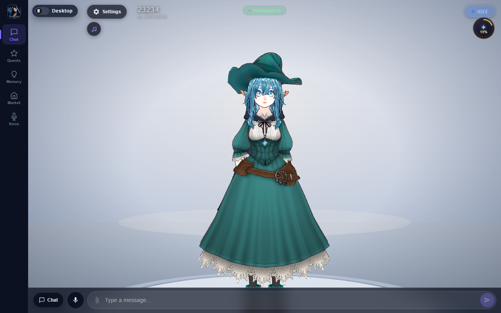

**Exact assertions (12 checks)**:

| Element | Selector | Expected |
|---|---|---|
| Chat view | `.chat-view` | visible |
| 3D viewport | `.viewport-layer` | visible |
| Input footer | `.input-footer` | visible |
| Desktop nav | `nav.desktop-nav` | visible |
| Nav tab labels | `.nav-btn .nav-label` | `["Chat","Quests","Memory","Market","Voice"]` |
| AI state pill | `.ai-state-pill` | visible |
| Quest orb | `.ff-orb` | visible |
| Mode toggle | `.mode-toggle-pill` | visible |
| Toggle label | `.mode-toggle-label` | `"Desktop"` |
| Chat input | `input.chat-input` | visible |
| Input placeholder | `input.chat-input[placeholder]` | `"Type a message…"` |
| Send button | `button.send-btn` | visible |

---

## Step 2 — Brain auto-configured

The Free Cloud API (Pollinations) auto-configures on first launch — no
setup wizard needed.

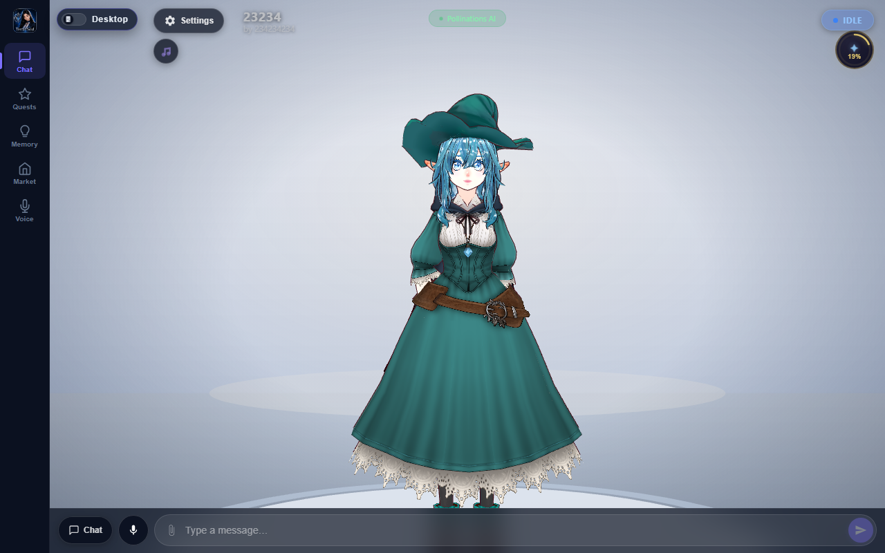

**Exact assertions (7 checks)**:

| Check | Method | Expected |
|---|---|---|
| Brain Pinia store | `$pinia.state.brain` | exists |
| Brain mode | `brainMode.mode` | `"free_api"` |
| Provider ID | `brainMode.provider_id` | `"pollinations"` |
| Status pill visible | `.brain-status-pill` | visible |
| Pill text | `.brain-status-pill` textContent | includes `"Pollinations AI"` |
| Setup overlay hidden | `.brain-overlay` | not visible |
| Free providers loaded | `freeProviders[]` | length ≥ 1 (got 3) |

> For local Ollama or paid API setup, launch with the Tauri desktop build
> and follow the quest wizard.

---

## Step 3 — Docker & LLM model verification

After the app loads, re-verify the Docker/Ollama infrastructure and confirm
which LLM provider the app actually selected.

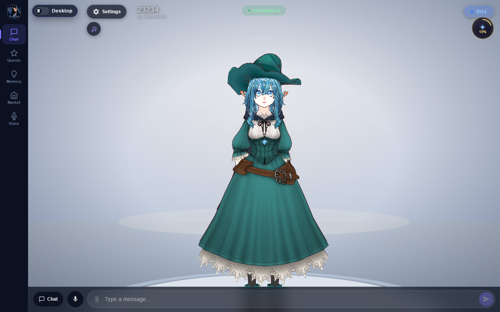

**Exact assertions (5 checks)**:

| Check | Method | Expected |
|---|---|---|
| Docker daemon | `docker --version` | accessible |
| Ollama container | `docker ps` | `ollama/ollama:latest`, status `Up` |
| Ollama API | `GET :11434/api/tags` | responsive |
| Active LLM provider | `brainMode.provider_id` via Pinia | `"pollinations"` (free_api) |
| Ollama status in Pinia | `brain.ollamaStatus` | `running=false, model_count=0` |

> This step confirms that even though Docker + Ollama are running, the app
> chose the Free Cloud API because no local models are pulled.

---

## Step 4 — Quest constellation

Click the crystal orb (top-right, showing `"19%"`) to open the full-screen
skill constellation — a visual map of all 36 skills.

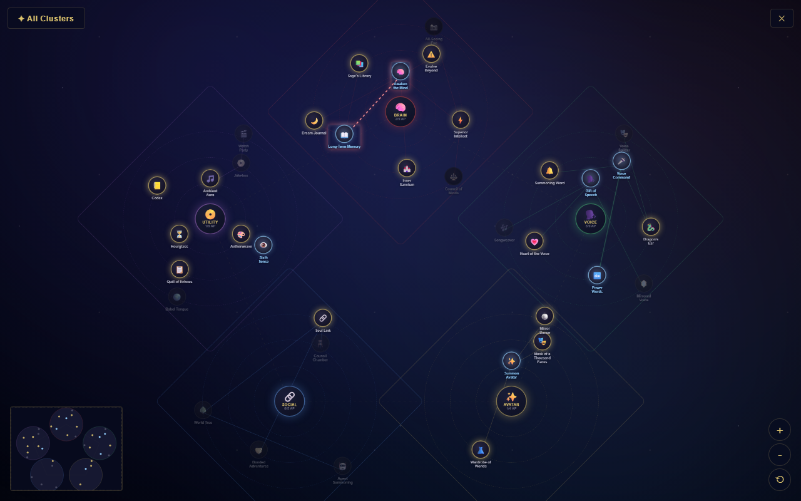

**Exact assertions (5 checks)**:

| Element | Selector | Expected |
|---|---|---|
| Orb percentage | `.ff-orb-pct` | `"19%"` |
| Constellation | `.skill-constellation` | visible (opened) |
| Close button | `.sc-close-btn` | visible |
| Close button text | `.sc-close-btn` textContent | `"✕"` |
| Breadcrumb | `.sc-crumb--root` | `"✦ All Clusters"` |

---

## Step 5 — Pet mode

Click the `"Desktop"` toggle to switch to pet mode. The character floats on
a transparent overlay with an onboarding tooltip.


**Exact assertions (6 checks)**:

| Element | Selector | Expected |
|---|---|---|
| Pet overlay | `.pet-overlay` | visible |
| App shell class | `.app-shell` | has `.pet-mode` class |
| Character | `.pet-character` | visible |
| Onboarding title | `.pet-onboarding-title` | `"Welcome to pet mode"` |
| Dismiss button | `.pet-onboarding-dismiss` | `"Got it"` |
| Exit pet mode | mode toggle click | returned to desktop |

**Pet mode controls**: click character to chat, drag to move, scroll to
zoom, right-click for mood/settings menu, Escape to exit back to desktop.

---

## Step 6 — Chat: first question (no memories)

Back in desktop mode, type a question and send it. Without any memories
the LLM gives a generic answer from its training data.

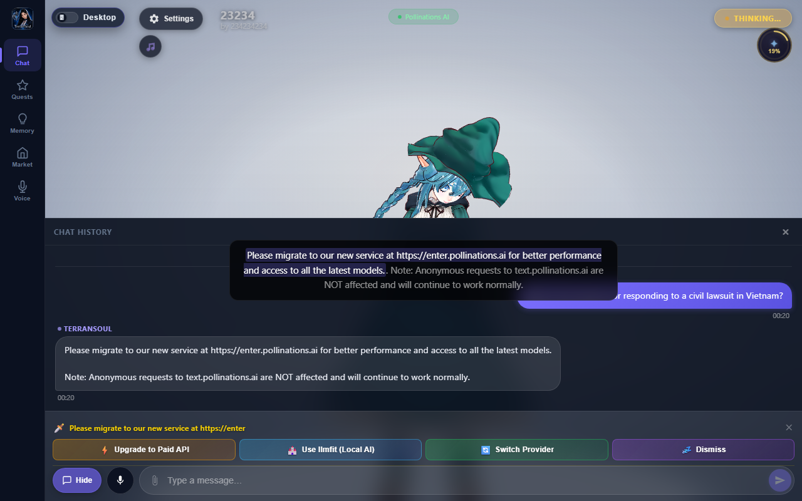

**Exact assertions (6 checks)**:

| Check | Selector / Method | Expected |
|---|---|---|
| Input enabled | `input.chat-input` | not disabled |
| Input filled | `.chat-input` value | 66+ chars |
| Send button | `button.send-btn` | visible |
| Assistant reply | Pinia `conversation.messages` | last message role=`assistant`, length > 20 chars |
| User rows | `.message-row.user` | count ≥ 1 |
| Assistant rows | `.message-row.assistant` | count ≥ 1 |

---

## Step 7 — Memory tab (empty)

Navigate to the **Memory** tab. The empty state shows filters, actions,
and search modes.

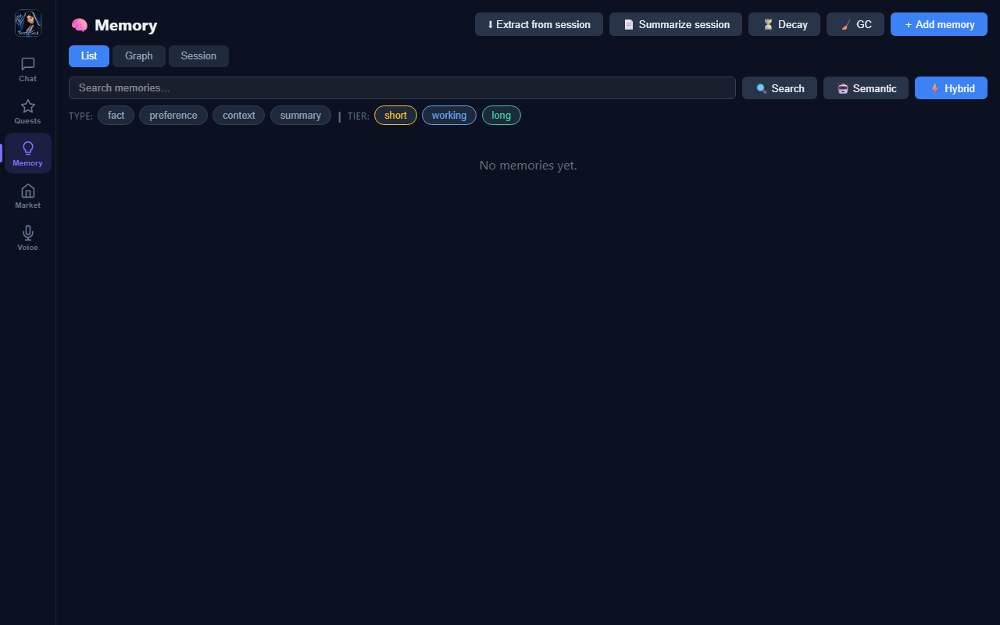

**Exact assertions (7 checks)**:

| Element | Selector | Expected |
|---|---|---|
| Memory view | `.memory-view` | visible |
| Header | `.mv-header h2` | `"🧠 Memory"` |
| Add button | `.mv-header-actions .btn-primary` | `"＋ Add memory"` |
| Sub-tabs | `.mv-tab` texts | `["List","Graph","Session"]` |
| Tier chips | `.mv-tier-chip` texts | `["short","working","long"]` |
| Type chips | `.mv-type-chip` texts | `["fact","preference","context","summary"]` |
| Action buttons | `.mv-header-actions .btn-secondary` texts | `["⬇ Extract from session","📄 Summarize session","⏳ Decay","🧹 GC"]` |

---

## Step 8 — Add a memory

Click **＋ Add memory** to open the modal. Enter knowledge manually —
in this example, Vietnamese civil code statute text about Article 429.

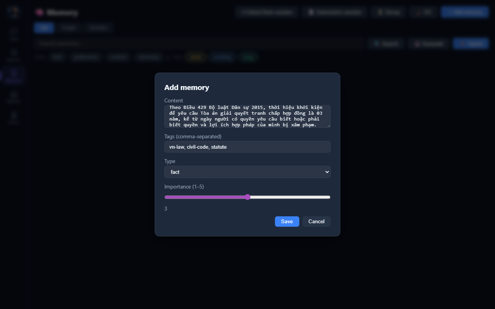

**Exact assertions (6 checks)**:

| Element | Selector | Expected |
|---|---|---|
| Modal opened | `.mv-modal` | visible |
| Modal title | `.mv-modal h3` | `"Add memory"` |
| Content placeholder | `textarea` placeholder | `"What should I remember?"` |
| Tags placeholder | tags `input` placeholder | `"python, work, project"` |
| Save button | `.btn-primary` text | `"Save"` |
| Modal closed | `.mv-modal` after save | not visible |

> In a full Tauri build, use `ingest_document` to crawl websites or ingest
> PDFs automatically. See [`BRAIN-COMPLEX-EXAMPLE-EXPLAIN.md` §7](BRAIN-COMPLEX-EXAMPLE-EXPLAIN.md#ingest-pipeline-url--file--crawl).

---

## Step 9 — Memories list ⏭

> **Skipped in browser-only mode**: The `add_memory` Tauri IPC command is
> unavailable without the Rust backend. Memory cards require persisting
> through `MemoryStore` which needs SQLite (or Postgres/MSSQL/CassandraDB).


In a full Tauri build, memory cards display: type badge, tier badge,
importance stars, decay bar, and tags.

---

## Step 10 — Memory graph

Switch to the **Graph** sub-tab to see a Cytoscape.js visualization of
memory nodes connected by shared tags.

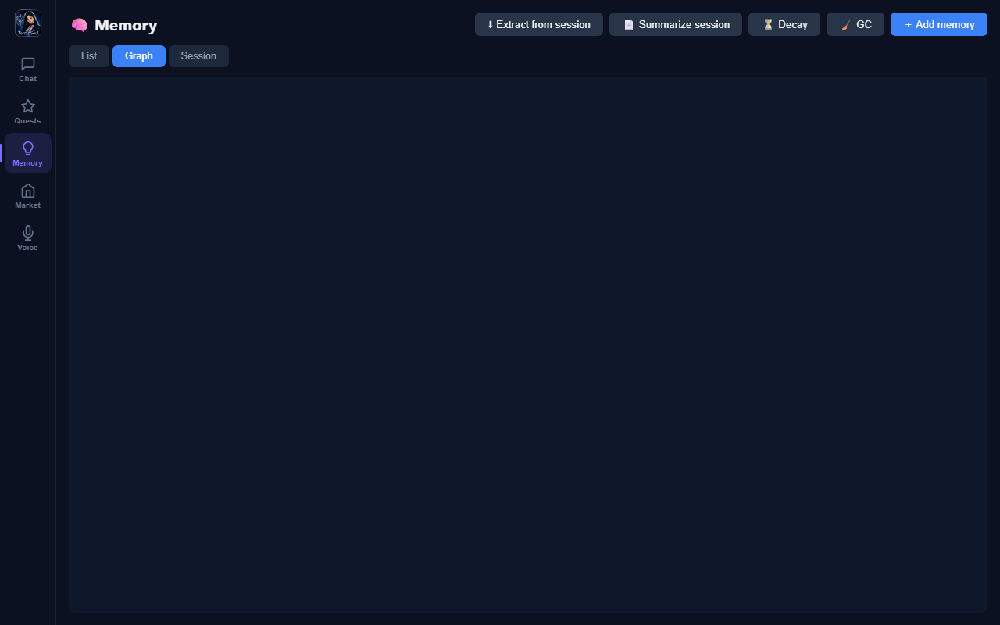

**Exact assertions (1 check)**:

| Element | Selector | Expected |
|---|---|---|
| Graph panel | `.mv-graph-panel` | visible |

---

## Step 11 — Chat with RAG

Navigate back to **Chat** and ask another question. Now `hybrid_search()`
injects the top-5 relevant memories into the system prompt as a
`[LONG-TERM MEMORY]` block. The answer is specific and grounded in stored
knowledge.

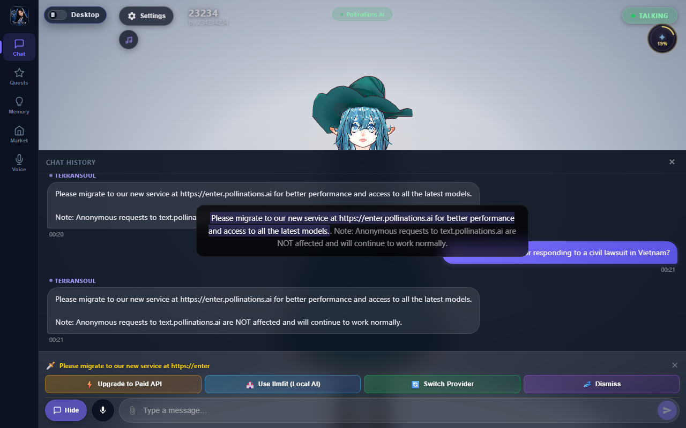

**Exact assertions (2 checks)**:

| Check | Method | Expected |
|---|---|---|
| Chat view visible | `.chat-view` offsetParent | not null |
| RAG reply | Pinia `conversation.messages` | last message role=`assistant`, length > 20 chars |

---

## Step 12 — Skill tree

Navigate to the **Quests** tab to see the Brain Stat Sheet, today's quests,
and active combos.

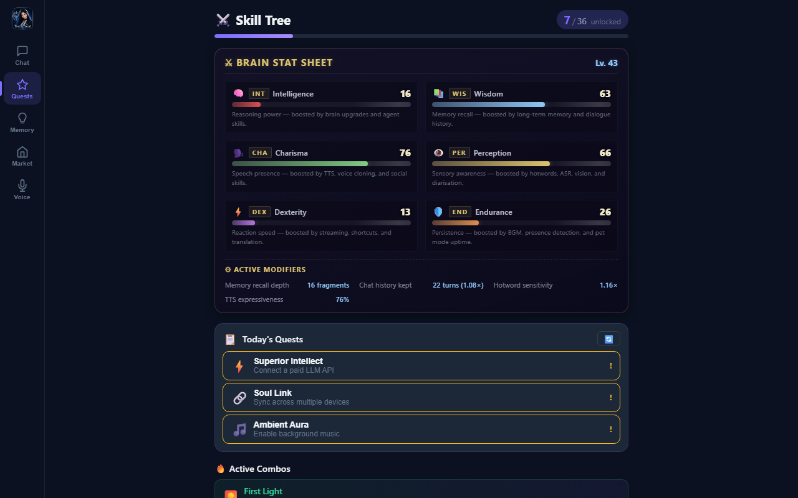

**Exact assertions (7 checks)**:

| Element | Selector | Expected |
|---|---|---|
| Skill tree view | `.skill-tree-view` | visible |
| Title | `.st-title` | `"⚔️ Skill Tree"` |
| Brain Stat Sheet | `.brain-stat-sheet` | visible |
| Sheet header | `.bss-title` | `"⚔ Brain Stat Sheet"` |
| Stat abbreviations | `.bss-stat-abbr` texts | `["INT","WIS","CHA","PER","DEX","END"]` |
| Level badge | `.bss-level` | `"Lv. 43"` |
| Daily quests | `.st-daily-section` | visible |

**Brain Stat Sheet**: INT, WIS, CHA, PER, DEX, END — each boosted by
different app features. Level scales with total unlocked skills.

---

## Step 13 — Pet mode with chat ⏭

Toggle pet mode again — the character appears as a floating overlay.

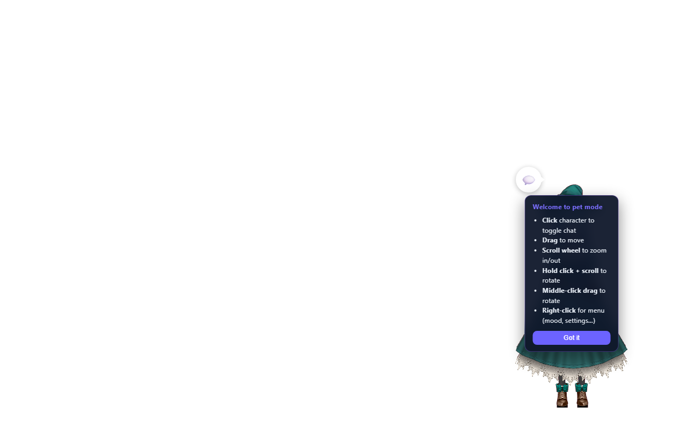

**Exact assertions (1 check + 1 skip)**:

| Check | Selector | Expected |
|---|---|---|
| Pet overlay | `.pet-overlay` | visible ✅ |
| Pet chat panel | `.pet-chat` | ⏭ skip (canvas click doesn't propagate in headless Playwright) |

In the real app, clicking the character opens the chat panel with an input
(`placeholder="Say something…"`) and a submit button (`"➤"`).

---

## Verification summary

All screenshots verified by [`scripts/verify-brain-flow.mjs`](../scripts/verify-brain-flow.mjs):

```
node scripts/verify-brain-flow.mjs
# 68 passed, 0 failed, 2 skipped
```

| Step | Description | Checks | Status |
|---:|---|---:|---|
| 0 | Pre-flight: Docker & Ollama | 3 | ✅ |
| 1 | Fresh launch | 12 | ✅ |
| 2 | Brain auto-configured | 7 | ✅ |
| 3 | Docker & LLM model verification | 5 | ✅ |
| 4 | Quest constellation | 5 | ✅ |
| 5 | Pet mode | 6 | ✅ |
| 6 | Chat (no memories) | 6 | ✅ |
| 7 | Memory tab (empty) | 7 | ✅ |
| 8 | Add a memory (modal) | 6 | ✅ |
| 9 | Memories list | 0 | ⏭ (Tauri IPC) |
| 10 | Memory graph | 1 | ✅ |
| 11 | Chat with RAG | 2 | ✅ |
| 12 | Skill tree | 7 | ✅ |
| 13 | Pet mode with chat | 1 | ✅ (+1 ⏭) |
| **Total** | | **68** | **68 ✅  2 ⏭** |

For the full code-path map, hybrid search formula, decay maths, schema,
ingest pipeline, and debug recipes, see
[`BRAIN-COMPLEX-EXAMPLE-EXPLAIN.md`](BRAIN-COMPLEX-EXAMPLE-EXPLAIN.md).
