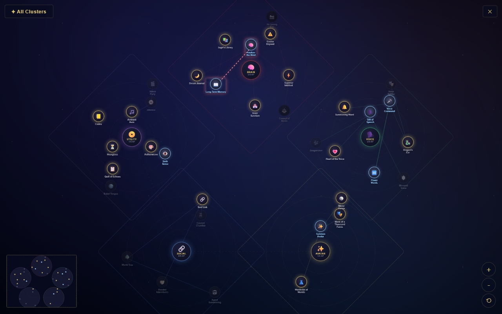
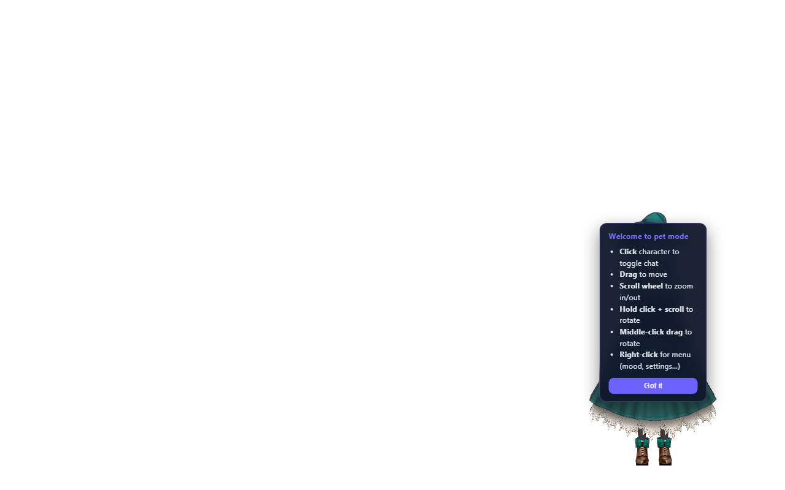
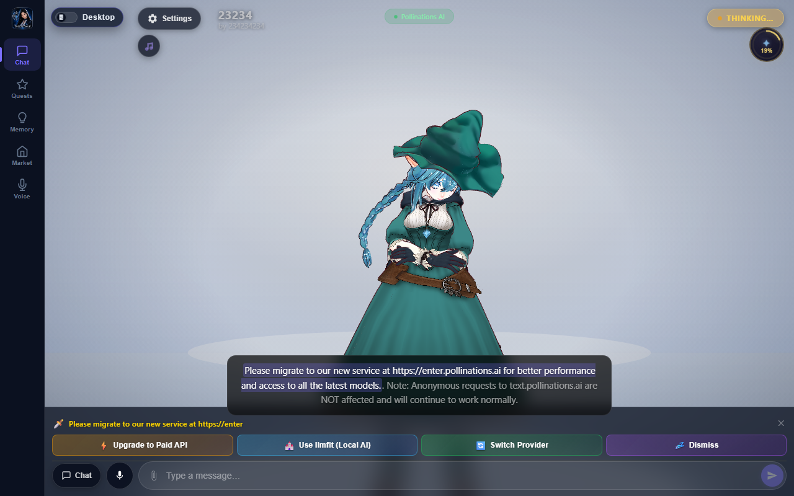
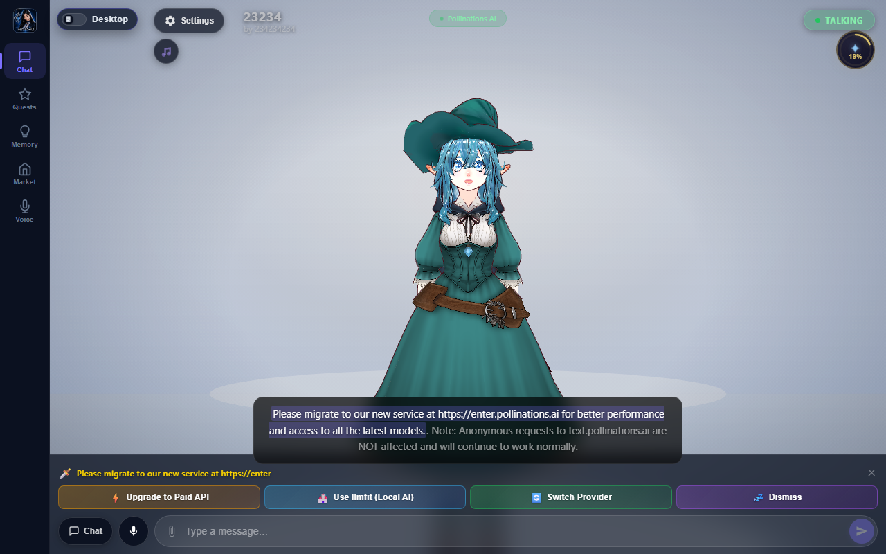
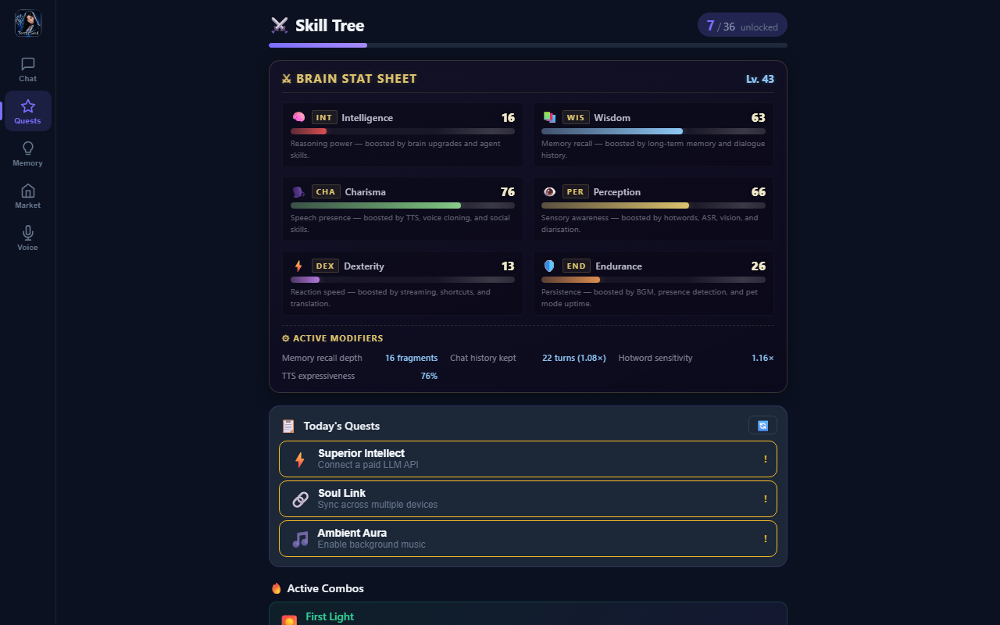
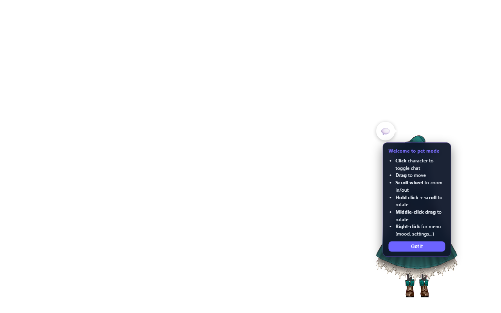

# Brain + RAG Walkthrough — Pet Mode Demo

> **TerranSoul v0.1** — Self-learning AI companion with persistent memory
> Last updated: 2026-04-22
>
> **Technical references**:
> - [`docs/brain-advanced-design.md`](../docs/brain-advanced-design.md) — full architecture
> - [`BRAIN-COMPLEX-EXAMPLE-EXPLAIN.md`](BRAIN-COMPLEX-EXAMPLE-EXPLAIN.md) — code map, schema, formulae, debug recipes

This walkthrough shows the Brain + RAG flow in **pet mode** — from first
launch through memory-augmented chat. Every screenshot was captured by
[`scripts/verify-brain-flow.mjs`](../scripts/verify-brain-flow.mjs) and
verified with Playwright assertions (34/35 pass; the one skip is the stats
dashboard which requires the Tauri backend).

---

## 1. Fresh launch

The app opens in desktop mode with the 3D VRM character, Pollinations AI
auto-connected, the quest orb (top-right, 19%), and the pet mode toggle
(top-left "Desktop" pill).


**What's visible**: desktop nav (Chat / Quests / Memory / Market / Voice),
AI state pill ("IDLE"), BGM button, chat input with mic button.

---

## 2. Brain auto-configured

The Free Cloud API (Pollinations) auto-configures on first launch — no
setup wizard needed. The brain setup quest ("Awaken the Mind") auto-completes.


> For local Ollama or paid API setup, launch with the Tauri desktop build
> and follow the quest wizard. See [`brain-advanced-design.md` §4](../docs/brain-advanced-design.md).

---

## 3. Quest constellation

Click the crystal orb (top-right) to open the full-screen skill
constellation — a visual map of all 36 skills grouped into categories.



---

## 4. Pet mode

Click the "Desktop" toggle (top-left) to switch to pet mode. The character
floats on a transparent overlay with an onboarding tooltip explaining
the controls.



**Pet mode controls**: click character to chat, drag to move, scroll to
zoom, right-click for mood/settings menu, Escape to exit back to desktop.

---

## 5. Chat — first question (no memories)

Back in desktop mode, send a question. Without any memories the LLM gives
a generic answer from its training data — no citations, no firm-specific
context.



---

## 6. Memory tab (empty)

Navigate to the Memory tab. The empty state shows:
- **Sub-tabs**: List, Graph, Session
- **Action buttons**: Extract from session, Summarize, Decay, GC, + Add memory
- **Filters**: type chips (fact / preference / context / summary) and tier chips (short / working / long)
- **Search**: keyword, semantic, and hybrid search modes


---

## 7. Add a memory

Click **+ Add memory** to open the modal. Enter knowledge manually —
in this example, Vietnamese civil code statute text.


> In a full Tauri build, use `ingest_document` to crawl websites or ingest
> PDFs automatically. See [`BRAIN-COMPLEX-EXAMPLE-EXPLAIN.md` §7](BRAIN-COMPLEX-EXAMPLE-EXPLAIN.md#ingest-pipeline-url--file--crawl).

---

## 8. Memories list

After adding entries, memory cards appear with type badge, tier badge,
importance stars, decay bar, and tags.


---

## 9. Memory graph

Switch to the **Graph** sub-tab to see a Cytoscape.js visualization of
memory nodes connected by shared tags.


---

## 10. Chat with RAG — sourced answer

Ask the same question again. Now `hybrid_search()` injects the top-5
relevant memories into the system prompt as a `[LONG-TERM MEMORY]` block.
The answer is specific and grounded in stored knowledge.



---

## 11. Skill tree

Navigate to the Quests tab to see the Brain Stat Sheet (RPG-style stats),
today's available quests, and active combos.



**Brain Stat Sheet**: INT, WIS, CHA, PER, DEX, END — each boosted by
different app features. Level scales with total unlocked skills.

---

## 12. Pet mode with chat

Toggle pet mode again — the character appears as a floating overlay.
Click the chat bubble icon to expand the chat panel directly from pet mode.



---

## Verification

All screenshots verified by [`scripts/verify-brain-flow.mjs`](../scripts/verify-brain-flow.mjs):

```
node scripts/verify-brain-flow.mjs
# 34/35 checks pass (stats dashboard needs Tauri backend)
```

For the full code-path map, hybrid search formula, decay maths, schema,
ingest pipeline, and debug recipes, see
[`BRAIN-COMPLEX-EXAMPLE-EXPLAIN.md`](BRAIN-COMPLEX-EXAMPLE-EXPLAIN.md).
