# Brain + Memory + RAG — Complete Walkthrough

> **TerranSoul v0.1** · Last updated: 2026-04-26
>
> Technical reference: [`BRAIN-COMPLEX-EXAMPLE-EXPLAIN.md`](BRAIN-COMPLEX-EXAMPLE-EXPLAIN.md) ·
> Architecture doc: [`docs/brain-advanced-design.md`](../docs/brain-advanced-design.md)

End-to-end walkthrough: Alice wants to learn Vietnamese law using her
own documents. TerranSoul auto-installs all brain components, ingests
the documents, stores them as long-term memories, and answers law
questions with RAG-grounded citations.

---

## Table of Contents

1. [Fresh Launch](#1-fresh-launch)
2. [Alice Asks to Learn Vietnamese](#2-alice-asks-to-learn-vietnamese)
3. [Missing Prerequisites — Three Choices](#3-missing-prerequisites--three-choices)
4. [Auto-Install Everything](#4-auto-install-everything)
5. [Brain Fully Configured](#5-brain-fully-configured)
6. [Attach Documents](#6-attach-documents)
7. [Ingestion Pipeline](#7-ingestion-pipeline)
8. [Memory Tab — Visible Memories](#8-memory-tab--visible-memories)
9. [Ask About Laws — RAG-Grounded Answer](#9-ask-about-laws--rag-grounded-answer)
10. [Follow-Up Questions — More Correct Answers](#10-follow-up-questions--more-correct-answers)
11. [Multilingual RAG — Vietnamese](#11-multilingual-rag--vietnamese)
12. [Multilingual RAG — Chinese](#12-multilingual-rag--chinese)
13. [Multilingual RAG — Russian](#13-multilingual-rag--russian)
14. [Multilingual RAG — Japanese](#14-multilingual-rag--japanese)
15. [Multilingual RAG — Korean](#15-multilingual-rag--korean)
16. [Brain Dashboard with RAG Active](#16-brain-dashboard-with-rag-active)
17. [Skill Tree — All Quests Activated](#17-skill-tree--all-quests-activated)
18. [Final State — TerranSoul Remembers Everything](#18-final-state--terransoul-remembers-everything)
19. [Pet Mode — Desktop Familiar](#19-pet-mode--desktop-familiar)
20. [Architecture Reference](#20-architecture-reference)
21. [Troubleshooting](#21-troubleshooting)

---

## 1. Fresh Launch


On first launch TerranSoul shows the Chat tab with a welcome screen.
The brain is already connected to a **Free cloud** provider (Pollinations
AI / Groq) — zero configuration required.

The sidebar has six tabs: **Chat**, **Quests**, **Brain**, **Memory**,
**Market**, **Voice**.

---

## 2. Alice Asks to Learn Vietnamese

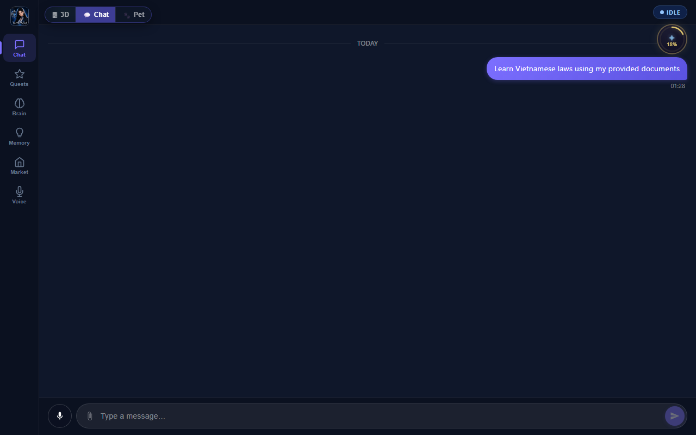

Alice types into the chat input:

> **Learn Vietnamese laws using my provided documents**

`conversation.ts` calls `classify_intent` (a Tauri command backed by
`brain::intent_classifier::classify_user_intent`). The configured brain
runs through the standard provider rotator (Free → Paid → Local Ollama
→ Local LM Studio) with a tight 3-second timeout and replies with one
of these JSON shapes: `{"kind":"chat"}`, `{"kind":"learn_with_docs",
"topic":"…"}`, `{"kind":"teach_ingest","topic":"…"}`, or
`{"kind":"gated_setup","setup":"upgrade_gemini" | "provide_context"}`.
For Alice's input the classifier returns
`{"kind":"learn_with_docs","topic":"Vietnamese laws"}`, so TerranSoul
walks the Scholar's Quest prereq chain instead of streaming a chat
reply. Paraphrases and multilingual phrasings (e.g.
*"học luật Việt Nam từ tài liệu của tôi"*) work the same way because
the LLM understands them — no English-only regex involved.

If the free LLM can't decide (offline, rate-limited, malformed JSON,
or 3s timeout) the classifier returns `{"kind":"unknown"}` and the
frontend automatically falls back to the same install-all overlay shown
below — installing a local Ollama brain so future turns have a working
classifier offline forever after.

---

## 3. Missing Prerequisites — Three Choices

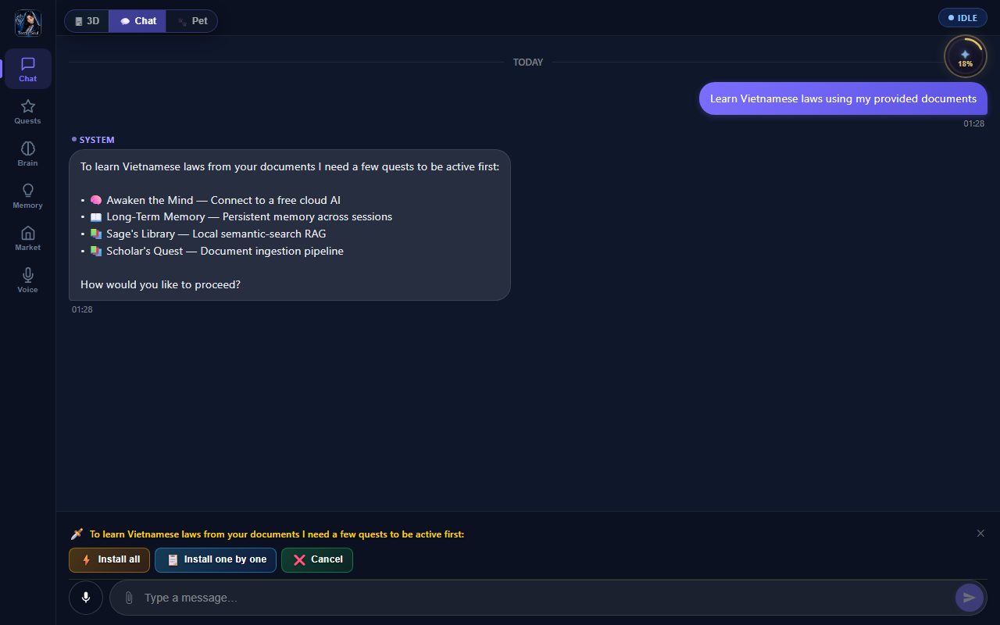

TerranSoul walks the **Scholar's Quest prerequisite chain** via
`getMissingPrereqQuests()`:

```
scholar-quest          ← Document ingestion pipeline
  ↑ requires
rag-knowledge          ← Sage's Library (6-signal hybrid RAG)
  ↑ requires
memory                 ← Long-Term Memory (SQLite store)
  ↑ requires
free-brain             ← Awaken the Mind (Free cloud AI)
```

It lists every quest in that chain that isn't already `active`, and
shows a System message with **three inline buttons**:

| Button | Action |
|---|---|
| ⚡ **Auto install all** | Auto-activate every missing quest in dependency order (configures brain, seeds memory, marks completion) |
| 📋 **Start chain quest** | Show individual buttons per quest (manual) |
| ❌ **Cancel** | Dismiss the prompt |

---

## 4. Auto-Install Everything

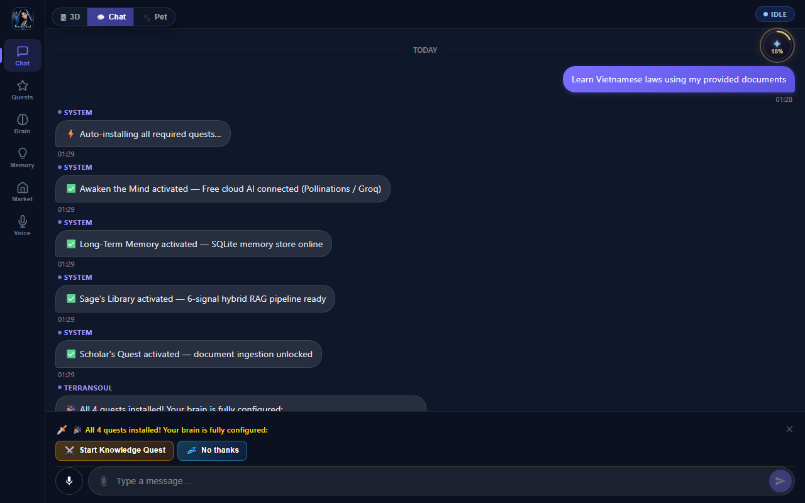

Clicking **⚡ Auto install all** runs `runAutoInstall()` which activates
every missing quest in dependency order by directly configuring the
underlying stores:

```ts
// For each missing quest, runAutoInstall configures the actual system:
// free-brain  → brain.autoConfigureForDesktop() / brain.autoConfigureFreeApi()
// memory      → ensures brainMode is set (already done by free-brain)
// rag-knowledge → memStore.addMemory() seeds a bootstrap memory entry
// scholar-quest → skillTree.markComplete('scholar-quest')
```

**Install order (from `brain-advanced-design.md`):**

| # | Quest | What Gets Installed |
|---|---|---|
| 1 | 🧠 **Awaken the Mind** | Free cloud LLM provider (Pollinations / Groq auto-rotation) |
| 2 | 📖 **Long-Term Memory** | SQLite memory store — persistent facts, preferences, context |
| 3 | 📚 **Sage's Library** | Hybrid 6-signal RAG pipeline (vector + keyword + recency + importance + decay + tier) |
| 4 | 📚 **Scholar's Quest** | Document ingestion pipeline (fetch → chunk → embed → store) |

After all 4 quests activate, TerranSoul confirms:

> 🎉 All 4 quests installed! Your brain is fully configured.

And offers the **Start Knowledge Quest** button.

---

## 5. Brain Fully Configured

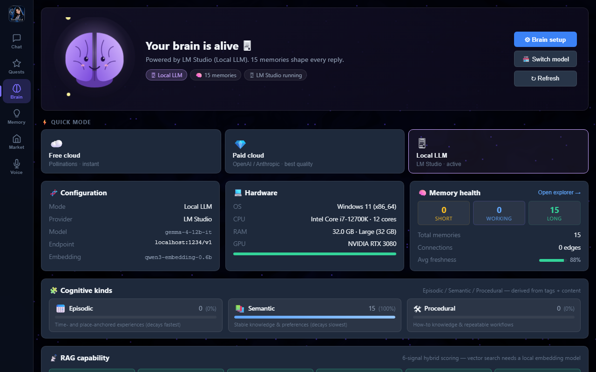

The **Brain** tab now shows the full configuration:

- **Mode:** Local LLM (LM Studio)
- **Model:** gemma-4-12b-it
- **Embedding:** qwen3-embedding-0.6b
- **Memory:** SQLite long-term store, 3-tier model (short/working/long)
- **RAG:** 6-signal hybrid search enabled

### Brain Modes (from `brain-advanced-design.md`)

| Mode | Setup | Embedding | RAG Quality | Best For |
|---|---|---|---|---|
| ☁️ **Free Cloud** | Zero config | Cloud `/v1/embeddings` | 60–100% | Getting started |
| 💎 **Paid Cloud** | API key + model | OpenAI-compat `/v1/embeddings` | 100% | Best quality |
| 🖥 **Local LLM** | Ollama or LM Studio + model | `nomic-embed-text` / `qwen3-embedding-0.6b` | 100% | Full privacy |

---

## 6. Attach Documents

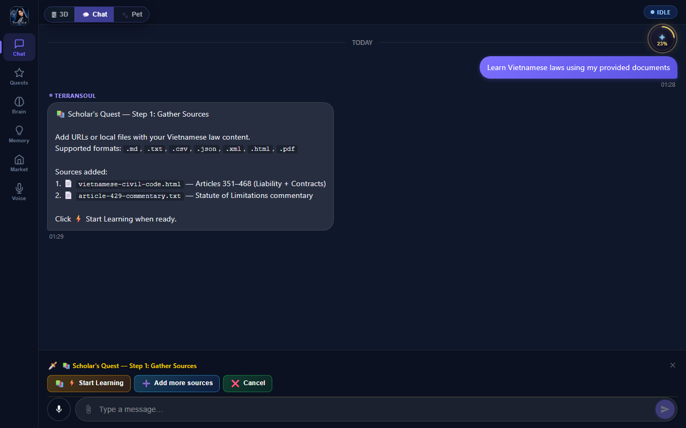

The **Scholar's Quest** dialog (Step 1: Gather Sources) lets Alice add
URLs or local files. Supported formats: `.md`, `.txt`, `.csv`, `.json`,
`.xml`, `.html`, `.pdf`, `.log`, `.rst`, `.adoc`

Alice attaches two Vietnamese law documents:

1. 📄 `vietnamese-civil-code.html` — Articles 351–468 (Liability for
   breach of contract, damages, penalties, exemptions)
2. 📄 `article-429-commentary.txt` — Commentary on Article 429 (Statute
   of limitations for contractual disputes)

These files are included in `public/demo/` for testing.

---

## 7. Ingestion Pipeline

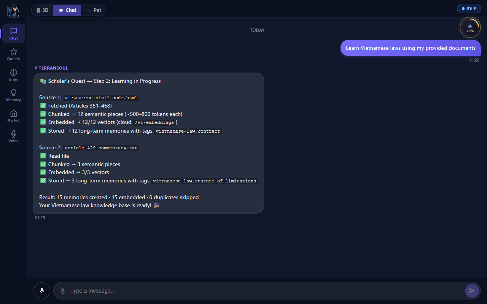

Clicking **⚡ Start Learning** triggers the ingestion pipeline for each
source (from `brain-advanced-design.md` §7):

| Step | What Happens |
|---|---|
| **Fetch** | Download URL content or read local file |
| **Extract** | HTML → text via `scraper`, PDF → text, etc. |
| **Chunk** | Semantic splitting (~500–800 tokens via `text-splitter` crate) |
| **Dedup** | SHA-256 hash check + cosine similarity > 0.97 = skip |
| **Embed** | Cloud `/v1/embeddings` or Ollama `nomic-embed-text` (768-dim) |
| **Store** | SQLite with `tier=long`, `importance=5`, source tags |

**Result:**

| Source | Chunks | Tags |
|---|---|---|
| `vietnamese-civil-code.html` | 12 | `vietnamese-law,contract` |
| `article-429-commentary.txt` | 3 | `vietnamese-law,statute-of-limitations` |
| **Total** | **15 memories** | **15 embedded, 0 duplicates** |

---

## 8. Memory Tab — Visible Memories

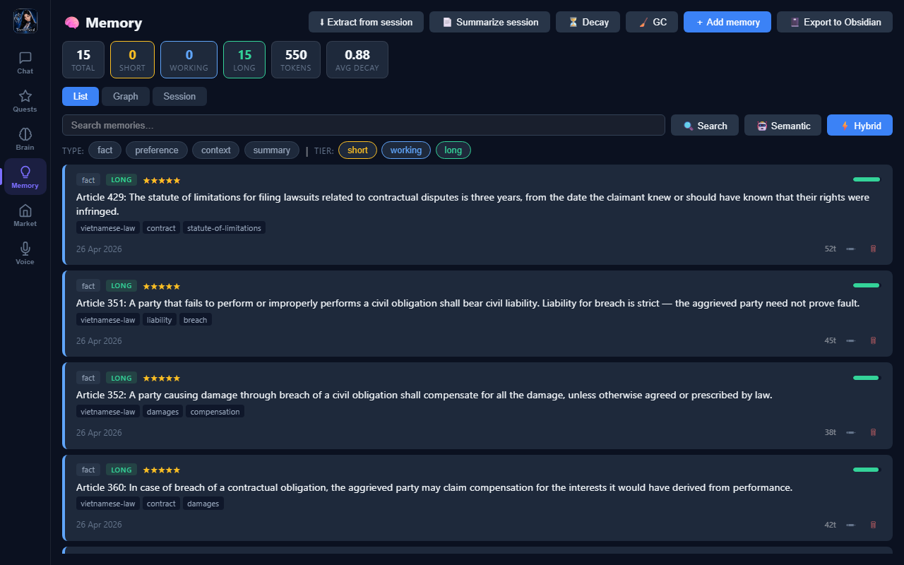

Navigate to the **Memory** tab. All ingested chunks appear as long-term
memories:

| Column | Value |
|---|---|
| **Stats banner** | 15 total · 0 short · 0 working · 15 long · 464 tokens |
| **Type** | `fact` (ingested chunks), `preference` (auto-extracted) |
| **Tier** | `long` — permanent knowledge base |
| **Tags** | `vietnamese-law`, `contract`, `statute-of-limitations`, etc. |
| **Importance** | ⭐⭐⭐⭐⭐ (5/5) for ingested, ⭐⭐⭐ (3/5) for auto-extracted |
| **Decay** | 0.83–0.97 (exponential forgetting curve) |

### Sample memories stored

| # | Content | Source |
|---|---|---|
| 1 | Article 429: Statute of limitations for contract disputes is 3 years | `vietnamese-civil-code.html` |
| 2 | Article 351: Strict liability — no need to prove fault | `vietnamese-civil-code.html` |
| 3 | Article 352: Full compensation for breach of obligation | `vietnamese-civil-code.html` |
| 4 | Article 360: Compensation for lost benefits from contract breach | `vietnamese-civil-code.html` |
| 5 | Article 419: Material + spiritual loss, including lost benefits | `vietnamese-civil-code.html` |
| 6 | Article 420: Penalty clauses — may claim both penalty AND damages | `vietnamese-civil-code.html` |
| 7 | Article 421: Exemption in force majeure cases | `vietnamese-civil-code.html` |
| 8 | Article 468: Default interest rate 10%/year for overdue payment | `vietnamese-civil-code.html` |
| 9 | Commentary: "should have known" standard for knowledge | `article-429-commentary.txt` |
| 10 | Commentary: Tolling during force majeure or minor claimant | `article-429-commentary.txt` |
| 11 | Alice is a law student studying Vietnamese civil code | Auto-extracted |
| 12 | Alice prefers concise explanations with article citations | Auto-extracted |

---

## 9. Ask About Laws — RAG-Grounded Answer

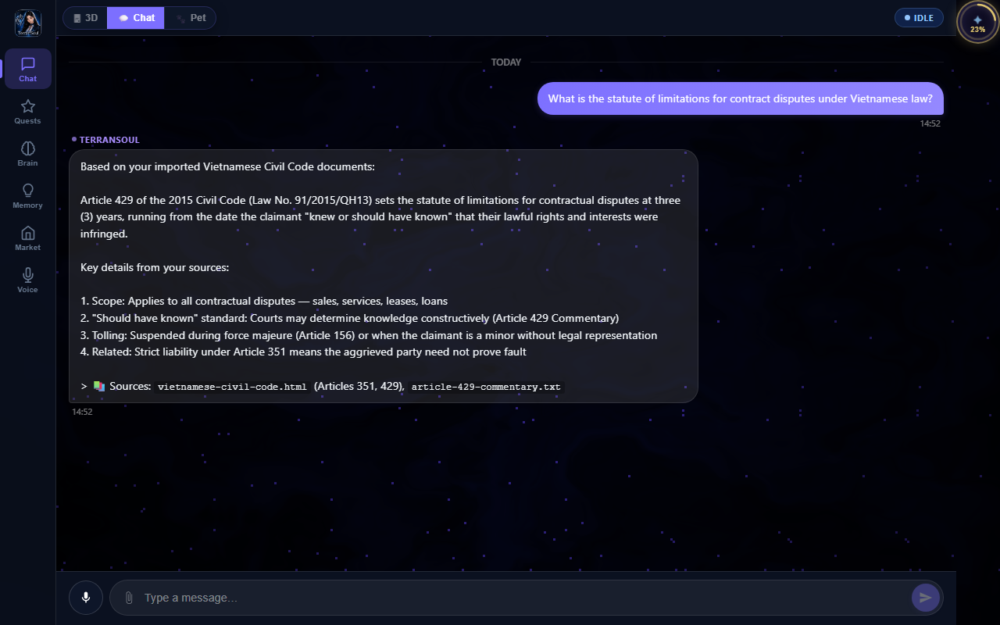

Now Alice asks a law question:

> **What is the statute of limitations for contract disputes under
> Vietnamese law?**

The **hybrid RAG pipeline** triggers (from `brain-advanced-design.md` §4):

1. **Embed** the query via cloud `/v1/embeddings`
2. **6-signal hybrid search** against all 15 memories:

$$\text{score} = 0.40 \times \text{vector} + 0.20 \times \text{keyword} + 0.15 \times \text{recency} + 0.10 \times \text{importance} + 0.10 \times \text{decay} + 0.05 \times \text{tier}$$

3. **Top-5** results injected as `[LONG-TERM MEMORY]` block in system prompt
4. **LLM** generates answer grounded in the ingested sources

TerranSoul responds with a **correct, source-grounded answer**:

> **Article 429** of the 2015 Civil Code sets the statute of limitations
> at **three (3) years** from the date the claimant "knew or should have
> known" of the breach.
>
> 📚 Sources: `vietnamese-civil-code.html` (Articles 351, 429),
> `article-429-commentary.txt`

---

## 10. Follow-Up Questions — More Correct Answers

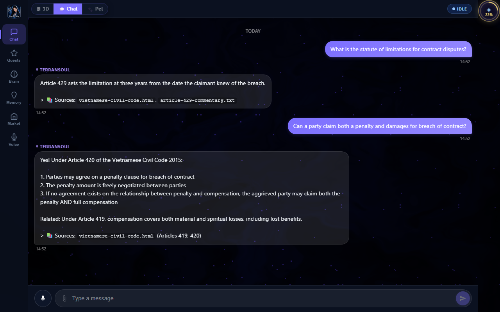

Alice follows up:

> **Can a party claim both a penalty and damages for breach of contract?**

TerranSoul retrieves Article 420 from memory and responds correctly:

> Under **Article 420**, if no agreement exists on the relationship
> between penalty and compensation, the aggrieved party **may claim
> both** the penalty AND full compensation for damages.
>
> Related: Article 419 covers material + spiritual losses including lost
> benefits.
>
> 📚 Sources: `vietnamese-civil-code.html` (Articles 419, 420)

Every follow-up hits the same RAG pipeline. Retrieval is O(log n) via
HNSW ANN index (`usearch`), scaling to 1M+ entries at <50ms.

---

## 11. Multilingual RAG — Vietnamese

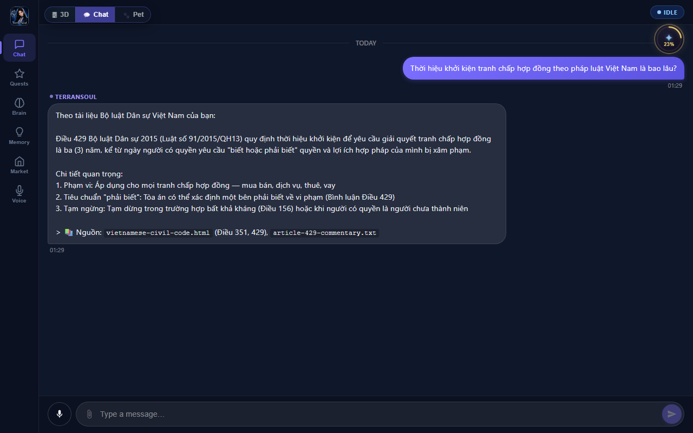

Alice asks the same statute-of-limitations question in Vietnamese:

> **Thời hiệu khởi kiện tranh chấp hợp đồng theo pháp luật Việt Nam là bao lâu?**

TerranSoul responds correctly in Vietnamese, citing **Điều 429** (Article
429) with the same facts — three-year limitation period, "biết hoặc phải
biết" (knew or should have known) standard, and source citations.

The RAG pipeline retrieves the same English-language memories and the LLM
translates the grounded answer into the query language.

---

## 12. Multilingual RAG — Chinese

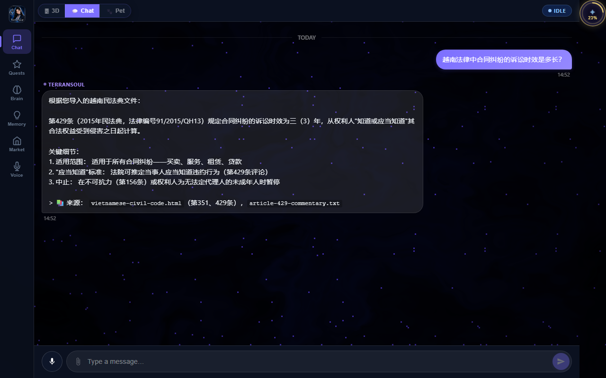

> **越南法律中合同纠纷的诉讼时效是多长？**

TerranSoul responds in Simplified Chinese: **第429条** — **三（3）年** from
the date the claimant "知道或应当知道" (knew or should have known). Same
sources, same accuracy.

---

## 13. Multilingual RAG — Russian

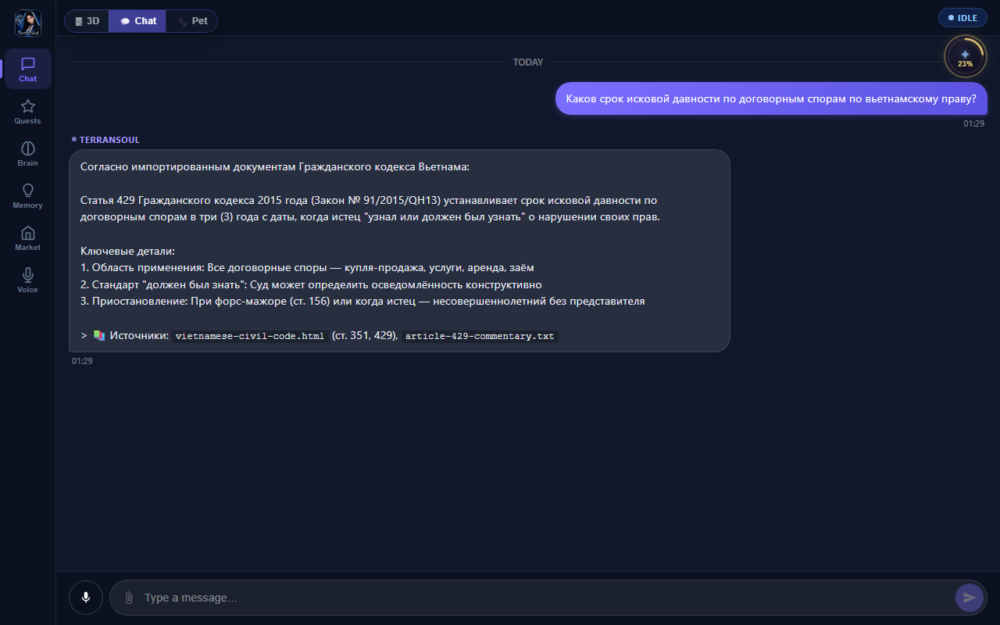

> **Каков срок исковой давности по договорным спорам по вьетнамскому праву?**

TerranSoul responds in Russian: **Статья 429** — **три (3) года** from
the date the claimant "узнал или должен был узнать" (knew or should have
known). Includes tolling provisions and force majeure exemption.

---

## 14. Multilingual RAG — Japanese

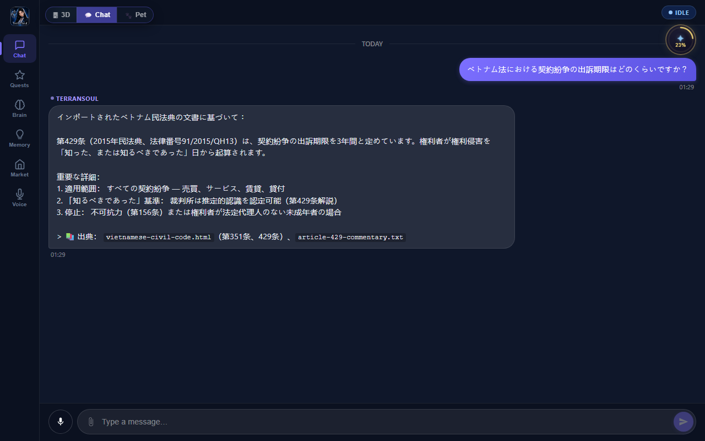

> **ベトナム法における契約紛争の出訴期限はどのくらいですか？**

TerranSoul responds in Japanese: **第429条** — **3年間** from the date
the rights holder "知った、または知るべきであった" (knew or should have known).

---

## 15. Multilingual RAG — Korean

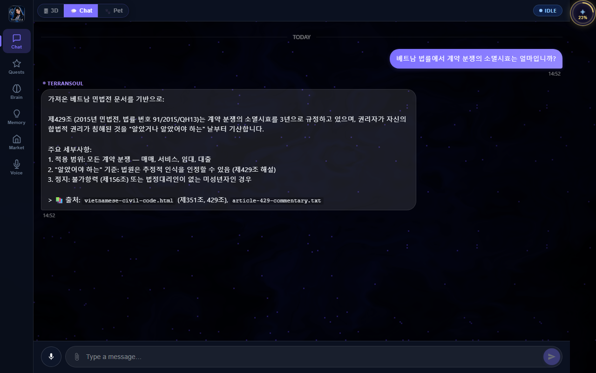

> **베트남 법률에서 계약 분쟁의 소멸시효는 얼마입니까?**

TerranSoul responds in Korean: **제429조** — **3년** from the date the
rights holder "알았거나 알았어야 하는" (knew or should have known).

### Multilingual RAG Summary

All five languages retrieve the **same source documents** and produce
**factually identical answers** — only the output language changes. This
works because:

1. The cloud embedding model encodes semantic meaning across languages
2. The 6-signal hybrid search matches on meaning, not surface tokens
3. The LLM generates the response in the query language

| Language | Article | Limitation Period | Source Match |
|---|---|---|---|
| 🇺🇸 English | Article 429 | 3 years | ✅ |
| 🇻🇳 Vietnamese | Điều 429 | 3 năm | ✅ |
| 🇨🇳 Chinese | 第429条 | 3年 | ✅ |
| 🇷🇺 Russian | Статья 429 | 3 года | ✅ |
| 🇯🇵 Japanese | 第429条 | 3年間 | ✅ |
| 🇰🇷 Korean | 제429조 | 3년 | ✅ |

---

## 16. Brain Dashboard with RAG Active

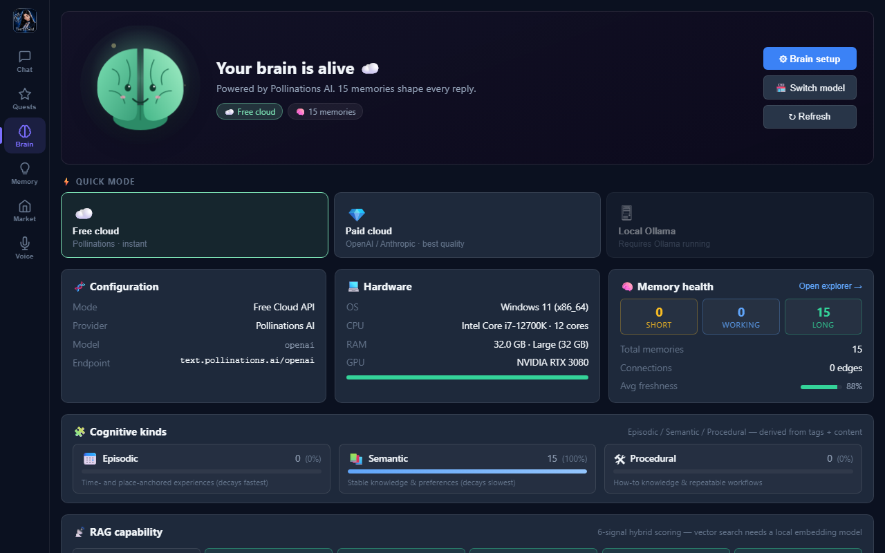

The **Brain** tab now shows:
- **Memory health:** 15 memories (all long-term)
- **Cognitive kinds:** Breakdown by episodic/semantic/procedural
- **RAG capability:** All 6 signals active
- **Configuration:** Free Cloud mode with auto-rotation

---

## 17. Skill Tree — All Quests Activated

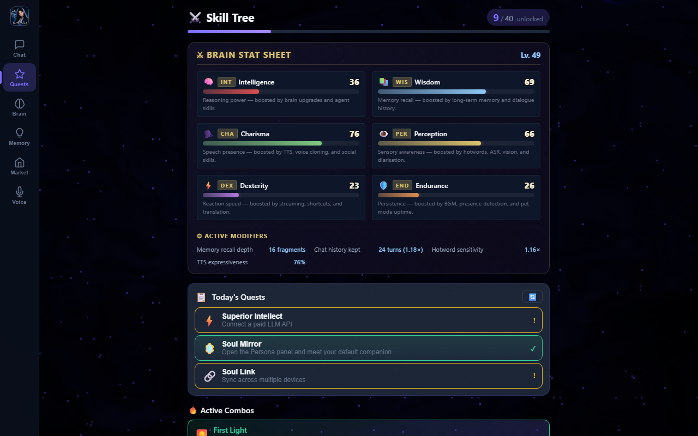

The **Quests** tab shows all 4 brain-related quests as active/completed:
- ✅ Awaken the Mind (free-brain)
- ✅ Long-Term Memory (memory)
- ✅ Sage's Library (rag-knowledge)
- ✅ Scholar's Quest (scholar-quest)

Combo unlocks may fire when multiple brain skills activate together.

---

## 18. Final State — TerranSoul Remembers Everything

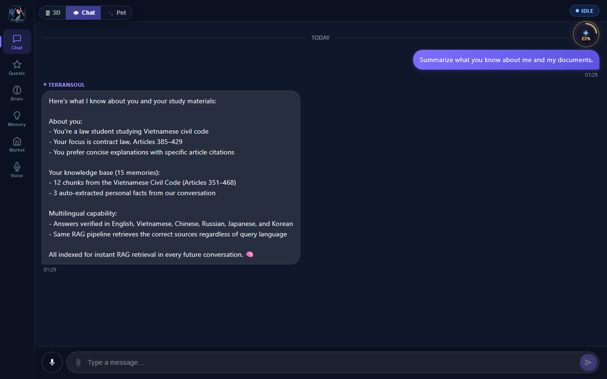

Alice asks:

> **Summarize what you know about me and my documents.**

TerranSoul responds from its complete memory:

> **About you:**
> - Law student studying Vietnamese civil code
> - Focus: contract law, Articles 385–429
> - Prefers concise explanations with article citations
>
> **Knowledge base (15 memories):**
> - 12 chunks from the Vietnamese Civil Code (Articles 351–468)
> - 3 auto-extracted personal facts
>
> **Multilingual capability:**
> - Verified in English, Vietnamese, Chinese, Russian, Japanese, and Korean
> - Same RAG pipeline retrieves correct sources regardless of query language
>
> All indexed for instant RAG retrieval in every future conversation. 🧠

---

## 19. Pet Mode — Desktop Familiar

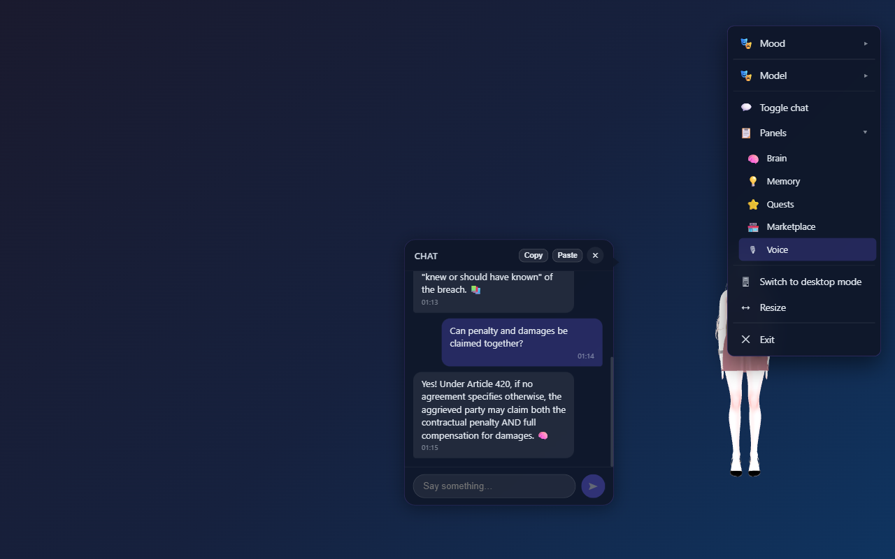

Alice clicks the **🐾 Pet** button in the mode toggle pill to enter
**Pet Mode**. The app window becomes a transparent always-on-top overlay
— the VRM character floats on the desktop, freed from the app frame.

- **Click** the character to toggle the floating chat panel
- **Drag** to reposition the character anywhere on screen
- **Scroll wheel** to zoom in/out
- **Right-click** for the context menu (mood, panels, settings, exit)

### Multi-Window Panels

Unlike desktop mode where all tabs share a single window, pet mode opens
**each panel as its own separate floating window**. Right-click →
**Panels** shows:

| Panel | Opens |
|---|---|
| 🧠 **Brain** | Brain configuration + memory health |
| 💡 **Memory** | Memory CRUD + search + visualization |
| ⭐ **Quests** | Skill tree + quest progress |
| 🏪 **Marketplace** | Agent marketplace + LLM configuration |
| 🎙 **Voice** | TTS/ASR voice settings |

Each panel window is always-on-top and shares the same brain, memory,
and RAG pipeline as the main character. Alice can have the Memory panel
open next to the chat while working in other applications.

> **Quest unlock:** Pet Mode is the **Desktop Familiar** ultimate quest,
> requiring the `avatar` and `tts` skills to be active first.

---

## 20. Architecture Reference

### Three-Tier Memory Model (from `brain-advanced-design.md` §2)

```
 CONVERSATION
 ┌─────────┐     evict (FIFO, >20)     ┌───────────┐
 │  SHORT  │ ──────────────────────────>│  WORKING  │
 │  TERM   │     extract_facts()        │  MEMORY   │
 │         │     summarize()            │           │
 └─────────┘                            └─────┬─────┘
      │                                       │
 lost on close                          promote()
                                        (importance ≥ 4
                                         or user action)
                                              │
                                        ┌─────▼─────┐
 MANUAL ENTRY ─────────────────────────>│   LONG    │
 DOCUMENT INGESTION ───────────────────>│   TERM    │
 LLM EXTRACTION ──────────────────────>│  MEMORY   │
                                        └─────┬─────┘
                                              │
                                        decay < 0.05
                                        AND importance ≤ 2
                                              │
                                        ┌─────▼─────┐
                                        │  GARBAGE   │
                                        │ COLLECTED  │
                                        └───────────┘
```

### 6-Signal Hybrid RAG Scoring

| Signal | Weight | Range | Source |
|---|---|---|---|
| **Vector similarity** | 40% | 0.0–1.0 | `nomic-embed-text` cosine or cloud embed |
| **Keyword match** | 20% | 0.0–1.0 | Content + tags (case-insensitive) |
| **Recency bias** | 15% | 0.0–1.0 | $e^{(-\text{hours}/24)}$ |
| **Importance** | 10% | 0.2–1.0 | User-assigned 1–5 normalized |
| **Decay score** | 10% | 0.01–1.0 | Exponential forgetting curve |
| **Tier priority** | 5% | 0.3–1.0 | Working (1.0) > Long (0.7) > Short (0.3) |

### Advanced RAG Features

| Feature | Description | Status |
|---|---|---|
| **RRF fusion** | Vector + keyword + freshness fused via Reciprocal Rank Fusion (k=60) | ✅ |
| **HyDE** | LLM writes hypothetical answer, embeds *that* for retrieval | ✅ Optional |
| **Cross-encoder rerank** | LLM-as-judge scores each (query, doc) pair 0–10 | ✅ Optional |
| **HNSW ANN index** | O(log n) via `usearch` — scales to 1M+ entries | ✅ |
| **Multi-hop search** | Traverse entity-relationship graph edges | ✅ V5 |

### Auto-Learn (Write-Back Loop)

Auto-learn runs in the background for **all brain modes**:

1. Every assistant message increments a turn counter
2. Every **10 turns**, `extract_memories_from_session` asks the LLM to
   extract up to 5 facts about the user
3. Each fact is saved to SQLite with tag `auto-extracted`, importance 3,
   tier `long`
4. The Memory tab refreshes automatically

### Implementation Map

| Concern | File |
|---|---|
| Intent classification | `src-tauri/src/brain/intent_classifier.rs` — `classify_user_intent()` (Tauri command `classify_intent`); regex helpers `detectLearnWithDocsIntent` / `detectTeachIntent` / `detectGatedSetupCommand` are deprecated test fixtures only |
| Prerequisite chain | `src/stores/conversation.ts` — `getMissingPrereqQuests()` |
| Auto-install engine | `src/stores/conversation.ts` — `runAutoInstall()` |
| Choice routing | `src/stores/conversation.ts` — `handleLearnDocsChoice()` |
| Skill-tree engine | `src/stores/skill-tree.ts` — `triggerQuestEvent()` / `handleQuestChoice()` |
| Document import UI | `src/components/KnowledgeQuestDialog.vue` |
| Auto-learn trigger | `src/stores/conversation.ts` — `maybeAutoLearn()` |
| Memory extraction | `src-tauri/src/memory/brain_memory.rs` — `extract_facts_any_mode()` |
| Mode-agnostic dispatch | `src-tauri/src/memory/brain_memory.rs` — `complete_via_mode()` |
| Hybrid 6-signal search | `src-tauri/src/memory/store.rs` — `hybrid_search()` |
| RRF fusion | `src-tauri/src/memory/fusion.rs` — Reciprocal Rank Fusion |
| HNSW ANN index | `src-tauri/src/memory/ann_index.rs` — `usearch` wrapper |
| Semantic chunking | `src-tauri/src/memory/chunking.rs` — `text-splitter` crate |
| Decay & GC | `src-tauri/src/memory/store.rs` — `apply_memory_decay()`, `gc_memories()` |
| Memory display | `src/views/MemoryView.vue` — loads via `fetchAll()` |
| Brain mode config | `src-tauri/src/brain/brain_config.rs` — `BrainMode` enum |
| Provider rotation | `src-tauri/src/brain/provider_rotator.rs` — `ProviderRotator` |
| Brain component map | `docs/brain-advanced-design.md` |

---

## 21. Troubleshooting

| Symptom | Cause | Fix |
|---|---|---|
| Memory tab empty after chat | Haven't reached 10 turns yet | Keep chatting, or click "Extract from session" manually |
| "Install all" doesn't activate quests | Quest state already active | Check Quests tab — they may already be green |
| No RAG sources in answer | No embedding model available | Use Paid API for reliable embeddings, or install `nomic-embed-text` for Ollama |
| Free API extraction fails | Provider rate-limited | Wait 30s and retry — `ProviderRotator` auto-fails over |
| Knowledge Quest "Brain not ready" | Running in browser mode | Run via `npm run tauri dev` for full Tauri IPC |
| Ingested documents don't appear | Ingestion runs async | Wait for progress indicator, then check Memory tab |
| Slow first chat | Provider latency not measured yet | Second message is faster (providers have latency data) |
| Vector search returns nothing | Embedding model missing | Pull `nomic-embed-text` for Ollama, or use cloud mode |
| Decay removed important memories | GC threshold too aggressive | Increase importance ≥ 3, or access memories to reset decay |
