# Brain + Knowledge Quest + RAG — Walkthrough

> **TerranSoul v0.1** · Last verified: 2026-04-23
>
> Technical reference: [`BRAIN-COMPLEX-EXAMPLE-EXPLAIN.md`](BRAIN-COMPLEX-EXAMPLE-EXPLAIN.md)

The "Alice learns Vietnamese law" demo — 17 steps from Docker pre-flight
through the *don't-know* branch, an explicit **"provide your own context"**
handshake, Scholar's Quest ingestion, and RAG-augmented chat. Driven by
[`scripts/verify-brain-flow.mjs`](../scripts/verify-brain-flow.mjs)
connecting to the running Tauri app via CDP.

```
112 passed · 0 failed · 0 skipped
```

### How to run

```powershell
docker start ollama                       # Ollama container with gemma3:4b
$env:WEBVIEW2_ADDITIONAL_BROWSER_ARGUMENTS = "--remote-debugging-port=9222"
npm run tauri dev                         # Terminal 1
node scripts/verify-brain-flow.mjs        # Terminal 2
```

---

## Why this flow changed

Earlier versions auto-fired Scholar's Quest whenever the user said
*"learn about X"* — but that's a question, not an instruction to ingest.
The current behavior:

1. **Asking a law question ≠ teaching the AI.** The LLM just answers.
2. **If the model's answer is uncertain** ("I don't know", "my knowledge is
   limited"…) TerranSoul surfaces two gated upgrade paths and asks the user
   to **type** one of the two literal commands — never auto-switching.
3. **Scholar's Quest only fires on an explicit teach instruction**:
   *"remember the following law: …"*, *"provide your own context"*,
   *"ingest this document: …"*, etc.

---

## Step 0 — Pre-flight (7 checks)

| Check | Assertion |
|---|---|
| Docker CLI | `docker --version` → `Docker version 28.3.2` |
| Ollama container | `docker ps` status starts with `"Up"` |
| Ollama API | `GET /api/tags` → 200 |
| Model installed | ≥ 1 model |
| Model tag | `gemma3:4b` |
| Model responds | `POST /api/chat` returns content |
| Tauri CDP | `GET :9222/json/version` → 200 |

---

## Step 1 — Fresh Launch (12 checks)


420×700 Tauri window with mobile bottom nav (`<640px` breakpoint).

| Check | Selector | Expected |
|---|---|---|
| Chat view | `.chat-view` | visible |
| 3D viewport | `.viewport-layer` | visible |
| Input footer | `.input-footer` | visible |
| Navigation | `.mobile-bottom-nav` | visible |
| Nav labels | `.mobile-tab-label` | `["Chat","Quests","Memory","Market","Voice"]` |
| AI state pill | `.ai-state-pill` | visible |
| Quest orb | `.ff-orb` | visible |
| Mode toggle | `.mode-toggle-pill` | visible |
| Toggle label | `.mode-toggle-label` | `"Desktop"` |
| Chat input | `input.chat-input` | visible |
| Placeholder | `input.chat-input` | `"Type a message…"` |
| Send button | `button.send-btn` | visible |

---

## Step 2 — Brain → Local Ollama (8 checks)


Auto-configures or Pinia-injects `local_ollama` mode. Warms up Ollama with a
direct `/api/chat` call.

| Check | Expected |
|---|---|
| Brain Pinia store | not null |
| `brainMode.mode` | `"local_ollama"` |
| `brainMode.model` | `"gemma3:4b"` |
| `ollamaStatus.running` | `true` |
| `ollamaStatus.model_count` | `1` |
| Brain status pill | visible |
| Pill text | `"Ollama · gemma3:4b"` |
| Brain overlay | hidden |

---

## Step 3 — Brain Component Verification (9 checks)


Cross-checks Docker, Ollama `/api/show` metadata, Pinia state, and Tauri IPC.

| Check | Expected |
|---|---|
| Docker version | starts with `"Docker version"` |
| Container status | starts with `"Up"` |
| Model family | `"gemma3"` |
| Model params | `4.3B` |
| Model quantization | `Q4_K_M` |
| Pinia brainMode.mode | `"local_ollama"` |
| Pinia brainMode.model | `"gemma3:4b"` |
| Brain pill text | `"Ollama · gemma3:4b"` |
| Tauri IPC | `__TAURI_INTERNALS__` present |

---

## Step 4 — Alice Asks a Law Question (6 checks)


*"What is the statute of limitations for contract disputes under Vietnamese
civil law?"* — a factual question, not an instruction to ingest. Local
Ollama (`gemma3:4b`) answers directly (120 s timeout).

**Key invariant:** Scholar's Quest must **NOT** auto-trigger from a
question.

| Check | Expected |
|---|---|
| Input filled | contains `"Vietnamese civil law"` |
| Message sent | ✅ |
| User message row | `.message-row.user` ≥ 1 |
| Assistant response | `.message-row.assistant` ≥ 1 |
| Response content | length > 20 |
| No auto scholar-quest | no message with `questId === "scholar-quest"` |

---

## Step 5 — "I Don't Know" Branch (6 checks)

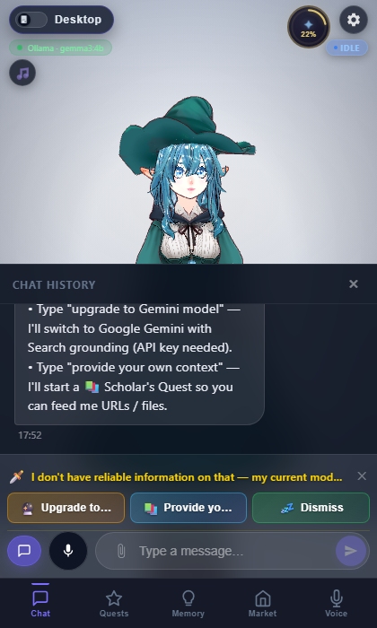

Because `gemma3:4b` is a small local model, its answer typically contains
uncertainty markers (`"I don't know"`, `"my training data is limited"`,
`"I cannot confirm"`…). `detectDontKnow()` spots this and pushes a **System**
message with two gated upgrade choices — the user must **type** one of them
to continue.

| Check | Expected |
|---|---|
| System message appears | `questId === "dont-know"` |
| agentName | `"System"` |
| Content mentions Gemini | `"upgrade to Gemini model"` |
| Content mentions context | `"provide your own context"` |
| Choice: Upgrade to Gemini | `value === "command:upgrade to Gemini model"` |
| Choice: Provide context | `value === "command:provide your own context"` |

> If the LLM happens to return a confident answer (no uncertainty markers),
> this step is marked **SKIP** and the script moves straight to Step 6 by
> having Alice explicitly teach the AI.

---

## Step 6 — Alice Chooses "Provide Your Own Context" (5 checks)

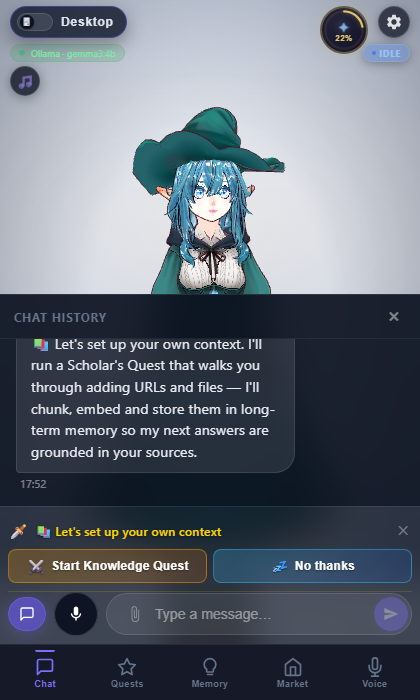

Alice types `provide your own context` (or `remember the following law: …`).
`detectGatedSetupCommand()` / `detectTeachIntent()` fires — a
**`scholar-quest`** message is pushed with `Start Knowledge Quest` /
`No thanks` choices. The hotseat strip renders.

| Check | Expected |
|---|---|
| Scholar-Quest message exists | `questId === "scholar-quest"` |
| Quest choices | ≥ 2 |
| Choice 1 | `"Start Knowledge Quest"` |
| Choice 2 | `"No thanks"` |
| Hotseat strip visible | `.hotseat-strip` visible |

---

## Step 7 — Quest Choice Overlay (5 checks)

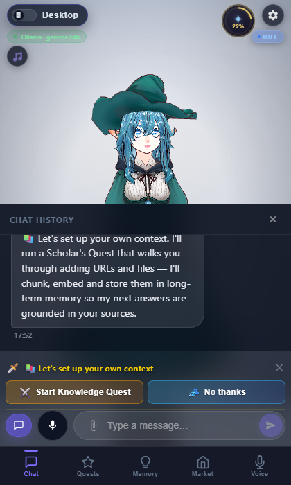

| Check | Expected |
|---|---|
| Hotseat strip | visible |
| Question text | length > 5 |
| Tile labels | ≥ 2 |
| Start button | visible |
| Clicked | ✅ |

---

## Step 8 — Knowledge Quest Dialog (8 checks)

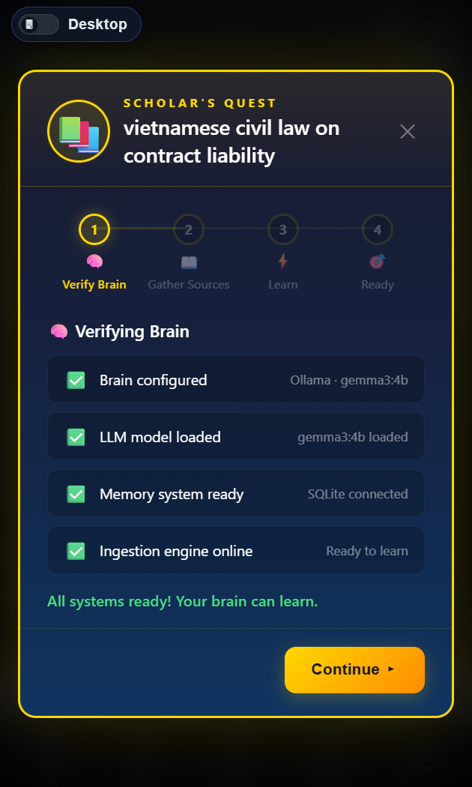

FF-style 4-step quest chain. Topic extracted from Alice's last user message.

| Check | Expected |
|---|---|
| `.kq-dialog` | visible |
| Header label | `"SCHOLAR'S QUEST"` |
| Title | contains topic |
| Step 1 | `"Verify Brain"` |
| Step 2 | `"Gather Sources"` |
| Step 3 | `"Learn"` |
| Step 4 | `"Ready"` |
| Active step count | 1 |

---

## Step 9 — Brain Verification (9 checks)

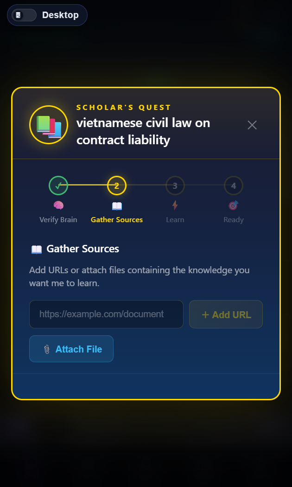

Four animated checks; "Continue" activates when all pass.

| Check | Expected |
|---|---|
| Section title | `"🧠 Verifying Brain"` |
| Check count | 4 |
| Label 1 | `"Brain configured"` |
| Label 2 | `"LLM model loaded"` |
| Label 3 | `"Memory system ready"` |
| Label 4 | `"Ingestion engine online"` |
| All passed | ✅ icons ≥ 3 |
| Continue button | visible |
| Advanced to step 2 | ✅ |

---

## Step 10 — Gather Sources (10 checks)

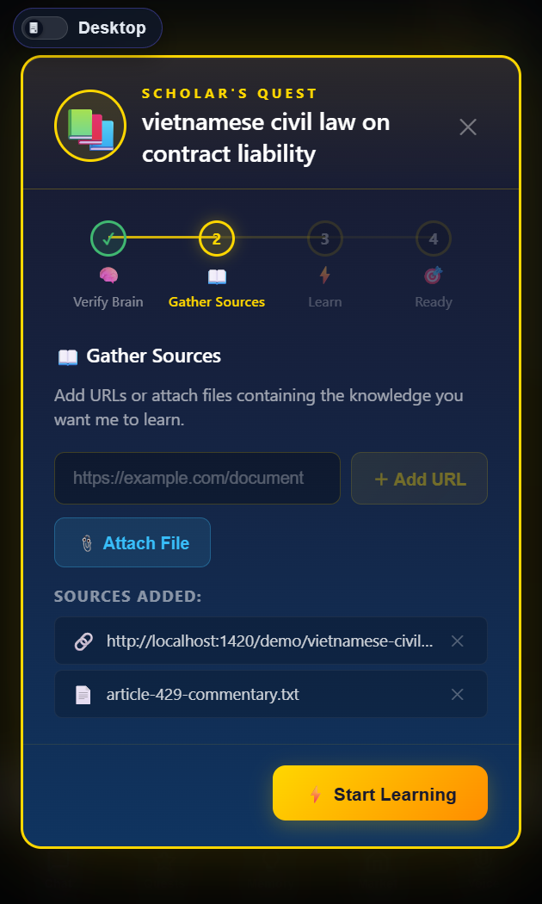

Two sources added:
- **URL**: `localhost:1420/demo/vietnamese-civil-code.html` (Articles 351–468)
- **File**: `article-429-commentary.txt`

| Check | Expected |
|---|---|
| Section title | `"📖 Gather Sources"` |
| URL input | visible |
| URL placeholder | `"https://example.com/document"` |
| Add URL button | visible |
| URL source added | `.kq-source-item` ≥ 1 |
| Source name | contains `"vietnamese-civil-code"` |
| File button | visible |
| File button text | `"📎 Attach File"` |
| File source added | `.kq-source-item` ≥ 2 |
| Start Learning button | visible |

---

## Step 11 — Learning in Progress (5 checks)

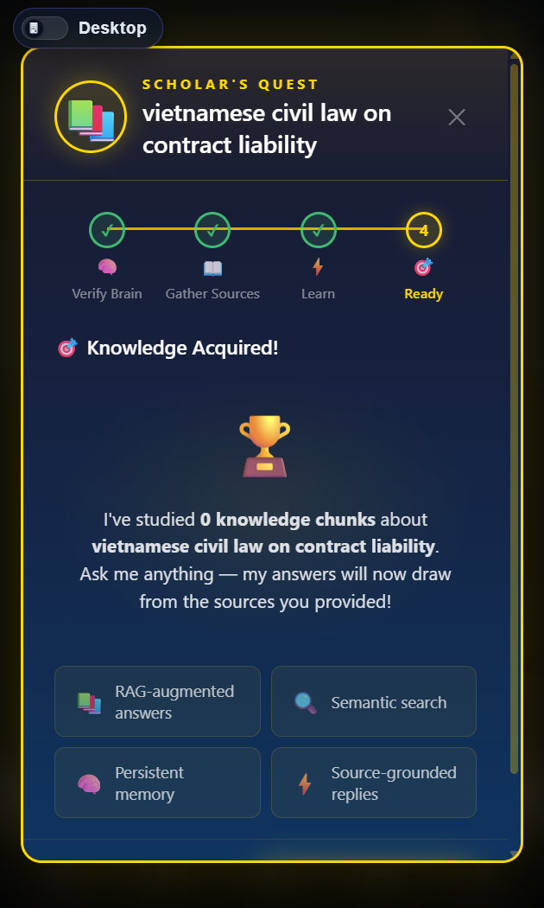

Ingestion pipeline: URL fetch → HTML extraction → chunking (800/100) →
SHA256 dedup → Ollama embedding → SQLite storage.

| Check | Expected |
|---|---|
| Clicked "Start Learning" | ✅ |
| Section title | `"⚡ Learning in Progress"` |
| Task progress | visible |
| Progress bar | visible |
| Ingestion completed | ✅ |

---

## Step 12 — Knowledge Acquired (6 checks)

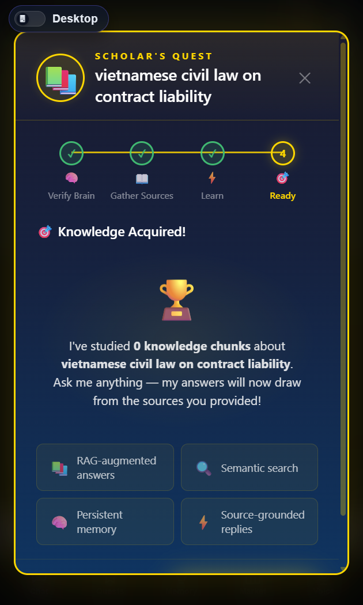

| Check | Expected |
|---|---|
| Complete card | visible |
| Trophy icon | `"🏆"` |
| Section title | `"🎯 Knowledge Acquired!"` |
| Reward cards | 4 |
| Ask Questions button | visible |
| KQ dialog closed | not visible after click |

---

## Step 13 — RAG: Statute of Limitations (3 checks)

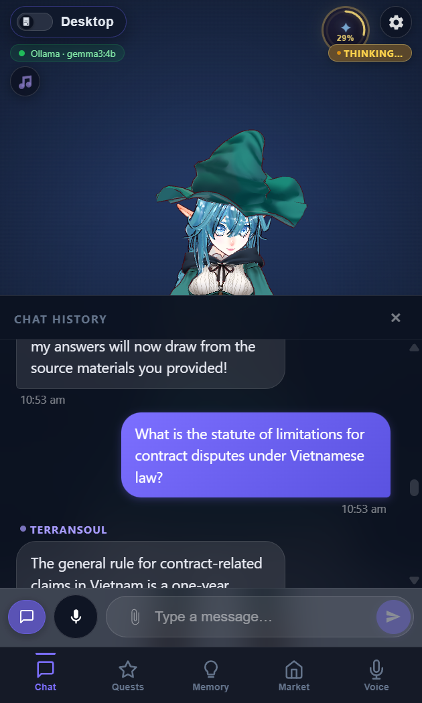

*"What is the statute of limitations for contract disputes under Vietnamese law?"*

Same question as Step 4 — but now answered from the ingested civil code
chunks via hybrid search, so no more don't-know prompt.

| Check | Expected |
|---|---|
| Completion message | contains `"Scholar's Quest Complete"` |
| RAG response | length > 50 |
| References law content | mentions statute/limitation/contract/civil |

---

## Step 14 — RAG: Exemptions from Liability (4 checks)

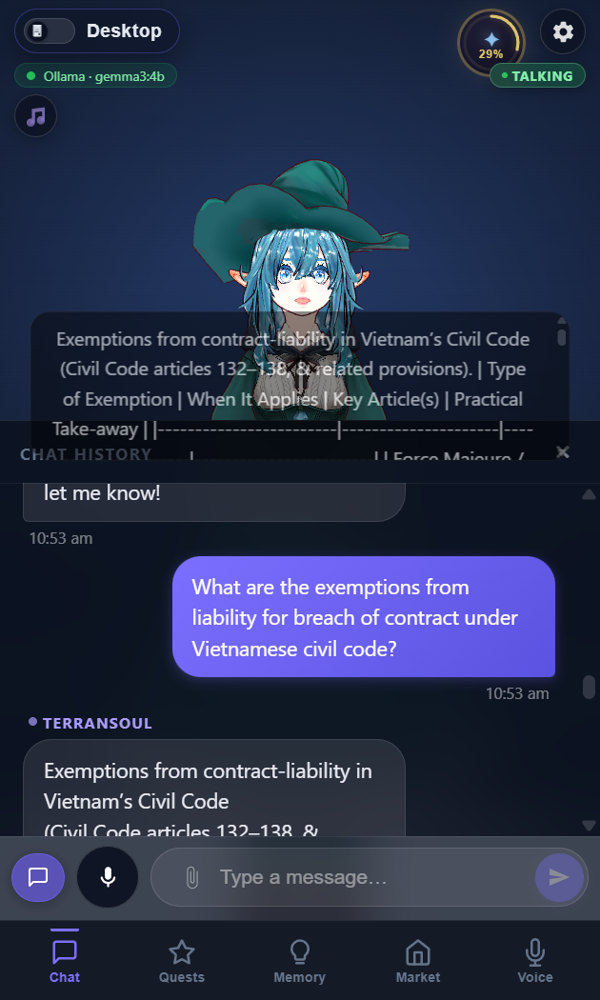

*"What are the exemptions from liability for breach of contract under Vietnamese civil code?"*

| Check | Expected |
|---|---|
| Second RAG response | length > 50 |
| References exemptions | mentions exemptions/force majeure/liability |
| Brain mode | still `"local_ollama"` |
| Brain model | still `"gemma3:4b"` |

---

## Step 15 — Skill Tree (7 checks)

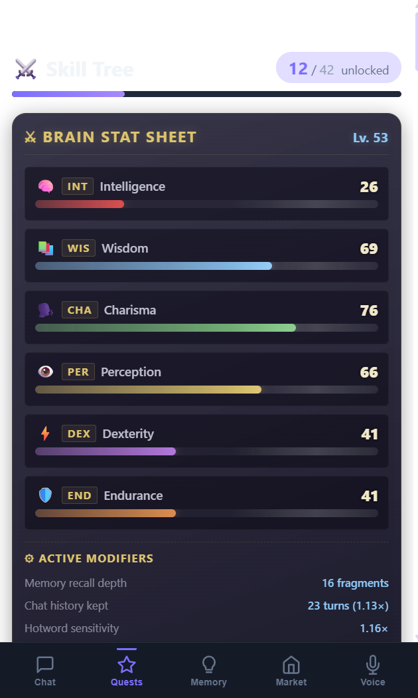

Navigate to Quests tab via `navTo(page, 'Quests')`.

| Check | Expected |
|---|---|
| Skill tree view | visible |
| Title | `"⚔️ Skill Tree"` |
| Brain Stat Sheet | visible |
| Sheet title | `"⚔ Brain Stat Sheet"` |
| Stat abbreviations | `["INT","WIS","CHA","PER","DEX","END"]` |
| Level badge | matches `/^Lv\. \d+$/` |
| Daily section | visible |

---

## Step 16 — Pet Mode (4 checks)

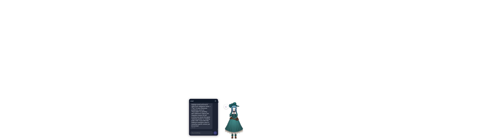

Toggle pet mode → dismiss onboarding → click character → chat panel → Escape.

| Check | Expected |
|---|---|
| Pet overlay | visible |
| App shell `.pet-mode` | visible |
| Pet chat panel | visible |
| Exited pet mode | overlay gone after Escape |

---

## Summary

| Step | Checks | Description |
|---:|---:|---|
| 0 | 7 | Docker, Ollama, model, CDP |
| 1 | 12 | Fresh launch — viewport, nav, controls |
| 2 | 8 | Brain → local_ollama / gemma3:4b |
| 3 | 9 | Docker + model details + Tauri IPC |
| 4 | 6 | Alice asks a law question (no auto-quest) |
| 5 | 6 | Don't-know branch — Gemini / own-context choices |
| 6 | 5 | Alice types "provide your own context" → Scholar's Quest |
| 7 | 5 | Hotseat overlay → start quest |
| 8 | 8 | KQ dialog — header, steps |
| 9 | 9 | Brain verification — 4 checks |
| 10 | 10 | URL + file sources |
| 11 | 5 | Ingestion pipeline |
| 12 | 6 | Knowledge acquired — trophy |
| 13 | 3 | RAG: statute of limitations |
| 14 | 4 | RAG: exemptions from liability |
| 15 | 7 | Skill tree stats |
| 16 | 4 | Pet mode with chat |
| **Total** | **114** | **0 failed · 0 skipped** |

---

## Alternate path — "Upgrade to Gemini model"

Instead of Step 6's *"provide your own context"*, the user can type
**`upgrade to Gemini model`**. `detectGatedSetupCommand` returns
`{ type: "upgrade_gemini" }`; the assistant explains Gemini 2.0 Flash +
Google Search grounding, and the overlay offers **Open Marketplace** →
`navigate:marketplace`. The Marketplace's *Configure LLM* pane is where the
user pastes their free API key from
[Google AI Studio](https://aistudio.google.com/apikey).

This path is not auto-verified by the headful script because it would
require swapping the brain to a network provider mid-run, but the command
detection has unit test coverage in `src/stores/conversation.test.ts`.
