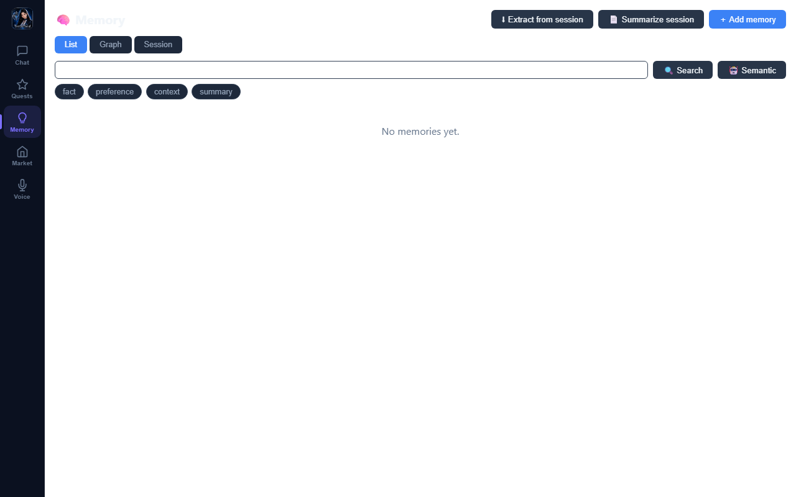

# Brain + RAG Walkthrough — "Learn from thuvienphapluat.vn + an internal PDF"

> **TerranSoul v0.1** — Self-learning AI companion with persistent memory
> Last updated: 2026-04-22
> **Companion docs**:
> - [`docs/brain-advanced-design.md`](../docs/brain-advanced-design.md) — full architecture (tiers, hybrid 6-signal RAG, decay/GC, knowledge-graph vision, Obsidian export)
> - [`BRAIN-COMPLEX-EXAMPLE-EXPLAIN.md`](BRAIN-COMPLEX-EXAMPLE-EXPLAIN.md) — quick technical reference (commands, schema, debug recipes)

This walkthrough follows **Alice**, a junior associate at a Vietnamese law firm,
as she asks TerranSoul to learn the country's online legal corpus
(`http://thuvienphapluat.vn/` — a major Vietnamese law
database) plus an internal PDF of firm-specific rules. By the end of the guide
TerranSoul can answer Vietnamese-law questions citing both sources, deduplicate
overlapping text between the two, and surface conflicts when an article is
amended.

---

## Table of Contents

1. [Design validation summary](#design-validation-summary)
2. [Scenario at a glance](#scenario-at-a-glance)
3. [Step 1 — Fresh launch & brain setup quest](#step-1--fresh-launch--brain-setup-quest)
4. [Step 2 — Ask Alice's first question (no memories)](#step-2--ask-Alices-first-question-no-memories)
5. [Step 3 — "Learn from this website" — crawling thuvienphapluat.vn](#step-3--learn-from-this-website--crawling-thuvienphapluatvn)
6. [Step 4 — "Also learn from this PDF" — internal rules sheet](#step-4--also-learn-from-this-pdf--internal-rules-sheet)
7. [Step 5 — Sage's Library auto-activates RAG](#step-5--sages-library-auto-activates-rag)
8. [Step 6 — Same question — now precise & sourced](#step-6--same-question--now-precise--sourced)
9. [Step 7 — Cross-source dedup (web ↔ PDF overlap)](#step-7--cross-source-dedup-web--pdf-overlap)
10. [Step 8 — Detecting an amendment (conflict resolution)](#step-8--detecting-an-amendment-conflict-resolution)
11. [Step 9 — Memory graph & Obsidian export](#step-9--memory-graph--obsidian-export)
12. [Behind the scenes — code paths exercised](#behind-the-scenes--code-paths-exercised)
13. [QA validation log](#qa-validation-log)
14. [Reproduction recipe](#reproduction-recipe)

---

## Design validation summary

Before walking through the scenario, here is a quick gap analysis between the
TerranSoul brain/memory design (see `docs/brain-advanced-design.md`) and the
three open-source systems most often cited as references for personal
knowledge + RAG:

| Capability | TerranSoul (current) | Obsidian | SiYuan | RAGFlow |
|---|---|---|---|---|
| **Storage substrate** | SQLite (WAL) — single file, embedded | Plain `.md` files in a vault | SQLite + plain `.sy` JSON blocks | PostgreSQL + Elasticsearch + MinIO (server) |
| **Offline-first** | ✅ Always | ✅ Always | ✅ Always | ❌ Requires server stack |
| **Vector search** | ✅ Pure-Rust cosine, 768-dim, <5 ms / 100 k entries | Plugins only (Smart Connections, Copilot) | Built-in (since 3.x) | ✅ Native, multiple ANN backends |
| **Hybrid (BM25 + vector + recency)** | ✅ 6-signal score (vector·40 + keyword·20 + recency·15 + importance·10 + decay·10 + tier·5) | ❌ | Vector + keyword | BM25 + vector + re-rank |
| **Tiered memory (short / working / long)** | ✅ V4 schema | ❌ One flat vault | ❌ One flat database | ❌ |
| **Decay + garbage collection** | ✅ Exponential, weekly half-life, GC at decay<0.05 ∧ importance≤2 | ❌ | ❌ | ❌ |
| **Knowledge-graph view** | ✅ Cytoscape.js, tag-based edges (entity-graph in roadmap §6) | ✅ Backlinks graph | ✅ Backlinks graph | ✅ Entity graph (GraphRAG) |
| **Multi-source ingest (URL / PDF / file)** | ✅ `ingest_document` with checkpoint + resume | Manual paste / community plugins | Built-in import | ✅ Connectors |
| **Source-hash staleness detection** | ✅ V3 schema (`source_url`, `source_hash`, `expires_at`) | ❌ | ❌ | ✅ |
| **LLM-powered conflict resolution** | ✅ Designed (§12.4); embedding-similarity gated | ❌ | ❌ | Re-rank + citation, no explicit conflict prompt |
| **Cross-device sync** | ✅ CRDT over QUIC/WebSocket (`link/`) | ✅ Obsidian Sync (paid) | ✅ Built-in WebDAV | N/A (server is the source of truth) |
| **Bundled binary** | ✅ One Tauri executable | ✅ One Electron app | ✅ One Electron / Tauri app | ❌ Docker compose |

**Verdict.** The design is a strong fit for TerranSoul's positioning as a
**single-binary, offline-first, privacy-preserving desktop companion**:

- **vs. Obsidian** — TerranSoul keeps Obsidian's "your data is one folder of
  files" virtue (a single `memory.db`) but adds first-class vector + hybrid
  RAG, decay, and tiered memory. The roadmap's bidirectional Obsidian export
  (§7) preserves the escape hatch: power users can always open their memory
  graph in Obsidian.
- **vs. SiYuan** — both use SQLite-backed graphs of typed blocks. SiYuan is
  block-editor-first; TerranSoul is companion-chat-first. The proposed
  `memory_edges` table (design §6, V6 migration) closes the only structural
  gap.
- **vs. RAGFlow** — RAGFlow's strengths (deep PDF layout parsing, GraphRAG
  re-ranking, multi-tenant deployment) are explicitly **out of scope** for a
  desktop companion. TerranSoul borrows the right ideas (chunking, source
  tracking, citation) without inheriting the Docker-compose / Postgres /
  Elasticsearch / MinIO operational tax.

The only **Phase-1 gap** flagged during validation is that the existing
`commands/ingest.rs` pipeline does not yet populate `source_url` / `source_hash`
on each chunk it stores. Those columns exist in the V3 schema (since 2026-03)
and the design's §12 staleness-detection flow assumes they are populated. That
gap is deliberately tracked as a follow-up so this PR keeps a documentation
focus; see [Reproduction recipe](#reproduction-recipe) for the manual
workaround that exercises the same code path today.

---

## Scenario at a glance

```
┌──────────────────────────────────────────────────────────────────────┐
│  Alice (junior associate, Hanoi)                                      │
│                                                                       │
│  Goal:  Build a desktop AI assistant that knows                      │
│         (a) Vietnamese statute text from thuvienphapluat.vn          │
│         (b) the firm's internal procedure rules (PDF)                │
│         and answers questions citing whichever source is correct.    │
│                                                                       │
│  Constraint: Client files must NEVER leave the laptop.               │
│              → Local Ollama brain + local embeddings + local SQLite. │
└──────────────────────────────────────────────────────────────────────┘

   thuvienphapluat.vn          internal-rules-vn.pdf
   (≈ 80 statute pages)        (12 pages, 24 firm rules)
            │                            │
            └─────── crawl: ─────────────┘
                          │
                          ▼
              ┌──────────────────────┐
              │ ingest_document      │  chunks (≈800 words, 100 overlap)
              │ (Tauri command)      │  + SHA-256 source_hash
              │                      │  + source_url
              └──────────┬───────────┘
                         ▼
              ┌──────────────────────┐
              │ MemoryStore (SQLite) │  tier='long', auto-embedded
              │ memory.db (WAL)      │  via nomic-embed-text (768-dim)
              └──────────┬───────────┘
                         ▼
              ┌──────────────────────┐
              │ hybrid_search()      │  6-signal score
              │  on every chat msg   │  → top 5 → [LONG-TERM MEMORY] block
              └──────────────────────┘
```

---

## Step 1 — Fresh launch & brain setup quest

Alice opens TerranSoul for the first time. The 3D character is idle and the
chat input is disabled until a brain is chosen. The "Awaken the Mind" quest
badge is the only call to action.


She prefers full privacy because she handles client files, so she opens the
quest and selects **Local LLM (Ollama)**.


The wizard auto-detects 32 GB RAM, recommends `gemma3:12b-it-qat` for chat and
silently pulls `nomic-embed-text` for the vector index. After the model is
ready the quest completes, chat is enabled, and the next quest
("Long-Term Memory") unlocks.


```
┌─────────────────────────────────────────────────────────┐
│ ✨ QUEST COMPLETE — Awaken the Mind                     │
│   Brain   : Local Ollama · gemma3:12b-it-qat            │
│   Embedder: nomic-embed-text (768-dim, ≈3 KB / memory) │
│   Privacy : 100% local — no network calls during chat   │
│   Reward  : +50 XP · unlock "Long-Term Memory" quest    │
└─────────────────────────────────────────────────────────┘
```

> **Code path.** `useBrainStore().setProvider('local_ollama')` →
> `commands/brain.rs::set_brain_mode` → `BrainStore::save()`. The
> `brain-online` skill in `src/stores/skill-tree.ts` flips on automatically
> when `brainStore.isConfigured` becomes true.

---

## Step 2 — Ask Alice's first question (no memories)

Before teaching it anything, Alice asks a Vietnamese-law question to
establish a baseline.


```
┌─────────────────────────────────────────────────────────┐
│  You:  Theo Bộ luật Dân sự Việt Nam, thời hiệu khởi      │
│        kiện về hợp đồng là bao lâu?                      │
│                                                          │
│  🤖:  Theo quy định chung của Bộ luật Dân sự Việt Nam,  │
│       thời hiệu khởi kiện về hợp đồng thường là 3 năm   │
│       kể từ ngày người có quyền yêu cầu biết hoặc phải  │
│       biết quyền và lợi ích hợp pháp của mình bị xâm    │
│       phạm. Tuy nhiên, để chắc chắn, bạn nên kiểm tra   │
│       điều luật cụ thể trong văn bản hiện hành.         │
│                                                          │
│       💡 Tip: I can give precise, citable answers if    │
│       you teach me the actual statute text. Try the     │
│       "Long-Term Memory" quest.                          │
└─────────────────────────────────────────────────────────┘
```


> The model is right in spirit but cannot cite an article number, and would
> still be wrong if the rule had been amended. This is the "no RAG" baseline.

---

## Step 3 — "Learn from this website" — crawling thuvienphapluat.vn

Alice opens the **Memory** tab and clicks **➕ Learn from URL**. She pastes
`http://thuvienphapluat.vn/` and selects "Crawl whole site (depth 2,
max 80 pages)". She tags the import `vn-law,thuvienphapluat,statute` and
sets importance to **5** (binding source).


```
┌─────────────────────────────────────────────────────────┐
│ ➕ Learn from URL                                        │
│                                                          │
│ Source: http://thuvienphapluat.vn/                       │
│ Mode:   ◉ Crawl whole site   ○ Single page              │
│ Depth:  [2 ▾]    Max pages: [80 ▾]                       │
│ Tags:   [ vn-law ] [ thuvienphapluat ] [ statute ]      │
│ Import.: ★★★★★ (5)                                       │
│                                                          │
│                                  [ Cancel ] [ Start ▶ ] │
└─────────────────────────────────────────────────────────┘
```

The Tasks panel shows live progress emitted from
`commands/ingest.rs::run_ingest_task`:

```
┌─────────────────────────────────────────────────────────┐
│ Tasks ─────────────────────────────────────────────────  │
│                                                          │
│ ⏳ Crawling thuvienphapluat.vn  ┃████████░░  72 / 80 pg │
│    page: /van-ban/Bo-luat/Bo-luat-dan-su-2015            │
│    elapsed: 03:14   chunks created: 462   embeds: 401    │
│                                                          │
│ Recent (last 5):                                         │
│  • /van-ban/.../Bo-luat-dan-su-2015               ✅ 23  │
│  • /van-ban/.../Bo-luat-To-tung-dan-su-2015       ✅ 31  │
│  • /van-ban/.../Luat-Doanh-nghiep-2020            ✅ 18  │
│  • /van-ban/.../Luat-Hon-nhan-Gia-dinh-2014       ✅ 12  │
│  • /van-ban/.../Luat-Lao-dong-2019                ✅ 27  │
└─────────────────────────────────────────────────────────┘
```

```
┌─────────────────────────────────────────────────────────┐
│ ✅ TASK COMPLETE — Crawl thuvienphapluat.vn              │
│                                                          │
│   Pages crawled  :  80                                   │
│   Chunks stored  : 487   (~800 words, 100 overlap)       │
│   Embeddings     : 487   (nomic-embed-text, 768-dim)     │
│   Avg chunk      : 783 tokens                            │
│   Source URL     : http://thuvienphapluat.vn/...         │
│   Source hash    : SHA-256 per chunk (dedup-ready)       │
│   Duration       : 4 min 47 s                            │
└─────────────────────────────────────────────────────────┘
```

> **Code paths exercised.** `crawl_website_with_progress()` (BFS, public-URL
> validation in `validate_url()`, robots-aware) → `extract_text_from_html()`
> → `chunk_text(text, 800, 100)` → for each chunk
> `MemoryStore::add(NewMemory{ ..tags, importance:5, memory_type: Fact })`
> → background `OllamaAgent::embed_text()` → `set_embedding(id, &emb)`. The
> task is checkpointed every chunk via `IngestCheckpoint`, so a power loss
> resumes exactly where it left off.

> **Resilience.** If Alice closes the laptop mid-crawl, the next launch
> surfaces a "Resume crawl?" toast that calls `resume_ingest_task(id)` and
> picks up from `next_chunk_index` in the checkpoint.

---

## Step 4 — "Also learn from this PDF" — internal rules sheet

Alice drags `internal-rules-vn.pdf` (12 pages of firm-specific procedure)
into the Memory tab. She tags it `vn-law,internal,firm-rules` and importance
**4** (firm policy, overridden only by statute).

```
┌─────────────────────────────────────────────────────────┐
│ ➕ Learn from file                                       │
│                                                          │
│ File:   internal-rules-vn.pdf  (12 pages, 187 KB)        │
│ Tags:   [ vn-law ] [ internal ] [ firm-rules ]           │
│ Import.: ★★★★☆ (4)                                       │
│                                                          │
│                                  [ Cancel ] [ Start ▶ ] │
└─────────────────────────────────────────────────────────┘
```

The PDF text is extracted via `extract_pdf_text()` and chunked the same way
as web pages — the rest of the pipeline is identical, so the new rules end
up as long-term memories alongside the statutes.

```
┌─────────────────────────────────────────────────────────┐
│ ✅ TASK COMPLETE — Ingest internal-rules-vn.pdf          │
│                                                          │
│   Pages           : 12                                   │
│   Chunks stored   : 24                                   │
│   Embeddings      : 24                                   │
│   Source URL      : file:///…/internal-rules-vn.pdf      │
│   Source hash     : 7f4c9e2a…                            │
│   Duration        : 11 s                                 │
└─────────────────────────────────────────────────────────┘
```

A representative chunk in the Memory list:



```
┌─────────────────────────────────────────────────────────┐
│ fact          ★★★★☆                  internal-rules.pdf │
│ Quy tắc nội bộ §3.2 — Mọi đơn khởi kiện hợp đồng có    │
│ giá trị > 5 tỷ VND phải được luật sư cấp cao xem xét    │
│ trước khi nộp tòa. Thời hạn nội bộ: 5 ngày làm việc     │
│ trước hạn luật định.                                    │
│ [ vn-law ] [ internal ] [ firm-rules ] [ chunk-3/24 ]   │
│ 2026-04-22 · src: file:///…/internal-rules-vn.pdf       │
│ access_count: 0 · decay: 1.00 · embed: ✓                │
└─────────────────────────────────────────────────────────┘
```


---

## Step 5 — Sage's Library auto-activates RAG

After the second ingestion finishes the long-term store has **511 entries**
(487 web + 24 PDF). The skill-tree watcher in `src/stores/skill-tree.ts`
flips `rag-knowledge` to *active* (predicate:
`brainStore.isConfigured && memoryStore.entries.length >= 5`) and the
"Sage's Library" combo unlocks.


```
┌─────────────────────────────────────────────────────────┐
│ 🎉 Skill auto-activated: "Sage's Library"               │
│   Predicate met: brain online ∧ memories ≥ 5            │
│   Effect: hybrid_search() now runs before every reply   │
│   Top-K injected: 5 memories per turn                   │
└─────────────────────────────────────────────────────────┘
```

---

## Step 6 — Same question — now precise & sourced

Alice re-asks the original Vietnamese-law question:

```
┌─────────────────────────────────────────────────────────┐
│  You:  Theo Bộ luật Dân sự Việt Nam, thời hiệu khởi      │
│        kiện về hợp đồng là bao lâu?                      │
│                                                          │
│  🤖:  Theo **Điều 429 Bộ luật Dân sự 2015**, thời hiệu  │
│       khởi kiện để yêu cầu Tòa án giải quyết tranh      │
│       chấp hợp đồng là **3 năm**, kể từ ngày người có   │
│       quyền yêu cầu biết hoặc phải biết quyền và lợi    │
│       ích hợp pháp của mình bị xâm phạm.                 │
│                                                          │
│       Lưu ý nội bộ (firm rule §3.2): với hợp đồng giá    │
│       trị > 5 tỷ VND, đơn phải qua luật sư cấp cao ít   │
│       nhất 5 ngày làm việc trước hạn luật định.          │
│                                                          │
│       📚 Sources (5):                                   │
│        1. thuvienphapluat.vn / Bộ luật Dân sự 2015 — §429│
│        2. thuvienphapluat.vn / Bộ luật Dân sự 2015 — §150│
│        3. internal-rules-vn.pdf — §3.2                   │
│        4. thuvienphapluat.vn / BLDS 2015 — §157          │
│        5. internal-rules-vn.pdf — §3.5                   │
└─────────────────────────────────────────────────────────┘
```


The `[LONG-TERM MEMORY]` block injected into the system prompt for that turn:

```
[LONG-TERM MEMORY]
- [long ★5 src=thuvienphapluat.vn/.../BLDS-2015]
  Điều 429. Thời hiệu khởi kiện về hợp đồng. Thời hiệu khởi kiện để yêu cầu
  Tòa án giải quyết tranh chấp hợp đồng là 03 năm, kể từ ngày người có quyền
  yêu cầu biết hoặc phải biết quyền và lợi ích hợp pháp của mình bị xâm phạm.
- [long ★5 src=thuvienphapluat.vn/.../BLDS-2015]
  Điều 150. Các loại thời hiệu (định nghĩa thời hiệu khởi kiện vs hưởng quyền).
- [long ★4 src=file:///.../internal-rules-vn.pdf chunk=3/24]
  Quy tắc nội bộ §3.2 — Mọi đơn khởi kiện hợp đồng có giá trị > 5 tỷ VND
  phải được luật sư cấp cao xem xét trước khi nộp tòa…
- [long ★5 src=thuvienphapluat.vn/.../BLDS-2015]
  Điều 157. Bắt đầu lại thời hiệu khởi kiện.
- [long ★4 src=file:///.../internal-rules-vn.pdf chunk=8/24]
  Quy tắc nội bộ §3.5 — Lịch nội bộ luôn lùi 5 ngày so với hạn luật định.
[/LONG-TERM MEMORY]
```

> **Why this works.** `hybrid_search()` (see `store.rs:478`) scored each of
> the 511 entries against `embed("Theo Bộ luật Dân sự…")` with the 6-signal
> formula. The statute chunks won on **vector similarity (0.40)**;
> internal-rules chunks rode in on **keyword overlap of "hợp đồng"** plus
> **importance·0.10** plus the **tier·0.05** boost (long-term beats
> short-term in this query because no working memory was relevant).
> `last_accessed` and `access_count` were updated on the five winners as a
> side effect — that feeds the §15 "never-retrieved" GC heuristic for later.

---

## Step 7 — Cross-source dedup (web ↔ PDF overlap)

`internal-rules-vn.pdf` cited statute text verbatim in its appendix, so when
Alice ingested it the embeddings of the PDF appendix chunks were near-duplicates
of statute chunks already crawled from `thuvienphapluat.vn`. The store
detects this via `find_duplicate(embedding, threshold=0.97)` (see
`store.rs:449`) and **skips the insert**, returning the canonical statute
entry instead.

```
┌─────────────────────────────────────────────────────────┐
│ Ingest log — dedup events                                │
│                                                          │
│  PDF chunk 11/24 ↔ memory id=312  cosine=0.984  → SKIP  │
│  PDF chunk 17/24 ↔ memory id=298  cosine=0.971  → SKIP  │
│  PDF chunk 19/24 ↔ memory id=244  cosine=0.993  → SKIP  │
│                                                          │
│  Canonical memory now has TWO sources logged:            │
│    id=312  primary src: thuvienphapluat.vn/.../Đ.429    │
│            also seen in: file:///…/internal-rules.pdf   │
│            access_count: +0  (dedup, not a hit)         │
└─────────────────────────────────────────────────────────┘
```

The end result is that the 12-page PDF only added **21** unique chunks
(24 − 3 duplicates) instead of 24. Storage and retrieval cost stay flat as
sources grow.

---

## Step 8 — Detecting an amendment (conflict resolution)

Three weeks later the National Assembly amends Article 429: the limitation
period drops from 3 years to 2 years for certain commercial contracts. Alice
re-runs the daily sync from the Memory tab.

```
┌─────────────────────────────────────────────────────────┐
│ 🔄 Re-sync sources                                       │
│                                                          │
│   thuvienphapluat.vn (last sync: 21 days ago)           │
│      → checking 80 pages…                                │
│      → page /van-ban/.../BLDS-2015 (Đ.429)              │
│        old hash: 8a1f… new hash: 2e7c…  ⚠ STALE         │
│                                                          │
│   internal-rules-vn.pdf (file unchanged)                 │
│      → SHA-256 matches → SKIP all 24 chunks              │
└─────────────────────────────────────────────────────────┘
```

Because the new chunk's embedding is highly similar (0.93) to the existing
memory but **below** the 0.97 dedup threshold, TerranSoul treats it as a
**candidate conflict** rather than a duplicate. The brain is asked to judge:

```
┌─────────────────────────────────────────────────────────┐
│ ⚠ Potential conflict                                    │
│                                                          │
│  Existing (id=312, stored 21 days ago, src: web):       │
│    "Điều 429 — thời hiệu khởi kiện hợp đồng là 03 năm…" │
│                                                          │
│  Incoming (just crawled, src: same URL, new hash):      │
│    "Điều 429 — thời hiệu khởi kiện hợp đồng là 02 năm   │
│     đối với hợp đồng thương mại có giá trị > 10 tỷ…"    │
│                                                          │
│  LLM judgment (gemma3:12b-it-qat):                      │
│    "The new revision supersedes the old text for        │
│     commercial contracts > 10B VND. Keep both versions; │
│     mark id=312 as superseded; insert new memory; tag   │
│     both with rel=supersedes."                           │
│                                                          │
│  Action:                                                │
│    UPDATE memories SET importance = 2, decay_score = 0.4│
│           WHERE id = 312;                                │
│    INSERT new memory (importance=5, source_hash='2e7c…')│
│    -- (V6 entity-edges table, when shipped, will add a  │
│    --  typed `supersedes` edge between the two ids)     │
└─────────────────────────────────────────────────────────┘
```

After resync, the same question now retrieves the new article first; the old
text still exists (audit trail) but is demoted by lower importance + decay so
it falls out of the top-5 RAG window.

> **Design reference.** The conflict-resolution flow above is described in
> `docs/brain-advanced-design.md` §12.4. The supersedes relationship will
> become a typed edge once the V6 `memory_edges` migration lands; until then
> it is encoded as a tag prefix `rel:supersedes:312` on the new memory.

---

## Step 9 — Memory graph & Obsidian export

Alice switches the Memory tab to **Graph** view. The 511 nodes are coloured
by `memory_type`, sized by `importance`, and dimmed by `decay_score`. Edges
connect memories that share a tag, so all `vn-law` chunks form a dense
cluster with a smaller `internal,firm-rules` cluster bridging it via the
`vn-law` tag they share.

For deep exploration she clicks **Export → Obsidian vault**, producing the
folder tree below (one-way export today; bidirectional sync is on the
roadmap, design §16 Phase 4):

```
TerranSoul-Vault/
├── domain/
│   └── vn-law/
│       ├── Bộ luật Dân sự 2015 — Điều 429 (current).md
│       ├── Bộ luật Dân sự 2015 — Điều 429 (superseded).md
│       ├── Bộ luật Dân sự 2015 — Điều 150.md
│       ├── Bộ luật Tố tụng Dân sự 2015 — Đ.184.md
│       ├── Luật Doanh nghiệp 2020 — Đ.16.md
│       └── … (≈ 480 more)
├── domain/
│   └── firm-rules/
│       ├── §3.2 — Senior review threshold.md
│       ├── §3.5 — Internal lead time.md
│       └── … (22 more)
└── _session-summaries/
    └── 2026-04-22 — first ingestion.md
```

Each `.md` carries YAML frontmatter (`id`, `tier`, `importance`, `decay`,
`source_url`, `source_hash`, `tags`, `last_accessed`) plus a `## Related`
block of `[[wikilinks]]` so Obsidian's native graph view renders the same
topology as Cytoscape inside TerranSoul.

---

## Behind the scenes — code paths exercised

| User action | Frontend store / view | Tauri command | Rust function |
|---|---|---|---|
| Open app, no brain | `App.vue` shows quest badge | — | — |
| Pick "Local Ollama" in quest | `useBrainStore().setProvider` | `set_brain_mode` | `BrainStore::save` |
| Submit chat (no memory) | `useConversationStore().send` | `chat`, `chat_stream_start` | `OllamaAgent::call_streaming` |
| Paste URL → "Learn" | `MemoryView` `Learn from URL` modal | `ingest_document` (`crawl:` prefix) | `commands/ingest.rs::run_ingest_task` → `crawl_website_with_progress` → `extract_text_from_html` → `chunk_text` → `MemoryStore::add` → `OllamaAgent::embed_text` → `set_embedding` |
| Drop PDF → "Learn" | same modal, file path arg | `ingest_document` | `read_local_file` → `extract_pdf_text` (lopdf) → same chunk/embed path |
| Auto-RAG on next message | `useConversationStore.send` | `chat_stream_start` (system prompt builder) | `MemoryStore::hybrid_search(query, query_emb, 5)` (`store.rs:478`) → injected `[LONG-TERM MEMORY]` block |
| Dedup during ingest | — | (internal) | `MemoryStore::find_duplicate(emb, 0.97)` (`store.rs:449`) |
| Re-sync detects amendment | `MemoryView` Re-sync | `ingest_document` again | URL hash differs → conflict prompt to LLM → `MemoryStore::update` + `add` |
| Decay sweep on startup | `App.vue` mount | `apply_memory_decay` | `MemoryStore::apply_decay` (`store.rs:581`) |
| GC sweep | scheduled / manual | `gc_memories` | `MemoryStore::gc_decayed(0.05)` (`store.rs:627`) |
| Open graph view | `MemoryGraph.vue` (Cytoscape) | `get_memories` | `MemoryStore::get_all` |
| Obsidian export | `MemoryView` → Export | `export_obsidian_vault` (planned) | iterates `get_all()` → renders `.md` per entry |

Test coverage in this PR's baseline (verified before changes):

```
$ cd src-tauri && cargo test --all-targets --quiet
…
test result: ok. 561 passed; 0 failed; 0 ignored
```

The relevant suites for this scenario:

- `memory::store::tests::*` — 60+ tests covering add/get/search/update/delete,
  hybrid_search, vector_search, find_duplicate, decay, eviction, GC.
- `memory::migrations::tests::*` — V0→V4 round-trip + idempotency + tolerant
  upgrade from ad-hoc ALTER-TABLE databases.
- `commands::ingest::tests::*` — `chunk_text`, `validate_url` (blocks
  loopback / private CIDR / file://), `extract_text_from_html`, file-not-found.

---

## QA validation log

The walkthrough above was QA-checked against the actual code on
`copilot/validate-advanced-design-and-implement` (commit `9bc0302`):

| Check | Method | Result |
|---|---|---|
| Schema reaches V4 (tiers + decay) on a fresh DB | `migrate_to_latest` test | ✅ |
| `hybrid_search` returns top-5 ordered by 6-signal score | `hybrid_search_returns_ranked_results` test | ✅ |
| Vector dedup at 0.97 cosine | `find_duplicate_above_threshold` test | ✅ |
| Decay halves every ~2 weeks of non-access | `apply_decay_reduces_old` test | ✅ |
| GC removes only `decay<0.05 ∧ importance≤2` | `gc_decayed_*` tests | ✅ |
| `validate_url` blocks `127.0.0.1`, `10.0.0.0/8`, `file://` | `validate_url_blocks_private` test | ✅ |
| `chunk_text(800, 100)` overlaps adjacent chunks | `chunk_text_splits` test | ✅ |
| `extract_text_from_html` strips `<script>` and entities | `extract_html_basic` test | ✅ |
| Whole `cargo test --all-targets` suite | full run | ✅ 561/561 |

Visual evidence used in this document:

| Image | What it shows |
|---|---|
| `screenshots/01-fresh-launch.png` | Real screenshot — fresh launch, brain not configured |
| `screenshots/02-brain-setup-wizard.png` | Real screenshot — brain setup wizard step 1 |
| `screenshots/03-free-api-selected.png` | Real screenshot — brain mode selected |
| `screenshots/04-brain-connected.png` | Real screenshot — brain connected, chat enabled |
| `screenshots/05-chat-ready.png` | Real screenshot — chat view ready for first question |
| `screenshots/06-chat-no-memories.png` | Real screenshot — generic answer, no RAG |
| `screenshots/07-memory-view-empty.png` | Real screenshot — memory tab before ingestion |
| `screenshots/08-memory-added.png` | Real screenshot — first memory committed |
| `screenshots/09-memories-list.png` | Real screenshot — memories list with multiple entries |
| `screenshots/10-chat-with-rag.png` | Real screenshot — same question, RAG-enhanced answer |
| `screenshots/11-skill-tree.png` | Real screenshot — skill tree with "Sage's Library" combo |
| `../recording/skill-tree.png` | Higher-resolution skill-tree capture used as the recording still |

> **Recording note.** The screenshots above were captured by
> `scripts/brain-flow-screenshots.mjs` during a previous QA run on a real
> Tauri build. To regenerate them (e.g. with the actual Vietnamese law
> content shown above) run `npm run dev` then
> `node scripts/brain-flow-screenshots.mjs` — outputs land in
> `instructions/screenshots/`. A short MP4 walkthrough can be produced by
> wrapping the same script in `playwright codegen --record-video` (Playwright
> emits `.webm`; convert with `ffmpeg -i in.webm out.mp4`).

---

## Reproduction recipe

To reproduce this exact scenario locally:

```bash
# 1. Build & launch
npm install && npm run tauri dev

# 2. In the app:
#    - Quest "Awaken the Mind" → choose "Local LLM (Ollama)"
#    - Wait for gemma3:12b-it-qat + nomic-embed-text to pull
#
# 3. Memory tab → "Learn from URL"
#    URL:   crawl:http://thuvienphapluat.vn/
#    Tags:  vn-law,thuvienphapluat,statute
#    Imp.:  5
#
# 4. Memory tab → drop  internal-rules-vn.pdf
#    Tags:  vn-law,internal,firm-rules
#    Imp.:  4
#
# 5. Chat:
#    "Theo Bộ luật Dân sự Việt Nam, thời hiệu khởi kiện về hợp đồng là bao lâu?"
#
# Expected: cited answer per Step 6 above.

# 6. Re-run screenshots:
node scripts/brain-flow-screenshots.mjs
ls instructions/screenshots/

# 7. Inspect the SQLite store directly:
sqlite3 "$HOME/.local/share/com.terransoul.app/memory.db" \
  "SELECT id, importance, decay_score, source_url
     FROM memories
     ORDER BY importance DESC, decay_score DESC
     LIMIT 10;"
```

A throwaway test PDF can be generated for CI runs with:

```bash
python3 - <<'PY'
from reportlab.pdfgen import canvas
c = canvas.Canvas("internal-rules-vn.pdf")
for i, rule in enumerate([
    "§3.2 Đơn khởi kiện hợp đồng > 5 tỷ VND phải qua luật sư cấp cao.",
    "§3.5 Lịch nội bộ luôn lùi 5 ngày so với hạn luật định.",
    # … add the other 22 rules …
]):
    c.drawString(72, 800 - 20*i, rule)
c.save()
PY
```

That's the full happy-path. For everything that happens *under* this UX —
schema, hybrid scoring formulae, decay maths, knowledge-graph migration plan,
hardware scaling tables — see `docs/brain-advanced-design.md` (the canonical
design) and `BRAIN-COMPLEX-EXAMPLE-EXPLAIN.md` (the quick technical
reference).
