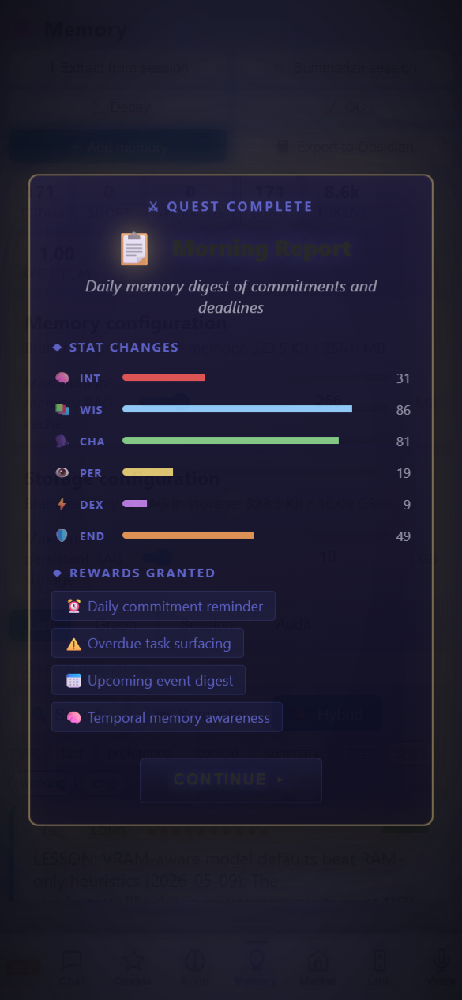

# Advanced Memory & RAG — HyDE, Reranking, Cognitive Axes & Memory Lifecycle

> **TerranSoul v0.1** · Last updated: 2026-05-07
>
> Related: [Brain + RAG Setup](brain-rag-setup-tutorial.md) ·
> [Folder to Knowledge Graph](folder-to-knowledge-graph-tutorial.md) ·
> Architecture: [`docs/brain-advanced-design.md`](../docs/brain-advanced-design.md)

TerranSoul's memory system goes far beyond simple chat history. This
tutorial covers the full RAG pipeline (RRF fusion, HyDE, cross-encoder
reranking), cognitive memory classification, temporal queries, conflict
resolution, decay/eviction, and the memory audit/provenance system.

---

## Table of Contents

1. [The RAG Pipeline (What Happens on Every Message)](#1-the-rag-pipeline-what-happens-on-every-message)
2. [Tuning RAG Settings](#2-tuning-rag-settings)
3. [Cognitive Memory Axes](#3-cognitive-memory-axes)
4. [Auto-Learn Policy](#4-auto-learn-policy)
5. [Memory Conflict Resolution](#5-memory-conflict-resolution)
6. [Temporal Queries (Time-Scoped Search)](#6-temporal-queries-time-scoped-search)
7. [Decay, Eviction & Garbage Collection](#7-decay-eviction--garbage-collection)
8. [Memory Audit & Provenance](#8-memory-audit--provenance)
9. [Session Reflection (`/reflect`)](#9-session-reflection-reflect)
10. [Troubleshooting](#10-troubleshooting)

---

## Requirements

| Requirement | Notes |
|---|---|
| **Brain configured** | Any mode (free cloud, paid, or local Ollama) |
| **Some memories stored** | Ingest a document or chat enough for auto-learn to create entries |

---

## 1. The RAG Pipeline (What Happens on Every Message)

Every time you send a message, TerranSoul runs a multi-stage retrieval pipeline:

### Stage 1: RRF Fusion (Always Active)

Three independent rankings are computed and fused using **Reciprocal Rank Fusion** (k=60):

| Ranking | Signal | What It Measures |
|---------|--------|------------------|
| **Vector** | Cosine similarity | Semantic closeness between your query embedding and stored embeddings |
| **Keyword** | Content + tag word hits | Exact word overlap (words > 2 chars) |
| **Freshness** | Composite score | `recency × importance × decay_score × tier_boost` |

The formula: `RRF(doc) = Σ 1/(60 + rank_i(doc))` across all rankings.

> **Key insight:** RRF works even when some signals are missing. If no embeddings exist yet, vector ranking is skipped gracefully.

### Stage 2: Intent-Aware Boost (Automatic)

Your query is classified by intent, and matching memories get a boost:

| Query Intent | Boosted Cognitive Kind |
|---|---|
| Procedural ("how do I...") | Procedural memories |
| Episodic ("what happened when...") | Episodic memories |
| Factual ("what is...") | Semantic memories |
| Unknown | No boost (equal treatment) |

### Stage 3: HyDE — Hypothetical Document Embeddings (Automatic for Abstract Queries)

For cold/abstract queries that poorly match stored document style:

1. The LLM generates a **hypothetical answer** (1–3 sentences).
2. That hypothetical answer is **embedded** instead of your raw query.
3. The resulting embedding better matches the writing style of stored documents.

**When HyDE activates:** Short queries, questions with no exact keyword matches, abstract/philosophical questions.

**Example:**
- Query: "What's the team's deployment process?"
- HyDE hypothetical: "The team deploys by bumping version, creating a git tag, pushing to main, and the CI pipeline handles the rest."
- The hypothetical's embedding matches stored procedural memories much better than the raw question.

### Stage 4: Cross-Encoder Reranker (Default On)

After initial retrieval, an LLM-as-judge scores each candidate:

1. Each `(query, document)` pair is sent to the active brain.
2. The LLM rates relevance on a 0–10 scale:
   - 0 = unrelated
   - 3 = mentions topic
   - 6 = partially answers
   - 8 = answers most of it
   - 10 = perfect answer
3. Documents scoring below the **threshold** (default: 0.55 normalized) are pruned.
4. Remaining documents are reordered by score.

### Stage 5: Injection

Top-k surviving memories are injected into the system prompt as `[LONG-TERM MEMORY]` blocks.

---

## 2. Tuning RAG Settings

Open **Settings → Brain** to adjust:

| Setting | Default | Effect |
|---------|---------|--------|
| **Relevance Threshold** | 0.30 | Minimum score for a memory to be injected (lower = more context, possibly noisier) |
| **Web Search Enabled** | Off | CRAG fallback — if retrieval quality is low, search the web |

### When to Adjust

- **Getting irrelevant memories in responses:** Raise the threshold to 0.50–0.70.
- **Missing context that should be found:** Lower threshold to 0.15–0.25.
- **Brand new knowledge base:** Keep threshold low until enough memories exist for good discrimination.

---

## 3. Cognitive Memory Axes

Every memory is automatically classified into one of four **cognitive kinds**:

| Kind | Description | Examples |
|------|-------------|----------|
| **Episodic** | Time/place-anchored experiences | "On April 22nd Alex finished the refactor" |
| **Semantic** | Stable knowledge, preferences, facts | "Rust uses ownership for memory safety" |
| **Procedural** | How-to knowledge, workflows, routines | "Deploy steps: bump → tag → push → CI" |
| **Judgment** | Rules, policies, value judgments | "Always prefer MIT license for libraries" |

### How Classification Works

1. **Explicit tag override** — Add `episodic`, `semantic`, `procedural`, or `judgment` as a tag.
2. **Memory type hint** — `Summary` → Episodic, `Preference` → Semantic.
3. **Content heuristics** — Words like "yesterday," "last week," "happened" → Episodic. "How to," "steps to," "procedure" → Procedural.
4. **Default** → Semantic.

### Why It Matters

- The **intent-aware search** boosts memories whose cognitive kind matches your query intent.
- The **wiki audit** groups memories by kind for better curation.
- The **hive federation** can set different sharing defaults per kind (e.g., procedural=paired, episodic=private).

---

## 4. Auto-Learn Policy

TerranSoul automatically extracts memories from conversations:

1. After each conversation, the brain identifies noteworthy facts, preferences, and experiences.
2. Extracted memories are stored in the `long` tier with appropriate cognitive kind.
3. Duplicate detection (cosine similarity ≥ 0.85) prevents redundant entries.

### What Gets Auto-Learned

- Stated preferences ("I prefer dark mode")
- Factual statements ("The project uses Rust")
- Significant events ("We shipped v2 today")
- Procedures explained ("To deploy, first bump the version...")

### What Doesn't Get Auto-Learned

- Casual chitchat without informational content
- Questions (queries don't become memories)
- Content below the importance threshold

---

## 5. Memory Conflict Resolution

When a new memory contradicts an existing one:

1. **Detection:** Cosine similarity ≥ 0.85 between new and existing memory triggers LLM-based contradiction check.
2. **Conflict created:** Both memories are flagged with status `Open`.
3. **Resolution options:**
   - **View conflicts:** Open the Memory tab → Conflicts section.
   - **Pick a winner:** Click "Keep This" on the correct memory. The loser gets soft-closed (`valid_to` set) but is never deleted.
   - **Dismiss:** Mark as "not a real conflict" if both are valid.

**Example:**
- Memory A: "Deploy uses Jenkins CI"
- Memory B (new): "We migrated to GitHub Actions for deployment"
- → Conflict detected. User picks Memory B as winner. Memory A is archived with a timestamp.

---

## 6. Temporal Queries (Time-Scoped Search)

TerranSoul understands natural-language time expressions in searches:

| Query Pattern | Interpretation |
|---|---|
| "last 3 days" | Memories from the past 72 hours |
| "last week" | Past 7 days |
| "today" / "yesterday" | UTC day boundaries |
| "since 2026-04-01" | Everything after April 1st |
| "before 2026-03-15" | Everything before March 15th |
| "between 2026-01-01 and 2026-03-31" | Q1 2026 only |

Use these in chat naturally: *"What did we discuss last week about deployments?"*

---

## 7. Decay, Eviction & Garbage Collection

### Decay (Gradual Forgetting)

Long-term memories decay over time if not accessed:

- **Formula:** `new_decay = current × 0.95^((hours_since_access / 168) × multiplier)`
- **Category multipliers:**
  - Personal memories: 0.5× (decay slower — more durable)
  - Tool/temporary: 1.5× (decay faster)
  - Default: 1.0×
- **Access resets decay:** Every time a memory is retrieved (used in RAG), its decay score resets.
- **Floor:** Never drops below 0.01.

### Capacity Eviction

When memories exceed the cap (default: 1,000,000):

1. Target: reduce to 95% of cap (950,000).
2. **Never evicted:** importance ≥ 4, protected flag, working/short tier.
3. **Eviction order:** Lowest `(importance + decay_score)` first, oldest as tiebreaker.
4. **Audit log:** Every eviction is logged to `eviction_log.jsonl`.

### Garbage Collection

Manually trigger GC to remove fully-decayed memories:

- Memories with `decay_score ≤ 0.01` are eligible.
- Run from Settings → Brain → Advanced → "Run Garbage Collection".

---

## 8. Memory Audit & Provenance

### Audit Tab

Open **Brain View → Wiki Panel → Audit tab** to see:

- **Total memories** and **live edges** count
- **Conflicts** (open contradictions)
- **Orphans** (memories with no edges — isolated knowledge)
- **Stale** (memories not accessed in a long time)
- **Embedding queue** (pending vectors)

### Provenance View

Click any memory → **Audit** tab to see its full history:

- **Current content** — live version
- **Version history** — all previous edits (non-destructive)
- **Connected edges** — what it links to and why
- **Direction labels** — whether it's a source or target of each edge
- **Neighboring summaries** — compact view of connected memories

---

## 9. Session Reflection (`/reflect`)

After a productive conversation, type `/reflect` to trigger session reflection:

1. The brain reviews the current conversation.
2. It extracts key facts, decisions, and learnings.
3. New memories are created from the reflection.
4. You see a summary of what was stored.

**Use this when:** You've discussed important topics and want to ensure key points are remembered.

---

## 10. Troubleshooting

| Problem | Solution |
|---------|----------|
| RAG not finding relevant memories | Lower relevance_threshold in Settings → Brain. Check if embeddings exist (Audit tab → embedding queue should be 0). |
| Too many irrelevant results | Raise relevance_threshold to 0.50+. The reranker should filter, but threshold is the final gate. |
| Conflicts not being detected | Requires an active brain for LLM contradiction check. Only triggers on high cosine similarity (≥ 0.85). |
| Decay happening too fast | Tag important memories with `personal:*` prefix for 0.5× decay rate. Or set higher importance. |
| Memory not found in temporal query | Check date format. Use ISO format (YYYY-MM-DD) for exact dates. |

---

## Where to Go Next

- **[Knowledge Wiki](knowledge-wiki-tutorial.md)** — Use wiki commands for memory curation and graph exploration
- **[Folder to Knowledge Graph](folder-to-knowledge-graph-tutorial.md)** — Bulk-import documents into the memory system
- **[Device Sync & Hive](device-sync-hive-tutorial.md)** — Share memories across devices with privacy controls
