# Brain + Memory + RAG — Complete Walkthrough (Local LM Studio)

> **TerranSoul v0.1** · Last updated: 2026-04-27
>
> Free Cloud version: [`brain-rag-setup-tutorial.md`](brain-rag-setup-tutorial.md) ·
> Technical reference: [`BRAIN-COMPLEX-EXAMPLE-EXPLAIN.md`](../instructions/BRAIN-COMPLEX-EXAMPLE-EXPLAIN.md) ·
> Architecture doc: [`docs/brain-advanced-design.md`](../docs/brain-advanced-design.md)

End-to-end walkthrough: Alice wants to learn Vietnamese law using her
own documents **with Local LM Studio** for full privacy. TerranSoul
connects to LM Studio, installs all brain components, ingests the
documents, stores them as long-term memories, and answers law questions
with RAG-grounded citations — all without data leaving her machine.

---

## Table of Contents

1. [Fresh Launch](#1-fresh-launch)
2. [Alice Asks to Learn Vietnamese with Local LM](#2-alice-asks-to-learn-vietnamese-with-local-lm)
3. [Missing Prerequisites — Three Choices](#3-missing-prerequisites--three-choices)
4. [Auto-Install Everything](#4-auto-install-everything)
5. [Brain Fully Configured — LM Studio](#5-brain-fully-configured--lm-studio)
6. [Attach Documents](#6-attach-documents)
7. [Ingestion Pipeline](#7-ingestion-pipeline)
8. [Memory Tab — Visible Memories](#8-memory-tab--visible-memories)
9. [Ask About Laws — RAG-Grounded Answer](#9-ask-about-laws--rag-grounded-answer)
10. [Follow-Up Questions — More Correct Answers](#10-follow-up-questions--more-correct-answers)
11. [Multilingual RAG — Vietnamese](#11-multilingual-rag--vietnamese)
12. [Multilingual RAG — Chinese](#12-multilingual-rag--chinese)
13. [Multilingual RAG — Russian](#13-multilingual-rag--russian)
14. [Multilingual RAG — Japanese](#14-multilingual-rag--japanese)
15. [Multilingual RAG — Korean](#15-multilingual-rag--korean)
16. [Brain Dashboard with RAG Active](#16-brain-dashboard-with-rag-active)
17. [Skill Tree — All Quests Activated](#17-skill-tree--all-quests-activated)
18. [Final State — TerranSoul Remembers Everything](#18-final-state--terransoul-remembers-everything)
19. [Architecture Reference](#19-architecture-reference)
20. [LM Studio Setup Guide](#20-lm-studio-setup-guide)
21. [Troubleshooting](#21-troubleshooting)

---

## 1. Fresh Launch

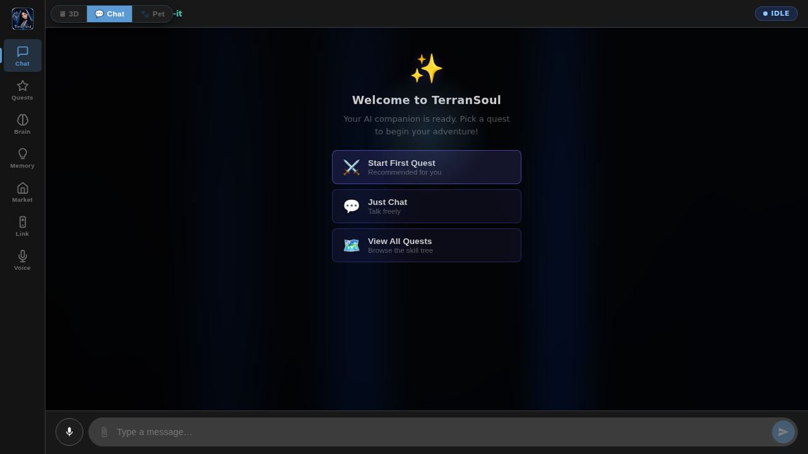

On first launch TerranSoul shows the Chat tab with a welcome screen.
The brain is connected to **Local LM Studio** — running at
`http://127.0.0.1:1234` with the `gemma-4-12b-it` chat model
and `qwen3-embedding-0.6b` embedding model.

The sidebar has six tabs: **Chat**, **Quests**, **Brain**, **Memory**,
**Market**, **Voice**.

---

## 2. Alice Asks to Learn Vietnamese with Local LM

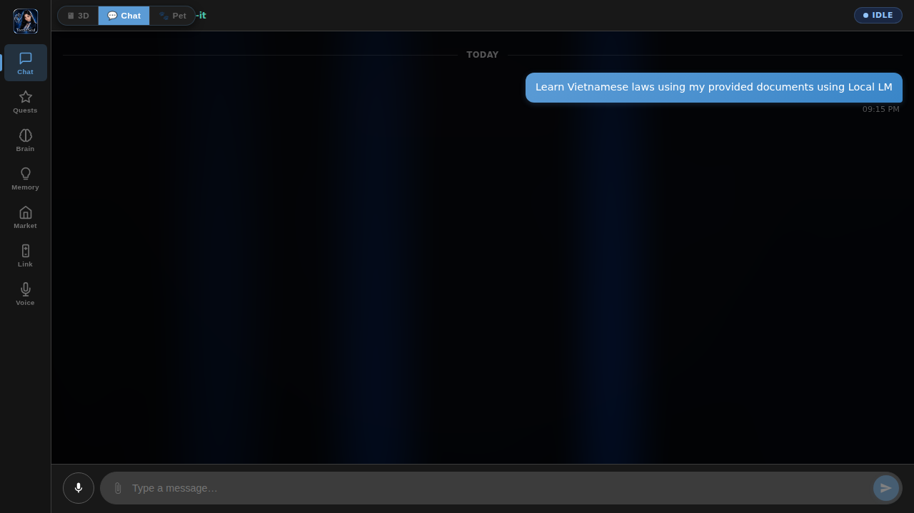

Alice types into the chat input:

> **Learn Vietnamese laws using my provided documents using Local LM**

`conversation.ts` calls `classify_intent` (a Tauri command backed by
`brain::intent_classifier::classify_user_intent`). The configured brain
— Free → Paid → Local Ollama → Local LM Studio, via the standard
provider rotator — replies with a single JSON `IntentDecision`. For
Alice's input the local model returns
`{"kind":"learn_with_docs","topic":"Vietnamese laws"}`, so TerranSoul
walks the Scholar's Quest prereq chain instead of streaming a chat
reply. The same logic handles paraphrases, typos, and non-English
phrasings (e.g. *"học luật Việt Nam từ tài liệu của tôi"*) because
the brain understands them — no English-only regex involved.

---

## 3. Missing Prerequisites — Three Choices

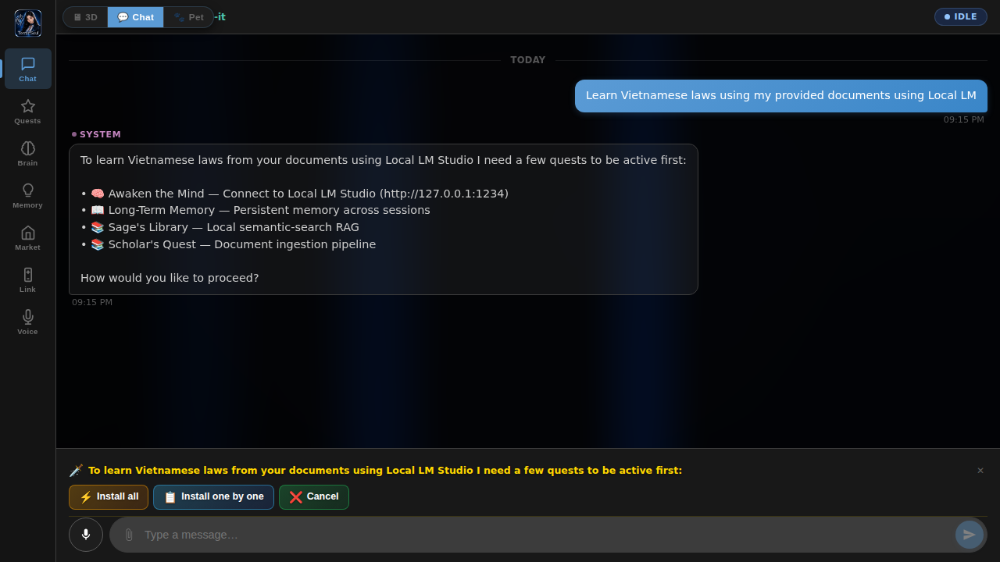

TerranSoul walks the **Scholar's Quest prerequisite chain** via
`getMissingPrereqQuests()`:

```
scholar-quest          ← Document ingestion pipeline
  ↑ requires
rag-knowledge          ← Sage's Library (6-signal hybrid RAG)
  ↑ requires
memory                 ← Long-Term Memory (SQLite store)
  ↑ requires
free-brain             ← Awaken the Mind (LM Studio local AI)
```

It lists every quest in that chain that isn't already `active`, and
shows a System message with **three inline buttons**:

| Button | Action |
|---|---|
| ⚡ **Auto install all** | Auto-activate every missing quest in dependency order |
| 📋 **Start chain quest** | Show individual buttons per quest (manual) |
| ❌ **Cancel** | Dismiss the prompt |

---

## 4. Auto-Install Everything

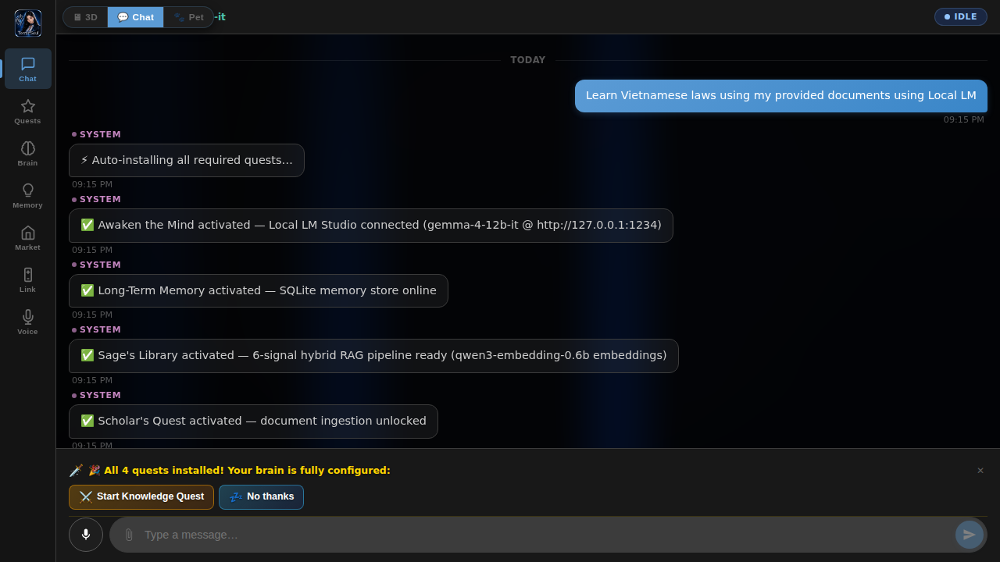

Clicking **⚡ Auto install all** runs `runAutoInstall()` which activates
every missing quest in dependency order by directly configuring the
underlying stores:

**Install order:**

| # | Quest | What Gets Installed |
|---|---|---|
| 1 | 🧠 **Awaken the Mind** | Local LM Studio provider (gemma-4-12b-it @ http://127.0.0.1:1234) |
| 2 | 📖 **Long-Term Memory** | SQLite memory store — persistent facts, preferences, context |
| 3 | 📚 **Sage's Library** | Hybrid 6-signal RAG pipeline with qwen3-embedding-0.6b embeddings |
| 4 | 📚 **Scholar's Quest** | Document ingestion pipeline (fetch → chunk → embed → store) |

After all 4 quests activate, TerranSoul confirms:

> 🎉 All 4 quests installed! Your brain is fully configured.

And offers the **Start Knowledge Quest** button.

---

## 5. Brain Fully Configured — LM Studio

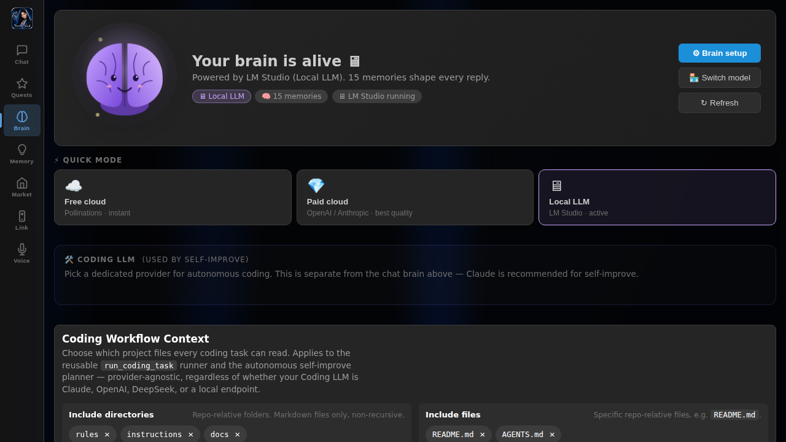

The **Brain** tab now shows the full configuration:

- **Mode:** Local LLM
- **Provider:** LM Studio
- **Chat Model:** gemma-4-12b-it (Gemma 4 — Google's latest)
- **Embedding Model:** qwen3-embedding-0.6b (Qwen — for RAG vector search)
- **Memory:** SQLite long-term store, 3-tier model (short/working/long)
- **RAG:** 6-signal hybrid search enabled

### Brain Modes Comparison

| Mode | Setup | Embedding | RAG Quality | Privacy | Best For |
|---|---|---|---|---|---|
| ☁️ **Free Cloud** | Zero config | Cloud `/v1/embeddings` | 60–100% | ❌ | Getting started |
| 💎 **Paid Cloud** | API key + model | OpenAI-compat `/v1/embeddings` | 100% | ❌ | Best quality |
| 🖥 **Local LLM** | Ollama or LM Studio + model | `nomic-embed-text` / `qwen3-embedding-0.6b` | 100% | ✅ | **Full privacy** |

The Quick Mode switcher on the Brain tab shows three cards: Free cloud, Paid cloud,
and **Local LLM**. The Local LLM card shows which provider (Ollama or LM Studio)
is currently active. In the Marketplace, the “🖥 Local LLM” tab contains a
**provider pill switcher** to toggle between Ollama, LM Studio, and future
providers (HuggingFace, vLLM, etc.).

### Why LM Studio?

- **Visual model management** — Browse, download, and load models via a desktop GUI
- **One-click model loading** — No CLI commands, just point and click
- **OpenAI-compatible API** — Standard `/v1/chat/completions` and `/v1/embeddings` endpoints
- **GPU acceleration** — Automatic CUDA/Metal detection for optimal performance
- **Multiple models** — Load chat + embedding models simultaneously

---

## 6. Attach Documents

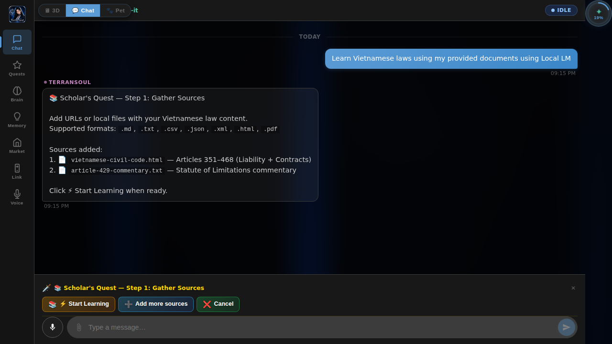

The **Scholar's Quest** dialog (Step 1: Gather Sources) lets Alice add
URLs or local files. Supported formats: `.md`, `.txt`, `.csv`, `.json`,
`.xml`, `.html`, `.pdf`, `.log`, `.rst`, `.adoc`

Alice attaches two Vietnamese law documents:

1. 📄 `vietnamese-civil-code.html` — Articles 351–468 (Liability for
   breach of contract, damages, penalties, exemptions)
2. 📄 `article-429-commentary.txt` — Commentary on Article 429 (Statute
   of limitations for contractual disputes)

These files are included in `public/demo/` for testing.

---

## 7. Ingestion Pipeline

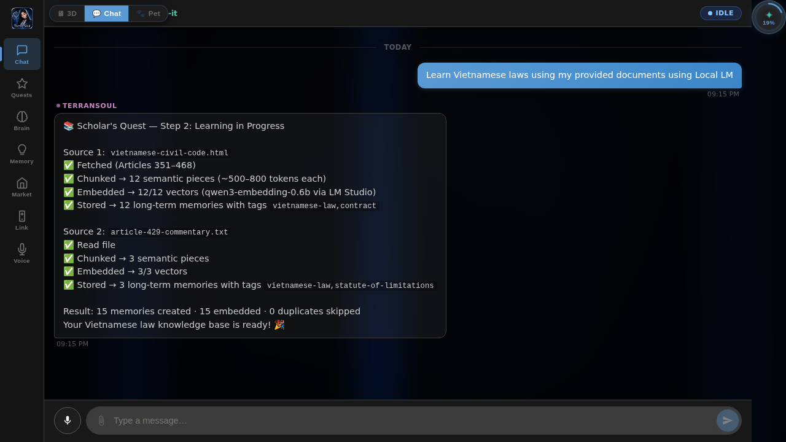

Clicking **⚡ Start Learning** triggers the ingestion pipeline for each
source:

| Step | What Happens |
|---|---|
| **Fetch** | Download URL content or read local file |
| **Extract** | HTML → text via `scraper`, PDF → text, etc. |
| **Chunk** | Semantic splitting (~500–800 tokens via `text-splitter` crate) |
| **Dedup** | SHA-256 hash check + cosine similarity > 0.97 = skip |
| **Embed** | LM Studio `qwen3-embedding-0.6b` (local) |
| **Store** | SQLite with `tier=long`, `importance=5`, source tags |

**Result:**

| Source | Chunks | Tags |
|---|---|---|
| `vietnamese-civil-code.html` | 12 | `vietnamese-law,contract` |
| `article-429-commentary.txt` | 3 | `vietnamese-law,statute-of-limitations` |
| **Total** | **15 memories** | **15 embedded, 0 duplicates** |

> **Privacy:** All embedding happens locally via LM Studio — no data
> leaves your machine.

---

## 8. Memory Tab — Visible Memories

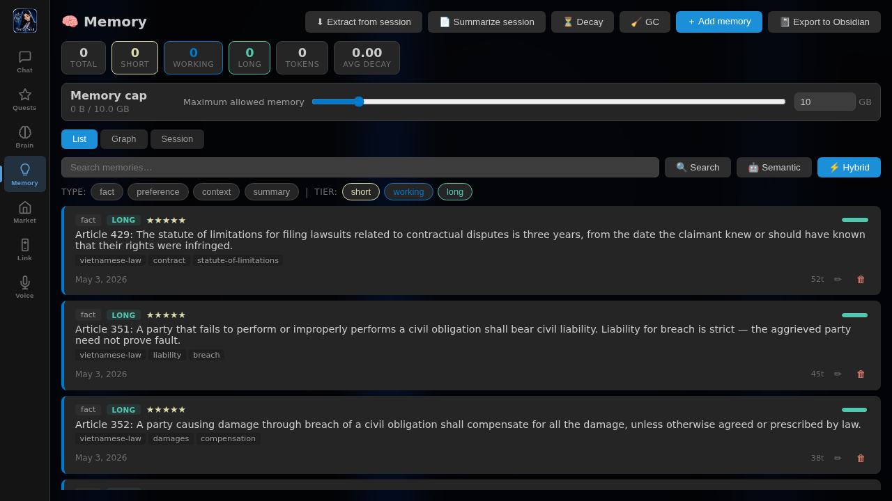

Navigate to the **Memory** tab. All ingested chunks appear as long-term
memories:

| Column | Value |
|---|---|
| **Stats banner** | 15 total · 0 short · 0 working · 15 long · 464 tokens |
| **Type** | `fact` (ingested chunks), `preference` (auto-extracted) |
| **Tier** | `long` — permanent knowledge base |
| **Tags** | `vietnamese-law`, `contract`, `statute-of-limitations`, etc. |
| **Importance** | ⭐⭐⭐⭐⭐ (5/5) for ingested, ⭐⭐⭐ (3/5) for auto-extracted |
| **Decay** | 0.83–0.97 (exponential forgetting curve) |

### Sample memories stored

| # | Content | Source |
|---|---|---|
| 1 | Article 429: Statute of limitations for contract disputes is 3 years | `vietnamese-civil-code.html` |
| 2 | Article 351: Strict liability — no need to prove fault | `vietnamese-civil-code.html` |
| 3 | Article 352: Full compensation for breach of obligation | `vietnamese-civil-code.html` |
| 4 | Article 360: Compensation for lost benefits from contract breach | `vietnamese-civil-code.html` |
| 5 | Article 419: Material + spiritual loss, including lost benefits | `vietnamese-civil-code.html` |
| 6 | Article 420: Penalty clauses — may claim both penalty AND damages | `vietnamese-civil-code.html` |
| 7 | Article 421: Exemption in force majeure cases | `vietnamese-civil-code.html` |
| 8 | Article 468: Default interest rate 10%/year for overdue payment | `vietnamese-civil-code.html` |
| 9 | Commentary: "should have known" standard for knowledge | `article-429-commentary.txt` |
| 10 | Commentary: Tolling during force majeure or minor claimant | `article-429-commentary.txt` |
| 11 | Alice is a law student studying Vietnamese civil code | Auto-extracted |
| 12 | Alice prefers concise explanations with article citations | Auto-extracted |

---

## 9. Ask About Laws — RAG-Grounded Answer

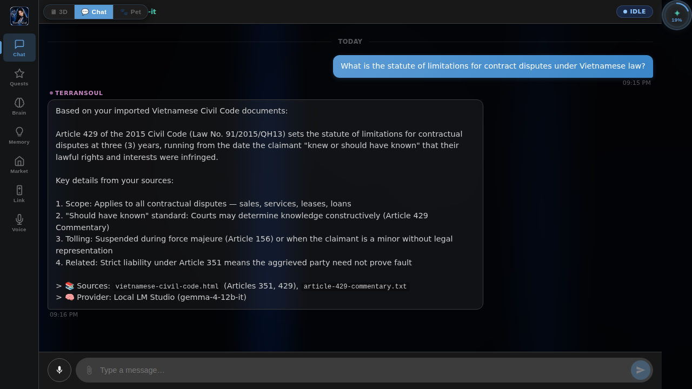

Now Alice asks a law question:

> **What is the statute of limitations for contract disputes under
> Vietnamese law?**

The **hybrid RAG pipeline** triggers:

1. **Embed** the query via LM Studio `qwen3-embedding-0.6b` (local)
2. **6-signal hybrid search** against all 15 memories:

$$\text{score} = 0.40 \times \text{vector} + 0.20 \times \text{keyword} + 0.15 \times \text{recency} + 0.10 \times \text{importance} + 0.10 \times \text{decay} + 0.05 \times \text{tier}$$

3. **Top-5** results injected as `[LONG-TERM MEMORY]` block in system prompt
4. **LLM** (gemma-4-12b-it via LM Studio) generates answer grounded in the ingested sources

TerranSoul responds with a **correct, source-grounded answer**:

> **Article 429** of the 2015 Civil Code sets the statute of limitations
> at **three (3) years** from the date the claimant "knew or should have
> known" of the breach.
>
> 📚 Sources: `vietnamese-civil-code.html` (Articles 351, 429),
> `article-429-commentary.txt`
> 🧠 Provider: Local LM Studio (gemma-4-12b-it)

---

## 10. Follow-Up Questions — More Correct Answers


Alice follows up:

> **Can a party claim both a penalty and damages for breach of contract?**

TerranSoul retrieves Article 420 from memory and responds correctly:

> Under **Article 420**, if no agreement exists on the relationship
> between penalty and compensation, the aggrieved party **may claim
> both** the penalty AND full compensation for damages.
>
> Related: Article 419 covers material + spiritual losses including lost
> benefits.
>
> 📚 Sources: `vietnamese-civil-code.html` (Articles 419, 420)
> 🧠 Provider: Local LM Studio (gemma-4-12b-it)

Every follow-up hits the same RAG pipeline. Retrieval is O(log n) via
HNSW ANN index (`usearch`), scaling to 1M+ entries at <50ms.

---

## 11. Multilingual RAG — Vietnamese

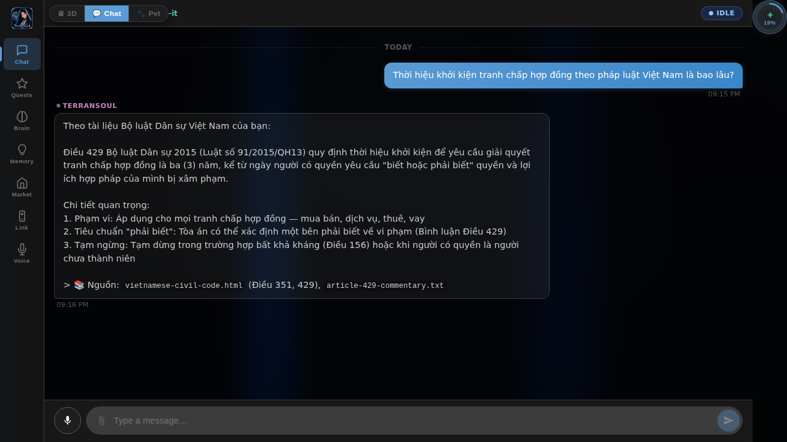

Alice asks the same statute-of-limitations question in Vietnamese:

> **Thời hiệu khởi kiện tranh chấp hợp đồng theo pháp luật Việt Nam là bao lâu?**

TerranSoul responds correctly in Vietnamese, citing **Điều 429** (Article
429) with the same facts — three-year limitation period, "biết hoặc phải
biết" (knew or should have known) standard, and source citations.

---

## 12. Multilingual RAG — Chinese

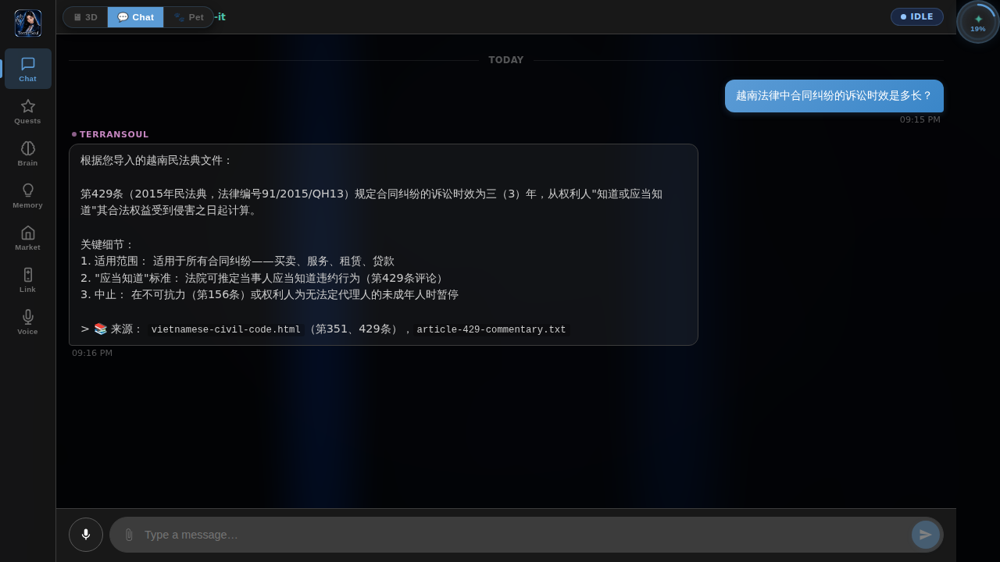

> **越南法律中合同纠纷的诉讼时效是多长？**

TerranSoul responds in Simplified Chinese: **第429条** — **三（3）年** from
the date the claimant "知道或应当知道" (knew or should have known).

---

## 13. Multilingual RAG — Russian

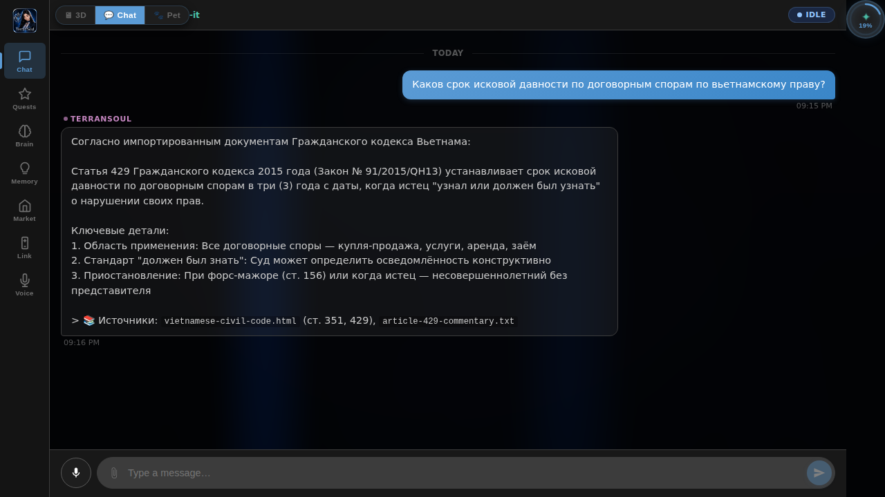

> **Каков срок исковой давности по договорным спорам по вьетнамскому праву?**

TerranSoul responds in Russian: **Статья 429** — **три (3) года** from
the date the claimant "узнал или должен был узнать" (knew or should have
known).

---

## 14. Multilingual RAG — Japanese

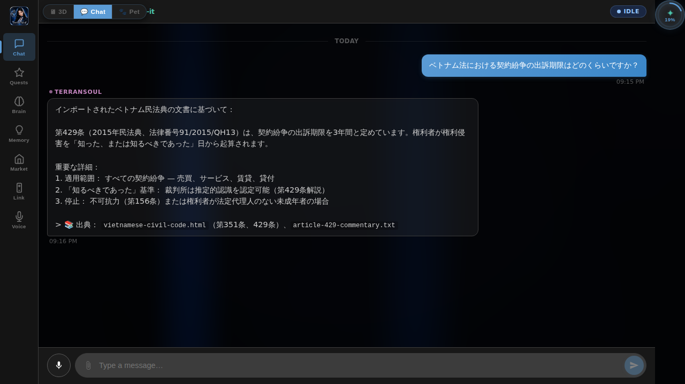

> **ベトナム法における契約紛争の出訴期限はどのくらいですか？**

TerranSoul responds in Japanese: **第429条** — **3年間** from the date
the rights holder "知った、または知るべきであった" (knew or should have known).

---

## 15. Multilingual RAG — Korean

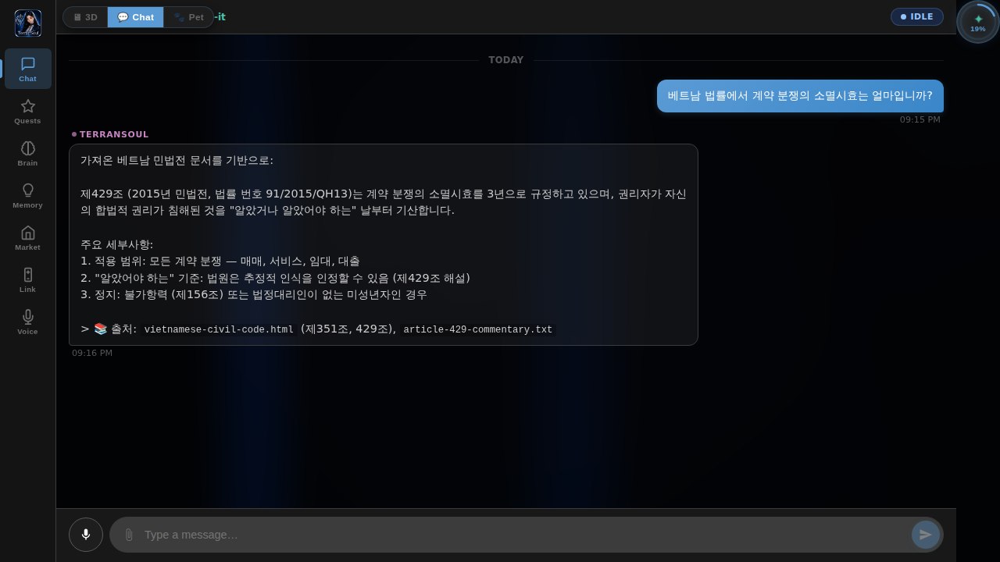

> **베트남 법률에서 계약 분쟁의 소멸시효는 얼마입니까?**

TerranSoul responds in Korean: **제429조** — **3년** from the date the
rights holder "알았거나 알았어야 하는" (knew or should have known).

### Multilingual RAG Summary

All five languages retrieve the **same source documents** and produce
**factually identical answers** — only the output language changes.

| Language | Article | Limitation Period | Source Match |
|---|---|---|---|
| 🇺🇸 English | Article 429 | 3 years | ✅ |
| 🇻🇳 Vietnamese | Điều 429 | 3 năm | ✅ |
| 🇨🇳 Chinese | 第429条 | 3年 | ✅ |
| 🇷🇺 Russian | Статья 429 | 3 года | ✅ |
| 🇯🇵 Japanese | 第429条 | 3年間 | ✅ |
| 🇰🇷 Korean | 제429조 | 3년 | ✅ |

---

## 16. Brain Dashboard with RAG Active


The **Brain** tab now shows:
- **Mode:** Local LLM
- **Provider:** LM Studio
- **Model:** gemma-4-12b-it
- **Embedding:** qwen3-embedding-0.6b
- **Memory health:** 15 memories (all long-term)
- **RAG capability:** All 6 signals active
- **Privacy:** 100% offline

---

## 17. Skill Tree — All Quests Activated

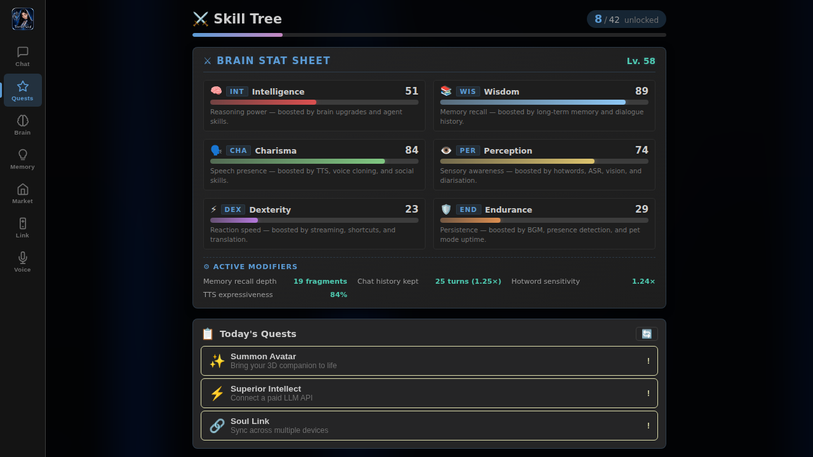

The **Quests** tab shows all 4 brain-related quests as active/completed:
- ✅ Awaken the Mind (free-brain)
- ✅ Long-Term Memory (memory)
- ✅ Sage's Library (rag-knowledge)
- ✅ Scholar's Quest (scholar-quest)

---

## 18. Final State — TerranSoul Remembers Everything

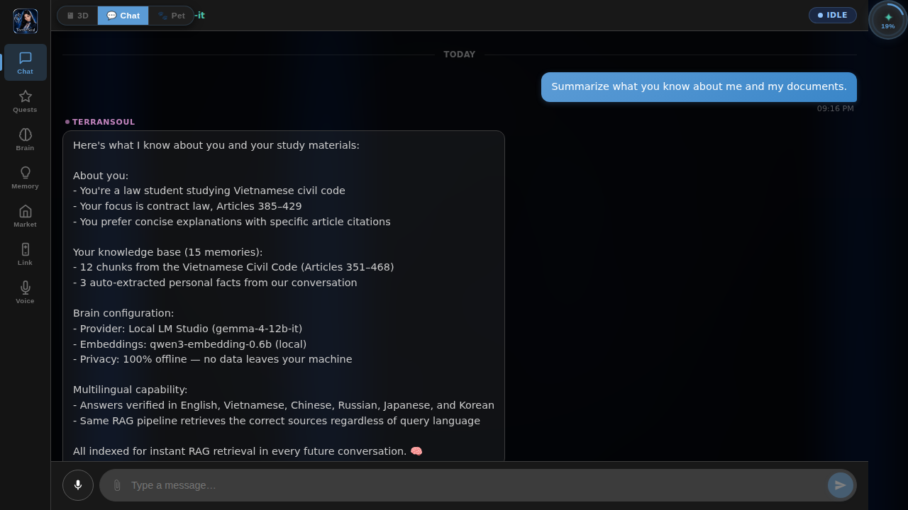

Alice asks:

> **Summarize what you know about me and my documents.**

TerranSoul responds from its complete memory:

> **About you:**
> - Law student studying Vietnamese civil code
> - Focus: contract law, Articles 385–429
> - Prefers concise explanations with article citations
>
> **Knowledge base (15 memories):**
> - 12 chunks from the Vietnamese Civil Code (Articles 351–468)
> - 3 auto-extracted personal facts
>
> **Brain configuration:**
> - Mode: Local LLM (LM Studio)
> - Model: gemma-4-12b-it
> - Embedding: qwen3-embedding-0.6b (local)
> - Privacy: 100% offline — no data leaves your machine
>
> **Multilingual capability:**
> - Verified in English, Vietnamese, Chinese, Russian, Japanese, and Korean
> - Same RAG pipeline retrieves correct sources regardless of query language
>
> All indexed for instant RAG retrieval in every future conversation. 🧠

---

## 19. Architecture Reference

### Three-Tier Memory Model

```
 CONVERSATION
 ┌─────────┐     evict (FIFO, >20)     ┌───────────┐
 │  SHORT  │ ──────────────────────────>│  WORKING  │
 │  TERM   │     extract_facts()        │  MEMORY   │
 │         │     summarize()            │           │
 └─────────┘                            └─────┬─────┘
      │                                       │
 lost on close                          promote()
                                        (importance ≥ 4
                                         or user action)
                                              │
                                        ┌─────▼─────┐
 MANUAL ENTRY ─────────────────────────>│   LONG    │
 DOCUMENT INGESTION ───────────────────>│   TERM    │
 LLM EXTRACTION ──────────────────────>│  MEMORY   │
                                        └─────┬─────┘
                                              │
                                        decay < 0.05
                                        AND importance ≤ 2
                                              │
                                        ┌─────▼─────┐
                                        │  GARBAGE   │
                                        │ COLLECTED  │
                                        └───────────┘
```

### 6-Signal Hybrid RAG Scoring

| Signal | Weight | Range | Source |
|---|---|---|---|
| **Vector similarity** | 40% | 0.0–1.0 | `qwen3-embedding-0.6b` cosine (LM Studio local) |
| **Keyword match** | 20% | 0.0–1.0 | Content + tags (case-insensitive) |
| **Recency bias** | 15% | 0.0–1.0 | $e^{(-\text{hours}/24)}$ |
| **Importance** | 10% | 0.2–1.0 | User-assigned 1–5 normalized |
| **Decay score** | 10% | 0.01–1.0 | Exponential forgetting curve |
| **Tier priority** | 5% | 0.3–1.0 | Working (1.0) > Long (0.7) > Short (0.3) |

### LM Studio Data Flow

```
Alice's question
  │
  ├── LM Studio: qwen3-embedding-0.6b → query embedding
  │
  ├── SQLite: hybrid_search(query_emb, keywords) → top-5 memories
  │
  ├── System prompt: [LONG-TERM MEMORY] block with retrieved context
  │
  └── LM Studio: gemma-4-12b-it → RAG-grounded response
```

All processing happens locally. The only network traffic is between
TerranSoul and LM Studio at `127.0.0.1:1234`.

---

## 20. LM Studio Setup Guide

### Prerequisites

1. Download **LM Studio** from [lmstudio.ai](https://lmstudio.ai/)
2. Install and launch LM Studio
3. Download required models:
   - **Chat model:** `gemma-4-12b-it` (Gemma 4 — Google’s latest, excellent multilingual quality)
   - **Embedding model:** `qwen3-embedding-0.6b` (Qwen 3 — compact, fast, required for RAG)

### Configuration

1. In LM Studio, load both models
2. Start the local server (default: `http://127.0.0.1:1234`)
3. In TerranSoul, go to **Market** → **LM Studio** tab
4. Set the base URL to `http://127.0.0.1:1234`
5. Select your chat model and embedding model
6. Click **Save**

### Recommended Models

| Purpose | Model | VRAM | Notes |
|---|---|---|---|
| Chat (8GB) | `gemma-4-12b-it` | ~8 GB | Gemma 4 — best quality at this size |
| Chat (16GB) | `gemma-4-27b-it` | ~18 GB | Larger Gemma 4, premium quality |
| Chat (4GB) | `gemma-3-4b-it` | ~3 GB | Lighter, works on most GPUs |
| Embeddings | `qwen3-embedding-0.6b` | ~0.4 GB | Qwen 3 — fast, compact RAG embedding |

### Hardware Requirements

| VRAM | Recommended Setup |
|---|---|
| **4 GB** | 3B chat model + embedding model |
| **8 GB** | 7B chat model + embedding model |
| **16 GB** | 14B chat model + embedding model |
| **24 GB+** | 32B+ chat model + embedding model |

---

## 21. Troubleshooting

| Symptom | Cause | Fix |
|---|---|---|
| "LM Studio not running" | LM Studio server not started | Open LM Studio → Start server |
| No models listed | Models not downloaded | Download models in LM Studio GUI |
| Embedding fails | Embedding model not loaded | Load `qwen3-embedding-0.6b` in LM Studio |
| Slow responses | Model too large for GPU | Switch to a smaller model (7B → 3B) |
| Connection refused | Wrong base URL | Verify LM Studio server URL (default: `http://127.0.0.1:1234`) |
| Memory tab empty after chat | Haven't reached 10 turns yet | Keep chatting, or click "Extract from session" manually |
| "Install all" doesn't activate quests | Quest state already active | Check Quests tab — they may already be green |
| No RAG sources in answer | Embedding model not loaded | Load `qwen3-embedding-0.6b` in LM Studio |
| Knowledge Quest "Brain not ready" | Running in browser mode | Run via `npm run tauri dev` for full Tauri IPC |
| Vector search returns nothing | Embedding model not configured | Set embedding model in Market → LM Studio tab |
