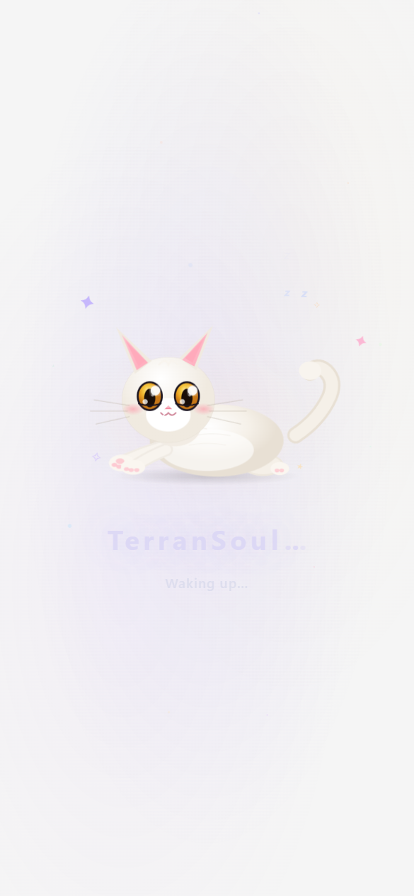
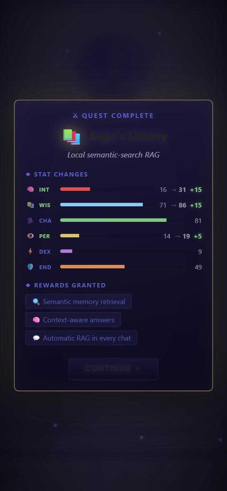
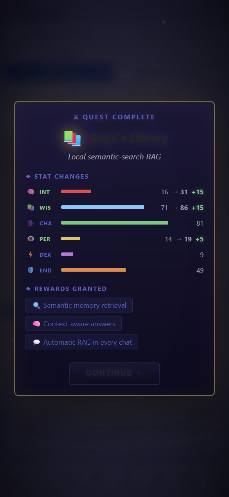

# Brain + Memory + RAG — Pet Mode Walkthrough

> **TerranSoul v0.1** · Last updated: 2026-05-09
>
> Technical reference: [`BRAIN-COMPLEX-EXAMPLE-EXPLAIN.md`](../instructions/BRAIN-COMPLEX-EXAMPLE-EXPLAIN.md) ·
> Architecture doc: [`docs/brain-advanced-design.md`](../docs/brain-advanced-design.md)

End-to-end walkthrough: set up TerranSoul's brain, memory, and RAG
pipeline entirely from **pet mode** — the transparent desktop overlay
where your VRM companion floats on top of your workspace.

---

## Table of Contents

1. [Launch & Enter Pet Mode](#1-launch--enter-pet-mode)
2. [Pet Mode Controls](#2-pet-mode-controls)
3. [Open the Chat Panel](#3-open-the-chat-panel)
4. [Configure the Brain — Auto-Install](#4-configure-the-brain--auto-install)
5. [Ingest Documents via Chat](#5-ingest-documents-via-chat)
6. [Ask Questions — RAG-Grounded Answers](#6-ask-questions--rag-grounded-answers)
7. [Follow-Up Questions](#7-follow-up-questions)
8. [Multilingual RAG](#8-multilingual-rag)
9. [Check Brain Status via Panels](#9-check-brain-status-via-panels)
10. [Check Memory via Panels](#10-check-memory-via-panels)
11. [Context Menu — Full Feature Tour](#11-context-menu--full-feature-tour)
12. [Slash Commands Reference](#12-slash-commands-reference)
13. [Architecture Reference](#13-architecture-reference)
14. [Troubleshooting](#14-troubleshooting)

---

## 1. Launch & Enter Pet Mode


Launch TerranSoul. The app opens in **desktop mode** with the Chat tab
and a welcome screen. The brain is already connected to a **Free cloud**
provider (Pollinations AI / OpenRouter) — zero configuration required.

The sidebar has six tabs: **Chat**, **Quests**, **Brain**, **Memory**,
**Market**, **Voice**.

Click the **🐾 Pet** toggle in the mode pill (top-right corner) to
switch to pet mode.


The app window becomes a **transparent always-on-top overlay** — the VRM
character floats directly on your desktop. You can see your other
applications through the transparent background.

On first entry, a **welcome tooltip** appears with interaction hints:

> - **Click** character to toggle chat
> - **Drag** to move
> - **Scroll wheel** to zoom in/out
> - **Hold click + scroll** to rotate
> - **Middle-click drag** to rotate
> - **Right-click** for menu (mood, settings…)

Click **Got it** to dismiss.

---

## 2. Pet Mode Controls

The VRM character is your primary interaction point. Everything happens
through direct interaction with the character:

| Action | Effect |
|---|---|
| **Left-click** | Toggle the floating chat panel |
| **Drag** | Move the character anywhere on screen |
| **Scroll wheel** | Zoom in/out |
| **Hold click + scroll** | Rotate camera |
| **Middle-click drag** | Rotate camera |
| **Right-click** | Open context menu |
| **Escape** | Exit pet mode → return to desktop mode |

The character responds with emotion bubbles — manga-style speech
balloons that show the current emotional state (💖 happy, 😢 sad, 😠
angry, 😌 relaxed, 😲 surprised).

---

## 3. Open the Chat Panel



**Click** the character to open the floating chat panel. It appears as a
manga-style speech bubble anchored near the character's head.

The chat panel includes:
- **Message history** with timestamps and date separators
- **Copy** button to copy chat history to clipboard
- **Paste** button to paste clipboard into input
- **Skip** button (visible during streaming/TTS) to stop current dialog
- **Close** button (×) to collapse the panel
- **Text input** with auto-resize and Enter-to-send

When the character responds, you'll see:
- Real-time **streaming text** as the LLM generates
- **Emotion bubbles** reflecting the response sentiment
- **Body animations** triggered by `<anim>` tags in the response
- **Voice playback** if TTS is configured

---

## 4. Configure the Brain — Auto-Install

*The quest system guides you through brain setup with inline action buttons.*

TerranSoul starts with the free cloud brain pre-configured. To unlock
the full RAG pipeline, the quest system guides you through setup.

In the pet chat, type:

> **Learn from my documents**

TerranSoul detects this as a document-learning intent and walks the
**Scholar's Quest prerequisite chain**:

```
scholar-quest          ← Document ingestion pipeline
  ↑ requires
rag-knowledge          ← Sage's Library (6-signal hybrid RAG)
  ↑ requires
memory                 ← Long-Term Memory (SQLite store)
  ↑ requires
free-brain             ← Awaken the Mind (Free cloud AI)
```

A system message appears with three inline buttons:

| Button | Action |
|---|---|
| ⚡ **Auto install all** | Activate every missing quest in order |
| 📋 **Start chain quest** | Show individual buttons per quest |
| ❌ **Cancel** | Dismiss |

Click **⚡ Auto install all**. TerranSoul activates all 4 quests:

| # | Quest | What Gets Installed |
|---|---|---|
| 1 | 🧠 **Awaken the Mind** | Free cloud LLM provider (auto-rotation) |
| 2 | 📖 **Long-Term Memory** | SQLite memory store — persistent facts |
| 3 | 📚 **Sage's Library** | Hybrid 6-signal RAG pipeline |
| 4 | 📚 **Scholar's Quest** | Document ingestion pipeline |

After all 4 activate, the companion confirms:

> 🎉 All 4 quests installed! Your brain is fully configured.

---

## 5. Ingest Documents via Chat

Pet mode supports document ingestion directly from the chat panel using
**slash commands**. No need to switch to desktop mode.

### Ingest a URL

Type in the pet chat:

```
/ingest https://example.com/vietnamese-civil-code.html
```

TerranSoul responds with the ingestion task:

> 📥 Ingesting url: https://example.com/vietnamese-civil-code.html
> Task: ingest-abc123

### Digest Text

Paste text directly into the brain:

```
/digest Article 429 of the 2015 Vietnamese Civil Code sets the statute
of limitations for contractual disputes at three (3) years from the date
the rights holder knew or should have known of the breach.
```

TerranSoul responds:

> ✅ Digested into memory #42.

### Digest a URL

The `/digest` command also accepts URLs:

```
/digest https://example.com/article-429-commentary.txt
```

> 📥 Ingesting url: https://example.com/article-429-commentary.txt
> Task: ingest-def456

### Ingestion Pipeline

Each source goes through the full pipeline (from
`brain-advanced-design.md` §7):

| Step | What Happens |
|---|---|
| **Fetch** | Download URL content or read local file |
| **Extract** | HTML → text via `scraper`, PDF → text, etc. |
| **Chunk** | Semantic splitting (~500–800 tokens via `text-splitter`) |
| **Dedup** | SHA-256 hash + cosine similarity > 0.97 = skip |
| **Embed** | Cloud `/v1/embeddings` or Ollama `nomic-embed-text` (768-dim) |
| **Store** | SQLite with `tier=long`, `importance=5`, source tags |

Supported formats: `.md`, `.txt`, `.csv`, `.json`, `.xml`, `.html`,
`.pdf`, `.log`, `.rst`, `.adoc`

---

## 6. Ask Questions — RAG-Grounded Answers

With documents ingested, ask questions in the pet chat:

> **What is the statute of limitations for contract disputes under
> Vietnamese law?**

The **hybrid RAG pipeline** triggers:

1. **Embed** the query via cloud `/v1/embeddings`
2. **6-signal hybrid search** against all memories:

$$\text{score} = 0.40 \times \text{vector} + 0.20 \times \text{keyword} + 0.15 \times \text{recency} + 0.10 \times \text{importance} + 0.10 \times \text{decay} + 0.05 \times \text{tier}$$

3. **Top-5** results injected as `[LONG-TERM MEMORY]` block
4. **LLM** generates answer grounded in ingested sources

TerranSoul responds with a correct, source-grounded answer:

> **Article 429** of the 2015 Civil Code sets the statute of limitations
> at **three (3) years** from the date the claimant "knew or should have
> known" of the breach.
>
> 📚 Sources: `vietnamese-civil-code.html`

---

## 7. Follow-Up Questions

Follow up naturally:

> **Can a party claim both a penalty and damages for breach of contract?**

TerranSoul retrieves the relevant articles from memory:

> Under **Article 420**, if no agreement exists on the relationship
> between penalty and compensation, the aggrieved party **may claim
> both** the penalty AND full compensation for damages.
>
> 📚 Sources: `vietnamese-civil-code.html` (Articles 419, 420)

Every question hits the same RAG pipeline. Retrieval is O(log n) via
HNSW ANN index (`usearch`), scaling to 1M+ entries at <50ms.

---

## 8. Multilingual RAG

Ask the same question in any language. The RAG pipeline retrieves the
same source documents and the LLM translates the grounded answer:

**Vietnamese:**
> Thời hiệu khởi kiện tranh chấp hợp đồng theo pháp luật Việt Nam là bao lâu?

**Chinese:**
> 越南法律中合同纠纷的诉讼时效是多长？

**Russian:**
> Каков срок исковой давности по договорным спорам по вьетнамскому праву?

**Japanese:**
> ベトナム法における契約紛争の出訴期限はどのくらいですか？

**Korean:**
> 베트남 법률에서 계약 분쟁의 소멸시효는 얼마입니까?

All five languages produce **factually identical answers** — only the
output language changes.

| Language | Article | Limitation Period | Source Match |
|---|---|---|---|
| 🇺🇸 English | Article 429 | 3 years | ✅ |
| 🇻🇳 Vietnamese | Điều 429 | 3 năm | ✅ |
| 🇨🇳 Chinese | 第429条 | 3年 | ✅ |
| 🇷🇺 Russian | Статья 429 | 3 года | ✅ |
| 🇯🇵 Japanese | 第429条 | 3年間 | ✅ |
| 🇰🇷 Korean | 제429조 | 3년 | ✅ |

---

## 9. Check Brain Status via Panels



**Right-click** the character → **Panels** → **🧠 Brain** to open the
Brain panel as a separate floating window.

The Brain panel shows:
- **Mode:** Free Cloud / Paid API / Local Ollama
- **Model:** Current LLM model name
- **Embedding:** Cloud `/v1/embeddings` or local `nomic-embed-text`
- **Memory health:** Total memories, tier breakdown
- **RAG:** 6-signal hybrid search status

### Brain Modes

| Mode | Setup | Embedding | RAG Quality | Best For |
|---|---|---|---|---|
| ☁️ **Free Cloud** | Zero config | Cloud `/v1/embeddings` | 60–100% | Getting started |
| 💎 **Paid Cloud** | API key + model | OpenAI `/v1/embeddings` | 100% | Best quality |
| 🖥 **Local LLM** | Ollama + model | `nomic-embed-text` | 100% | Full privacy |

---

## 10. Check Memory via Panels



**Right-click** → **Panels** → **💡 Memory** to open the Memory panel.

All ingested chunks appear as long-term memories:

| Column | Value |
|---|---|
| **Stats** | Total · Short · Working · Long · Tokens |
| **Type** | `fact` (ingested), `preference` (auto-extracted) |
| **Tier** | `long` — permanent knowledge base |
| **Tags** | Source-based tags (e.g. `vietnamese-law`, `contract`) |
| **Importance** | ⭐⭐⭐⭐⭐ (5/5) for ingested, ⭐⭐⭐ (3/5) for auto-extracted |
| **Decay** | 0.83–0.97 (exponential forgetting curve) |

You can search, filter, edit, and delete memories from this panel while
the character stays visible on your desktop.

---

## 11. Context Menu — Full Feature Tour

**Right-click** the character to open the context menu:

| Menu Item | Description |
|---|---|
| 🎭 **Mood** | Set character emotion (Happy, Sad, Angry, Relaxed, Surprised, Neutral) |
| 🎭 **Model** | Switch VRM character model |
| 💬 **Toggle chat** | Show/hide the floating chat panel |
| 📋 **Panels** ▸ | Open floating windows (Brain, Memory, Quests, Marketplace, Voice) |
| 🛠️ **Self-Improve** | Toggle AI self-improvement mode |
| 📊 **Self-Improve progress…** | View self-improvement task history |
| 🤖 **Multi-agent workflows…** | Configure multi-agent orchestration |
| 🎭 **Charisma — Teach me…** | Train expressions, motions, and style |
| ⚙ **Teachable capabilities…** | Define custom capabilities |
| 🖥 **Switch to desktop mode** | Return to the full windowed app |
| ↔ **Resize** | Toggle resize handles on the character |
| ❌ **Exit** | Close the application |

### Multi-Window Panels

Each panel opens as its own **separate floating window**, always-on-top.
You can have the Memory panel open next to the chat while working in
other applications:

| Panel | Opens |
|---|---|
| 🧠 **Brain** | Brain configuration + memory health |
| 💡 **Memory** | Memory CRUD + search + visualization |
| ⭐ **Quests** | Skill tree + quest progress |
| 🏪 **Marketplace** | Agent marketplace + LLM configuration |
| 🎙 **Voice** | TTS/ASR voice settings |

---

## 12. Slash Commands Reference

Pet mode chat supports these slash commands:

| Command | Description |
|---|---|
| `/ingest <url>` | Fetch and ingest a URL or local file path into the brain |
| `/digest <text>` | Digest pasted text directly into brain memory |
| `/digest <url>` | Routes to ingest when a URL is detected |
| `/help` | Show available slash commands |

### Examples

```
/ingest https://example.com/document.html
/ingest C:\Documents\notes.txt
/digest The Civil Code sets limitations at 3 years for contract disputes.
/help
```

Regular messages are sent to the LLM as normal chat with RAG context
injection.

---

## 13. Architecture Reference

### Three-Tier Memory Model (from `brain-advanced-design.md` §2)

```
 CONVERSATION
 ┌─────────┐     evict (FIFO, >20)     ┌───────────┐
 │  SHORT  │ ──────────────────────────>│  WORKING  │
 │  TERM   │     extract_facts()        │  MEMORY   │
 │         │     summarize()            │           │
 └─────────┘                            └─────┬─────┘
      │                                       │
 lost on close                          promote()
                                        (importance ≥ 4
                                         or user action)
                                              │
                                        ┌─────▼─────┐
 MANUAL ENTRY ─────────────────────────>│   LONG    │
 DOCUMENT INGESTION ───────────────────>│   TERM    │
 LLM EXTRACTION ──────────────────────>│  MEMORY   │
                                        └─────┬─────┘
                                              │
                                        decay < 0.05
                                        AND importance ≤ 2
                                              │
                                        ┌─────▼─────┐
                                        │  GARBAGE   │
                                        │ COLLECTED  │
                                        └───────────┘
```

### 6-Signal Hybrid RAG Scoring

| Signal | Weight | Range | Source |
|---|---|---|---|
| **Vector similarity** | 40% | 0.0–1.0 | `nomic-embed-text` cosine or cloud embed |
| **Keyword match** | 20% | 0.0–1.0 | Content + tags (case-insensitive) |
| **Recency bias** | 15% | 0.0–1.0 | $e^{(-\text{hours}/24)}$ |
| **Importance** | 10% | 0.2–1.0 | User-assigned 1–5 normalized |
| **Decay score** | 10% | 0.01–1.0 | Exponential forgetting curve |
| **Tier priority** | 5% | 0.3–1.0 | Working (1.0) > Long (0.7) > Short (0.3) |

### Advanced RAG Features

| Feature | Description | Status |
|---|---|---|
| **RRF fusion** | Vector + keyword + freshness fused via Reciprocal Rank Fusion (k=60) | ✅ |
| **HyDE** | LLM writes hypothetical answer, embeds *that* for retrieval | ✅ Optional |
| **Cross-encoder rerank** | LLM-as-judge scores each (query, doc) pair 0–10 | ✅ Optional |
| **HNSW ANN index** | O(log n) via `usearch` — scales to 1M+ entries | ✅ |
| **Multi-hop search** | Traverse entity-relationship graph edges | ✅ V5 |

### Auto-Learn (Write-Back Loop)

Auto-learn runs in the background for **all brain modes**:

1. Every assistant message increments a turn counter
2. Every **10 turns**, `extract_memories_from_session` asks the LLM to
   extract up to 5 facts about the user
3. Each fact is saved to SQLite with tag `auto-extracted`, importance 3,
   tier `long`
4. The Memory panel refreshes automatically

### Implementation Map

| Concern | File |
|---|---|
| Intent classification | `src-tauri/src/brain/intent_classifier.rs` |
| Prerequisite chain | `src/stores/conversation.ts` — `getMissingPrereqQuests()` |
| Auto-install engine | `src/stores/conversation.ts` — `runAutoInstall()` |
| Skill-tree engine | `src/stores/skill-tree.ts` |
| Pet overlay | `src/views/PetOverlayView.vue` |
| Pet context menu | `src/components/PetContextMenu.vue` |
| Pet chat ingest | `src/views/PetOverlayView.vue` — `handlePetIngestCommand()` |
| Document ingestion | `src-tauri/src/commands/ingestion.rs` |
| Hybrid 6-signal search | `src-tauri/src/memory/store.rs` — `hybrid_search()` |
| RRF fusion | `src-tauri/src/memory/fusion.rs` |
| HNSW ANN index | `src-tauri/src/memory/ann_index.rs` |
| Semantic chunking | `src-tauri/src/memory/chunking.rs` |
| Decay & GC | `src-tauri/src/memory/store.rs` — `apply_memory_decay()` |
| Brain mode config | `src-tauri/src/brain/brain_config.rs` |
| Provider rotation | `src-tauri/src/brain/provider_rotator.rs` |

---

## 14. Troubleshooting

| Symptom | Cause | Fix |
|---|---|---|
| Can't click dialogs/buttons in pet mode | Windows DWM per-pixel alpha hit-testing on transparent WebView2 | Fixed in v0.1 — TerranSoul toggles WebView2 background alpha when interactive overlays are open |
| `/ingest` command not recognized | Running older version without pet chat commands | Update to latest; `handlePetIngestCommand()` was added in pet mode v2 |
| Memory tab empty after chat | Haven't reached 10 turns yet | Keep chatting, or use `/digest` to add memories manually |
| "Install all" doesn't activate quests | Quest state already active | Right-click → Panels → Quests to check status |
| No RAG sources in answer | No embedding model available | Use Free/Paid API for cloud embeddings, or install `nomic-embed-text` for Ollama |
| Free API extraction fails | Provider rate-limited | Wait 30s and retry — `ProviderRotator` auto-fails over |
| Pet mode not available | Running in browser mode | Pet mode requires the Tauri desktop app (`npm run tauri dev` or installed app) |
| Character invisible after entering pet mode | Character position off-screen | Right-click anywhere → the context menu will still appear; drag to reposition |
| Ingested documents don't appear in Memory panel | Ingestion runs async | Wait for the ingestion task to complete, then reopen the Memory panel |
| Slow first chat | Provider latency not measured yet | Second message is faster (providers have latency data) |
| Vector search returns nothing | Embedding model missing | Pull `nomic-embed-text` for Ollama, or use cloud mode |
| Decay removed important memories | GC threshold too aggressive | Increase importance ≥ 3, or access memories to reset decay |
| Pet mode panels don't open | Tauri multi-window API unavailable | Only works in the desktop app, not browser mode |
