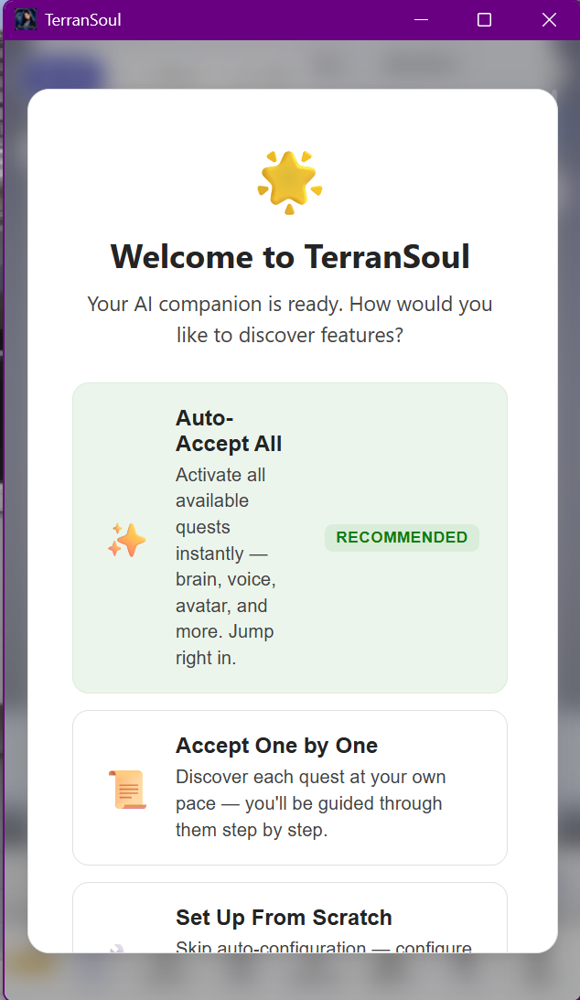
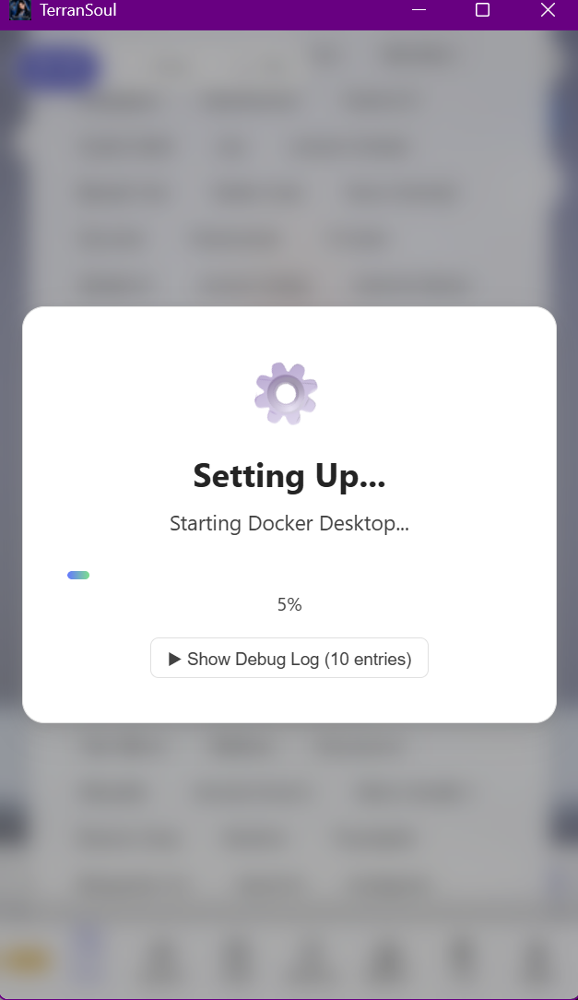
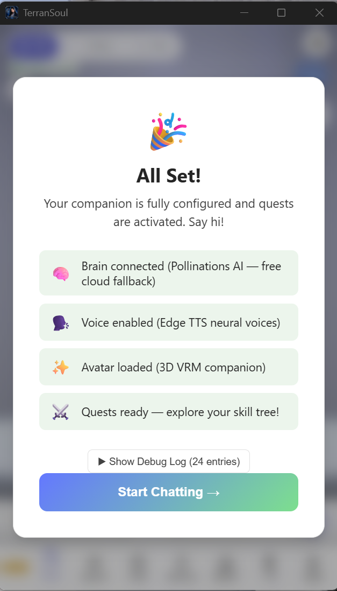
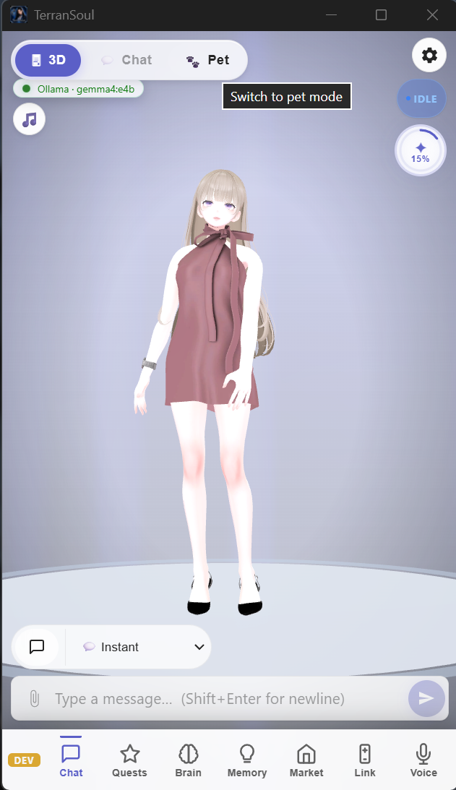
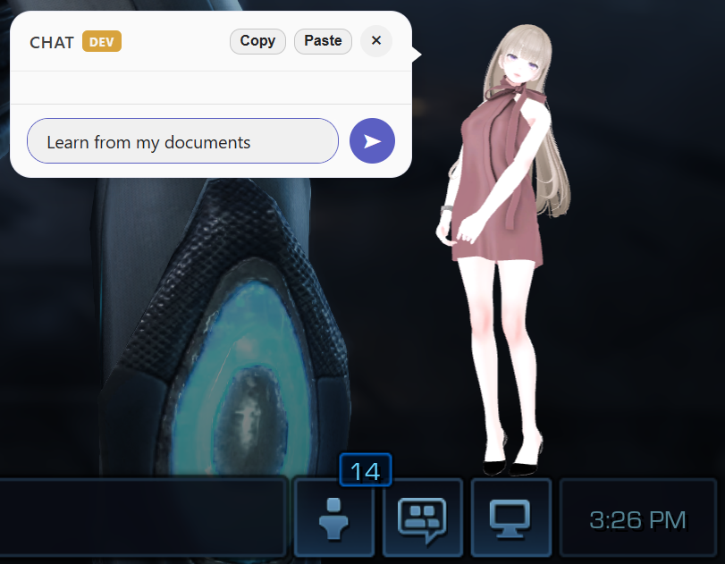
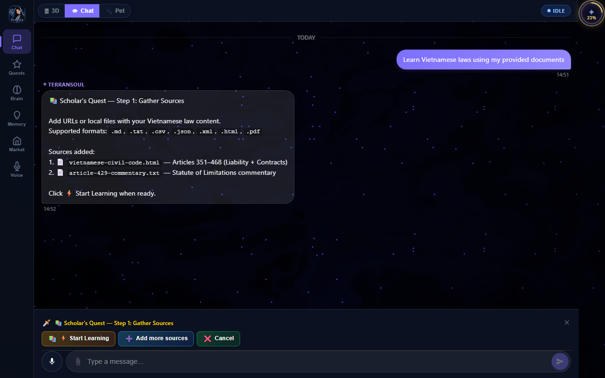
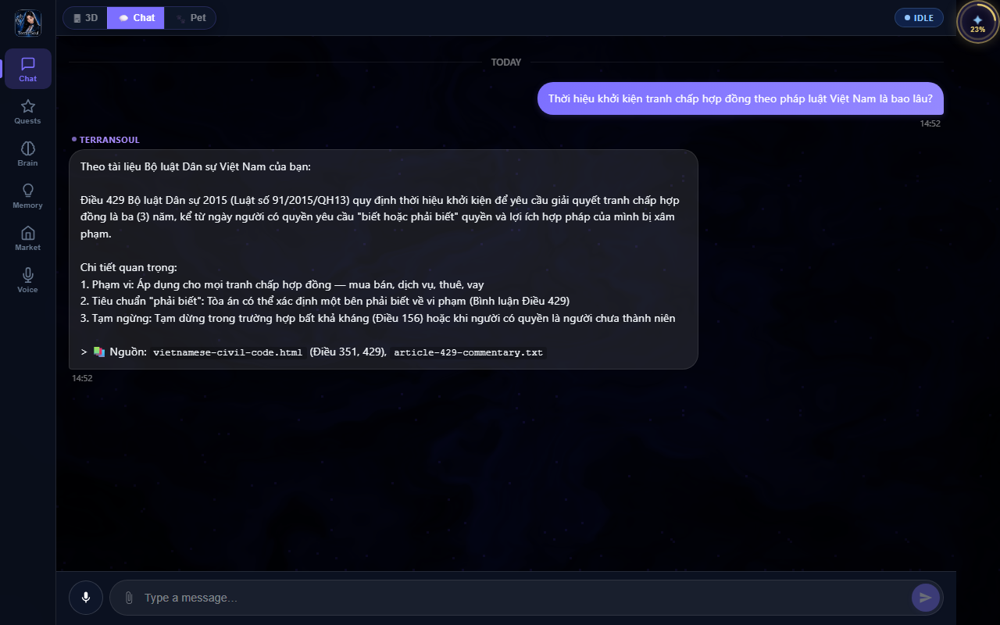

# Brain + Memory + RAG - Pet Mode Tutorial

> **TerranSoul v0.1** · Last verified: 2026-05-10.
> Follow the recommended setup path, switch to pet mode, ask TerranSoul to
> learn from documents, upload sources through Scholar's Quest, and verify
> RAG answers in multiple languages.
>
> Technical reference: [BRAIN-COMPLEX-EXAMPLE-EXPLAIN.md](../instructions/BRAIN-COMPLEX-EXAMPLE-EXPLAIN.md) ·
> Architecture doc: [docs/brain-advanced-design.md](../docs/brain-advanced-design.md)

---

## What You Are Building

You will produce one working brain + memory + RAG setup:

- Recommended first-launch setup accepted with **Auto-Accept All**.
- Pet mode opened from the main 3D view.
- Floating pet chat opened by clicking the character.
- The message **Learn from my documents** routed through the backend intent classifier.
- Scholar's Quest source upload completed with Vietnamese Civil Code sample documents.
- RAG-grounded answers verified in English, Vietnamese, and Chinese.

The document-learning trigger is brain-owned. The frontend sends contentful
messages through the backend `classify_intent` command, which retrieves app
knowledge from the RAG store before deciding that **Learn from my documents**
means `learn_with_docs`.

Implementation surfaces reviewers can check:

- [src/stores/conversation.ts](../src/stores/conversation.ts) - chat send flow and quest-chain activation.
- [src-tauri/src/commands/brain.rs](../src-tauri/src/commands/brain.rs) - `classify_intent` command and intent RAG context retrieval.
- [src-tauri/src/brain/intent_classifier.rs](../src-tauri/src/brain/intent_classifier.rs) - LLM intent classifier prompt and parser.
- [src/stores/skill-tree.ts](../src/stores/skill-tree.ts) - quest activation state.
- [src/views/ChatView.vue](../src/views/ChatView.vue) - desktop chat surface and bottom action bar.

---

## Requirements

- TerranSoul desktop app, not browser-only mode. Pet mode and floating panels
  require the Tauri desktop runtime.
- A recommended setup path available on first launch. If you already completed
  first launch, reset first-launch state before recapturing this exact flow.
- A brain provider available through the recommended setup. The screenshots show
  both a free fallback setup and an Ollama setup because they come from real
  verification runs.
- Document sources for the worked example:
  - [`public/demo/vietnamese-civil-code.html`](../public/demo/vietnamese-civil-code.html) - Articles 351-468 sample of the 2015 Civil Code.
  - [`public/demo/article-429-commentary.txt`](../public/demo/article-429-commentary.txt) - plain-text commentary on the contract limitation period.
  - Web crawler example: `https://thuvienphapluat.vn/van-ban/Lao-dong-Tien-luong/Bo-Luat-lao-dong-2019-333670.aspx` - public Vietnamese 2019 Labour Code page, used to exercise the on-domain web crawler (depth 2, max 20 pages).

---

## Walkthrough

### 1. Select Auto-Accept All Recommended Setup



On first launch, choose the recommended setup card labeled **Auto-Accept All**.
The card includes the **RECOMMENDED** badge and activates the available brain,
voice, avatar, and quest features automatically.

Use this path when you have not explicitly chosen a setup mode. In TerranSoul,
an undefined setup mode defaults to the recommended setup.

### 2. Wait For Setup



Wait while the **Setting Up...** dialog runs. The screenshot shows the setup
starting Docker Desktop and exposing **Show Debug Log** for troubleshooting.

Do not close the app during this stage. The progress dialog is the expected
state while TerranSoul configures the provider, voice, avatar, and quests.

### 3. Click Start Chatting



When the dialog changes to **All Set!**, verify the checklist:

- Brain connected.
- Voice enabled.
- Avatar loaded.
- Quests ready.

Click **Start Chatting →** to enter the main app.

### 4. Click Pet Mode



In the main 3D view, use the top mode switch and click **Pet**. The tooltip
reads **Switch to pet mode** when the cursor is over the pet-mode control.

Pet mode turns the companion into a transparent desktop overlay. In the desktop
app, this is a native Tauri window, so it is different from browser-only mode.

### 5. Open Pet Chat And Type Learn From My Documents



Click the character to open the floating chat panel. The panel appears beside
the character with **CHAT**, **Copy**, **Paste**, and close controls.

Type:

```text
Learn from my documents
```

Then send the message. This must flow through the same backend classifier path
used by normal chat. The expected intent is `learn_with_docs`, not a frontend
regex shortcut.

### 6. Trigger Scholar's Quest And Upload Documents



TerranSoul starts the **Scholar's Quest — Step 1: Gather Sources** chain. The
quest asks you to add URLs or local files and lists supported formats:
`.md`, `.txt`, `.csv`, `.json`, `.xml`, `.html`, and `.pdf`.

For this worked example, add these sources:

1. [`public/demo/vietnamese-civil-code.html`](../public/demo/vietnamese-civil-code.html) - Articles 351-468, including liability and contracts. Use **📎 Attach File** and pick this file from the repo.
2. [`public/demo/article-429-commentary.txt`](../public/demo/article-429-commentary.txt) - statute-of-limitations commentary. Use **📎 Attach File** and pick this file from the repo.
3. `https://thuvienphapluat.vn/van-ban/Lao-dong-Tien-luong/Bo-Luat-lao-dong-2019-333670.aspx` - public Vietnamese 2019 Labour Code page. Paste this URL into the URL field, tick **🕸️ Crawl whole site**, then click **＋ Add URL**. The checkbox prefixes the source with `crawl:` so the backend follows same-domain links (depth 2, max 20 pages).

Click **Start Learning** when the sources are ready. Use **Add more sources**
if you need another document, or **Cancel** to stop the chain.

After you start learning, the ingestion pipeline fetches, chunks, embeds, and
stores the documents as long-term memories. The same flow is available from pet
chat after the intent classifier opens the quest chain.

### 6a. Monitor The Crawl Job

You can watch crawler progress in two places at the same time:

| Surface | What it shows | Where to find it |
|---|---|---|
| **Scholar's Quest — Step 3 (Learning in Progress)** | Per-source progress card with description, percentage, and chunk count. Crawl rows include `Crawling N/M (depth D/MAX): URL` so you can see how many pages have been fetched and the current BFS depth. | Inside the open Knowledge Quest dialog after you click **⚡ Start Learning**. |
| **TaskProgressBar** (`📄 Import` / `🕸️ Crawl`) | Global running-task panel mounted in both **Chat** view and **Brain** view. Each crawl task shows the kind label `🕸️ Crawl`, processed/total page count, percentage, and **Cancel** / **Resume** buttons. Tasks pause automatically after 30 minutes and can be resumed from a saved checkpoint. | Bottom of Chat view and inside Brain view (`TaskProgressBar.vue`). |

Crawler limits and behaviour:

- **Domain scope:** the crawler only follows links whose host matches the start URL's host (`thuvienphapluat.vn` in this example). Cross-domain links are dropped.
- **Depth limit:** BFS depth is capped at `2` (start page = depth 0).
- **Page limit:** at most `20` pages are fetched per crawl source.
- **User-Agent:** `TerranSoul/0.1 WebCrawler`.
- **Pause/Resume:** crawl state (visited URLs, queue, collected text) is checkpointed to the task manager; **Resume** continues from the last checkpoint.
- **Cancel:** stops the crawl, saves a checkpoint, and marks the task `Cancelled`.

Code references for reviewers:

- [src-tauri/src/commands/ingest.rs](../src-tauri/src/commands/ingest.rs) - `crawl_website_with_progress`, `save_crawl_checkpoint`, `emit_progress`.
- [src/components/TaskProgressBar.vue](../src/components/TaskProgressBar.vue) - global progress panel reading the `task-progress` event.
- [src/components/KnowledgeQuestDialog.vue](../src/components/KnowledgeQuestDialog.vue) - the **🕸️ Crawl whole site** toggle that prefixes the URL with `crawl:`.

### 7. Ask A RAG Question In English


Ask:

```text
What is the statute of limitations for contract disputes under Vietnamese law?
```

Expected answer: Article 429 of the 2015 Civil Code sets the limitation period
at **three (3) years**, counted from when the claimant knew or should have known
their lawful rights and interests were infringed.

The answer should cite the uploaded sources, including `vietnamese-civil-code.html`
and `article-429-commentary.txt`.

### 8. Ask The Same Question In Vietnamese



Ask:

```text
Thời hiệu khởi kiện tranh chấp hợp đồng theo pháp luật Việt Nam là bao lâu?
```

Expected answer: TerranSoul answers in Vietnamese and preserves the same fact:
the contract-dispute limitation period is **3 năm** under Article 429.

This verifies cross-language retrieval. The query language changes, but the
same uploaded memories are retrieved.

### 9. Ask The Same Question In Chinese


Ask:

```text
越南法律中合同纠纷的诉讼时效是多长？
```

Expected answer: TerranSoul answers in Chinese and again grounds the answer in
Article 429, with the limitation period stated as **三（3）年**.

At this point, the RAG setup is working if all three answers agree on:

| Check | Expected result |
|---|---|
| Source | `vietnamese-civil-code.html` and `article-429-commentary.txt` |
| Article | Article 429 |
| Limitation period | Three years |
| Language behavior | Answer language follows the user question |

---

## What Happens Internally

The visible flow is short, but the brain pipeline does several things in order:

1. The chat store sends contentful user messages to `classify_intent`.
2. `classify_intent` retrieves relevant app knowledge from memory/RAG context.
3. The classifier returns `learn_with_docs` for the document-learning request.
4. The conversation store starts the Scholar's Quest prerequisite chain.
5. Scholar's Quest gathers sources and starts ingestion.
6. Ingestion extracts text, chunks it, embeds it, and stores long-term memories.
7. Later questions use hybrid retrieval and inject source memories into the LLM prompt.

Document ingestion uses the same memory/RAG architecture described in
[docs/brain-advanced-design.md](../docs/brain-advanced-design.md): vector search,
keyword matching, recency, importance, decay, and tier priority contribute to
retrieval ranking.

---

## Screenshot Inventory

All screenshots for this tutorial live in
[tutorials/screenshots/brain-rag-setup](screenshots/brain-rag-setup/):

| Step | File | Verified UI state |
|---|---|---|
| 1 | `01-auto-accept-recommended-setup.png` | First-launch recommended setup choice |
| 2 | `02-wait-recommended-setup.png` | Setup progress dialog |
| 3 | `03-all-set-start-chatting.png` | Setup complete dialog |
| 4 | `04-click-pet-mode.png` | Main 3D view with Pet toggle |
| 5 | `05-pet-chat-learn-from-documents.png` | Pet chat message entry |
| 6 | `06-scholar-quest-upload-documents.png` | Scholar's Quest source upload |
| 7 | `07-ask-rag-question-english.png` | English grounded answer |
| 8 | `08-ask-rag-question-vietnamese.png` | Vietnamese grounded answer |
| 9 | `09-ask-rag-question-chinese.png` | Chinese grounded answer |

When recapturing, keep the numeric prefix and kebab-case label so the folder
sorts in walkthrough order.

---

## Troubleshooting

| Symptom | Cause | Fix |
|---|---|---|
| Recommended setup does not appear | First launch was already completed | Reset first-launch state before recapturing the onboarding screenshots |
| Pet mode is unavailable | Running browser-only Vite mode | Use the Tauri desktop app; pet mode requires the native window runtime |
| **Learn from my documents** acts like normal chat | Classifier or RAG context is unavailable | Check the `classify_intent` command and brain provider health |
| Scholar's Quest does not show source buttons | Required quest state is already active or the chain was dismissed | Open Quests, confirm Scholar's Quest state, then send the document-learning request again |
| No source citations in answers | Documents were not ingested or embeddings failed | Re-run **Start Learning** and confirm the Memory panel has long-term chunks |
| Answers disagree across languages | Retrieval did not return the same memories | Check tags/source names and verify Article 429 chunks exist in memory |
| Setup progress is stuck on Docker | Docker Desktop is not running or cannot start | Open **Show Debug Log** from the setup dialog and start Docker Desktop manually |

---

## Where To Next

- [brain-rag-local-lm-tutorial.md](brain-rag-local-lm-tutorial.md) - run the same RAG flow with Local Ollama.
- [advanced-memory-rag-tutorial.md](advanced-memory-rag-tutorial.md) - tune retrieval and memory settings.
- [skill-tree-quests-tutorial.md](skill-tree-quests-tutorial.md) - understand quest activation and prerequisite chains.
- [docs/brain-advanced-design.md](../docs/brain-advanced-design.md) - architecture details for memory, embeddings, and RAG.
- [rules/tutorial-template.md](../rules/tutorial-template.md) - tutorial structure and screenshot governance.
