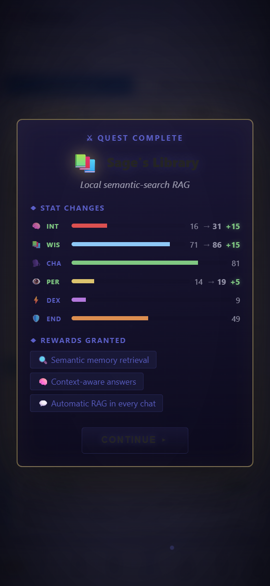

# Turn Any Folder Into a Navigable Knowledge Graph

> **TerranSoul v0.1** · Last updated: 2026-05-07
>
> Related: [Knowledge Wiki](knowledge-wiki-tutorial.md) ·
> [Advanced Memory & RAG](advanced-memory-rag-tutorial.md) ·
> [MCP for Coding Agents](mcp-coding-agents-tutorial.md)

Build a complete TerranSoul knowledge graph from a folder of code, docs,
and PDFs in a few commands. You will end up with a navigable graph,
an Obsidian vault with backlinks, an auto-generated wiki, and natural-
language Q&A over everything — all served from your local MCP brain.

This tutorial replaces the “one-CLI-magic-command” pitch with the
**actual TerranSoul flow** that ships today, and is honest about what
is supported now vs. what is on the roadmap. Read [§9 What is *not*
yet supported](#9-what-is-not-yet-supported) before assuming feature
parity with third-party tools that make broader claims.

---

## Table of Contents

1. [Human-Brain ↔ AI-System ↔ RPG-Stat](#1-human-brain--ai-system--rpg-stat)
2. [What You Are Building](#2-what-you-are-building)
3. [Requirements](#3-requirements)
4. [Index the Code in the Folder](#4-index-the-code-in-the-folder)
5. [Ingest Documents and PDFs](#5-ingest-documents-and-pdfs)
6. [Generate the Wiki](#6-generate-the-wiki)
7. [Export to an Obsidian Vault](#7-export-to-an-obsidian-vault)
8. [Ask Questions in Natural Language](#8-ask-questions-in-natural-language)
9. [What Is Not Yet Supported](#9-what-is-not-yet-supported)
10. [Worked Example: Cook County Family-Law Notes](#10-worked-example-cook-county-family-law-notes)
11. [Troubleshooting](#11-troubleshooting)
12. [Where to Next](#12-where-to-next)

---

## 1. Human-Brain ↔ AI-System ↔ RPG-Stat



| Human action | AI system surface | Persona "stat" exercised |
| --- | --- | --- |
| "Read this codebase" | `code_index_repo` → `code_resolve_edges` → `code_compute_processes` (Tauri) + `code_query` / `code_context` / `code_impact` (MCP) | Pattern memory |
| "Read these documents" | `brain_ingest_url` (MCP) / `ingest_document` (Tauri) — Markdown, text, JSON/XML/HTML, PDF | Episodic memory |
| "Show me how things connect" | `brain_kg_neighbors` (MCP) + `brain_wiki_spotlight` / `brain_wiki_serendipity` | Knowledge-graph reasoning |
| "Make me an Obsidian vault" | `obsidian_export` + bidirectional `obsidian_sync` | Externalised long-term memory |
| "Auto-write a wiki" | `code_generate_wiki` (code) + `brain_wiki_audit/spotlight/serendipity/revisit` (memory) | Reflection / curation |
| "Ask a question across everything" | `brain_search` with RRF + HyDE + LLM-as-judge rerank | Hybrid retrieval |

## 2. What You Are Building

```
your-folder/                          MCP brain output
├── src/**.{rs,ts,tsx,py,...}    →   code_index.sqlite (symbols + edges)
├── docs/**.md                    →   memories rows + memory_edges
├── papers/**.pdf                 →   memories rows + source-guide summaries
└── notes/**.txt                  →   memories rows + auto-extracted edges
                                       │
                                       ├── <data_dir>/wiki/index.md + per-cluster pages
                                       ├── <data_dir>/TerranSoul/<id>-<slug>.md (Obsidian)
                                       └── chat / MCP brain_search Q&A
```

Concrete artifacts you will produce by the end of this tutorial:

- Indexed symbol table for every supported source file in the folder.
- One memory row per ingested document chunk (semantic-chunked) with
  embeddings, plus one `Summary` source-guide row per document.
- A wiki under `<app data dir>/wiki/index.md` with per-cluster pages.
- An Obsidian vault under `<app data dir>/TerranSoul/<id>-<slug>.md`
  with `[[id-slug]]` backlinks driven by `memory_edges`.
- A working MCP `brain_search` endpoint that answers in natural language
  over the merged corpus.

## 3. Requirements

- TerranSoul desktop app **or** the headless MCP runner (`npm run mcp`)
  on Windows / macOS / Linux. See
  [rules/agent-mcp-bootstrap.md](../rules/agent-mcp-bootstrap.md).
- An active brain (any of: local Ollama, OpenAI-compatible cloud, free
  provider). Embeddings are required for vector search;
  `nomic-embed-text` is the default for local Ollama.
- For code indexing beyond Rust + TypeScript, build with the relevant
  Cargo features: `parser-python`, `parser-go`, `parser-java`,
  `parser-c` — see
  [src-tauri/src/coding/parser_registry.rs](../src-tauri/src/coding/parser_registry.rs).
- An MCP bearer token. The headless runner writes the token to
  `.vscode/.mcp-token`; the app shows it in **Settings → MCP**.

## 4. Index the Code in the Folder

For repositories with source code, run the symbol-graph pipeline.

From the desktop app's **Code** view *or* via a Tauri command call,
run these in order:

1. `code_index_repo({ repoPath: "D:/path/to/your-folder" })` — walks
   the folder, parses every supported file with tree-sitter, and
   writes symbols + intra-file edges to `code_index.sqlite`.
2. `code_resolve_edges({ repoPath })` — resolves cross-file imports,
   calls, and inheritance.
3. `code_compute_processes({ repoPath })` — clusters symbols into
   functional groups and traces execution-flow processes.

**Languages this version of TerranSoul actually parses** (defined in
[src-tauri/src/coding/parser_registry.rs](../src-tauri/src/coding/parser_registry.rs)):

| Always on | Behind `parser-python` | Behind `parser-go` | Behind `parser-java` | Behind `parser-c` |
| --- | --- | --- | --- | --- |
| Rust (`.rs`), TypeScript (`.ts`/`.tsx`) | Python (`.py`) | Go (`.go`) | Java (`.java`) | C (`.c`/`.h`), C++ (`.cpp`/`.cxx`/`.cc`/`.hpp`/`.hxx`) |

Total: **7 languages** in the default desktop build (2 always on +
5 feature-gated). Other languages are skipped gracefully — they show
up in the symbol graph as opaque files but contribute no symbols.

> **Honest note.** External materials that advertise "13 programming
> languages" usually mean a different tool. If you need broader
> coverage, open an issue and request specific tree-sitter grammars;
> the registry is designed to make adding one a 3-step change.

## 5. Ingest Documents and PDFs

Code indexing covers source files. Plain documents go through the
**memory ingest** pipeline.

From chat or MCP, ingest each document one at a time:

```text
/digest D:/path/to/your-folder/docs/architecture.md
/digest D:/path/to/your-folder/papers/whitepaper.pdf
```

Equivalent MCP call:

```json
{
  "name": "brain_ingest_url",
  "arguments": { "url": "file:///D:/path/to/your-folder/docs/architecture.md" }
}
```

Supported file extensions (see `read_local_file` in
[src-tauri/src/commands/ingest.rs](../src-tauri/src/commands/ingest.rs)):

| Type | Extensions | How it is read |
| --- | --- | --- |
| Markdown | `.md`, `.markdown` | UTF-8 + heading-aware semantic chunking (`split_markdown`) |
| Plain text & data | `.txt`, `.csv`, `.json`, `.xml`, `.html`, `.htm`, `.log`, `.rst`, `.adoc` | UTF-8 + paragraph-aware chunking (`split_text`) |
| PDF | `.pdf` | `extract_pdf_text` — text-stream extraction; image-only PDFs are **not** OCR'd |
| Images | `.png`, `.jpg`, `.webp`, … | **Not supported** in this version. See [§9](#9-what-is-not-yet-supported). |

Every ingested document also produces one `MemoryType::Summary`
source-guide row that captures headings, top terms, and starter
questions, so broad questions retrieve the guide first instead of a
pile of raw chunks.

If you have many files, loop through them with your shell while the
TerranSoul `ingest_semaphore` keeps embedding load capped at four
concurrent tasks. Failed embeddings auto-retry via the
`pending_embeddings` self-healing queue.

## 6. Generate the Wiki

For the indexed code repository, run `code_generate_wiki({ repoPath })`.
It writes:

- `<app data dir>/wiki/index.md` — table of clusters with sizes and
  brain-summarised one-liners (when an active brain is available).
- `<app data dir>/wiki/<cluster>.md` — per-cluster page with member
  symbols, intra-cluster edges, and a Mermaid call graph.

For the document/memory side, run the brain-wiki tools from chat or MCP:

```text
/spotlight       # most-connected memories (god nodes)
/serendipity     # high-confidence cross-community edges
/ponder          # audit conflicts / orphans / stale rows / embedding gaps
/revisit         # append-and-review queue
```

These are read tools; they do not modify memories. They surface the
shape of your knowledge graph the same way Wikipedia's "What links
here" does.

## 7. Export to an Obsidian Vault

Trigger the export from **Settings → Memory → Obsidian** in the app,
or call the export module directly. The export pipeline is in
[src-tauri/src/memory/obsidian_export.rs](../src-tauri/src/memory/obsidian_export.rs)
and the bidirectional sync is in
[src-tauri/src/memory/obsidian_sync.rs](../src-tauri/src/memory/obsidian_sync.rs).

For each long-tier memory, the exporter writes
`<vault>/TerranSoul/<id>-<slug>.md` with YAML frontmatter:

```yaml
---
id: 1040
created_at: "2026-05-07T00:00:00Z"
importance: 10
memory_type: "fact"
tier: "long"
tags:
  - "chunk-38.5"
  - "benchmark"
  - "million-memory"
source_url: "https://..."
---
```

Backlinks are produced from `memory_edges`. Edges of type `references`,
`derived_from`, `supports`, `contradicts`, `related_to`, etc. all
become Obsidian wiki-links the file system already resolves
because filenames start with the memory id.

Bidirectional sync uses **last-writer-wins**: if you edit a vault
file in Obsidian, the next sync cycle imports the change back into
the brain (`file_mtime > last_exported`).

## 8. Ask Questions in Natural Language

After indexing, ask anything from chat or any MCP-connected agent:

```text
> what does the eviction module do, and which capacity test covers it?
```

Behind the scenes, `brain_search` runs:

1. Hybrid 6-signal score (vector + keyword + recency + importance +
   decay + tier) for raw recall.
2. Reciprocal Rank Fusion (`k = 60`) over vector / keyword / freshness
   rankings.
3. Optional HyDE expansion for cold/abstract queries.
4. Optional cross-encoder rerank (LLM-as-judge, default `0.55`
   normalised threshold) to keep only relevant candidates.
5. Top-k injected into the chat prompt as `[LONG-TERM MEMORY]`.

For programmatic / agent use, the MCP tool surface is documented in
[rules/agent-mcp-bootstrap.md](../rules/agent-mcp-bootstrap.md) — the
relevant tools here are `brain_search`, `brain_get_entry`,
`brain_kg_neighbors`, `brain_suggest_context`, `code_query`,
`code_context`, `code_impact`, and `code_rename`.

## 9. What Is Not Yet Supported

So you can plan around real capability rather than marketing claims:

- **Image OCR.** Image-only PDFs and standalone images (`.png`,
  `.jpg`, `.webp`, …) are not extracted in this version. PDFs with
  embedded text streams work; scanned PDFs do not.
- **Single "ingest a folder" chat command for mixed code + docs.**
  Today you call `code_index_repo` for code and loop ingestion calls
  per document. A unified folder-walker that dispatches by extension
  is on the roadmap; the building blocks (`coding::symbol_index`,
  `commands::ingest`, MCP `brain_ingest_url`) are all stable.
- **Languages beyond the 7 listed in [§4](#4-step-1--index-the-code-in-the-folder).**
  Adding one is a 3-step change in
  [src-tauri/src/coding/parser_registry.rs](../src-tauri/src/coding/parser_registry.rs)
  + Cargo feature.
- **Headline "71.5×" token reduction.** That number originates in
  third-party marketing material. TerranSoul measures its own number
  per session — see
  [docs/mcp-token-usage-benchmark.md](../docs/mcp-token-usage-benchmark.md)
  for the actual reduction observed in the session that wrote this
  tutorial (≈11–80× depending on query class).

## 10. Worked Example: Cook County Family-Law Notes

A recurring example folder used in the TerranSoul corpus is
[documents/cook-county-family-law-rules.md](../documents/cook-county-family-law-rules.md).
End-to-end:

1. Code index step is **skipped** — no source code in the folder.
2. Ingest the markdown:

   ```text
   /digest documents/cook-county-family-law-rules.md
   ```
3. Run `/ponder` and `/spotlight` to see what edges the LLM extractor
   inferred (deadlines, parties, rule numbers).
4. Export to Obsidian; open the vault and observe `[[<id>-rule-14-3]]`-
   style backlinks to neighbouring rules.
5. Ask in chat: *"What does Cook County rule 14.3 say about response
   deadlines?"* — `brain_search` returns the rule chunk with its
   source guide; the chat agent answers without re-reading the entire
   document.

## 11. Troubleshooting

| Symptom | Likely cause | Fix |
| --- | --- | --- |
| `code_index_repo` returns 0 symbols | No supported source files in the folder, or required parser feature isn't built. | Build with `parser-python` / `parser-go` / etc., or expect doc-only behaviour. |
| `Unsupported or binary file format: .xyz` during ingest | Extension not in the allowlist, and the file isn't UTF-8. | Convert to Markdown / text first, or open an issue requesting the extension. |
| `Could not extract text from PDF. The PDF may use image-based content.` | Scanned PDF without a text layer. | OCR externally (Tesseract, etc.) and ingest the resulting `.txt`. |
| `brain_ingest_url` says "ingest sink not attached" on stdio MCP | Old MCP build before Chunk 38 sink fixes. | Rebuild with current `main`; both HTTP and stdio MCP now ship `IngestSink`. |
| Obsidian backlinks don't appear | Vault not opened with Obsidian, or `last_exported` already current. | Open the `<vault>/TerranSoul/` folder in Obsidian and re-run the sync; LWW resolves remaining drift. |
| `brain_search` returns nothing even after ingest | Embedding provider unreachable; rows are queued in `pending_embeddings`. | Check `embedding_queue_status`; the self-healing worker drains every 10 s. |

## 12. Where to Next

- Brain architecture: [docs/brain-advanced-design.md](../docs/brain-advanced-design.md)
- Benchmarks (latency + token usage):
  [docs/benchmarking.md](../docs/benchmarking.md) and
  [docs/mcp-token-usage-benchmark.md](../docs/mcp-token-usage-benchmark.md)
- MCP bootstrap procedure: [rules/agent-mcp-bootstrap.md](../rules/agent-mcp-bootstrap.md)
- Tutorial template & rules: [rules/tutorial-template.md](../rules/tutorial-template.md)
- Related tutorials:
  [tutorials/brain-rag-setup-tutorial.md](brain-rag-setup-tutorial.md),
  [tutorials/brain-rag-local-lm-tutorial.md](brain-rag-local-lm-tutorial.md),
  [tutorials/lan-mcp-sharing-tutorial.md](lan-mcp-sharing-tutorial.md)
