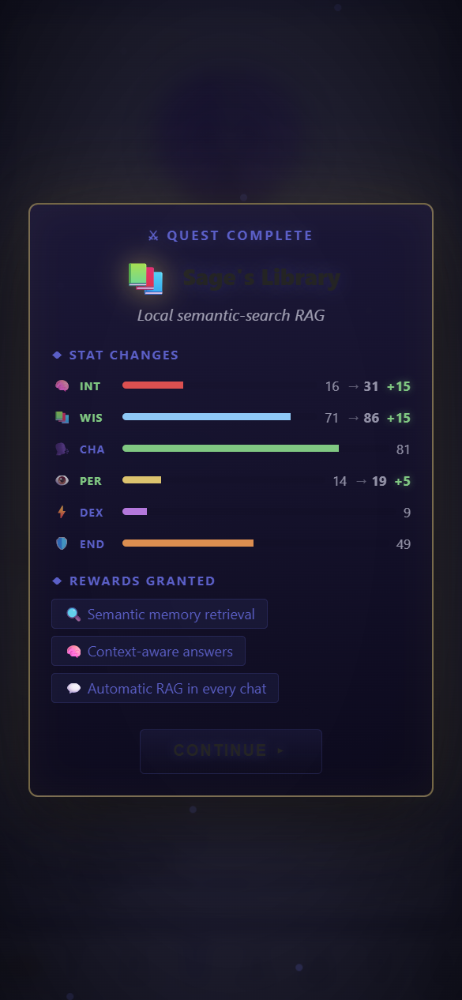

# MCP for Coding Agents — VS Code Copilot, Headless Brain & Code Intelligence

> **TerranSoul v0.1** · Last updated: 2026-05-07
>
> Related: [LAN Brain Sharing](lan-mcp-sharing-tutorial.md) ·
> [Advanced Memory & RAG](advanced-memory-rag-tutorial.md) ·
> [Multi-Agent Workflows](multi-agent-workflows-tutorial.md)

TerranSoul exposes its brain as an MCP (Model Context Protocol) server
that AI coding assistants can query for project knowledge, semantic
search, and code intelligence. This tutorial covers setup for VS Code
Copilot, the headless runner for CI/automation, and the code tools.

---

## Table of Contents

1. [Understanding MCP Ports](#1-understanding-mcp-ports)
2. [Quick Start (Headless MCP)](#2-quick-start-headless-mcp)
3. [VS Code Copilot Integration](#3-vs-code-copilot-integration)
4. [Available Brain Tools](#4-available-brain-tools)
5. [Using Brain Search in Practice](#5-using-brain-search-in-practice)
6. [Code Intelligence Setup](#6-code-intelligence-setup)
7. [Workflow for Coding Sessions](#7-workflow-for-coding-sessions)
8. [Stdio Transport (Direct Pipe)](#8-stdio-transport-direct-pipe)
9. [Troubleshooting](#9-troubleshooting)

---

## Requirements

| Requirement | Notes |
|---|---|
| **Node.js 18+** | For the headless MCP runner |
| **VS Code** | With GitHub Copilot extension (for Copilot integration) |
| **TerranSoul repo cloned** | The MCP server runs from the repo |

---

## 1. Understanding MCP Ports



TerranSoul runs MCP on three ports depending on context:

| Surface | Port | Data Directory | Use Case |
|---------|------|---------------|----------|
| **Release app** | 7421 | OS app-data | Production desktop app running |
| **Dev build** (`cargo tauri dev`) | 7422 | OS app-data/dev | Development builds |
| **Headless** (`npm run mcp`) | **7423** | `<repo>/mcp-data/` | CI, coding agents, automation |

For coding work, use the **headless runner on port 7423** — it doesn't touch your personal data.

---

## 2. Quick Start (Headless MCP)

### Step 1: Start the MCP Server

```bash
npm run mcp
```

This builds the frontend and starts a headless brain server on `127.0.0.1:7423`.

**What happens:**
1. Vite builds the frontend bundle
2. The Rust binary launches in MCP-only mode
3. State is stored in `<repo>/mcp-data/`
4. A bearer token is generated at `mcp-data/mcp-token.txt`
5. Seed data from `mcp-data/shared/memory-seed.sql` is loaded

### Step 2: Verify Health

```bash
curl http://127.0.0.1:7423/health
```

Response:
```json
{"status":"ok","version":"0.1.0","provider":"ollama","memory_count":1052}
```

### Step 3: Set the Token for VS Code

The MCP token is auto-generated. Set it as an environment variable:

```powershell
# PowerShell
$env:TERRANSOUL_MCP_TOKEN_MCP = Get-Content .vscode/.mcp-token

# Bash
export TERRANSOUL_MCP_TOKEN_MCP=$(cat .vscode/.mcp-token)
```

---

## 3. VS Code Copilot Integration

### Auto-Start (Recommended)

TerranSoul's workspace includes a VS Code task that auto-starts MCP when you open the folder:

- Task: **"TerranSoul MCP: Auto-Start"**
- Configured in `.vscode/tasks.json` with `runOptions.runOn: "folderOpen"`
- Runs `node scripts/copilot-start-mcp.mjs` which:
  1. Checks if ports 7421/7422/7423 already have a healthy MCP
  2. Reuses existing if found
  3. Starts `npm run mcp` detached if none is healthy

### MCP Client Configuration

The repo includes `.vscode/mcp.json` with pre-configured servers:

| Server ID | URL | When to Use |
|---|---|---|
| `terransoul-brain` | `http://127.0.0.1:7421/mcp` | Release app is running |
| `terransoul-brain-dev` | `http://127.0.0.1:7422/mcp` | Dev build is running |
| `terransoul-brain-mcp` | `http://127.0.0.1:7423/mcp` | Headless runner (coding agents) |
| `terransoul-brain-stdio` | Stdio binary | Direct binary pipe (no HTTP) |

Copilot picks these up automatically. The environment variable for each:
- `TERRANSOUL_MCP_TOKEN` (release)
- `TERRANSOUL_MCP_TOKEN_DEV` (dev)
- `TERRANSOUL_MCP_TOKEN_MCP` (headless)

---

## 4. Available Brain Tools

Once connected, coding agents can call these tools:

### Brain Tools (Always Available)

| Tool | Purpose |
|------|---------|
| `brain_health` | Check status: provider, model, memory count, RAG quality |
| `brain_search` | Hybrid RRF search over all memories (supports HyDE mode) |
| `brain_suggest_context` | Get contextually relevant memories for a topic |
| `brain_get_entry` | Retrieve a full memory entry by ID |
| `brain_list_recent` | List recently created/accessed memories |
| `brain_kg_neighbors` | Traverse the knowledge graph from a seed memory |
| `brain_summarize` | LLM-summarize text or memory IDs |
| `brain_ingest_url` | Fetch, chunk, and embed a URL into the brain |
| `brain_failover_status` | Check provider failover state |

### Code Intelligence Tools (When `code_read` Capability Granted)

| Tool | Purpose |
|------|---------|
| `code_query` | Search indexed symbols by name/kind/file pattern |
| `code_context` | Get full context for a symbol (definition + references + callers) |
| `code_impact` | Analyze impact of changing a symbol (what breaks?) |
| `code_rename` | Preview a rename across the codebase |
| `code_list_groups` | List repo groups for cross-repo queries |
| `code_create_group` | Create a repo group |
| `code_add_repo_to_group` | Add a repo to a group |
| `code_group_status` | Check indexing status of a group |
| `code_extract_contracts` | Extract API contracts (function/struct/trait signatures) |
| `code_list_group_contracts` | List contracts across a repo group |
| `code_cross_repo_query` | Search symbols scoped to a repo group |
| `code_generate_skills` | Auto-generate coding skills from indexed code |

---

## 5. Using Brain Search in Practice

### Basic Search

```
brain_search(query: "how does the RAG pipeline work", limit: 5)
```

Returns top-5 memories with relevance scores, content, tags, and importance.

### HyDE Mode (For Abstract Queries)

```
brain_search(query: "deployment best practices", mode: "hyde", limit: 10)
```

Generates a hypothetical answer first, then embeds that for better retrieval.

### Suggest Context (For Task Planning)

```
brain_suggest_context(topic: "implementing the eviction scheduler")
```

Returns memories most relevant to the task you're about to work on.

---

## 6. Code Intelligence Setup

### Index a Repository

```bash
# From TerranSoul chat or via Tauri commands:
code_index_repo --path /path/to/your/project
```

This parses supported languages and builds a symbol index:
- **Always supported:** Rust, TypeScript/TSX
- **Feature-gated:** Python, Go, Java, C, C++

### Query Symbols

```
code_query(query: "MemoryStore", kind: "struct")
```

Returns all matching symbols with file location, documentation, and relationships.

### Impact Analysis

```
code_impact(symbol: "hybrid_search_rrf", file: "src-tauri/src/memory/fusion.rs")
```

Shows what would be affected by changing this function: callers, tests, dependents.

---

## 7. Workflow for Coding Sessions

The recommended workflow for AI coding agents:

1. **Session start:** Call `brain_health` to verify MCP is up.
2. **Context gathering:** Call `brain_search` or `brain_suggest_context` with the task topic before doing broad grep/file searches.
3. **During work:** Use `code_query`/`code_context`/`code_impact` for symbol navigation.
4. **After completing:** Sync durable lessons back via `brain_ingest_url` or by updating `mcp-data/shared/memory-seed.sql`.

### Token Savings

MCP returns focused, relevant context instead of raw file content:
- Typical `brain_search` response: ~2-3 KB
- Equivalent grep/file content: ~30-100 KB
- **Reduction: 10-50× per query** (measured; varies by query specificity)

---

## 8. Stdio Transport (Direct Pipe)

For editors that prefer stdio over HTTP:

```bash
terransoul --mcp-stdio
```

The binary reads JSON-RPC from stdin and writes responses to stdout. Same capabilities as HTTP, using READ_WRITE permission level for the trusted local pipe.

---

## 9. Troubleshooting

| Problem | Solution |
|---------|----------|
| `npm run mcp` fails to build | Run `npm install` first. Check Node.js ≥ 18. |
| Port 7423 already in use | Another MCP instance is running. The start script will reuse it if healthy. |
| Token rejected | Re-read from `mcp-data/mcp-token.txt` (regenerated on each start). |
| `brain_search` returns empty | Seed data may not be loaded. Check `mcp-data/shared/memory-seed.sql` exists. |
| Code tools not available | Code intelligence requires `code_read` capability and an indexed repo. |
| Copilot not connecting | Verify `.vscode/mcp.json` is present and the token env var is set. |

---

## Where to Go Next

- **[LAN Brain Sharing](lan-mcp-sharing-tutorial.md)** — Share MCP with team members on the network
- **[Folder to Knowledge Graph](folder-to-knowledge-graph-tutorial.md)** — Index a codebase into the brain
- **[Multi-Agent Workflows](multi-agent-workflows-tutorial.md)** — Orchestrate agents that use the brain
