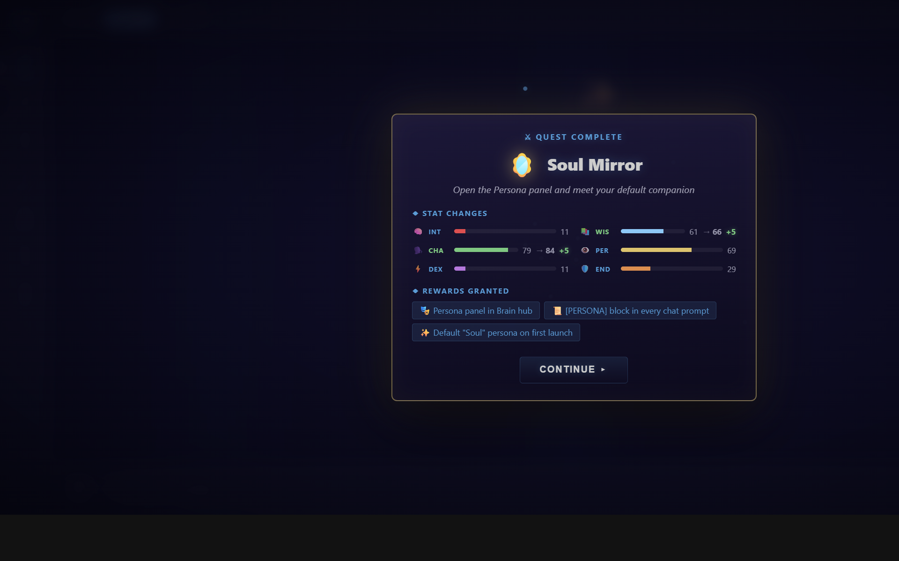

# Multi-Agent Workflows — Tutorial

> **TerranSoul v0.1** · Last updated: 2026-05-07
>
> Related: [Self-Improve to PR](self-improve-to-pr-tutorial.md) ·
> [MCP for Coding Agents](mcp-coding-agents-tutorial.md) ·
> Design: [`docs/multi-agent-orchestration-analysis-2026.md`](../docs/multi-agent-orchestration-analysis-2026.md)

**TerranSoul's gamified, scheduled, multi-agent task system.**
Coordinate Planner, Coder, Reviewer, Tester, Researcher, and Orchestrator
agents through editable YAML workflow plans with Microsoft Teams-style
recurrence and live monitoring.

This tutorial walks through the multi-agent workflow system added in
**Chunk 30.3** (Phase 30 — Self-Improve & Coding Workflow). It covers the
six agent roles, creating and editing plans, swapping LLMs per agent,
scheduling recurring runs, and a worked self-improve example triggered
from a chat suggestion.

---

## Table of Contents

1. [Why Multi-Agent?](#1-why-multi-agent)
2. [The Three Workflow Kinds](#2-the-three-workflow-kinds)
3. [Anatomy of a Workflow Plan](#3-anatomy-of-a-workflow-plan)
4. [Quick Start: Create Your First Plan](#4-quick-start-create-your-first-plan)
5. [Switching LLMs per Agent](#5-switching-llms-per-agent)
6. [Recurring Schedules (Teams-Style)](#6-recurring-schedules-teams-style)
7. [Calendar View](#7-calendar-view)
8. [Worked Example — Self-Improve from a Chat Suggestion](#8-worked-example--self-improve-from-a-chat-suggestion)
9. [Best-Practice Patterns Absorbed](#9-best-practice-patterns-absorbed)
10. [CLI / Programmatic Access](#10-cli--programmatic-access)
11. [See Also](#11-see-also)

---

## 1. Why Multi-Agent?



A single LLM doing every job is wasteful and error-prone. Anthropic's
*Building Effective Agents* (2024) and the AutoGen / CrewAI bodies of
work converge on the same insight: **specialise the model to the role**.
TerranSoul ships **six built-in roles**, each with hand-tuned LLM
recommendations across three tiers (`fast` / `balanced` / `premium`).

| Role | Icon | Strength | Typical model |
|---|---|---|---|
| **Planner** | 🗺️ | Decomposes high-level goals into a DAG of small steps | Claude Sonnet 4.5 (premium), Llama 3.3 70B (balanced) |
| **Coder** | ⌨️ | Writes the code | Claude Sonnet 4.5, Qwen2.5-Coder 32B |
| **Reviewer** | 🔍 | Critiques diffs, catches bugs | Claude Opus 4 (premium), DeepSeek-V3 (balanced) |
| **Tester** | 🧪 | Authors and runs tests | Qwen2.5-Coder 7B (fast), Claude Sonnet |
| **Researcher** | 📚 | Searches docs, RAG, web | Gemini 2.0 Flash (fast), Claude Sonnet |
| **Orchestrator** | 🎯 | Routes work, decides termination | GPT-4o (premium), Llama 3.1 8B (fast) |

Each plan stores the chosen model **per agent**, but you can override
per-step too. All recommendations are sourced live from
`workflow_agent_recommendations` (Tauri command), so they reflect what
actually works on your machine (RAM-aware, network-aware).

---

## 2. The Three Workflow Kinds


| Kind | When to use | Examples |
|---|---|---|
| `coding` | Anything that touches code in this repo | "Refactor auth to OAuth2", "Add a Pinia store for X" |
| `daily` | Recurring routine work | "9am Mon–Fri PR review", "Sunday 5pm release notes draft" |
| `one_time` | Ad-hoc one-shots | "Summarise yesterday's chat", "Generate cover image" |

Kind only affects defaults and color-coding in the calendar — every plan
is the same YAML format under the hood.

---

## 3. Anatomy of a Workflow Plan


Plans persist as YAML files in `<data_dir>/workflow_plans/<id>.yaml`.
A typical plan:

```yaml
id: 01J8WV6XK4P0Q...
title: Refactor auth to OAuth2
kind: coding
status: pending_review
user_request: "Replace cookie-based auth with OAuth2 PKCE"
created_at: 1735990000000
updated_at: 1735990000000
tags: [auth, refactor]

agent_llm_overrides:
  planner:    { provider: anthropic,  model: claude-sonnet-4-5 }
  coder:      { provider: anthropic,  model: claude-sonnet-4-5 }
  reviewer:   { provider: anthropic,  model: claude-opus-4 }
  tester:     { provider: ollama,     model: qwen2.5-coder:7b }
  researcher: { provider: google,     model: gemini-2.0-flash }

steps:
  - id: research
    agent: researcher
    description: "Survey OAuth2 PKCE libraries for Rust + TS"
    depends_on: []
    output_format: prose
    status: pending
    requires_approval: false
    llm_provider: google
    llm_model: gemini-2.0-flash

  - id: plan
    agent: planner
    description: "Produce a step-by-step migration DAG"
    depends_on: [research]
    output_format: plan
    status: pending
    requires_approval: true   # human gate before any code is written
    llm_provider: anthropic
    llm_model: claude-sonnet-4-5

  - id: code-server
    agent: coder
    description: "Rewrite src-tauri/src/auth/* to issue PKCE codes"
    depends_on: [plan]
    output_format: code
    status: pending
    requires_approval: false
    llm_provider: anthropic
    llm_model: claude-sonnet-4-5

  - id: code-client
    agent: coder
    description: "Update Pinia auth store + login view"
    depends_on: [plan]
    output_format: code
    status: pending
    requires_approval: false
    llm_provider: anthropic
    llm_model: claude-sonnet-4-5

  - id: test
    agent: tester
    description: "Add Vitest+rust tests, run full CI gate"
    depends_on: [code-server, code-client]
    output_format: test_results
    status: pending
    requires_approval: false
    llm_provider: ollama
    llm_model: qwen2.5-coder:7b

  - id: review
    agent: reviewer
    description: "Diff review, security audit"
    depends_on: [test]
    output_format: verdict
    status: pending
    requires_approval: true
    llm_provider: anthropic
    llm_model: claude-opus-4

schedule: null  # optional — see "Recurring schedules" below
```

The runner uses **Kahn's topological sort** on `depends_on` to determine
execution order. Independent steps (`code-server`, `code-client`) run in
parallel automatically.

---

## 4. Quick Start: Create Your First Plan


1. **Right-click** the pet character → **Multi-agent workflows…**
2. Click **+ New Workflow**.
3. Type your request: *"Add a markdown export button to the chat view"*.
4. Pick kind `coding`. Click **Create**.

A blank plan is created with one **Planner** step. The next refinement is
to expand it: click the plan, then either run the Planner step (it'll
ask Claude/Llama to fill in the rest) or hand-edit the YAML in your
favourite editor — both flows update through the same
`workflow_plan_save` command and re-validate the DAG.

---

## 5. Switching LLMs per Agent


Open a plan → **Steps** section. Each step has an **LLM** dropdown that
groups recommendations by tier:

```
Planner
  fast ┐
       └ llama-3.1-8b-instruct (ollama) — Local, RAM-friendly, decent at decomposition
  balanced ┐
           └ llama-3.3-70b (ollama) — Best local planner under 70B
  premium ┐
          └ claude-sonnet-4-5 (anthropic) — Strongest reasoning, costs $$
```

Picking a new model fires `workflow_plan_override_llm`, which propagates
the choice to **every step** with the same agent role. Per-step overrides
are also possible via direct YAML edit if you need finer-grained control.

> **Tip — cost control**: for daily/recurring workflows, prefer a `fast`
> tier model. For ad-hoc one-offs where quality matters, go `premium`.

---

## 6. Recurring Schedules (Teams-Style)


Open a plan → **Add schedule (recurring)** disclosure. Pick a pattern:

| Pattern | Inputs | Example preview |
|---|---|---|
| **Once** | start datetime | "One time" |
| **Daily** | interval (every N days) | "Every day" / "Every 3 days" |
| **Weekly** | interval + selected weekdays | "Weekly on Mon, Wed, Fri" |
| **Monthly** | interval + day of month | "Monthly on day 15" |

Plus **Start at** (`datetime-local`), **Duration** (minutes — drives
calendar block height), and an optional **End on** date.

The generated `WorkflowSchedule` mirrors RFC 5545 (iCal RRULE) loosely:

```yaml
schedule:
  start_at: 1746388800000          # Mon 4 May 2026, 17:00 local
  end_at: 1761386400000            # Mon 26 Oct 2026 (optional)
  duration_minutes: 30
  timezone: America/Chicago
  recurrence:
    kind: weekly
    interval: 1
    weekdays: [monday]
  last_fired_at: null
```

The Rust function `next_occurrence_after()` computes the next firing
strictly after a given timestamp. `occurrences_in_range()` projects
occurrences for the calendar viewport (capped at 100 per plan to keep
the UI fast).

---

## 7. Calendar View


The **Calendar** tab is a 7-day × 24-hour grid styled after Microsoft
Teams calendar. Each plan's projected occurrences appear as colored
blocks:

- **Blue** — coding workflows
- **Green** — daily workflows
- **Purple** — one-time workflows
- **↻** prefix — recurring

Use the `‹` / `Today` / `›` controls to navigate. Click any block to
load that plan in the Workflows tab for editing.

The `eventsByDay` computed property buckets events by ISO local date
(`YYYY-MM-DD`), so the calendar renders in O(visible days) regardless of
how many plans exist.

---

## 8. Worked Example — Self-Improve from a Chat Suggestion


This example shows how the multi-agent system pairs with TerranSoul's
**Self-Improve** loop. Scenario: while chatting, you say *"You should
add a dark mode toggle to settings."* TerranSoul recognises this as a
coding-task suggestion and offers to schedule it.

**Step 1 — chat triggers a plan stub.** The `conversation` store
detects the suggestion (existing pattern from `SelfImproveSessionsPanel`
+ `coding/coding_orchestrator`). It calls
`workflow_plan_create_blank` with:

```ts
await invoke('workflow_plan_create_blank', {
  args: {
    user_request: 'Add a dark mode toggle to settings',
    kind: 'coding',
  },
});
```

A blank plan appears in the Workflows panel with status `pending_review`.

**Step 2 — Planner expands the DAG.** When you click **Run** on the
single Planner step, it sends the user request through your chosen
planner LLM (default Claude Sonnet 4.5). The output, parsed via
`parse_planner_response()`, is a YAML block of steps that the system
inserts into the plan. Markdown fences (```` ```yaml ````) are stripped
automatically.

**Step 3 — review and edit.** The plan now has 4–6 steps. You can:
- Reorder steps by editing `depends_on`.
- Swap any agent's LLM via the dropdown.
- Tick **requires_approval** on dangerous steps (anything that writes
  files, runs migrations, or pushes commits).
- Add/remove tags for filtering.

Click **Save** — `workflow_plan_save` validates the DAG (rejects cycles
via Kahn's algorithm) before persisting.

**Step 4 — schedule it.** You decide this should run as part of every
weekly self-improve session. Open the schedule editor:

- Pattern: **Weekly**
- Repeat every **1 week**
- On these days: ☑ Sunday
- Start at: **Sunday 14:00**
- Duration: **45** minutes

The schedule fires every Sunday at 2pm. The plan re-runs from `pending`
status; previously-completed steps are reset.

**Step 5 — live monitoring.** The Calendar tab shows the recurring
block. While the workflow is running, the Workflows tab shows live step
status (`pending` → `running` → `completed`/`failed`). Each step's
output streams into the panel; errors are highlighted in red. You can:
- **Approve** a step that's blocked on `requires_approval`.
- **Pause** the whole workflow — sets status to `paused`, no new steps
  start.
- **Cancel** — terminates the workflow.

**Step 6 — feedback loop.** When the workflow completes, a chat message
fires: *"I added the dark mode toggle. PR #142 ready for review.
3 tests passed, 0 failed."* The Reviewer step's verdict is summarised
inline. If anything failed, the failure is added to your brain memory
under the `coding-failures` cognitive kind, so future Planners can
retrieve it via RAG and avoid the same mistake. **This is the
self-improvement closing the loop.**

---

## 9. Best-Practice Patterns Absorbed


The system implements three patterns from Anthropic's
*Building Effective Agents*:

1. **Orchestrator-Workers** — Planner produces the DAG; specialised
   agents (Coder, Tester, Reviewer) execute leaves; Orchestrator
   monitors and routes.
2. **Evaluator-Optimizer loops** — `requires_approval` gates plus the
   Reviewer step at the end form a critic loop. Failed reviews send the
   plan back to the Coder with feedback in the step's `error` field.
3. **Parallelization** — independent leaves of the DAG run concurrently
   via Tokio. The 100-occurrence cap on calendar projection prevents
   pathological recurrence rules from blocking the UI thread.

From CrewAI: **YAML-first agent config**. The whole plan is a single
YAML file you can `git diff`, share via Persona Pack, or edit in
`vim`. From AutoGen: **explicit termination conditions** — every plan
is a finite DAG, no `while True:` loops.

---

## 10. CLI / Programmatic Access


All ten Tauri commands are also reachable via the brain MCP server on
`127.0.0.1:7421` for AI coding assistants:

| Command | Description |
|---|---|
| `workflow_plan_list` | List all plan summaries |
| `workflow_plan_load` | Full plan by id |
| `workflow_plan_save` | Persist (validates DAG) |
| `workflow_plan_delete` | Remove plan + YAML file |
| `workflow_plan_create_blank` | Stub plan from a user request |
| `workflow_plan_validate` | Dry-run cycle / dependency check |
| `workflow_plan_update_step` | Set step status / output / error |
| `workflow_plan_override_llm` | Swap LLM for an agent role across all its steps |
| `workflow_calendar_events` | Project occurrences in `[from_ms, to_ms]` |
| `workflow_agent_recommendations` | Live LLM picker data per role |

A coding agent (Claude Code, Copilot, Aider) can use these to build,
run, and observe its own workflows with zero UI involvement.

---

## 11. See Also

- [docs/coding-workflow-design.md](../docs/coding-workflow-design.md) — full
  design context, including DAG runner internals (§3.9).
- [docs/multi-agent-orchestration-analysis-2026.md](../docs/multi-agent-orchestration-analysis-2026.md)
  — 2026-05 research synthesis and adoption plan for live orchestration.
- [rules/architecture-rules.md](../rules/architecture-rules.md) — how
  this fits with the orchestrator and brain.
- [docs/AI-coding-integrations.md](../docs/AI-coding-integrations.md) — using
  workflow plans with external coding assistants via MCP.
- `src-tauri/src/coding/multi_agent.rs` — Rust source of truth (data
  model + scheduling).
- `src/stores/workflow-plans.ts` — Pinia store + helpers.
