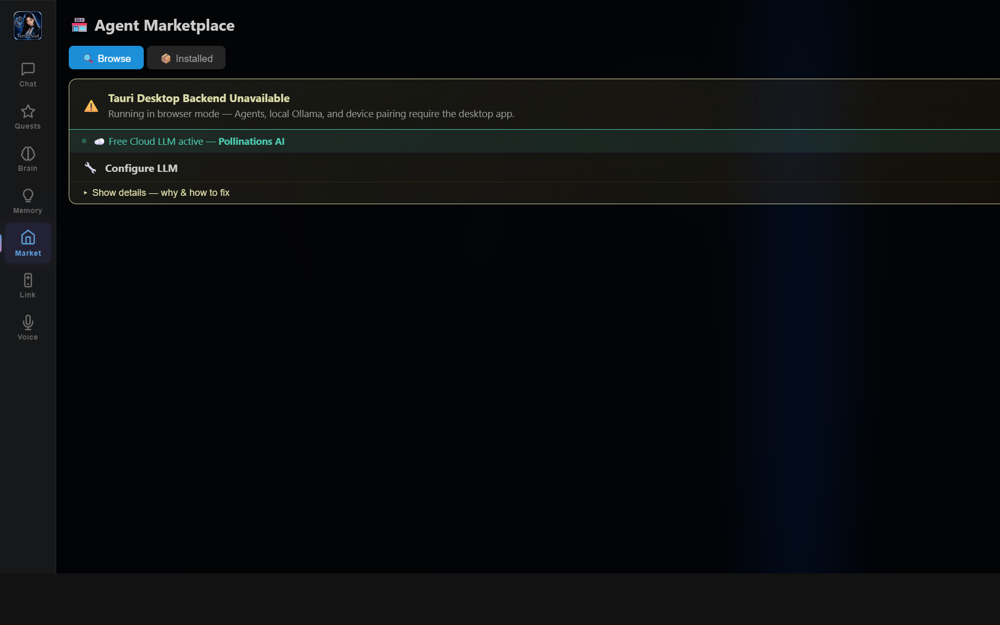

# AI Packages & Plugin Development — Marketplace, Agents & Extensibility

> **TerranSoul v0.1** · Last updated: 2026-05-07
>
> Related: [OpenClaw Plugin](openclaw-plugin-tutorial.md) ·
> [Multi-Agent Workflows](multi-agent-workflows-tutorial.md) ·
> [Plugin Development: `docs/plugin-development.md`](../docs/plugin-development.md)

TerranSoul's package manager lets you browse, install, and manage AI
agents from a built-in marketplace. For developers, the plugin system
supports custom commands, views, themes, slash commands, and memory
hooks. This tutorial covers both the user and developer perspectives.

---

## Table of Contents

1. [Agent Marketplace (User Guide)](#1-agent-marketplace-user-guide)
2. [Plugin System (Developer Guide)](#2-plugin-system-developer-guide)
3. [WASM Plugin Sandbox](#3-wasm-plugin-sandbox)
4. [Registry Server (Advanced)](#4-registry-server-advanced)
5. [Troubleshooting](#5-troubleshooting)

---

## Requirements

| Requirement | Notes |
|---|---|
| **TerranSoul running** | Desktop build (marketplace uses Tauri commands) |
| **Brain configured** (optional) | Some agents require an active brain |

---

## 1. Agent Marketplace (User Guide)



### Step 1: Open the Marketplace

Click **🏪 Marketplace** in the sidebar (or detach it as a floating panel window).

The Marketplace has three tabs:
- **Browse** — Search and discover available agents
- **Installed** — Manage your installed agents
- **Local LLM** — Local Ollama models that appear as marketplace agents

### Step 2: Browse Agents

1. Use the search bar to find agents by name or capability.
2. Each agent card shows:
   - Name and description
   - Required capabilities (brain mode, voice, etc.)
   - Install size
   - Version and author

### Step 3: Install an Agent

1. Click **Install** on an agent card.
2. TerranSoul downloads and validates the agent manifest.
3. The agent appears in your **Installed** tab.
4. Click **Start** to activate it.

### Step 4: Manage Installed Agents

| Action | Effect |
|--------|--------|
| **Start** | Activate the agent (registers its commands/views) |
| **Stop** | Deactivate without removing |
| **Update** | Pull the latest version from registry |
| **Remove** | Uninstall completely |

### Step 5: Local Ollama as Agents

If Ollama is running locally, its models automatically appear in the **Local LLM** tab:

- Each model shows as an installable agent.
- "Install" wires it into TerranSoul's agent system.
- Activate from the same Installed tab.

---

## 2. Plugin System (Developer Guide)


### Plugin Architecture

Plugins extend TerranSoul through a manifest-driven system:

```
Plugin Manifest (JSON)
  ├── Metadata (id, name, version, kind)
  ├── Capabilities required
  ├── Activation events
  └── Contributions
       ├── Commands
       ├── Views
       ├── Settings
       ├── Themes
       ├── Slash Commands
       └── Memory Hooks
```

### Step 1: Create a Plugin Manifest

```json
{
  "id": "my-custom-plugin",
  "display_name": "My Custom Plugin",
  "version": "1.0.0",
  "description": "Adds custom slash commands for my workflow",
  "kind": "utility",
  "install_method": "local",
  "capabilities": ["brain_read"],
  "activation_events": ["onStartup"],
  "contributes": {
    "slash_commands": [
      {
        "command": "/mycommand",
        "description": "Does something useful",
        "handler": "handle_my_command"
      }
    ],
    "commands": [
      {
        "id": "my-plugin.run",
        "title": "Run My Plugin Action"
      }
    ]
  },
  "dependencies": []
}
```

### Step 2: Plugin Kinds

| Kind | Purpose |
|------|---------|
| `utility` | General-purpose tools and commands |
| `brain` | Extends the brain/memory system |
| `voice` | Adds ASR/TTS providers or processing |
| `avatar` | Adds expressions, animations, or model features |
| `social` | Networking and communication features |

### Step 3: Capability System

Plugins declare required capabilities. TerranSoul only grants what's declared:

| Capability | Access Level |
|-----------|-------------|
| `brain_read` | Read memories, search, get entries |
| `brain_write` | Create/update/delete memories |
| `voice_listen` | Access ASR stream |
| `voice_speak` | Trigger TTS output |
| `filesystem_read` | Read files (sandboxed) |
| `network` | Make HTTP requests |

### Step 4: Install Your Plugin

1. Open **Settings → Plugins**.
2. Click **"Install from file"**.
3. Select your manifest JSON.
4. TerranSoul validates capabilities and registers the plugin.
5. Activate with the toggle switch.

### Step 5: Slash Commands in Plugins

Plugins can contribute slash commands that appear in the chat `/` menu:

```json
"contributes": {
  "slash_commands": [
    {
      "command": "/summarize-meeting",
      "description": "Summarize the current conversation as meeting notes",
      "handler": "summarize_handler"
    }
  ]
}
```

Users type `/summarize-meeting` in chat, and your plugin handles the request.

### Step 6: Memory Hooks

Plugins can react to memory lifecycle events:

```json
"contributes": {
  "memory_hooks": [
    {
      "event": "on_create",
      "filter": { "tags": ["meeting"] },
      "handler": "handle_meeting_memory"
    }
  ]
}
```

This fires whenever a memory with the "meeting" tag is created.

---

## 3. WASM Plugin Sandbox


For untrusted or third-party plugins, TerranSoul supports optional WASM sandboxing:

- **Enable:** Build with `--features wasm-sandbox`
- **Default:** WASM sandbox is disabled (returns a clear "disabled" message)
- **When enabled:** Plugin code runs in an isolated Wasmtime runtime with capability-limited host functions

### Sandbox Boundaries

| Allowed | Blocked |
|---------|---------|
| Read/write via declared capabilities | Direct filesystem access |
| HTTP via network capability | Raw socket access |
| Memory CRUD via brain capabilities | Direct SQLite access |
| Emit events to frontend | Access other plugins' state |

---

## 4. Registry Server (Advanced)


TerranSoul includes a built-in package registry server for teams:

1. **Start registry:** Settings → Packages → "Start Local Registry".
2. The registry serves on a local port.
3. Other team members point their marketplace to your registry URL.
4. Publish agents: Export your agent manifest + assets, place in registry.

---

## 5. Troubleshooting

| Problem | Solution |
|---------|----------|
| Agent not starting | Check if required capabilities are available (e.g., needs brain configured). |
| Marketplace empty | Ensure network access. The in-process catalog registry provides default entries. |
| Plugin manifest rejected | Validate JSON structure. Check `id` is unique and `capabilities` are valid strings. |
| WASM sandbox error | Build with `--features wasm-sandbox` to enable. Default build shows "disabled" message. |
| Slash command not appearing | Ensure plugin is activated (not just installed). Check activation events. |

---

## Where to Go Next

- **[Multi-Agent Workflows](multi-agent-workflows-tutorial.md)** — Use installed agents in orchestrated workflows
- **[MCP for Coding Agents](mcp-coding-agents-tutorial.md)** — Expose the brain to external AI coding tools
- **[OpenClaw Plugin](openclaw-plugin-tutorial.md)** — Example of a production plugin (legal document analysis)
