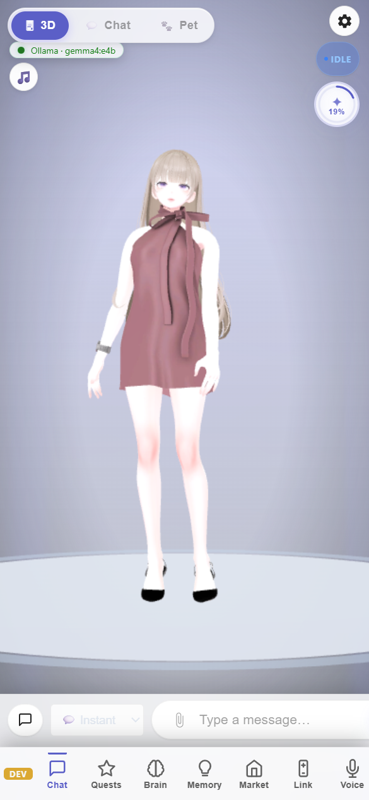

# Quick Start — Your First Chat, Pet Mode & Custom VRM Models

> **TerranSoul v0.1** · Last updated: 2026-05-07
>
> Related: [Voice Setup](voice-setup-tutorial.md) ·
> [Brain + RAG](brain-rag-setup-tutorial.md) ·
> [Skill Tree](skill-tree-quests-tutorial.md)

TerranSoul's first-launch wizard gets you chatting in under 2 minutes.
This tutorial covers platform setup, importing your own VRM avatar,
switching display modes, and the floating Pet Mode overlay.

---

## Table of Contents

1. [First Launch Wizard](#1-first-launch-wizard)
2. [The Three Display Modes](#2-the-three-display-modes)
3. [Pet Mode (Desktop Familiar)](#3-pet-mode-desktop-familiar)
4. [Import a Custom VRM Model](#4-import-a-custom-vrm-model)
5. [Send Your First Message](#5-send-your-first-message)
6. [Troubleshooting](#6-troubleshooting)

---

## Requirements

| Requirement | Notes |
|---|---|
| **OS** | Windows 10/11, macOS (Apple Silicon + Intel), or Linux (`.deb`/`.rpm`/`.AppImage`) |
| **Disk** | ~2 GB free for local Ollama model (optional — free cloud works without it) |
| **Network** | Internet for free cloud brain; offline works with local Ollama |

### Platform-Specific Install

| Platform | Method |
|---|---|
| Windows | Download `.msi` or `.exe` installer from GitHub Releases. WebView2 is built into Windows 10/11. |
| macOS | Download `.dmg`, drag to Applications. Signed (Apple Silicon native + Intel universal). |
| Linux | Choose `.deb`, `.rpm`, or `.AppImage`. Requires: `webkit2gtk-4.1`, `libgtk-3`, `libsoup-3.0`, `libayatana-appindicator3-1` |

---

## 1. First Launch Wizard

When TerranSoul opens for the first time, the **First Launch Wizard** appears automatically.

You'll see three setup options:

1. **"Auto-Accept All"** (Recommended) — Activates brain, voice, and avatar quests instantly. The app downloads a small local AI model (~2 GB) or configures a free cloud provider.
2. **"Accept One by One"** — Guided step-by-step discovery where you accept each feature individually.
3. **"Set Up From Scratch"** — Skip auto-configuration entirely; configure everything manually later.

### Disk Space Check

If you chose a local model, TerranSoul shows:
- Model name and download size (in GB)
- Storage location on your system
- Available disk space with a visual progress bar

Click **Continue** to proceed. The progress bar shows real-time setup status.

### Done!

Once complete, you'll see a summary of what was configured (brain provider, voice, avatar). Click **Start Chatting** to enter the main interface.

---

## 2. The Three Display Modes

TerranSoul's toolbar (top of the chat area) has a mode selector with three options:

| Mode | Icon | Description |
|------|------|-------------|
| **3D** | 🖥 | Full 3D character with chat panel below |
| **Chat** | 💬 | Clean chatbox-only layout (hides the 3D viewport) |
| **Pet** | 🐾 | Floating transparent overlay — character lives on your desktop |

Click any mode button to switch instantly.

---

## 3. Pet Mode (Desktop Familiar)

Pet Mode turns TerranSoul into a floating desktop companion:

1. Click the **🐾 Pet** button in the mode toolbar.
2. The window becomes:
   - **Transparent background** — only the character is visible
   - **Always-on-top** — floats above all other windows
   - **No taskbar icon** — minimal presence
   - **Draggable** — click and drag the character anywhere on screen

### Pet Mode Features

- **Chat bubble** — Recent assistant messages appear as a floating bubble near the character. Click to expand into a manga-style chat panel.
- **Mouse wheel zoom** — Scroll to resize the character.
- **Right-click menu** — Access settings, switch modes, or quit.
- **Escape key** — Exit pet mode and return to the full window.

### Multi-Monitor Support

In Pet Mode, TerranSoul can span across all your monitors. The character follows your cursor across screens (Windows only; uses a ~33 Hz cursor position poll).

---

## 4. Import a Custom VRM Model

TerranSoul ships with two bundled avatars (**Shinra** and **Komori**), but you can import any VRM 0.0 or VRM 1.0 model.

### Where to Find VRM Models

- [VRoid Hub](https://hub.vroid.com/) — free community models
- [VRoid Studio](https://vroid.com/studio) — create your own VRM avatar
- [Booth.pm](https://booth.pm/) — paid/free VRM models from Japanese creators

### Import Steps

1. **Method A — Viewport dropdown:**
   - Click the model name dropdown at the top of the 3D viewport.
   - Click **📁 Import VRM** button.
   - Select your `.vrm` file.

2. **Method B — Model Panel:**
   - Click the **ℹ** button in the top-right corner of the 3D viewport.
   - Click **Import VRM Model** in the panel that opens.
   - Select your `.vrm` file.

The model loads immediately. Imported models are stored in your app data folder:

| OS | Path |
|---|---|
| Windows | `%APPDATA%\com.terranes.terransoul\user_models\` |
| macOS | `~/Library/Application Support/com.terranes.terransoul/user_models/` |
| Linux | `~/.local/share/com.terranes.terransoul/user_models/` |

### Switching Models

Use the model dropdown at the top of the 3D viewport to switch between bundled and imported models at any time.

> **Note:** Only `.vrm` files are supported. glTF, FBX, and other 3D formats are not compatible.

---

## 5. Send Your First Message

1. Type a message in the chat input at the bottom.
2. Press **Enter** or click the send button.
3. TerranSoul responds with streaming text — the character lip-syncs and gestures during the response.

### What Happens Behind the Scenes

- Your message is processed by the configured brain (free cloud, paid API, or local Ollama).
- If you have memories stored, the RAG pipeline injects relevant context automatically.
- The character's expressions and gestures are driven by the response content.

---

## 6. Troubleshooting

| Problem | Solution |
|---------|----------|
| No response from brain | Check Settings → Brain tab. Ensure a provider is configured. |
| Character not loading | Verify the VRM file is valid (VRM 0.0 or 1.0). Try a bundled model first. |
| Pet mode not transparent | Ensure your OS supports transparent windows (requires compositing on Linux). |
| Installer blocked (macOS) | Right-click → Open, or: System Settings → Privacy & Security → Open Anyway. |
| Missing libs (Linux) | Install: `sudo apt install webkit2gtk-4.1 libgtk-3-0 libsoup-3.0-0 libayatana-appindicator3-1` |

---

## Where to Go Next

- **[Brain + RAG Setup](brain-rag-setup-tutorial.md)** — Configure document ingestion and knowledge retrieval
- **[Voice Setup](voice-setup-tutorial.md)** — Enable speech-to-text and text-to-speech
- **[Skill Tree & Quests](skill-tree-quests-tutorial.md)** — Discover the RPG gamification system
- **[Teaching Animations](teaching-animations-expressions-persona-tutorial.md)** — Teach custom expressions via webcam
