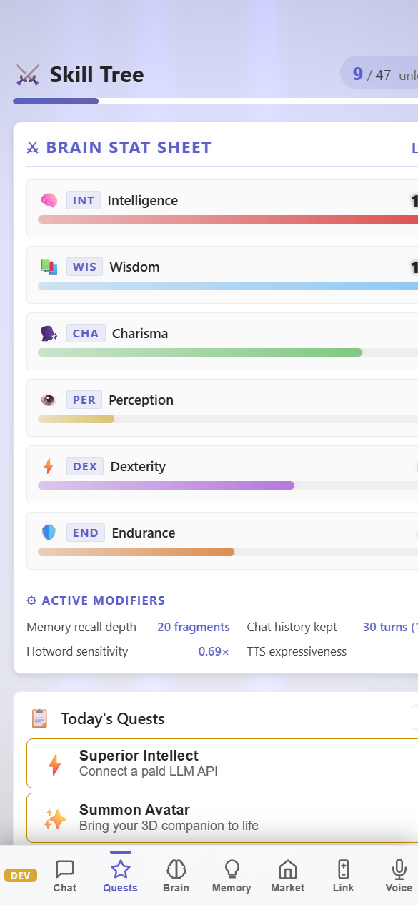

# Skill Tree & Quests — RPG Feature Discovery

> **TerranSoul v0.1** · Last updated: 2026-05-07
>
> Related: [Quick Start](quick-start-tutorial.md) ·
> [Brain + RAG](brain-rag-setup-tutorial.md) ·
> [Voice Setup](voice-setup-tutorial.md)

TerranSoul gamifies feature discovery with 40+ skills across 5
categories, quest chains that guide setup, daily suggestions, and
combo unlocks when skills combine. This tutorial explains the system
and walks through activating your first skills.

---

## Table of Contents

1. [Open the Skill Tree](#1-open-the-skill-tree)
2. [Understand the Structure](#2-understand-the-structure)
3. [Auto-Detection (How Skills Activate)](#3-auto-detection-how-skills-activate)
4. [Quest Steps (Guided Setup)](#4-quest-steps-guided-setup)
5. [Combos (Skill Synergies)](#5-combos-skill-synergies)
6. [Daily Suggestions (Morning Report)](#6-daily-suggestions-morning-report)
7. [Platform-Specific Skills](#7-platform-specific-skills)
8. [All Brain Skills (Progression Path)](#8-all-brain-skills-progression-path)
9. [Troubleshooting](#9-troubleshooting)

---

## Requirements

| Requirement | Notes |
|---|---|
| **TerranSoul running** | Skills auto-detect based on app state — no extra setup needed |

---

## 1. Open the Skill Tree


Click the **✨ Skill Tree** button in the left sidebar (or navigate to the Constellation Map tab).

You'll see a visual constellation map with nodes representing skills, connected by requirement lines.

---

## 2. Understand the Structure


### Skill Categories (5 Constellations)

| Category | Icon | Skills | Focus |
|----------|------|--------|-------|
| **Brain** | 🧠 | 11 | AI providers, memory, RAG, vision, multi-agent |
| **Voice** | 🗣️ | 9 | ASR, TTS, hotwords, diarization, clone |
| **Avatar** | 👤 | 9 | VRM, expressions, motion capture, pet mode |
| **Social** | 🤝 | 5 | Device link, agents, chat rooms, community |
| **Utility** | ⚙️ | 13 | BGM, themes, focus timer, clipboard, notifications |

### Skill Tiers

| Tier | Meaning | Example |
|------|---------|---------|
| **Foundation** | Core features, no prerequisites | "Awaken the Mind" (first brain) |
| **Advanced** | Requires a foundation skill | "Sage's Library" (RAG knowledge) |
| **Ultimate** | Requires multiple advanced skills | "Council of Minds" (multi-agent) |

### Skill States

| State | Meaning |
|-------|---------|
| 🔒 **Locked** | Prerequisites not met yet |
| ⭕ **Available** | Prerequisites met — ready to activate |
| ✅ **Active** | Currently working — auto-detected from app state |

---

## 3. Auto-Detection (How Skills Activate)



Most skills activate **automatically** based on your actual configuration:

| Skill | Activates When... |
|-------|-------------------|
| Awaken the Mind | Any brain provider is configured |
| Superior Intellect | Brain mode is `paid_api` |
| Inner Sanctum | Brain mode is `local_ollama` |
| Gift of Speech | TTS provider is set |
| Voice Command | ASR provider is set |
| Long-Term Memory | Brain is configured (enables memory store) |
| Sage's Library | Brain configured + at least 1 memory exists |
| Summon Avatar | Always active (VRM loads by default) |
| Soul Mirror | Persona traits are loaded |
| Ambient Aura | BGM is enabled in settings |
| Aetherweave | A non-default theme is active |

**No manual "activate" button needed** — just configure the feature and the skill lights up.

---

## 4. Quest Steps (Guided Setup)

Each skill has **quest steps** that guide you through activation:

1. Click a skill node on the constellation map.
2. The skill detail panel shows:
   - **Name & tagline** — what the skill does
   - **Quest steps** — numbered actions to complete
   - **Rewards** — what you unlock
   - **Combos** — synergies with other skills

### Quest Step Types

| Action | Meaning |
|--------|---------|
| `navigate` | Opens a specific settings panel or view |
| `configure` | Guides you to change a setting |
| `external` | Links to an external resource (download, API signup) |
| `info` | Shows contextual information |

**Example — "Awaken the Mind" quest:**
1. Navigate to Brain settings
2. Choose a provider (Free / Paid / Local)
3. Verify brain is responding (auto-check)

---

## 5. Combos (Skill Synergies)

When multiple skills are active simultaneously, **combos** unlock:

### Notable Combos

| Combo | Required Skills | Effect |
|-------|----------------|--------|
| 🌅 **First Light** | Free Brain + Avatar | First companion interaction |
| 🎙️ **Living Doll** | TTS + Avatar | Character speaks aloud |
| 💫 **Companion Awake** | Avatar + Brain + TTS | Full companion experience |
| 💬 **Full Conversation** | ASR + TTS | Two-way voice chat |
| 🔮 **True Recall** | Paid Brain + Memory | Premium memory retrieval |
| 📜 **Offline Sage** | Local Brain + Memory | Fully private knowledge |
| 👂 **Perfect Hearing** | Whisper ASR + Hotwords | Enhanced recognition |
| 🦊 **Living Desktop Pet** | Pet Mode + ASR + Presence | Voice-activated pet |
| 🎓 **Scholar's Gambit** | RAG Knowledge + Paid Brain | Advanced document Q&A |
| 🛡️ **Round Table** | Multi-Agent + Memory | Agent swarm with shared knowledge |

Combos appear as glowing connections between skill nodes on the constellation map.

---

## 6. Daily Suggestions (Morning Report)

The **"Morning Report"** skill (Brain category, advanced tier) provides daily quest suggestions:

1. Activate the **Morning Report** skill.
2. Each day, TerranSoul suggests:
   - Skills you're close to unlocking
   - Combos you could activate with one more skill
   - Unused features that match your usage pattern

---

## 7. Platform-Specific Skills

Some skills are platform-gated:

| Skill | Platform | Purpose |
|-------|----------|---------|
| Windows Alerts | Windows only | System notification integration |
| Power User | Windows only | Global keyboard shortcuts |
| System Integration | Windows only | Taskbar customization |
| Boot Companion | Windows only | Auto-start with Windows |

These only appear on their supported platform.

---

## 8. All Brain Skills (Progression Path)

Here's the recommended Brain category progression:

```
Foundation:  Awaken the Mind (any brain)
     ↓
Advanced:    Evolve Beyond (upgrade provider)
     ↓           ↓           ↓
   Paid Brain  Local Brain  Long-Term Memory
     ↓           ↓           ↓
   Sage's Library ← ← ← ← ←
     ↓
   Scholar's Quest → Morning Report
     ↓
Ultimate:  All-Seeing Eye (vision) → Council of Minds (multi-agent)
```

---

## 9. Troubleshooting

| Problem | Solution |
|---------|----------|
| Skill not activating | Check the quest steps — auto-detection requires specific state (e.g., `rag-knowledge` needs brain + at least 1 memory) |
| Combo not showing | Ensure ALL required skills are active simultaneously |
| Locked skill shows no path | Check prerequisites — click the locked skill to see what it requires |
| Morning Report not appearing | Requires both "Scholar's Quest" and a Paid/Local brain |

---

## Where to Go Next

- **[Brain + RAG Setup](brain-rag-setup-tutorial.md)** — Activate brain skills by configuring your first provider
- **[Voice Setup](voice-setup-tutorial.md)** — Unlock voice skills and the "Full Conversation" combo
- **[Advanced Memory & RAG](advanced-memory-rag-tutorial.md)** — Power up the "Sage's Library" skill with documents
