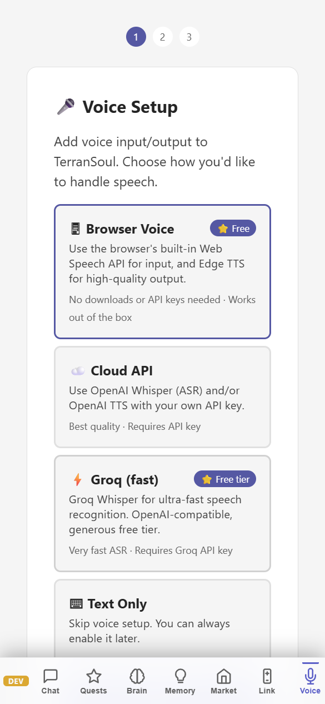

# Voice Setup — Speech Recognition, Text-to-Speech & Lip Sync

> **TerranSoul v0.1** · Last updated: 2026-05-07
>
> Related: [Quick Start](quick-start-tutorial.md) ·
> [Teaching Animations](teaching-animations-expressions-persona-tutorial.md) ·
> [Skill Tree](skill-tree-quests-tutorial.md)

Enable hands-free conversation with TerranSoul using speech recognition
(ASR) and text-to-speech (TTS). This tutorial covers provider selection,
hotword configuration, and the lip-sync animation pipeline.

---

## Table of Contents

1. [Open Voice Settings](#1-open-voice-settings)
2. [Choose an ASR Provider](#2-choose-an-asr-provider)
3. [Choose a TTS Provider](#3-choose-a-tts-provider)
4. [Configure Hotwords](#4-configure-hotwords-power-words)
5. [Lip Sync Pipeline](#5-lip-sync-pipeline)
6. [Full Conversation Mode](#6-full-conversation-mode)
7. [Voice Auto-Configure](#7-voice-auto-configure)
8. [Troubleshooting](#8-troubleshooting)

---

## Requirements

| Requirement | Notes |
|---|---|
| **Microphone** | Any input device for ASR (speech-to-text) |
| **Speakers** | For TTS audio playback |
| **API Key** | Only needed for cloud providers (Whisper API, Groq, OpenAI TTS) |

---

## 1. Open Voice Settings

Navigate to **Settings → Voice** tab (or activate the **"Gift of Speech"** quest in the Skill Tree).

You'll see two sections:
- **ASR (Speech Recognition)** — converts your voice to text
- **TTS (Text-to-Speech)** — makes the companion speak aloud

---

## 2. Choose an ASR Provider

| Provider | Privacy | Speed | Quality | Key Required |
|----------|---------|-------|---------|--------------|
| **Web Speech API** | Local (browser) | Instant | Good | No |
| **Groq Whisper** | Cloud | ~1 s | Excellent | Yes (free tier available) |
| **OpenAI Whisper API** | Cloud | ~2 s | Excellent | Yes |

### Web Speech API (Recommended Start)

1. Select **"Web Speech API"** from the ASR dropdown.
2. Click the **🎤 microphone** button in the chat input to start listening.
3. Speak naturally — text appears in real-time.
4. The message sends automatically after a pause, or press Enter.

> **Note:** Web Speech API uses your browser's built-in speech engine. Quality varies by OS — Chrome/Edge on Windows gives the best results.

### Groq Whisper (Best Quality)

1. Get a free API key from [console.groq.com](https://console.groq.com).
2. Select **"Groq Whisper (fast)"** from the ASR dropdown.
3. Paste your API key in the **API Key** field.
4. Click 🎤 to test.

### OpenAI Whisper

1. Get an API key from [platform.openai.com](https://platform.openai.com).
2. Select **"OpenAI Whisper API"** from the ASR dropdown.
3. Paste your key. Uses `whisper-1` model.

---

## 3. Choose a TTS Provider

| Provider | Privacy | Voices | Quality | Key Required |
|----------|---------|--------|---------|--------------|
| **Web Speech (browser)** | Local | System voices | Good | No |
| **OpenAI TTS** | Cloud | 6 voices | Excellent | Yes |

### Web Speech TTS (Default)

Already active by default. To customize:

1. Select **"Web Speech (browser, free)"** in the TTS dropdown.
2. Choose a voice from your system's installed voices.
3. Adjust **Pitch** and **Rate** sliders for character personality.

> **Tip:** On Windows, install additional language packs in Settings → Time & Language → Speech for more voice options.

### OpenAI TTS (Premium Quality)

1. Select **"OpenAI TTS"** from the TTS dropdown.
2. Enter your OpenAI API key.
3. The companion speaks with high-quality neural synthesis.

---

## 4. Configure Hotwords (Power Words)

Hotwords boost recognition accuracy for frequently-used names or terms.

1. In Voice Settings, scroll to **Hotwords** section.
2. Click **Add Hotword**.
3. Enter the phrase (e.g., your companion's name, a project name).
4. Set boost strength (0–10): higher values prioritize the word during recognition.

**Example hotwords:**
- Companion name: boost 8.0
- Common project terms: boost 5.0
- Technical jargon: boost 3.0

---

## 5. Lip Sync Pipeline

When TTS speaks, the 3D character automatically lip-syncs:

1. **TTS generates audio** → WAV bytes sent to the frontend.
2. **Phoneme analysis** → Audio is analyzed for mouth shapes (visemes).
3. **VRM blend shapes** → Visemes map to the character's mouth morphs in real-time.
4. **Expression blending** → Lip sync blends with emotional expressions (happy, surprised, etc.) without conflict.

### Tuning Lip Sync

- **Pitch/Rate in TTS settings** — Affects mouth movement timing.
- **Character expressions** — The avatar blends lip movements with configured idle expressions.
- No additional setup needed — lip sync is automatic whenever TTS is active.

---

## 6. Full Conversation Mode

When both ASR and TTS are configured, you unlock the **"Full Conversation"** combo in the Skill Tree:

1. Click the **🎤 microphone** button (or say your wake word if configured).
2. Speak your question.
3. The companion processes your speech, generates a response, and speaks it aloud while animating.
4. After speaking, it listens again automatically (continuous conversation mode).

### Speaker Diarization (Multi-Speaker)

If multiple people are speaking, TerranSoul can identify different speakers:

1. Ensure ASR is configured with Groq Whisper or OpenAI Whisper.
2. The system automatically labels speakers in the transcript.
3. Useful for meeting notes or group conversations.

> **Note:** Diarization quality depends on the ASR provider. Cloud providers give the best multi-speaker separation.

---

## 7. Voice Auto-Configure

If you used the First Launch Wizard with "Auto-Accept All," voice was configured automatically:

- **TTS:** Web Speech (browser) with a default voice
- **ASR:** Not auto-enabled (requires explicit microphone permission)

To reconfigure at any time:
1. Open Settings → Voice.
2. Change providers or clear the configuration.
3. The **"Voice Command"** quest in the Skill Tree updates automatically when ASR is set.

---

## 8. Troubleshooting

| Problem | Solution |
|---------|----------|
| Microphone not detected | Check browser permissions. Chrome: Settings → Privacy → Microphone. |
| Web Speech not recognizing | Try Chrome/Edge. Firefox has limited Web Speech API support. |
| TTS silent | Check system volume. Ensure "Web Speech" is selected (not Stub). |
| Groq key rejected | Verify key at [console.groq.com](https://console.groq.com). Free tier has rate limits. |
| Lip sync not matching | Ensure TTS is active (not text-only mode). Lip sync only works during speech. |

---

## Where to Go Next

- **[Skill Tree & Quests](skill-tree-quests-tutorial.md)** — See voice skills unlock combos
- **[Teaching Animations](teaching-animations-expressions-persona-tutorial.md)** — Add facial expressions that blend with lip sync
- **[Advanced Memory & RAG](advanced-memory-rag-tutorial.md)** — Voice queries trigger RAG retrieval too
